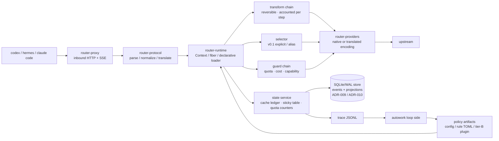

# Design (HOW) — router

Convention: this document is the single source of truth for the **implementation structure** (module
boundaries, data flow, algorithms, test strategy). External behavior is in `docs/spec.md`.

## 1. Panorama



Three hard boundaries (AGENTS.md carries the binding clauses): the byte boundary, content determinism,
the observation boundary.

## 2. crate dependency direction

```
router-cli → router-proxy → router-protocol → router-core ← router-plugins
                    ↘ router-runtime ↗                 ↑
                          router-providers        router-plugin-sdk (tier-B protocol types)
                    router-store ──→ router-core  (trait Store implementation, ADR-009)
```

- `router-core`: the domain model of request/decision, the cost engine, the cache ledger, the plugin
  traits. **Depends on no HTTP/protocol crate**.
- `router-runtime`: Cordis semantics (§4). `router-core`'s traits are loaded here as fibers.
- `router-protocol`: codec for the 3 protocols + translation matrix + `Usage` normalization; pure
  functions, exhaustively unit-testable.
- `router-providers`: wire capabilities, authentication, retry, SSE parsing; **makes no decisions**.
- `router-proxy`: the axum data plane, byte-faithful forwarding and SSE passthrough.
- `router-plugins`: the built-in tier-A plugins (cache-guard, transform_rules, cost_ledger, quota_guard,
  sticky).
- `router-store`: the SQLite/WAL implementation of `trait Store` (event log + projections + migrations).
  It is the persistence seam **under** the state service's traits of §12.2, not a second domain model
  (ADR-009).

## 3. Decision pipeline (the order of one request)

```
parse → session resolution → transform chain → selector → guard chain → encode → forward → usage normalization → ledger/trace
```

Key design: **both transform and guard remain trace-attributable after the decision** (one transform
record is written per step); in v0.1 the selector only does explicit/alias resolution and `auto` is left
to a plugin — but the slot, the contract and the trace fields are in place now, so a plugin needs no
data-plane change when it lands.

## 4. Plugin runtime (aligned with Cordis semantics)

The mapping from the paper's primitives to this project's implementation (fixed by ADR-002):

| Cordis primitive | This project's Rust form | Purpose |
|---|---|---|
| `ctx.effect(cb) → dispose` | `fn(&mut Ctx) -> Effect`, `Effect{undo: FnOnce}`, accumulated LIFO | any registration/rewrite carries its own inverse; unloading a plugin = a full rollback |
| `ctx.set(key,value)` / `ctx.get(key)` + `notify → refresh` | typed service slot `ServiceKey<T>`; when a provider enters UNLOADING its **dependents are deactivated first**, then the binding is withdrawn | dependencies and dependents between plugins need no manual ordering |
| `fiber.inject` (a coeffect declaration) | the manifest declares `inject: [services]`; while unsatisfied it **stops at load-waiting** instead of erroring | out-of-order loading is safe |
| `ctx.isolate(key, realm)` | the same key with multiple realms → two independent sets of bindings | **A/B and shadow**: two policy versions coexist without interfering |
| `ctx.intercept(key, metadata)` | does not change the binding, only "how it is used" | set the sample rate, timeout or shadow switch for one plugin |
| entries + keyed diff + HMR | a declarative `plugins:` list + per-field minimal operations | parameter-level experiments need no restart |

**Rust's trade-off (must be faced honestly)**: the paper's HMR relies on dynamic module loading in JS.
This project's tier-A plugins are linked at compile time, so there is **no module-level HMR** — a code
change = rebuild + restart; only **config-level coordination** (config/weights/rule TOML take effect
immediately) and module-level reload of tier-B (out-of-process) plugins exist. To keep the restart cost
low, the `cache ledger / sticky table / quota counters` are all projections of the local store (§8,
ADR-009) and survive a restart (rebuilt from the event log if a projection was lost), so a restart loses no
session context.

Lifecycle state machine (simplified): `LOADING → ACTIVE → UNLOADING → (removed)`; while `inject` is
unsatisfied it stays at LOADING; when unloading a fiber its dependents leave first, then its inverse is
executed in LIFO order. A failed state carries an error result and does not affect other fibers.

## 5. Cost engine

**Five-tier price + peak/off-peak**: `input_miss`, `input_hit`, `cache_write`, `output`,
`peak.multiplier`. Per-request cost:

```
cost = input_miss × p_miss + input_cached × p_hit + cache_write × p_write + output × p_out   (× peak)
```

**Quota plans** (coding-plan style): the marginal cost inside the plan is recorded as 0, but
`tokens_remaining` and `over_quota: block|spill` must be modeled; under `spill` the overflow is charged
at `p_miss`. The remaining allowance is written to the trace (`quota_after`), making "where the
allowance was spent" auditable.

**The cost model of switching (cache-aware breakeven)**: switching models immediately loses the prefix
cache and recomputes the whole prefix once at the miss price.

```
switch_gain  ≈ remaining_turns × tokens_per_turn × (p_stay − p_new)
switch_cost  ≈ prefix_tokens × p_miss_new
switch if and only if switch_gain > safety_factor × switch_cost
```

The parameters are in `config.cache.breakeven`; `remaining_turns` is estimated from the session history
and `safety_factor` defaults to 1.2. (In v0.1 the model is specified explicitly, so this formula decides
**failover and quota spill**, not automatic model selection.)

## 6. Cache policy (P0, the first-order lever)

1. **Fidelity**: on the passthrough path the only permitted mutations are deleting router-owned fields
   and replacing the value of the top-level `model` member with the resolved native id (spec §2,
   §12.10.7); for the same input the encoder must be byte-deterministic.
2. **Content determinism**: a transform is a pure function of `(content, stable config)` — depending on
   the turn number, the wall clock or an RNG is forbidden. Any "rolling window / per-turn trimming"
   implementation counts as breaking the prefix (which is why P4 is deferred).
3. **Stickiness**: a session → (provider, model) mapping, keyed preferentially by the client-supplied
   `prompt_cache_key` (the upstream echoes it; measured to work), falling back to `header:session-id` /
   `header:thread-id`; TTL is in config.
4. **Breakpoint injection**: when translating to an anthropic upstream, inject `cache_control` at "stable
   content boundaries" (same content → same position); the number of breakpoints is written to the trace
   (`cache_control_breaks`).
5. **State-service handover**: the ledger and the sticky table are projections of the local store
   (§8, ADR-009/ADR-010); a restart loads them — and rebuilds them from the event log if they were
   lost — so the `prefix_continuity` metric does not break across restarts.

## 7. Protocol translation layer

The capability matrix is declared in config (`supports`); the 3×3 table is constructed at runtime:

- a `native` cell → byte passthrough (the only permitted operation is deleting router-owned fields).
- a `translated` cell → goes through an explicit mapper; every mapper must be marked
  `lossless | lossy(reason)`.
- when lossy: write the trace and optionally the `X-Router-Lossy` response header; never silently.
- inbound unknown fields are kept verbatim (a bypass side channel exists), so protocol evolution loses
  no information.
- **an upstream error is normalized in exactly one place** (ADR-011): the provider layer surfaces the raw
  evidence (status, headers, error body) and makes no decision (§2), the classifier in `router-core`
  assigns a reason and a recovery action, and this layer only *renders* the client-facing shape
  (`ErrorBody`, §12.7). No call site branches on an upstream's prose, and an upstream error body is read
  and never persisted (ADR-009 item 3).

## 8. State and persistence

One local process, one writer, one store. State is an **event log plus rebuildable projections**, not
memory plus snapshots: ADR-009 fixes the storage boundary, ADR-010 the truth and the write ordering.

The plugin-facing surface stays the service traits of §12.2 (`CacheLedger`, `SessionTable`, `QuotaStore`);
`trait Store` is the persistence seam **under** them, implemented by `router-store` (§12.1).

| State | Medium | Durability | Notes |
|---|---|---|---|
| event log (`events`) | SQLite/WAL behind `trait Store` | intent / accounting events `synchronous=FULL`, committed **before** the effect they authorize (ADR-010) | the truth: every state transition is a row |
| sticky table / cache ledger / quota counters | projections in the same store | `NORMAL` + group commit | rebuildable from `events`; losing one regresses statistics, never correctness |
| provider cooldown (demotion, ADR-011) | projection in the same store | `NORMAL` + group commit | rebuildable from `events`; losing it costs one doomed attempt, never a wrong charge |
| trace | append-only JSONL, rolled hourly (spec §4.1; record shape in §12.6) | OS defaults | the analysis truth and the only product → autowork channel (ADR-005), unchanged |
| request / response bodies | **never persisted by the product** | — | the log keeps `body_hash` + a pointer; raw bytes exist only in captures taken outside the product |

- **Store path**: `<directory containing the config file>/state/router.db` (`state/` is gitignored). v0.1
  fixes it — there is no `state:` config key (§12.5); a section that moves the file is an additive future
  key (spec §4.1's precedent).
- **Startup prerequisite**: if the store cannot be opened or migrated, `serve` exits non-zero with the
  reason. There is no in-memory degraded mode: a gateway that enforced quota from numbers it cannot
  recover would report figures it cannot stand behind.
- **Ordered write path**: `upstream.submitted` commits before the upstream attempt begins; if that intent
  write fails, the request is rejected before anything is sent (nothing billed, the client's retry is
  safe) (ADR-009 item 8).
- **Crash window**: an intent with no response is `unknown_outcome`; the quota is not charged again and no
  cost is invented for it (ADR-010).
- **Migrations**: forward-only, with three deliberately distinct version axes (store DDL / event payload /
  trace record — ADR-009 item 7).

**Upstream failure path (ADR-011).** One classifier, one action, one record: `upstream.responded` →
`classify_upstream_error` → `error.classified` (a kind of ADR-010's vocabulary; `NORMAL`, payload `reason` +
`action` + the matched table entry + `retry_after_s?` + `demotion?`) → the action's effect. The action set is
`retry | rotate credential | fallback provider | compress | abort`, and the trace mirror rides in the
existing `errors[]` element (`kind = upstream_error`, `details.*`), so no spec §6 field and no
`schema_version` moves (§12.6).

- **Retry needs not-billed evidence**: an answer (any status) or a failure before the request bytes went out
  may be retried inside the declared attempt budget; a request fully written whose response never arrived
  may **not**, because the upstream may already have billed it — that attempt is ADR-010's
  `unknown_outcome`, and the client decides whether to retry.
- **`connect_failure` is a reason of its own** (ADR-011 item 6's rows, named here because the ADR's v0.1
  enum sketch lists no transport class): a no-status failure whose transport evidence says no connection
  was ever established (`reqwest`'s `is_connect()`, surfaced as `TransportKind::Connect` by
  `router-providers`) classifies as `connect_failure` — nothing was billed, so the class **fails over**
  (`action = fallback_provider`) and never re-attempts the same provider in this request. A no-status
  failure whose evidence is `is_timeout()` (a connect or read timeout) keeps the `timeout` reason and its
  existing abort semantics. The two share one evidence source — the transport kind on the attempt's
  `TransportError` — so the split is a pure function of the failure, not a heuristic over error text.
- **`context_overflow` / `payload_too_large` compress instead of failing over** (failing over bills another
  provider for the same oversized prompt), and `content_policy_blocked` is aborted locally, never re-probed
  unchanged.
- **The provider is the demotion unit** (a plan allowance is per provider/account, spec §4.0): a
  billing-class failure writes a cooldown that the guard sees as an unavailable route, so the next request
  does not pay to rediscover a dead account. `Retry-After` and the `x-ratelimit-*` headers feed its TTL, and
  a wait longer than `server.request_timeout` is carried across requests by the cooldown rather than held
  open inside one.
- **A failover prices the cache it breaks**: `failover.triggered` carries the prefix tokens and the switch
  cost in integer NanoUsd (§5, §12.4, ADR-006) as an **inferred** figure at decision time, and the measured
  figure — the miss-priced tokens actually billed on the first post-switch turn, against the origin route's
  `input_hit` price — once that attempt's `usage` lands. The `verified/inferred` convention (spec §7) thus
  applies to failover exactly as it applies to transforms.

## 9. Replay (computing money with the same code)

`router replay --trace t.jsonl --config c.yaml [--plugins p.yaml]`: feeds real inbound requests into
**the same production decision pipeline** (the same binary, the same transform/encoding path), replacing
only the outbound HTTP with a local simulation (or a real replay once, behind a budget gate). It outputs
a cost/cache/latency report contrasted against `prefix_continuity`.

This is the foundation of autowork: a policy cannot be re-implemented in Python without producing skew
(the lesson of the old project), so policy simulation is always a subcommand of the product.

**Not implemented in v0.1** and taken by no round yet: there is no `replay` subcommand and no simulation seam
in the serving path, so the shape above is design intent, not a served surface — spec §9.3 says the same thing
at the user-facing boundary, together with `router trace tail` and `GET /metrics`. Until it lands, the trace
record (spec §6) is the interface, and a figure that cannot be replayed must not be claimed.

## 10. Test strategy

| Layer | Contents |
|---|---|
| unit | exhaustive protocol codec (3×3), `Usage` normalization, five-tier cost, breakeven boundaries, realm isolation, effect LIFO rollback, the upstream-error taxonomy (one fixture per reason class plus the priority-order cases, ADR-011) |
| conformance | fidelity (upstream-visible prefix hash == the client's), SSE event-sequence equivalence, tool-call round trip, unknown-field passthrough, error-code mapping |
| cache | same-session two turns `prefix_continuity == 1.0`; re-measure after enabling each transform (regression guard) |
| accounting | every transform carries a `verified/inferred` label; gates read verified only |
| state | write-ahead ordering on a fixed event log, projection == rebuild from `events`, an intent-write failure rejecting before anything reaches the upstream, startup refusal when the store cannot be opened or a second writer holds it, config-driven `serve` (CONF-20…25, §12.10) |
| interaction | one onboarding smoke run each with the real codex/hermes (including verification of the `NO_PROXY` prerequisite) |

## 11. Risks and mitigations

| Risk | Mitigation |
|---|---|
| a transform breaks the prefix without knowing it | `prefix_continuity` as a blocking gate; run the cache regression for each transform separately |
| a lossy translation layer makes client behavior wrong | the lossy list goes into the spec; mark it explicitly when lossy + conformance cases |
| no HMR for tier-A slows experiment iteration | parameters/rules go through config-level coordination; experiment-class plugins are forced to tier-B |
| the accounting convention is polluted by "estimates" | the binary verified/inferred convention + reports must state the sample size |
| a system proxy makes onboarding fail | README/spec enforce `NO_PROXY`; the smoke test includes this item |
| a retry picks the same dead provider again | the demotion is *state* (a cooldown projection), not a per-request check; the previous project measured this failure mode at 62% of its failures (ADR-011) |
| the failure path's judgement is re-implemented at each call site | one classifier in `router-core`, one table per reason class with a one-fixture minimum; the provider layer makes no decisions (§2) (ADR-011) |
| the loop improves the measurement instead of the product | the gate definitions, the frozen corpus and the conformance assertions are outside the mutable scope, and a verdict records the evaluator commit and the corpus digest it ran against (ADR-012) |
| an online experiment destroys the prefix cache | shadow first (no upstream call), then a session-bucketed canary decided at session start and never mid-session; shadow can never enter the cost gate (ADR-013) |
| an auto-adopted parameter drifts past its declared envelope | declared triggers + automatic rollback + no promotion without the minimum sample + a re-proposal cooldown; only in-envelope parameters are auto-adoptable (ADR-013) |

## 12. Module and type landing list

This section lands the structure of §2/§4/§5/§6/§7 as **signature sketches + a case-ID table**, giving
implementers a single basis. It lands only "the shape of types and contracts", not function bodies; the
implementation order is given by each row's "Lands in".

### 12.1 crate list, dependency direction and the third-party dependency allowlist

```
router-cli → router-proxy → router-protocol → router-core ← router-plugins
                    ↘ router-runtime ↗                 ↑
                          router-providers        router-plugin-sdk
```

| crate | Public surface (what is usable outside) | Permitted third-party dependencies | Lands in |
|---|---|---|---|
| `router-core` | domain model, cost/quota/breakeven pure functions, plugin traits, `DecisionRecord` | `serde`, `serde_json`(preserve_order+arbitrary_precision), `sha2` | 2026-09-19 |
| `router-protocol` | codec for the 3 protocols, translation matrix, `Usage` normalization, `raw_json` (span-faithful editing) | `serde_json` | 2026-09-19 |
| `router-providers` | `ProviderClient` (wire capabilities, authentication, retry, SSE parsing) | `reqwest` (with a TLS feature — all real providers are https), `tokio`, `futures` | 2026-09-19 |
| `router-runtime` | `Ctx` / `Effect` / `ServiceKey` / fiber state machine, declarative loader | none (pure std + core) | 2026-09-19 |
| `router-plugins` | built-in tier-A: cache_guard / transform_rules / cost_ledger / quota_guard / sticky | `toml`, `regex` | 2026-09-19 / 2026-09-20 |
| `router-proxy` | axum data plane: byte-faithful forwarding, SSE passthrough | `axum`, `tokio`, `hyper`, `tower` | 2026-09-19 |
| `router-cli` | `serve` / `stats` / `replay` / `trace` | `clap`, `tokio` | 2026-09-19 (serve stub) |
| `router-plugin-sdk` | tier-B out-of-process plugin protocol types (UDS frames) | `serde_json` | 2026-09-20 |
| `router-store` | the SQLite/WAL store: the `events` log, the `sessions` / `cache_ledger` / `quota_counters` projections, forward-only migrations | `rusqlite` (bundled), `serde_json` | 2026-09-19 (ADR-009) |
| `router-conformance` (`tests/conformance/`) | the CONF cases (§12.8) | `tokio`, `axum`, the crates under test | 2026-09-19, as an empty shell |

- **`router-core` depends on no HTTP / protocol crate** (§2 hard constraint); how it is spot-checked: the
  dependency set of `cargo tree -p router-core` must be ⊆ the allowlist.
- Dependency discipline: **a new dependency must have its reason written in the commit message**
  (consistent with this round's task constraint). Any dependency outside the allowlist is discussed first.
- Every crate root adds `#![forbid(unsafe_code)]`; `router-core` additionally adds
  `#![deny(clippy::float_arithmetic)]` (money only takes the fixed-point path of §12.4).
- Test placement: unit tests use `#[cfg(test)] mod tests` in place; conformance lives in
  `tests/conformance/tests/` (§12.8).

### 12.2 Runtime primitives (ADR-002 → Rust signature sketch)

| Cordis primitive | Rust type (`router-runtime`) | Where the semantics land |
|---|---|---|
| `ctx.effect(cb) → dispose` | `Ctx::effect(Effect) -> EffectId` + `Effect { undo: Box<dyn FnOnce()+Send> }` | a LIFO stack; unload = run the undos in order |
| `ctx.set/get(key)` + refresh | `Ctx::provide/get` + `ServiceKey<T>` | a provider going offline → its dependents are deactivated first, then the binding is withdrawn |
| `fiber.inject` | `Plugin::inject() -> &[ServiceId]` | while unsatisfied it stays at `Loading{waiting_on}`, with no error |
| `ctx.isolate(key, realm)` | `Ctx::isolate(key, RealmId) -> RealmGuard` | multiple sets of bindings for the same key (A/B and shadow coexist) |
| `ctx.intercept(key, md)` | `Ctx::intercept(&key, InterceptMeta)` | does not change the binding, only "how it is used" (sample/timeout/shadow) |
| entries + keyed diff | a `PluginCfg` list + `apply_config_diff` | a config change diffs itself; `disabled` unloads; an `id`/`kind` change rebuilds |

```rust
pub struct PluginId(pub String);
pub struct ServiceId(&'static str);
pub struct RealmId(u32);
pub const ROOT_REALM: RealmId = RealmId(0);

pub struct ServiceKey<T: ?Sized> { name: &'static str, _m: PhantomData<fn() -> T> }
impl<T: ?Sized> ServiceKey<T> { pub const fn new(name: &'static str) -> Self; pub fn name(&self) -> &'static str; }
pub const CACHE_LEDGER: ServiceKey<dyn CacheLedger> = ServiceKey::new("cache_ledger");
pub const SESSION_TABLE: ServiceKey<dyn SessionTable> = ServiceKey::new("session_table");
pub const QUOTA_STORE:   ServiceKey<dyn QuotaStore>   = ServiceKey::new("quota_store");
pub const TRACE_SINK:    ServiceKey<dyn TraceSink>    = ServiceKey::new("trace_sink");

pub struct Effect { undo: Option<Box<dyn FnOnce() + Send>> }
impl Effect { pub fn new(f: impl FnOnce() + Send + 'static) -> Self; pub fn noop() -> Self; }

pub struct Ctx { /* fiber scope: service table + effect stack + realm table */ }
impl Ctx {
    pub fn effect(&mut self, e: Effect) -> EffectId;
    pub fn provide<T: Send + Sync + 'static>(&mut self, key: ServiceKey<T>, v: Arc<T>) -> EffectId;
    pub fn get<T: Send + Sync + 'static>(&self, key: &ServiceKey<T>) -> Option<Arc<T>>;
    pub fn isolate<T: Send + Sync + 'static>(&mut self, key: ServiceKey<T>, realm: RealmId) -> RealmGuard;
    pub fn intercept<T: Send + Sync + 'static>(&mut self, key: &ServiceKey<T>, md: InterceptMeta);
}

pub enum FiberState { Created, Loading { waiting_on: Vec<ServiceId> }, Active, Unloading, Failed(PluginError), Removed }

pub trait Plugin: Send + Sync {
    fn id(&self) -> &PluginId;
    fn inject(&self) -> &'static [ServiceId];      // coeffect declaration; unsatisfied → stays at Loading
    fn apply(&self, ctx: &mut Ctx) -> Result<Effect, PluginError>;
}
```

**Unload order (the implementation must follow it, and a test asserts it)**: ① recursively put the
dependents into `Unloading` and wait for them to finish → ② run this fiber's `Effect::undo` in reverse
LIFO → ③ withdraw the service bindings → ④ `Removed`. A failure goes to `Failed(err)` and **does not
affect other fibers** (ADR-002's "failure isolation"). How it is asserted: after load → activate →
unload, the service table and the intercept table must be **deep-equal** to what they were before
loading (unit-tested).

### 12.3 Decision-pipeline types and the failure semantics of each step

```
parse → session resolution → transform chain → selector → guard chain → encode → forward → usage normalization → ledger/trace
```

```rust
pub enum Protocol { Chat, Responses, Anthropic }
pub enum ClientKind { Codex, Hermes, ClaudeCode, Other }
pub struct RouteSpec { pub provider: String, pub model: String }
pub enum SelectionSource { Explicit, Alias, Plugin }
pub struct Decision { pub route: RouteSpec, pub source: SelectionSource, pub plugin_chain: Vec<PluginId> }

pub trait Transform: Send + Sync {
    fn id(&self) -> &'static str;
    /// Content-deterministic: reading the clock/turn/RNG is forbidden. Err = fall back to the original text (spec §8), the caller records the trace.
    fn apply(&self, req: &mut CanonicalRequest) -> Result<TransformReport, TransformError>;
}
pub struct TransformReport {
    pub added_input_tokens: u64, pub saved_input_tokens: u64, pub saved_output_tokens: u64,
    pub cache_impact: CacheImpact, pub verdict: Verdict, pub tee_id: Option<TeeId>,
}
pub enum CacheImpact { Neutral, Risky, Broken }      // Broken → cache_guard's strict_prefix rejects it
pub enum Verdict { Verified, Inferred }              // only Verified can enter a gate (ADR-003/spec §7)

pub trait Selector: Send + Sync { fn select(&self, req: &CanonicalRequest, roster: &Roster) -> Result<Decision, SelectError>; }
pub trait Guard: Send + Sync { fn check(&self, cx: &GuardCx<'_>) -> GuardOutcome; }
pub enum GuardOutcome { Pass, Reject { code: ErrorCode, message: String }, Downgrade(RouteSpec) }
pub trait Observer: Send + Sync { fn on_decision(&self, rec: &DecisionRecord); fn on_error(&self, e: &RouterError); }
```

| Step | Failure semantics |
|---|---|
| parse | the request body is unparsable → `invalid_request` 400, not forwarded |
| session resolution | every source is missing → `session = None` (the trace records null, `sticky_hit=false`), **not an error** |
| transform | any step `Err` → fall back to the original text + `TransformRecord.error`; the request proceeds as usual (spec §8) |
| selector | `auto` → `auto_not_supported` 400 (spec §3); a `provider/model` that does not exist → 404 |
| guard | `Reject` → the normalized error body; `Downgrade` → take that route and record `failover_from` |
| encoding | a translation cell missing its declaration → 400; lossy → record `lossy[]` + `X-Router-Lossy` |
| forwarding | 5xx/429/quota exhausted → the fallback chain; chain exhausted → 502 carrying the last `upstream_status` |
| usage normalization | the upstream is missing usage fields → zero values + trace `usage_missing: true` (**never guessed**) |
| ledger/trace | a trace write failure → the request proceeds as usual, the count goes into the `trace_dropped` metric (an observable degradation) |

#### 12.3.1 Landing the byte boundary in the types (AGENTS hard constraint 1)

```rust
pub struct CanonicalRequest {
    pub protocol_in: Protocol,
    pub raw: RawBody,                 // the client's raw bytes: the sole authority
    pub doc: JsonDoc,                 // order-preserving parsed view (for decisions; **not used for outbound sending**)
    pub session: Option<SessionId>,
    pub thread_id: Option<String>,
    pub turn_index: u32,
}
pub struct RawBody(Bytes);
impl RawBody {
    pub fn as_bytes(&self) -> &[u8];
    /// Mutation (a) of the byte boundary: deleting top-level router-owned fields. All other bytes are kept byte for byte.
    pub fn remove_top_level_keys(&self, keys: &[&str]) -> Result<RawBody, RawEditError>;
    /// Mutation (b): replacing the **value** of a top-level string member (in practice the outbound
    /// `model`, spec §2). Byte-level, single pass, no parse→reserialize. `Cow::Borrowed` when the value
    /// already is `value` (byte-identical input), `Cow::Owned` otherwise; `Err` when the member is
    /// absent or its value is not a JSON string.
    pub fn set_top_level_string(&self, key: &str, value: &str) -> Result<Cow<'_, [u8]>, BodyError>;
}
```

- `RawBody` **does not implement** `DerefMut`/`AsMut`, and exposes no mutable reference to a
  `serde_json::Value` → a casual "just tweak it" is blocked at compile time.
- `remove_top_level_keys` uses a **single-pass JSON scanner** (it needs only the spans of the top-level
  keys, tracking strings/escapes/bracket depth) to delete at the byte level; a **parse → reserialize
  round trip is forbidden** (that is the most common way the byte boundary is broken).
- router-owned fields = the `router_meta` echo + routing hints (spec §2). The deletion list is a
  **whitelist constant**; adding one requires changing that constant.
- The separator semantics of deletion (pinned down 2026-09-19): consecutive whitelist hits form one
  "segment"; the segment is removed as a whole and swallows the comma between **its tail** and the
  member that follows it (including the whitespace in between); the comma at the head of the segment is
  left to the previous retained member. Only when the first member is the start of a segment does it
  instead swallow the segment-tail comma. Invariant: any `Ok` output must be valid JSON, and the
  retained members are byte-for-byte equal to their input spans (the `deletion_position_matrix*` tests
  are a permanent regression matrix).
- **Mutation (b) — `set_top_level_string`** (its settled semantics — ruled 2026-09-19 (`3074957`), implemented the same day (`233e05e`), so ruling and wiring cannot differ):
  - **Only the value span moves.** The member's key bytes, its position in the document, the separators
    and the whitespace around it, and every byte outside the member are byte-for-byte the input; the new
    value is encoded as a JSON string (`"` + RFC 8259 escaping + `"`) inserted in place of the old value
    span. It therefore cannot reorder members, re-escape unrelated strings or drop trailing whitespace —
    the three ways a parse→reserialize would silently rewrite the body.
  - **Idempotent and content-deterministic** (AGENTS constraint 2): the result depends only on
    (content, key, value); a second application with the same value returns the first application, and a
    value equal to the member's current value returns the input bytes unchanged (`Cow::Borrowed`).
  - **An absent member is an error, never an insertion** (`Err`, not "add it and carry on"): the
    passthrough path never invents a member the client did not send, and no reachable path needs the
    insertion — a body whose `model` is missing or not a string is answered `400 invalid_request`
    before the rewrite (spec §8). A present member whose value is **not** a JSON string is an error for
    the same reason. The concrete variant names are the implementation's to choose (`RawEditError`'s
    vocabulary plus these two), the *distinguishability* is the contract.
  - **The same scanner** as `remove_top_level_keys` — the primitive and the deleter share
    `scan_top_level_members`, never a second parser (the policy differs; the scanning does not).
- Three settled boundary behaviors (the rationale for rejecting vs passing through, each pinned by a
  unit test):
  - **BOM prefix → `Err(NotTopLevelObject)`**: stripping the BOM is a rewrite outside the whitelist
    (hard constraint 1 permits deleting router-owned fields and replacing the value of the top-level
    `model` member — and nothing else), so router has no right to "fix it in
    passing" and it is left to the caller to handle as a 400.
  - **Leading-zero number (`01`) → `Err(Malformed)`**: the RFC 8259 number grammar does not contain this
    form; the raw value fragment is vetted by the serde_json validator, and an ambiguous number is not
    passed through (upstream parsers disagreeing is a hidden risk).
  - **invalid UTF-8 inside a **string** value → `Ok` and passed through byte for byte**: the byte
    boundary takes priority, router does not interpret value content, and legality is adjudicated by the
    upstream. Note the asymmetry: invalid UTF-8 inside a **key** is still `Err(Malformed)` — a key must
    be decodable to be compared semantically against the whitelist, and if it cannot be compared there is
    no safe way to decide delete-or-not.
- The domain of the prefix hash = the raw bytes of `messages | input | tools` and the system-instruction
  position in the upstream-visible body (spec §6 "prefix"), so "deleting router fields" does not affect
  that hash — CONF-10 asserts exactly this. The `model` member is **not** in that domain either, so
  mutation (b) does not affect it: `prefix_continuity` measures the conversation's fidelity, not the
  route the request took (§12.10.7).
- Prefix blocks (`prefix_blocks[]`): a block = the **smallest indivisible unit** in the prefix region
  (one message / one tool definition / one input item), recording `tokens` and `hash` per block;
  `hash = the first 16 hex chars of sha256(block raw bytes)`.
  (GAP-Q5: the spec does not define block granularity; this blueprint takes a "structural unit" rather
  than a fixed-length token bucket, because the former aligns with cache breakpoints.)

### 12.4 Cost / quota / breakeven pure functions (the implementation target of the 2026-09-19 bootstrap)

```rust
/// Money is fixed-point: 1 nano-USD = 1e-9 USD. No f64 appears in the decision path or the trace.
pub struct NanoUsd(pub u64);
/// Unit price: nano-USD / 1K token (the same shape as the config's USD/1K, only integerized).
pub struct Price(pub u64);
pub struct PriceTable { pub input_miss: Price, pub input_hit: Price, pub cache_write: Price,
                        pub output: Price, pub peak: PeakTable }
pub struct PeakTable { pub multiplier_pct: u32, pub windows: Vec<PeakWindow> }   // 2.0 → 200
pub struct PeakWindow { pub days: Weekdays, pub from_min: u16, pub to_min: u16, pub tz: Tz }

pub struct Usage { pub input_total: u64, pub input_cached: u64, pub cache_write: u64,
                   pub output: u64, pub reasoning: u64 }
impl Usage { pub fn uncached(&self) -> u64;  pub fn cache_hit_rate(&self) -> f32; }

pub struct CostBreakdown { pub input_miss: NanoUsd, pub input_hit: NanoUsd, pub cache_write: NanoUsd,
                           pub output: NanoUsd, pub peak_applied_pct: u32, pub total: NanoUsd }

/// Pure function: cost(miss, hit, write, out, price, at) -> CostBreakdown
/// cost_nano = Σ_tier ( tokens_tier × price_tier_nano_per_1k ) / 1000   (integer; only the final division rounds down)
/// A peak-window hit (at ∈ windows) → sum the no-peak total first, then × multiplier_pct / 100.
/// The input_miss tier uses usage.uncached(); the output tier includes reasoning (most upstreams count reasoning into output).
pub fn cost(usage: &Usage, price: &PriceTable, at: Timestamp, tz: Tz) -> CostBreakdown;
```

Quota (spec §4 `quota`, DESIGN §5):

```rust
pub enum QuotaWindow { Monthly { reset_day: u8 } }        // spec defines monthly only; any other value = a load error
pub enum OverQuota { Block, Spill }
pub struct QuotaPlan { pub models: Vec<String>, pub window: QuotaWindow, pub tokens: u64,
                       pub over_quota: OverQuota, pub source: String }
pub struct QuotaState { pub plan_idx: usize, pub window_start_epoch_s: u64, pub tokens_used: u64 }
pub enum QuotaVerdict {
    Inside  { remaining_before: u64 },
    Spill   { billable_tokens: u64 },      // the overflow is charged at input_miss (DESIGN §5)
    Blocked { remaining: u64 },            // over_quota=block → Guard Reject(quota_exceeded)
}
/// Pure function (the only state write point): tokens = usage.input_total + usage.output (this blueprint's default convention; see GAP-Q1)
pub fn charge(plan: &QuotaPlan, st: &mut QuotaState, usage: &Usage, now_epoch_s: u64) -> QuotaVerdict;
```

**ADR-014 refinement — which signal may refuse a request.** The `Blocked` verdict above stays the **local**
verdict and keeps its meaning as a recorded warning: under GAP-Q1 the plan's `tokens` may be a placeholder, so
it may not by itself produce a `GuardOutcome::Reject`. Two consequences land with ADR-014's implementation:
(a) `over_quota: block` refuses when the **upstream** has declared the allowance exhausted (ADR-011's
`quota_exhausted` classification) rather than when the local counter says so, while the local verdict stays
visible through `cost.quota_after.verdict`; (b) the local counter's second honest use is **deferring a plan
probe** until the plan's declared window boundary (`window_start_for`) has passed — a deferral of an
experiment, never a refusal of a request. `plan_policy`'s own guardrail (`overflow_monthly_cap_usd`) **may**
refuse, and the asymmetry is deliberate: its inputs are measured usage priced by the config table, whereas
GAP-Q1's denominator is unverified (spec §4.6, ADR-014 items 2 and 7).

cache-aware breakeven (DESIGN §5, integerized to avoid floating-point boundary disagreements):

```rust
pub struct BreakevenParams { pub enabled: bool, pub min_remaining_turns: u32, pub safety_factor_pct: u32 }
pub struct SwitchCandidate {
    pub prefix_tokens: u64,      // the amount of prefix recomputed at the miss price when switching models
    pub tokens_per_turn: u64,    // estimated input tokens per following turn
    pub remaining_turns: u32,    // estimated remaining turns (no history → 0)
    pub p_stay_hit: Price,       // the next turn's unit price if staying = the current model's input_hit (already cached)
    pub p_new_miss: Price,       // the new model's input_miss (switching necessarily misses the whole prefix)
}
pub enum StayReason { Disabled, RemainingTurnsZero, BelowMinRemainingTurns, NotPaying }
pub enum SwitchVerdict { Switch { gain: NanoUsd, cost: NanoUsd },
                         Stay { reason: StayReason, gain: NanoUsd, cost: NanoUsd } }
/// gain = remaining_turns × tokens_per_turn × (p_stay_hit − p_new_miss) / 1000   (an i128 intermediate)
/// cost = prefix_tokens × p_new_miss / 1000
/// Switch ⟺ gain × 100 > safety_factor_pct × cost      (strictly greater; cross-multiplied, so no precision is lost to division)
pub fn decide_switch(p: &BreakevenParams, c: &SwitchCandidate) -> SwitchVerdict;
```

**Boundary cases (the implementation must cover them, asserting the `SwitchVerdict` for each)**:

| Case | Expectation |
|---|---|
| `enabled = false` | `Stay(Disabled)` |
| `remaining_turns = 0` | `Stay(RemainingTurnsZero)` (gain is always 0) |
| `remaining_turns < min_remaining_turns` | `Stay(BelowMinRemainingTurns)` (even if the formula is better) |
| `prefix_tokens = 0` | `Switch` (switching costs 0, gain > 0) |
| exactly equal (`gain×100 == sf×cost`) | `Stay(NotPaying)` (switch only on strictly greater) |
| `p_stay_hit ≥ p_new_miss` | `Stay(NotPaying)` (not profitable) |
| a peak-window hit | both `cost`/`gain` include `×multiplier_pct/100` |
| integer tiering `input_miss=0.00015` | parses to `Price(150_000)` (no floating-point residue) |

### 12.5 Config types and parsing rules (`config.example.yaml` ↔ types)

```rust
#[derive(Deserialize)] #[serde(deny_unknown_fields)]
pub struct RouterConfig { pub server: ServerCfg, pub session: SessionCfg, pub cache: CacheCfg,
    pub trace: TraceCfg,
    pub providers: Vec<ProviderCfg>, pub aliases: BTreeMap<String, RouteSpec>,
    pub plugins: Vec<PluginCfg>, pub fallback: Vec<RouteSpec>,
    pub plan_policy: Option<PlanPolicyCfg> }   // spec §4.6; ADR-014 — absent = no plan-first routing

/// spec §4.6. `ProviderCfg` gains `account: AccountKind` (`CodingPlan` | `Api`, absent ⇒ `Api`); the
/// cross-field checks are §12.10.2's table, not serde's (a `deny_unknown_fields` struct does not police
/// an enum value, and this section's only job is syntax).
pub struct PlanPolicyCfg { pub family: String, pub primary: RouteSpec, pub overflow: RouteSpec,
    pub on_primary_exhausted: OnPrimaryExhausted,   // Spill (default) | Block
    pub recover: RecoveryMode,                      // Probe (default) | None
    pub cooldown: DurationVal,                      // default 15m
    pub overflow_monthly_cap_usd: Option<CapUsdVal> }  // absent = no cap; `to_nano()` is the one rounding

/// spec §4.1; `Rollover::Hourly` is the only value in v0.1 → the file `<dir>/YYYY-MM-DDTHH.jsonl` (UTC).
pub struct TraceCfg { pub dir: PathBuf, pub rollover: Rollover }

/// spec §4's `server` section, including §4.7's one added key. `auth_token_env` carries the **name** of
/// an environment variable of this process; the value is read once by `router-cli` at startup and never
/// reaches this type or `router-proxy` — `router-core` stays I/O-free (§12.10.2's split), and the token
/// value never enters a config struct, a log line, a trace field or an event payload (§12.11).
pub struct ServerCfg { pub addr: String, pub upstream_attempt_timeout: DurationVal,
    pub request_timeout: DurationVal, pub auth_token_env: Option<String> }   // absent ⇒ no inbound auth
```

| Point | Rule |
|---|---|
| duration | `<integer><ms\|s\|m\|h>`, concatenable (`1h30m`); invalid → a load error (with the field path) |
| context | `<integer>` or `<integer>k\|m` (k=1024, m=1048576); used by the guard's capability check |
| price | read as f64 (USD/1K), converted **at load time** to `Price((v * 1e9).round() as u64)`; `v < 0`, or 0 after `round` → a load error |
| peak.multiplier | converted to `multiplier_pct = (v*100).round()`; only two decimal places are supported, otherwise a load error |
| `account` (spec §4.6) | `coding_plan` \| `api`; **absent ⇒ `api`**; any other value is a load error (`deny_unknown_fields` polices keys, not enum values) |
| `plan_policy` (spec §4.6) | at most one section in v0.1; a second family is an additive future key, never a reshaped section. Its cross-field checks are §12.10.2's table (they are routing rules, not syntax) |
| `overflow_monthly_cap_usd` (spec §4.6) | read as a `CapUsdVal` (f64 USD) and converted **at load time** by `CapUsdVal::to_nano()` to `NanoUsd((v * 1e9).round())` — one rounding, the same shape as `price` (§12.4); a negative or non-finite value is a load error; absent means no cap. Every later comparison is integer |
| base_url | must already contain the version segment; router only appends `chat → /chat/completions`, `responses → /responses`, `anthropic → /v1/messages` |
| `rules_file` | resolved relative to **the directory containing this config file** (not the CWD); `trace.dir` follows the same rule (spec §4.1) |
| `trace.rollover` | only `hourly` is accepted (any other value = a load error); retention is **not** a config key (v0.1 does no automatic cleanup) |
| `state` | **not** a config key in v0.1: the store path is fixed at `<config dir>/state/router.db` (spec §4.5, ADR-009); a `state:` section that moves the file (as `trace.dir` does) is an additive future key |
| unknown fields | `deny_unknown_fields` → **errors out and exits** (no silent ignore: config is written by hand, and "I changed it but it did not take effect" is the most expensive silent failure) |
| `server.auth_token_env` (spec §4.7) | a plain string, or absent. Absent ⇒ **no inbound auth** (today's behaviour, and the backward-compatibility clause). Present ⇒ the named env var must exist **and be non-empty** or the process refuses to start — but that check is **not** this parser's: `router-core` never reads the environment (§12.10.2's split), so this row fixes only that the key is a string the parser carries through. The startup refusal and the empty-string rule are §12.11 |
| secrets | only `api_key_env`; when the env var is missing at startup → that provider is marked unavailable and reported on `/health` (it does not block other providers). `auth_token_env` is the one exception: a missing value there refuses the start (§12.11) |
| `disabled: true` | that fiber is not loaded (no error); `/health` lists it under `plugins_disabled` |
| defaults | only those the spec §4 states explicitly (`safety_factor: 1.2`, `sticky`, `over_quota`) have a default; everything else is **not enabled unless written** |

### 12.6 DecisionRecord (trace contract, fully covering spec §6)

```rust
pub struct DecisionRecord {
    pub schema_version: u16,            // trace version; the autowork side uses it for compatibility (ADR-005)
    pub ts: String,                     // RFC3339 UTC, milliseconds
    pub identity: IdentityRec,          // identity
    pub protocol: ProtocolRec,          // protocol
    pub decision: DecisionRec,          // decision
    pub state: StateRec,                // state
    pub prefix: PrefixRec,              // prefix
    pub transforms: Vec<TransformRecord>, // transform (one per step)
    pub usage: Usage,                   // usage
    pub cost: CostRec,                  // cost
    pub result: ResultRec,              // result
    pub errors: Vec<TraceError>,        // failure details (spec §6 "failure details"; written back 2026-09-19)
}

pub struct IdentityRec { pub request_id: String,
    pub event_id: i64,          // the request.received event in the state store (spec §4.5, ADR-010)
    pub client: ClientKind, pub client_ua_raw: Option<String>,
    pub session: Option<String>, pub thread_id: Option<String>, pub turn_index: u32 }
pub struct ProtocolRec { pub r#in: Protocol, pub out: Protocol, pub translated: bool, pub lossy: Vec<LossyNote> }
pub struct LossyNote { pub field: &'static str, pub reason: &'static str, pub action: LossyAction }
pub struct DecisionRec { pub provider: String, pub model: String, pub requested_model: Option<String>,
    pub selection_source: SelectionSource, pub plugin_chain: Vec<String>, pub decision_ms: u32 }
pub struct StateRec { pub stateful_inbound: bool, pub sticky_hit: bool, pub cache_control_breaks: u16 }
pub struct PrefixRec { pub blocks: Vec<PrefixBlock>, pub continuity: Option<f32> }
pub struct PrefixBlock { pub kind: BlockKind, pub index: u16, pub tokens: u64, pub hash: String }
pub struct TransformRecord { pub plugin: String, pub added_input_tokens: i64, pub saved_input_tokens: i64,
    pub saved_output_tokens: i64, pub cache_impact: CacheImpact, pub verdict: Verdict,
    pub tee_id: Option<String>, pub error: Option<String> }
pub struct CostRec { pub input_miss: NanoUsd, pub input_hit: NanoUsd, pub cache_write: NanoUsd,
    pub output: NanoUsd, pub peak_applied_pct: u32, pub total: NanoUsd, pub quota_after: Option<QuotaAfter> }
pub struct QuotaAfter { pub provider: String, pub plan_idx: usize, pub tokens_used: u64, pub tokens_limit: u64,
    pub over_quota: OverQuota, pub verdict: &'static str }
pub struct ResultRec { pub status: u16, pub upstream_status: Option<u16>, pub failover_from: Option<RouteSpec>,
    /// spec §6 `plan_switch` (ADR-014): present-and-null whenever the plan policy did not displace this
    /// request's account — the same stance as `prefix.continuity`, never omitted.
    pub plan_switch: Option<PlanSwitchRec>,
    pub overhead_ms: u32, pub upstream_ms: Option<u32>, pub usage_missing: bool }

/// spec §6 `plan_switch` (ADR-014 §12.10.8): the plan policy moved this request's account. `from` / `to` are
/// `"<provider>/<model>"` strings, the same wire form `failover_from` uses; `reason` is the stable word
/// (`primary_exhausted` / `primary_cooling_down` / `primary_recovered`) and `probe` says whether the move was
/// an admitted probe's return trip. The two figures are the switch's cache price under spec §7's convention.
pub struct PlanSwitchRec { pub from: String, pub to: String, pub reason: &'static str,
    pub probe: bool, pub reprefill_tokens: u64, pub switch_cost_nano: NanoUsd }

/// The landing of spec §6 "failure details": the **internal** failure details (possibly several), which are
/// not the same thing as the single error response given to the client in §12.7; the two share the kind vocabulary.
/// No failure = an empty array (not omitted).
///
/// `kind` is a `String` produced by the one function that ties the two vocabularies together,
/// `TraceError::kind_for_code(ErrorCode)`: `transform_error` / `upstream_error` / `trace_write_failed` /
/// `internal`, plus §12.11's `unauthorized`. Its `match` is exhaustive, so a new `error.type` in §12.7's
/// table cannot land without its trace word landing with it.
/// *(This sketch used to write an `enum TraceErrorKind`; the implementation has always used the string
/// mapping above, so the sketch was the drift — corrected here rather than left as a type that does not
/// exist, which is the "documented but unreachable" defect in reverse.)*
pub struct TraceError { pub kind: String, pub message: String,
    pub plugin: Option<String>, pub details: Option<serde_json::Value> }
```

spec §6 field groups → Rust paths (auditable line by line):

| spec §6 field group | Fields | Rust path |
|---|---|---|
| identity | `request_id` `event_id` `client` `session` `thread_id` `turn_index` | `identity.*` (`client_ua_raw` is an appendix, for troubleshooting when UA normalization fails; `event_id` is the join anchor into the event log, spec §4.5) |
| protocol | `protocol_in` `protocol_out` `translated` `lossy[]` | `protocol.r#in` `protocol.out` `protocol.translated` `protocol.lossy` |
| decision | `provider` `model` `requested_model` `selection_source` `plugin_chain[]` `decision_ms` | `decision.*` (`model` = the resolved provider-native id, `requested_model` = the client's own string — spec §6 and §12.10.7) |
| state | `stateful_inbound` `sticky_hit` `cache_control_breaks` | `state.*` |
| prefix | `prefix_blocks[]` (token count + hash) `prefix_continuity` | `prefix.blocks[].{tokens,hash}` `prefix.continuity` |
| transform | `plugin` `added_input_tokens` `saved_input_tokens` `saved_output_tokens` `cache_impact` `verdict` | `transforms[].*` |
| usage | `input_total` `input_cached` `cache_write` `output` `reasoning` | `usage.*` |
| cost | `cost.input_miss` `input_hit` `cache_write` `output` `total` `quota_after` | `cost.*` |
| result | `status` `upstream_status` `failover_from` `plan_switch` `overhead_ms` `upstream_ms` | `result.*` (`plan_switch` is ADR-014's displacement record: spec §6 defines it, §12.10.8 lands it) |
| failure details | `errors[]` (`kind` `message` `plugin?` `details?`) | `errors[].*` (the kind vocabulary is shared with the error body of §12.7; the difference between internal details and the client-facing response is explained above) |

- The `state` group is **constant in v0.1** (known gap G-F): `Accountant::commit` — the record's single
  writer — stores `stateful_inbound: false`, `sticky_hit: false`, `cache_control_breaks: 0` for every
  request. `store` and `previous_response_id` are never read: they are ordinary client bytes, so at most
  §12.3.1's two mutations touch them, and the sticky-binding read of §12.10.5 row 4 decides only whether a
  `session.bound` event is written, never a trace field. The mapping row above stays the contract to land;
  Q8 below is where it lands.
- On disk: `<config trace.dir>/YYYY-MM-DDTHH.jsonl` (spec §4.1; `trace.dir` defaults to
  `./state/traces`), **append-only, rolled hourly** (DESIGN §8); a write failure does not block the
  request and records `errors[].kind = trace_write_failed`.
- `schema_version` only increments on a **breaking** change; adding an optional field does not change the
  version (the autowork side tolerates unknown fields).
- `decision.requested_model` is such an addition (contract ruled 2026-09-19 (`3074957`), implemented the same day (`233e05e`)): `null` when the
  request carried no parsable `model` (the field is present-and-null rather than omitted, the same stance
  as `prefix.continuity` — an absent value is written as absent, never as a plausible substitute).
- `result.plan_switch` is such an addition too (ADR-014; spec §6): optional and present-and-null, so
  `schema_version` stays 1. It is **not** a second name for `failover_from` — spec §6's own table fixes which
  facts set which of the two (a failure-class fact sets `failover_from`; the plan policy's account state sets
  `plan_switch`) — and §12.10.8 lands the rest.
- `identity.event_id` is the `request.received` row of that request in the state store: the analysis truth
  and the state truth are paired on `request_id` + `event_id`, never on a timestamp (spec §4.5).
- `identity.event_id` is **`0`** when no such row exists, which is exactly the case for a request refused
  **before** §12.10.5 row 1 — the parse / route / capability rejections already write it, and §12.11's
  inbound-auth refusal is the same class (spec §6's pre-pipeline record). `0` can never collide with a real
  row (`events.event_id` starts at 1), and the sentinel is what makes "no state-truth row" *visible* instead
  of absent. **Scope of CONF-24's join assertion**: the row reads "every `DecisionRecord` carries an
  `event_id` that exists in `events`" — read it as *every record of a request that entered the pipeline*
  (§12.10.5 row 1's own words), which is the only reading under which it is true today. Its assertion, its
  file and its ID are untouched; this bullet exists so the sentinel is a decision rather than an accident.
- Derived metrics (`router stats`, spec §6 "metric definitions") — all computable in a single pass over
  the trace, with no extra state needed:
  `cache_hit_rate = Σusage.input_cached / Σusage.input_total`;
  `stateful_inbound_rate` (**always 0 in v0.1**: the group is constant, so no request counts as
  stateful — gap G-F), `prefix_continuity_p50` (group by session, take adjacent requests),
  `verified_savings_tokens` (**accumulates only `verdict=Verified`**), the p99 of
  `overhead_ms_p99 = result.overhead_ms`.
- Reporting discipline: any statement of "how much was saved" must carry the convention
  (verified/inferred), the sample size and the time window (spec §7).

### 12.7 Error semantics and the response surface (the landing of spec §8)

> Since the 2026-09-19 write-back, the error-body schema and the `error.type`→HTTP table below **are already written into
> `docs/spec.md` §8** (the spec is the single source of truth for the external contract); this section
> keeps `ErrorBody`'s Rust form and the implementation details, and the two must agree.

Unified error body (**all** non-2xx responses and the stub endpoints share one shape; README's success
response carries the router-owned field `router_meta`):

```rust
pub struct ErrorBody { pub error: ErrorDetail }
pub struct ErrorDetail { pub r#type: &'static str, pub message: String,
                         pub request_id: String, pub details: Option<serde_json::Value> }
```

| `error.type` | HTTP | Trigger |
|---|---|---|
| `invalid_request` | 400 | request body unparsable / missing `model` / wrong field type |
| `unknown_provider` `unknown_model` | 404 | `provider/model` or an alias does not resolve |
| `auto_not_supported` | 400 | `model: auto` (v0.1; the hint says a plugin takes it over, spec §3) |
| `capability_unsupported` | 400 | inbound protocol ∉ that provider's `supports` |
| `unauthorized` | 401 | the request carried no token, or a token that does not match `server.auth_token_env`'s value (spec §4.7; the error body's `details.header` names which header was read). Decided at the boundary, before the pipeline — it starts no failover walk (§12.11) |
| `cost_cap_exceeded` | 403 | guard cost cap hit |
| `quota_exceeded` | 429 | `quota.over_quota = block` and the allowance is exhausted |
| `stateful_unsupported` | 400 | stateful inbound and stickiness cannot keep fidelity (ADR-004; **cannot fire in v0.1** — no request is ever judged stateful, gap G-F) |
| `upstream_error` | 502 | upstream error and the fallback chain is exhausted (`details.upstream_status`) |
| `upstream_timeout` | 504 | an upstream attempt timed out and the chain is exhausted |
| `not_implemented` | 501 | a capability declared in the roadmap but not implemented in this build: today the cross-protocol **translation** cells (native passthrough of all three protocols is implemented, so the cell's message names what is missing, spec §8) |
| `internal` | 500 | everything else (beyond the degradation path of a trace write failure) |

Response headers: `X-Router-Request-Id` (always), `X-Router-Session` (when a session was resolved),
`X-Router-Lossy` (when a lossy translation happened, DESIGN §7). On the SSE path all three headers must
already have been sent before the first event.

### 12.8 conformance case table (`CONF-01…CONF-47`)

Location: the workspace member `router-conformance` (`tests/conformance/`), case file
`tests/conformance/tests/conf_<NN>_<slug>.rs`, the test function named after the file. **An unimplemented path
must carry `#[ignore = "CONF-NN: depends on <implementation item>"]`** (explicitly visible, rather than simply
not written).

| ID | Covers §10 | Assertion | Depends on implementation item |
|---|---|---|---|
| CONF-01 | conformance·fidelity | chat inbound → `wire_api: chat`: the upstream-visible body is byte-identical to the client body **minus the router-owned keys and with the top-level `model` replaced by the resolved native id** (spec §2, §12.10.7) | router-protocol native path + the `model` rewrite |
| CONF-02 | same as above | responses → responses native: same two mutations, nothing else | same as above |
| CONF-03 | same as above | anthropic → anthropic native: same two mutations, nothing else | same as above |
| CONF-04 | same as above·translation | chat → responses: two requests with the same content produce **the same upstream bytes** (determinism); the lossy points are registered one by one | translation matrix + mappers |
| CONF-05 | same as above | chat → anthropic: determinism + `cache_control` breakpoint positions stable | same as above + breakpoint injection |
| CONF-06 | same as above | responses → chat: determinism + the lossy list (dropping reasoning must be marked) | same as above |
| CONF-07 | same as above | responses → anthropic: determinism + breakpoint injection | same as above |
| CONF-08 | same as above | anthropic → chat: determinism + `thinking` handling | same as above |
| CONF-09 | same as above | anthropic → responses: determinism + `tool_use` mapping | same as above |
| CONF-10 | conformance·fidelity + §12.3.1 | after deleting router-owned fields the remaining bytes are byte-identical to the client's; the `router_meta` echo never reaches the upstream | `RawBody::remove_top_level_keys` |
| CONF-11 | conformance·unknown fields | top-level and nested unknown fields are passed through verbatim (including the measured fields `include`, `client_metadata`) | `RawBody` + encoder |
| CONF-12 | conformance·tool-call round trip | chat `tool_calls`/`role=tool` ↔ responses `function_call*` ↔ anthropic `tool_use/result`: id and order preserved | translation matrix |
| CONF-13 | conformance·SSE | native streaming: the upstream's `event:`/`sequence_number` are passed through event-by-event equivalently; end-event semantics preserved (responses has no `[DONE]`) | router-proxy SSE passthrough |
| CONF-14 | conformance·error codes | upstream 400/401/429/5xx → the normalized error body of §12.7; 5xx/429 triggers fallback and records `failover_from` | proxy + guard/fallback |
| CONF-15 | §10·cache | same-session two-turn passthrough: `prefix_continuity == 1.0` | cache ledger + sticky table |
| CONF-16 | §10·cache | after enabling each transform separately, re-measure the cache regression, not below the baseline (parameterized: one case per plugin) | transform chain + ledger |
| CONF-17 | §10·accounting | every `TransformRecord.verdict ∈ {Verified, Inferred}` and gates read `Verified` only | the accounting implementation |
| CONF-18 | §10·interaction | one smoke run each with the real codex/hermes (including verification of the `NO_PROXY` prerequisite) — manual / network-enabled CI only | end to end |
| CONF-19 | §9·replay | two `router replay` runs over the same trace produce cost/cache reports identical field by field | the replay subcommand |
| CONF-20 | §10·state | **ordered write invariant**: on one request run through the pipeline with a recording store and a fake provider, the event row with the highest `event_id` at the instant the attempt's request bytes are handed to the wire is that attempt's `upstream.submitted` intent — nothing is written between the intent commit and the attempt | `trait Store` + the ordered write path (§12.10.5) |
| CONF-21 | §10·state | **projection == rebuild**: running the same request set twice — once projecting incrementally, once rebuilding from `events` — yields row-by-row identical `sessions` / `cache_ledger` / `quota_counters` / `provider_cooldown` contents | the projections (§12.10.4) |
| CONF-22 | §10·state | **intent write failure ⇒ nothing reached the upstream**: with a store double whose intent write fails, the fake provider records zero attempts, the client receives the §8 `internal` body with `details.stage = "intent"`, and no intent row exists for the request | store + the intent path (§12.10.5) |
| CONF-23 | §10·state | **startup refusal, both kinds**: (a) a store that cannot be opened or migrated makes `serve` exit **non-zero** with the reason (never a silent in-memory fallback); (b) a second `serve` on the same state directory is refused at startup with a *distinguishable* "locked" reason | store startup + `router-cli` (§12.10.4) |
| CONF-24 | §10·state | **trace ↔ event join**: every `DecisionRecord` carries an `event_id` that exists in `events` with `kind = request.received` and the same `request_id`; the request's accounting rows carry a `trace_ref` that resolves to that record's own line | store + trace (§12.10.5) |
| CONF-25 | §10·state | **config-driven `serve`**: the listen address, the plugin set and the roster come from the config file — a config naming another address and another plugin set is what the process actually uses (`/health` reports the configured set, and the configured address is where it listens), with no hardcoded default surviving in the serving path | config parsing + `serve` (§12.10.2) |
| CONF-26 | §10·invariant | **the client can speak TLS**: the workspace manifest declares `reqwest` with a TLS feature and does not re-enable its default features (an http-only client fails every real provider while every mock upstream stays plain http) | the workspace `Cargo.toml` (§12.10.1) |
| CONF-27 | §10·fidelity + §12.10.7 | **the upstream receives the provider-native model id**: (a) client sends `provider/model` → the mock receives that provider's native id; (b) client sends an alias → the upstream request is **byte-identical** to (a)'s, and the trace's `decision.model` / `decision.requested_model` / `selection_source` say native id / client string / `alias`; (c) every other byte (whitespace, escapes, multi-byte UTF-8, trailing newline) is unchanged | the `model` rewrite (§12.10.7) + `decision.requested_model` (§12.6) |
| CONF-28 | §6 + §8·observation | **a terminal failure still writes its trace line**: an upstream 400 (deterministic `format_error`, never retried) leaves exactly one `DecisionRecord` with `errors[].details.error_class == "format_error"`, `result.status == 502`, `usage_missing: true` and nothing charged; companion cases pin the same one-line invariant on the connect-failure and pre-route paths | the terminal-failure record path (`Accountant::finish_failure`, §12.6) |
| CONF-29 | §8·error behaviour | **a connection failure is not a timeout**: with the upstream pointed at a closed local port (connect refused, nothing written), `error.classified` carries `reason = "connect_failure"` and `action = "fallback_provider"` — never the `timeout` + `abort` pair the flattened no-status arm produced — and the client's terminal failure names the same class | `classify_upstream_error`'s no-status arm (§12.10.1's `transport_cause`, ADR-011 item 6 row 1) |
| CONF-30 | §6 + §7·streaming observation | **the streaming path keeps the same books as the buffered path**: over a mock SSE upstream returning usage, a streamed request leaves one `DecisionRecord` with `session` resolved from `prompt_cache_key`, `cost.computed` written, and `session.bound` in the event log; the same session's second streaming turn records `prefix.continuity == 1.0` (a first-message swap drops it below 1.0); a stream whose usage never arrived keeps `usage_missing: true` and an absent cost. Pre-relay connect failure classifies `connect_failure` with `transport_cause` evidence, same as the buffered path | the stream relay's terminal accounting (`Accountant::finish_stream`, §12.10.5 note R3) |
| CONF-31 | §6·prefix metric | **blocks are enumerated in the provider template order**: with a codex-shaped fixture (`input` serialized before `tools`, turn 2 appending items at the `input` tail), the trace's `prefix.blocks[]` kinds run `tools…, input_item…` and a pure append measures `prefix.continuity == 1.0`; mutating turn 1's first `input` item drops the ratio **below** 1.0 (the metric is bidirectionally movable, not a constant) | `extract_prefix_blocks`'s enumeration order (§12.10.6; the 2026-09-20 Plan A decision) |
| CONF-32 | §4.6 / ADR-014 items 4–5·plan-first priority and the priced spill | while the account state is `primary` a family request is served by the primary route's own `base_url`; an upstream `403 quota_exhausted` spills it to the overflow route, the move is one `plan.switched` event (FULL), the trace carries `result.plan_switch` priced at the destination account's miss price, and `failover_from` names the route the failure moved the request off | plan-first routing (2026-09-20, `fd3b3d6`: the guard, the chain's family candidate, the `plan_state` projection) |
| CONF-33 | §4.6 hard rule 2 / ADR-014 item 3·the probe lives at the session boundary | both directions against each other: a session already on `overflow` does **not** probe mid-session (`turn_index == 2`, with `cooldown: 0s` so the cooldown cannot be the explanation); after the cooldown **and** the ADR-011 demotion have passed, a **new** session's first request is admitted as a probe on the primary, its success flips the family back (`plan.switched { reason: primary_recovered, probe: true }`) and pulls the already-spilled session back with it | same as CONF-32 |
| CONF-34 | §4.6 / ADR-014 item 3·a sessionless request never probes | it has no boundary to be admitted at and probing per request is the flip item 1 forbids: it follows the current account state in both directions, and only the upstream moves the family back (`cooldown: 0s` throughout, so a cooldown cannot explain the negative) | same as CONF-32 |
| CONF-35 | §4.6 hard rule 3 / ADR-014 item 2 (GAP-Q16)·the local counter is a warning | with a plan of exactly one request's chargeable tokens and `over_quota: block` — the most aggressive local verdict available — one served request makes the counter read exhausted while the mock upstream keeps answering 200s: the counter neither refuses a request nor forces a spill, and its one honest effect is deferring a probe to the plan's window boundary | same as CONF-32 |
| CONF-36 | §4.6 / ADR-014 item 7·`on_primary_exhausted: block` | the identical `403` exchange as CONF-32's spill, with only the mode changed: the request is refused with the spec §8 `quota_exceeded` body (429) naming the family — never a silent 200 from the metered account, never a quietly downgraded request | same as CONF-32 |
| CONF-37 | §4.6 / ADR-014 item 5·the switch path charges once | a turn that `403`s on the primary and is served by the overflow account walks the whole candidate chain, but `quota.charged` appears at most once for the primary's window and the overflow spend counts the single served response, not one per attempt. Asserted through the event-log rows `router stats` reads, not an internal builder | same as CONF-32 |
| CONF-38 | §4.6 / ADR-014 item 7·`overflow_monthly_cap_usd` | the cap is compared against measured usage priced by the config table (the UTC month's overflow `cost.computed` rows) before the attempt: the request that crosses the cap is served, the next is refused with `cost_cap_exceeded` (403). Fixture: one served overflow response costs 184000 nano, so a cap of 0.000184 USD admits the first and refuses the second | same as CONF-32 |
| CONF-39 | §4.6 / ADR-014 item 10's testability clause·the cooldown knob is usable | a `100ms` cooldown, end-to-end on the live path: while the window is open the boundary does **not** probe (the request is still served by the overflow account), and once it has passed the very same kind of boundary probes and wins — both halves, so neither can pass vacuously | `parse_duration`'s `ms` segment (config.rs) + the probe gate |
| CONF-40 | §4.6 rule 4 / ADR-014 item 6·the account decides the books | an in-plan request (serving provider `account: coding_plan`) is 0 in every cost bucket and `total`, with `quota_after` still recorded when the provider declares a plan; an overflow request is priced at the model's real five-tier price. Both in one session, and again on a quota-less rig (a plan whose allowance is not published is still a plan), so a bug that zeroed everything or priced everything cannot pass | the in-plan accounting branch (`RouteAccounting.in_plan`, 2026-09-20 `ba3636c`) |
| CONF-41 | §9 (reporting surfaces)·`/health`'s plan section + `router stats` provenance | (a) a run whose config declares a `plan_policy` reports the family with `probe.deadline == since + cooldown`, and a run with no `plan_policy` has **no** fabricated plan section; (b) `router stats`' figures equal the sums computed independently from the trace rows and the event log in the case itself | `router stats` + `/health`'s plan section (2026-09-20, `7c3d83b`) |
| CONF-42 | §6 `plan_switch.reason: primary_cooling_down`·the third value's producing path | a request whose resolution lands on the family's `primary` while that provider is inside ADR-011's cooldown is served by the overflow route with `result.plan_switch { from: <primary>, to: <the route actually attempted>, reason: primary_cooling_down }` and `failover_from` naming the abandoned primary — and with **no** `plan.switched` event and the account state still `primary` (a cooldown may not move the account, §4.6 rule 3); the negative half: a healthy primary produces no such value | the pre-attempt cooldown displacement record (2026-09-20, `582001f`) |
| CONF-43 | spec §9.3·the documented command set | **docs ↔ CLI consistency, both directions**: every `router <subcommand>` mention in `book/` and `README.md` (direction: docs → CLI) must resolve in the real clap parser — as a served subcommand, or as a whitelisted deferral that sits inside a paragraph carrying a deferral marker; and every subcommand the parser accepts must be mentioned in the docs at least once (CLI → docs, whitelist-independent). The relation asserted is "documented set = parser's set, modulo explicitly marked deferrals", never a snapshot of either side | the CLI surface (`serve`, `stats`) + the two documentation sets |
| CONF-44 | spec §6's `plan_switch` producer table (row ii)·the direction rule | **a state-driven displacement's `reason` is decided by destination, never by the account state read before the request**: on the third turn of an already-spilled family (nothing failed in the request, no probe admitted) the displacement to the overflow route says `primary_exhausted` with `failover_from: null` and `probe: false`; the spill round itself keeps `primary_exhausted` in the same run, so the two rows cannot drift | the guard's displacement record (both forwarding paths) |
| CONF-45 | spec §4.7 + §8·inbound token auth | **the boundary guard, six ways**: ① no token → `401` (`unauthorized`, §8's body verbatim); ② a wrong token → `401`; ③ the right token, once as `Authorization: Bearer` and once as `x-api-key` → forwarded normally, with the upstream-visible bytes unchanged (the guard adds nothing to the body); ④ `GET /health` with no token → `200`; ⑤ **no `server.auth_token_env` ⇒ behaviour identical to before the key existed** (no auth anywhere); ⑥ the key written but its environment variable missing/empty ⇒ the process does not start (non-zero exit, the variable named on stderr). A 401's trace line — one record, `errors[].kind == "unauthorized"`, `usage_missing: true`, priced nowhere — is asserted with them | the start-up resolution (router-cli) + the guard (`router-proxy::auth`) + §12.11's record |
| CONF-46 | spec §9.3·`GET /metrics` not served | **a bare 404, both layers**: against the real `serve` assembly over loopback (with a `/health` 200 liveness control on the same run), `GET /metrics` answers status `404` — never `200` (a served surface) and never `501` (a registered-but-unimplemented route), because an unregistered path has no handler to choose either — and the response carries no §8 error body: no JSON `error` member and no `X-Router-Request-Id` header (an unrouted path does not go through §8's formatter) | the `serve` route registration (router-cli), asserted without touching it |
| CONF-47 | spec §9.3·unserved subcommands | **the parser's refusal, real exit code and wording**: `router replay --trace … --config …`, `router trace tail`, and the bare `router replay` / `router trace` are each refused by the same `Cli` parser `main` dispatches on — a usage error naming the subcommand (`unrecognized subcommand`, plus a usage line; checked by substring, not a frozen string), mapping to a non-zero process exit (clap's usage error → exit 2, never a silently ignored flag); a liveness control shows the same argv prefix with a served subcommand parses, proving the refusal is the subcommand itself | the CLI argument parser (`router_cli::Cli`, clap derive) |

**Allocation of CONF-20…25.** These six IDs are allocated by the owner's 2026-09-19
decision — a human decision, not a loop outcome (AGENTS constraint 9 / ADR-012's
never-mutable path rule), which is why the allocation is recorded here rather than appearing
as an edit to an existing case. The cases are asserted by the round that lands the
implementation they name (the config-driven serve for CONF-25; the store landing for CONF-20…24); their case files land
with those items and carry `#[ignore = "CONF-NN: depends on <item>"]` until then. The IDs
are allocated once: they are not renumbered and not reused. CONF-20 is the case ADR-010's
consequences explicitly invited ("the last event before an upstream call is
`upstream.submitted`"); CONF-21/22 come from ADR-009's projection rule (item 5) and its
failure-mode table (item 8); CONF-23 from ADR-009 item 6/item 8; CONF-24 from spec §4.5's
join key; CONF-25 from spec §4 (no behaviour outside the config).

**Allocation of CONF-28.** Allocated by the operator's 2026-09-19 gap ruling (failed requests must still
write their trace line; the ID was named on the allocating card). The shared terminal-failure recorder
(`Accountant::finish_failure`, called once from the buffered path's `forward` wrapper) is
deliberately a reusable seam: the streaming path's terminal outcomes were routed through the same
function instead of a second inlined copy (2026-09-19, `3829104`).

**Allocation of CONF-29.** Allocated by the operator's 2026-09-19 ruling (a connection failure must not be
classified `timeout`): the reason name `connect_failure` is defined in §8's failure-path clause above
because ADR-011's v0.1 enum sketch lists no transport class — the ADR's *taxonomy* (item 6's evidence
rows: "no connection was ever established" is a distinct, failover-eligible row) is what the class
implements, so this is a wiring-table entry, not a new ADR decision.

**Allocation of CONF-30.** Allocated by the operator's 2026-09-19 ruling (the streaming path must run the
same closing stages as the buffered path). Measured motivation: a real codex agent loop through the
router left the trace directory **empty** for its streamed requests — session resolution,
`session.bound`, prefix blocks, `cost.computed` and the `DecisionRecord` itself existed only on the
buffered path, so codex/hermes traffic (which is permanently streaming) produced no analysis truth at
all. §12.10.5 note R3 above already carries the design (the accounting rows commit at stream end, before the last
byte is written through; a stream without usage is `usage_missing`, nothing charged); CONF-30 pins it,
and pins the classification parity the same ruling ordered: a pre-relay connect failure on the stream
path classifies `connect_failure` from `transport_cause` evidence, never `timeout`.

**Allocation of CONF-26 and CONF-27.** Two further owner-allocated IDs, recorded the same way (a human
decision, not a loop outcome — ADR-012):

- **CONF-26** was allocated by the operator's TLS fix (`fix/https-tls-backend`) and landed with it as
  `tests/conformance/tests/conf_26_https_capable_http_client.rs`; its row above is added retroactively, because a
  case that exists in `tests/conformance/` and not in this table is exactly the drift the "case IDs are a
  contract" rule below forbids.
- **CONF-27** was allocated by the owner's 2026-09-19 ruling (`3074957`; the outbound `model` is the provider-native id). Its file
  landed with that contract commit `#[ignore]`d behind the wiring (`233e05e`) that makes it true, and **that wiring closed
  that ignore**: CONF-27 executes, and so do CONF-01/02/03, whose expected upstream body the same commit rewrote
  to the native id. Both rows above therefore describe cases that run, and no case file is parked any more.

**Allocation of CONF-32…40 (ADR-014's plan-first routing) — satisfied 2026-09-20.** ADR-014 allocates no ID itself
("the implementing round allocates the conformance cases"), and it says nothing about which round implements the
policy; the implementing round ran 2026-09-20 and allocated the next free IDs with the case files: **CONF-32…39**
by that round's conformance card (ten ADR-014 hard rules, red-then-green on the live serve path) and **CONF-40** by the in-plan-cost
deviation closure (`ba3636c`). The allocation is a human decision (§12.8's own precedent for CONF-20…25), while the
obligation to have a witness is not — which is what this paragraph is for, now discharged row by row above. The
candidate coverage ADR-014 named is witnessed one-to-one: a session displaced mid-flight keeps its account and
does not probe (CONF-33 first half, CONF-34); a new session after the cooldown probes and records
`plan.switched` (CONF-33 second half, CONF-39); a probe deferred by the window boundary (CONF-35); `block`
refusing with a readable reason while `spill` continues (CONF-36 against CONF-32); the overflow cap refusing
with `cost_cap_exceeded` (CONF-38); and `plan_switch`'s presence/absence against `failover_from` (CONF-32,
CONF-34).

**Allocation of CONF-41 and CONF-42 (the 2026-09-20 reporting round).** Allocated by the orchestrator's cards of that round, and
recorded here in the same commit class as the contract they witness (`00e3934`, which writes spec §9 and §6's
`plan_switch` producer table): **CONF-41** (`conf_41_*.rs`, `7c3d83b` — the reporting surfaces of spec §9) and
**CONF-42** (`conf_42_primary_cooling_down.rs`, `582001f` — the third `plan_switch` reason's producing path). Their
files land with those cards on the same round branch; until a file exists its row above is the allocation
record, exactly as CONF-27's was while it was parked behind its implementation.

**Allocation and registration of CONF-43, CONF-44 and CONF-45.** These three rows are recorded here
rather than in the paragraph of the change that allocated each one, because the registry *is* the
contract and a case file that exists without a row is exactly the drift this section forbids:

- **CONF-43** (`conf_43_cli_docs_consistency.rs`) and **CONF-44** (`conf_44_switch_reason_by_direction.rs`)
  landed with the 2026-09-20 reporting/plan work and their rows were **missing from this table** until
  the 2026-09-20 inbound-auth round added them. That is a registry gap closed, not a new decision: both
  rows describe assertions that already execute, and neither file changes. The lesson is this section's
  own rule, one file late.
- **CONF-45** (`conf_45_*.rs`) is allocated by the operator's 2026-09-20 inbound-auth round, and its file
  lands with the implementation it witnesses — the same change class as the contract it asserts (spec §4.7,
  written by that round's contract card). Until the file exists, this row is the allocation record, the
  parking rule CONF-27 and CONF-41/42 already used, and its ID is spent: not renumbered, not reused.

Case IDs are a **contract**: a new behavior in `docs/spec.md` → this section and `tests/conformance/`
must gain it in step, and numbering only grows, never changes (a removed case keeps its ID and is marked
`removed`).

**Failover-chain note — the failover chain walks routes, but never re-attempts a provider (spec §4.2).** The
chain walks "the next route **not yet attempted**" in list order, skipping routes of a provider
already attempted in this request (the in-request form of ADR-011 item 4's provider-level demotion:
a second attempt on a dead provider is the failure mode it designs out). Routes already attempted
are never retried within one request — the "not yet attempted" rule subsumes per-route retries on
the buffered path. The five CONF cases of this card (01/02/03/10-chain/14) are un-ignored by the
round that lands the provider adapters and the buffered forwarding path; CONF-01/02/03 then kept their
original assertion (the client's `model` string verbatim) until the 2026-09-19 ruling (`3074957`) changed the contract: it
rewrote their expected upstream body to the native id and parked all three `#[ignore]`d behind the wiring (`233e05e`),
which un-ignores them. The IDs, the files and the shape of the assertions are unchanged — the expected
value moved with spec §2, which is the only thing that legitimately moves it.

### 12.9 Gaps and pending rulings (GAP-Q1…Q13)

**This section changes no existing clause, it only registers.** Each entry gives the default this blueprint
adopts and its blast radius. (From the 2026-09-19 write-back on, the "write-back record" below the table governs: settled
items are written into the spec, unsettled ones stay registered.)

| # | Gap | This blueprint's default | Impact |
|---|---|---|---|
| Q1 | the `quota` accounting convention is undefined (input only? including output? does cache_read count?) | `input_total + output` | quota routing (D5); the spec needs one more sentence |
| Q2 | the trace on-disk path / rollover / retention are not in config (§3's `state/traces/` is an implementation detail) | `state/traces/YYYY-MM-DDTHH.jsonl`, hourly | the trace implementation; a config section may also be needed |
| Q3 | the storage and retrieval channel of `tee + retrieve` are undefined (ADR-003 requires them, the spec has no endpoint) | declare `tee` in the rule first, storage and the endpoint come later | the retrievability of P1 compression's (D3) savings |
| Q4 | the override semantics of the rules' "three-level override" and whether an rtk-style trust gate is needed are undefined | the first hit takes effect; no trust gate is implemented | rule loading safety (D3) |
| Q5 | the block granularity of `prefix_blocks[]` is undefined | a structural unit (message / tool definition / input item) | cache-metric comparability |
| Q6 | the time zone and "holiday" semantics of the peak windows (`peak.windows`) | windows carry an explicit `tz`; holidays are not modeled | cost accuracy (D9) |
| Q7 | which tier breakeven's `p_stay` uses (hit price vs miss price) | `p_stay = input_hit`; `switch_cost` uses `p_new_miss` | failover/spill decisions (D5) |
| Q8 | the 400 criterion for `stateful_inbound` when it "cannot keep fidelity" is undefined | as long as the sticky table has that session it counts as able to keep fidelity | landing ADR-004 — **not landed in v0.1**: `state` is a constant group, so no request is ever judged stateful and the 400 cannot fire (gap G-F; §12.6's state note) |
| Q9 | the behavior when `context` is exceeded (400, or hand it to the upstream) | hand it to the upstream (do not judge on the upstream's behalf) | guard behavior |
| Q10 | the error-body schema and `errors[]` are not listed in spec §6 | pinned down by §12.6/§12.7, recommended to be written back into the spec | autowork parsing the trace |
| Q11 | the plugin `inject` is not in spec §4's schema (DESIGN §4 requires it) | already landed in `config.example.yaml` and marked GAP | out-of-order loading safety |
| Q12 | the `fallback` chain schema and its switching granularity (global / per model) are not given in spec §4 | a global ordered route list | failover (D5) |
| Q13 | whether an alias may point at `auto` or carry parameter overrides | `provider/model` only | selection semantics (§3) |
| Q14 | how `prefix_blocks[].tokens` is counted (spec §6 requires a per-block token count; the dependency allowlist has no tokenizer) | proportional attribution of the measured `usage.input_total` over the prefix region by block byte length; every figure derived from it (`prefix_tokens`, `reprefill_tokens`, `switch_cost_nano`) is therefore `inferred` (spec §7), while `prefix_continuity` — the fidelity metric — uses only block hashes and is unaffected | cache-metric comparability; the inferred/verified split (§12.10.6) |
| Q15 | ADR-014's `account:` / `plan_policy:` are in spec §4 / §4.6 but not in `config.example.yaml` or the parser, and the example is the file an implementation reads directly (spec §4) | land both in the **same round** that implements ADR-014; until then the example is exactly spec §4 minus these two keys (there is no drift in the other direction — it carries nothing the spec does not define) | `deny_unknown_fields` makes a key and its parser inseparable: an example ahead of the parser is an unservable file |
| Q16 | which signal may `Reject` on a plan's allowance: today `over_quota: block` acts on the **local** counter, whose `tokens` may be a placeholder (Q1) | ADR-014 item 2 / §12.4's refinement: the local verdict warns and never gates, and the `Reject` follows upstream evidence | one refusal point moves behind upstream evidence; the local verdict stays visible in `cost.quota_after.verdict` |

ADR disposition (2026-09-19): the three originally proposed ADRs have been written as the orchestrator ruled —
`ADR-006` "integer NanoUsd fixed-point accounting", `ADR-007` "span-faithful forwarding (no
parse→reserialize round trip)", `ADR-008` "three-level rule override and the trust gate" (v0.1 does not
enable the trust gate, and states the trigger condition for re-evaluating it). All three encode the types
and conformance assertions already pinned down, so §12's type sketches no longer need changing.

**Write-back record (2026-09-19; the spec has been changed, this section's table is kept as a
historical register)**

| Disposition | Items |
|---|---|
| already written into `docs/spec.md` | Q2 → §4.1; Q3 → §4.4 (the retrieval channel explicitly marked "not implemented in this version"); Q5 → §6 "the definition of `prefix_blocks[]`"; Q10 → §6 "failure details" + §8 (the error body + the type→HTTP table); Q11 → §4.3; Q12 → §4.2 |
| already ruled by ADR-008 | Q4 (override semantics = the first hit takes effect; the trust gate is not enabled in v0.1, and the trigger condition for re-evaluation is written in that ADR) |
| takes the default value (not written into the spec; annotated in `config.example.yaml` comments) | Q1 (quota = `input_total + output`), Q7 (`p_stay = input_hit`), Q9 (over context → hand it to the upstream), Q13 (an alias is only `provider/model`), Q14 (registered 2026-09-19: prefix-block tokens are a proportional estimate of the measured usage, so everything derived from them is `inferred` — §12.10.6) |
| deferred to later work | Q8 (the 400 criterion for `stateful_inbound`), Q6 (holidays not modeled = a known deviation) |

**Write-back record (2026-09-20, the ADR-014 landing; the spec has been changed, the table above stays a
historical register)**

| Disposition | Items |
|---|---|
| written into `docs/spec.md` | §4 (the `account` key and the `plan_policy` block), §4.6 (new: per-key semantics, defaults, the hard rules, the Guard-stage relation), §4.2 (the family's `overflow` precedes the chain), §6 (`result.plan_switch` + the switch's recompute-cost convention), §8 (the `quota_exceeded` and `cost_cap_exceeded` triggers) |
| landed in `design/DESIGN.md` | §12.4 (which signal may refuse — the refinement of the local verdict), §12.5 (the parsing rules + `PlanPolicyCfg`), §12.6 (`ResultRec.plan_switch` / `PlanSwitchRec`, no `schema_version` move), §12.8 (the allocation owed by the implementing round), §12.10.2 (the load-time validations), §12.10.4 (`plan_state` is DDL version 2), §12.10.5 (row 15 + note R5), §12.10.8 (the landing) |
| newly registered by this round | Q15 (the config keys and the parser land together with ADR-014's implementation), Q16 (the local verdict may not gate) |
| book | `book/cost-and-caching.md` gains the user-facing section (how to configure plan-first, when it spills, what a spill costs, and what a switch does to the upstream prefix cache) |

### 12.10 Data plane and storage landing (the 2026-09-19 data-plane blueprint)

The sections above name the two data-plane deliverables without landing them: the **data plane**
(provider adaptation and the byte-level streaming relay, §12.10.1–§12.10.3) and the
**store** (`trait Store`, the `events` table, its projections and the event wiring,
§12.10.4–§12.10.6). §12.10.7 lands the one place the outbound body is mutated on the native
path — the `model` rewrite of spec §2. This section lands their shape so
`router-providers`, `router-proxy`, `router-cli` and the new `router-store` can be implemented
in parallel against one sketch.

It adds no field to spec §6 (the `requested_model` of §12.10.7 is the spec's own field, written
into §6), no error type to spec §8 and no key to spec §4. Where it
touches a contract it cites it; the places where a contract's *wording* is narrower than
its intent are flagged explicitly as refinements (notes R1–R4 in §12.10.5) rather than
quietly reinterpreted.

#### 12.10.1 Provider adaptation: `trait ProviderClient` and the `reqwest` implementation

```rust
// crates/router-providers (§12.1 allowlist: reqwest, tokio, futures)
pub struct UpstreamPlan<'a> {
    pub route: &'a RouteSpec,
    pub protocol_out: Protocol,       // the provider's wire_api; the encoding was decided in §7
    pub base_url: &'a str,            // already carries the version segment (spec §4)
    pub api_key: &'a SecretKey,       // Debug prints <redacted>; never serialized, never logged
    pub attempt: u32,                 // 0-based attempt index within one inbound request
    pub stream: bool,                 // the inbound request asked for SSE
}

/// The raw material of a classification. `router-providers` surfaces it and decides nothing
/// (ADR-011 item 1); the proxy, the guards and the plugins never read an upstream error body.
pub struct ErrorEvidence<'a> {
    pub status: Option<u16>,
    pub headers: &'a HeaderMap,
    pub body: &'a [u8],
    pub wrote_full_request: bool,     // ADR-011 item 6: the retry rule turns on exactly this flag
    pub transport_cause: Option<TransportCause>, // no-status failures: which transport kind failed (§8's connect_failure split)
}

pub enum AttemptOutcome {
    Responded(UpstreamResponse),      // an answer (any status) arrived
    NotSent(TransportError),          // connect/TLS failure: no request bytes went out, nothing billed
    WrittenNoResponse(TransportError),// full write, no response: ADR-010 item 4's crash window
}
pub struct UpstreamResponse { pub status: u16, pub headers: HeaderMap, pub body: UpstreamBody }
pub enum UpstreamBody { Buffered(Bytes), Stream(BoxStream<'static, Result<Bytes, TransportError>>) }

pub trait ProviderClient {
    fn wire_api(&self) -> Protocol;                       // no I/O: the declared native format
    fn build(&self, plan: &UpstreamPlan<'_>) -> Result<http::Request<Bytes>, ProviderError>;
    fn send(&self, req: http::Request<Bytes>) -> impl Future<Output = AttemptOutcome> + Send;
}
```

- **No `async-trait`** (it is not in the allowlist): `send` returns `impl Future`, the trait is
  used through generics, and the proxy is monomorphized over the real client and its test
  double. dyn-compatibility is not needed anywhere — §12.1 lists exactly one real
  implementation.
- **One attempt per call.** `send` never retries and never fails over; the attempt index is a
  parameter, not a loop counter (ADR-011: retry is a *decision*, taken above this layer).
- **URL assembly** is the only place a path is composed: `base_url` already contains the
  version segment, and the client appends `chat → /chat/completions`,
  `responses → /responses`, `anthropic → /v1/messages` and nothing else (spec §4).
- **Auth** never leaks: `chat`/`responses` send `Authorization: Bearer <key>`; `anthropic`
  sends `x-api-key` plus `anthropic-version` (falling back to `Authorization: Bearer` for
  providers that document it). Auth header values exist only in the outbound request —
  `SecretKey` has no `Display`, its `Debug` prints `<redacted>`, it is not `Serialize`, and no
  log line, trace field or event payload can carry it (§12.10.2).
- **One `reqwest::Client` per provider**, built at startup so the connection pool is reused:
  `.connect_timeout(server.upstream_attempt_timeout)`,
  `.redirect(reqwest::redirect::Policy::none())`, and **automatic decompression disabled**
  (see R9 in §12.10.3). The inbound `server.request_timeout` bounds the whole request and is
  enforced by the caller, not by the client.
- **Test double.** `ProviderClient` ships a fake that returns a canned `AttemptOutcome` and
  records the bytes it was handed. Every case that must not touch the network uses it —
  CONF-20 and CONF-22 (the ordered-write invariant and the intent-write rejection) are only
  assertable through it.

#### 12.10.2 Config landing (spec §4 + §4.5)

Types live in `router-core` (pure, unit-testable): §12.5's `RouterConfig` is the type of the
file — exactly spec §4, `deny_unknown_fields`. File I/O lives in `router-cli`, which produces
a **resolved** form for `router-proxy`:

```rust
pub struct ResolvedConfig {
    pub config_dir: PathBuf,               // the anchor for every relative path (spec §4.1)
    pub server: ServerCfg,
    pub trace_dir: PathBuf,                // = config_dir / trace.dir       (spec §4.1)
    pub state_db: PathBuf,                 // = config_dir / state/router.db (spec §4.5, ADR-009 item 6)
    pub rules: Vec<(PluginId, PathBuf)>,   // per plugins[*].config.rules_file, resolved the same way
    pub router: RouterConfig,              // the validated file itself (roster, aliases, fallback, plugins)
}
```

- **Resolution rule, in one place.** A relative path is resolved against the directory
  containing the config file — never the CWD — for `trace.dir`, every `rules_file` and
  `state/` alike (spec §4.1; ADR-009 item 6). `config_dir` is the only place that rule is
  written, so the three paths cannot drift apart.
- **Load-time validation** (each failure exits non-zero, naming the config path and the
  reason; there is no partially-started process — CONF-25's counterpart, and the reason
  `deny_unknown_fields` is worth the friction):

  | Check | Example failure |
  |---|---|
  | an alias target resolves to a roster route | `aliases.coding-fast: unknown route zai/glm-9` |
  | a `quota` entry references only its **own** provider's model ids (spec §4.0) | a cross-provider reference |
  | `wire_api ∈ supports`, and every `supports` entry is a known protocol | a declaration that contradicts itself |
  | `fallback` entries are `provider/model` roster routes (aliases do not take part, spec §4.2) | an alias or an unknown route in the chain |
  | no duplicate provider `name`; no duplicate model `id` within a provider | an ambiguous roster |
  | the §12.5 parsing rules for duration / context / price / peak multiplier | the §12.5 error verbatim, with the field path |
  | spec §4.6's `account` and `plan_policy` (ADR-014): `account` ∈ {`coding_plan`, `api`}; `primary` and `overflow` are distinct roster routes whose model id equals `family`; `primary`'s provider is `coding_plan` and `overflow`'s is `api`; the family's model is covered by the plan's `quota.models` when the primary provider declares a plan; at most one policy, one per family | an unknown `account` value; a `primary` on a metered provider; `primary == overflow`; a family that is not both routes' model id; a plan that does not cover the family — each named with the field path |
  | no unknown key — **including a `state:` section** | the message states that the state path is fixed in v0.1 (spec §4.5) and that a `state:` section is an additive future key |
  | `server.auth_token_env` (spec §4.7): when the key is written, the environment variable it names must be **present and non-empty** | `router: config file <path>: server.auth_token_env names ROUTER_TOKEN, which is unset: refusing to start (a token-less start would serve unauthenticated)` — exit code **4**, the code the other unsatisfiable-environment prerequisites use (store, trace dir), not 2 (a config that cannot be parsed) |

- **A missing `api_key_env` value is not a load error** (§12.5): that provider is marked
  unavailable and reported by `/health`; the rest of the roster still serves. A missing *key*
  in the file is, of course, a load error. **`auth_token_env` is the one exception, and
  deliberately so**: a missing provider key costs one provider while the gateway keeps serving,
  whereas a missing auth token would cost the access control itself — the tolerant reading is
  a silent downgrade of the only thing standing between an open port and the roster, so it
  refuses the start instead (spec §4.7). The check is a **process** fact (`std::env`), so it runs
  in `router-cli` next to the provider-key probe — never in `router-core`, which stays I/O-free —
  and it reads the variable **once**: the value lives only in the guard and is never written to a
  struct that is serialized, a log line, a trace record or an event payload (§12.11).
  It does **not** gate `router stats`: that command reads the config for `trace.dir` and accepts
  no requests, so a missing token variable leaves it working (the refusal belongs to the serving
  process, which is the only thing the token protects).
- **`/health` reports what was actually loaded** (the config-driven contract): the plugin set
  (with `disabled` entries shown as disabled), each provider's key presence, **whether inbound
  auth is required and which variable holds the token (`auth: {required, env?}`, spec §9.1 —
  the name only, never the value)**, the resolved `trace_dir` and `state_db`, and the store's
  status. Before the store landing, the store's status is reported honestly as `pending` (the path is
  resolved, opening is not implemented yet); once it lands, the value is `open` or the refusal
  reason (CONF-23). Because `serve` refuses to start when the token variable is missing (§4.7),
  a *running* process that reports `auth: {required: true}` has the token in hand: the member is
  a statement about the loaded config, and there is no reachable state in which it is `true` and
  unhonoured.
- **No defaults outside the file.** The bootstrap stub's hardcoded `127.0.0.1:8790` address and
  hardcoded five-plugin list are removed and may not reappear in the serving path; the listen
  address, plugin set and roster come from the config and are asserted to do so by CONF-25.

#### 12.10.3 The streaming data plane: SSE byte-level requirements

The relay is a **byte-level** operation. Its requirements are stated as R1–R11 so a reviewer
can check an implementation against them one at a time.

**R1 — no re-framing.** Router never parses SSE events in order to re-emit them. The bytes
that reach the client are the bytes the upstream sent, in the order they arrived; router does
not insert, delete, reorder, rewrite or normalize `event:` / `data:` / `id:` / `retry:` lines,
does not merge or split events to a preferred size, and does not append a terminal marker
(§12.8 CONF-13 asserts the native path's equivalence event by event).

**R2 — write through, no buffering.** Each read is written to the client as soon as it is
available; router never accumulates the body to flush it at the end. Accumulating would
destroy the interactive property, change the observed timing of the stream and defeat R4's
idle detection. Time-to-first-event is the upstream's, not the stream's.

**R3 — the head goes first, and carries the truth.** The response head (the upstream's status
plus §12.7's response headers, including all three `X-Router-*` values required by spec §8)
is written before the first body byte. A streaming response never gains a `content-length`
that router invented; a buffered response keeps the upstream's.

**R4 — bounded idle.** After the head is sent, a gap with no upstream bytes longer than
`server.upstream_attempt_timeout` is a failure: the relay ends (R6), it does not hang. The
inbound `server.request_timeout` (default 10m) remains the outer bound on the whole request,
including the stream.

**R5 — a client disconnect cancels the upstream.** Dropping the response future drops the
upstream body stream, which closes that connection: router does not keep draining a stream
nobody is reading (that would bill tokens with no reader). If the stream had not completed,
the request is an `unknown_outcome` (§12.10.5): the upstream may already have billed it, so
the quota is not charged again and no cost is invented (ADR-010 item 4).

**R6 — mid-stream failure semantics** (three cases; the boundary is *our* head):

| Failure | Before our head is sent | After the first event is forwarded |
|---|---|---|
| connect/TLS failure, or an upstream error status with a non-SSE body | the ordinary error path: classify (ADR-011) → retry / fail over per the attempt budget → the client receives the §8 error body. The three headers have not been sent yet, so this is still a normal request | not reachable (the head already carries the upstream's status) |
| the stream ends without completing (`Timeout`, a closed connection, an upstream error event) | — | failover is **impossible** — the client's output is already committed. Router stops relaying and terminates the stream using the protocol's own in-band failure shape where one exists (`anthropic`: `event: error`; `responses`: the `error`/`response.failed` event) and otherwise ends the stream **without** the protocol's terminal marker (chat completions: no `[DONE]`). The classification is recorded in the trace's `errors[]` |

Standing rule for both columns: router **never fabricates** a successful terminal event, never
appends `[DONE]`, and never presents a truncated stream as complete.

**R7 — observe without mutating.** The usage/accounting tap reads a *copy* of the relayed
bytes through a read-only fan-out (a `futures` tee on the stream), never on the relay path
itself. Consequence: a bug in the accounting tap cannot change what a client sees, and the
byte boundary holds even where the observation is wrong.

**R8 — streamed usage honesty.** Usage is taken from the protocol's own carrier: the terminal
events of `responses` / `anthropic`, and for `chat` only when the client requested it
(`stream_options.include_usage`). No carrier ⇒ `usage_missing = true`, zero usage, no invented
cost and no plan charge (spec §6/§7 are unchanged by this; the alternative would be a
fabricated number).

**R9 — no compression rewriting.** The client's `reqwest` is configured not to add
`accept-encoding` and not to decompress transparently. If the client asked for gzip, the
compressed bytes and the `content-encoding` header travel together as opaque bytes: a
decompressed body with a stripped `content-encoding` is a rewrite of upstream-visible bytes
(AGENTS constraint 1), and `reqwest`'s default behaviour does exactly that.

**R10 — redirects are not followed** (`redirect::Policy::none()`): following one would hide
the very status the classifier needs, and may re-send the body — an unrecorded second paid
attempt. A 3xx is evidence, not instructions.

**R11 — the streaming path is the same request.** The SSE path shares the pipeline, the
events, the trace record and the cost path with the buffered path; `result.status` is the
status already sent to the client, and a stream that never completed is marked through
`errors[]` + `usage_missing` rather than through a fabricated status.

#### 12.10.4 `trait Store`, the `events` table and the projections

The DDL below is the v0.1 schema (store DDL version 1). `events` is contractual (ADR-010 item
2); a projection's column set is implementation-defined because it is rebuildable (ADR-009
item 2).

```sql
PRAGMA journal_mode = WAL;
PRAGMA foreign_keys = ON;

CREATE TABLE schema_version (                 -- the store's own forward-only DDL version
    version    INTEGER NOT NULL,              -- 1 = this DDL
    applied_at TEXT    NOT NULL               -- RFC3339 UTC
);

CREATE TABLE events (                         -- the truth (ADR-010 item 2)
    event_id       INTEGER PRIMARY KEY AUTOINCREMENT,  -- the ordering anchor; the join key's second half
    ts_us          INTEGER NOT NULL,                   -- unix microseconds; observation, never a join key
    kind           TEXT    NOT NULL,                   -- ADR-010's vocabulary (see the note below)
    request_id     TEXT,                               -- NULL only for store-level events
    session        TEXT,
    schema_version INTEGER NOT NULL,                   -- the payload's own version, per row: old rows are never rewritten
    payload        TEXT    NOT NULL,                   -- JSON: the event's essentials
    body_hash      TEXT,                               -- first 16 hex of sha256(router-visible bytes); never the body
    trace_ref      TEXT                                -- "<trace file>:<line>", written only where §12.10.5 note R2 allows it
);
CREATE INDEX idx_events_request ON events(request_id, event_id);   -- replay one request, in order
CREATE INDEX idx_events_kind_ts ON events(kind, ts_us);            -- the reason mix / counters over a window
CREATE INDEX idx_events_session ON events(session, event_id);      -- a session's history

-- projections: rebuildable from `events`; losing one regresses statistics, never correctness
CREATE TABLE sessions (                       -- the sticky table (ADR-004)
    session_key   TEXT PRIMARY KEY,
    provider      TEXT    NOT NULL,
    model         TEXT    NOT NULL,
    requests_seen INTEGER NOT NULL DEFAULT 0, -- the source of `turn_index` (§12.10.5)
    expires_at_us INTEGER NOT NULL,
    last_event    INTEGER NOT NULL
);
CREATE TABLE cache_ledger (                   -- the last prefix block set seen per session (spec §6)
    session_key TEXT    NOT NULL,
    block_index INTEGER NOT NULL,
    kind        TEXT    NOT NULL,             -- block kind: message | tool | input_item | system
    tokens      INTEGER NOT NULL,
    hash        TEXT    NOT NULL,
    last_event  INTEGER NOT NULL,
    PRIMARY KEY (session_key, block_index)
);
CREATE TABLE quota_counters (                 -- tokens charged per plan window (spec §4 quota)
    provider        TEXT    NOT NULL,
    plan_idx        INTEGER NOT NULL,
    window_start_us INTEGER NOT NULL,
    tokens_used     INTEGER NOT NULL,
    last_event      INTEGER NOT NULL,
    PRIMARY KEY (provider, plan_idx, window_start_us)
);
CREATE TABLE provider_cooldown (              -- ADR-011 demotions: provider-wide or route-scoped
    scope      TEXT    NOT NULL,              -- 'provider' | 'route'
    provider   TEXT    NOT NULL,
    model      TEXT    NOT NULL DEFAULT '',   -- '' = provider-wide (SQLite treats NULLs as distinct in a PK)
    until_us   INTEGER NOT NULL,
    reason     TEXT    NOT NULL,              -- the FailoverReason that caused it
    last_event INTEGER NOT NULL,
    PRIMARY KEY (scope, provider, model)
);
```

- **`plan_state` is DDL version 2, and it is not in the block above** (ADR-014, landed 2026-09-20). The family's
  account state and its probe gate are a projection like the others; §12.10.8 gives its DDL and its rebuild
  rule. Its implementation adds one table through the forward-only migration list (`const MIGRATIONS`), and no
  existing row is rewritten (ADR-009 item 7) — which is why it is version 2 rather than an edit to the DDL
  version 1 above.
- **No `CHECK` on `events.kind`, deliberately.** The vocabulary grows (ADR-010 item 2's list,
  plus `error.classified` from ADR-011); a `CHECK` would force a DDL migration per new event
  kind, and DDL migrations are exactly what must not be coupled to the truth's vocabulary. The
  closed set is enforced in code (`EventKind`), and a reader tolerates an unknown kind instead
  of failing (rows written by a newer binary stay readable — ADR-009 item 7).
- **`trait Store`** is the lower seam: `router-core`'s service traits (`CacheLedger`,
  `SessionTable`, `QuotaStore`, §12.2) are implemented *over* it, and `router-core` stays
  I/O-free.

```rust
// crates/router-store (ADR-009 item 1). The only crate with `rusqlite` in its allowlist.
pub struct EventId(pub i64);
pub struct NewEvent<'a> {
    pub kind: EventKind, pub request_id: Option<&'a str>, pub session: Option<&'a str>,
    pub body_hash: Option<&'a str>, pub trace_ref: Option<&'a str>,   // attempt index rides in the payload
    pub payload: serde_json::Value,
}
pub enum StoreError {
    Locked,                                        // another process holds this state directory
    Unopenable(String),                            // missing directory, permissions, corruption
    SchemaTooNew { found: u32, supported: u32 },   // forward-only migrations
    Busy,                                          // SQLITE_BUSY past the busy timeout
    Sql(String),
}
pub trait Store: Send + Sync {
    /// Durable: committed before the caller performs the effect it authorizes (ADR-010 item 3).
    fn append(&self, ev: NewEvent<'_>) -> Result<EventId, StoreError>;
    /// Cheap and batchable; a lost projection is rebuilt, never a correctness problem (ADR-009 item 4).
    fn project(&self, w: ProjectionWrite<'_>) -> Result<(), StoreError>;
    /// The serving path's reads: sticky binding, quota state, cooldown, the session counter.
    fn query(&self, q: Query<'_>) -> Result<QueryRow, StoreError>;
    /// The state layer's correctness oracle: must converge with the incremental path, row for row (CONF-21).
    fn rebuild(&self, which: Projection) -> Result<RebuildStats, StoreError>;
    fn schema_version(&self) -> Result<u32, StoreError>;
}
```

- **One connection, one writer.** `rusqlite::Connection` is not `Sync`, so the store owns one
  behind a `Mutex`; a single connection is also what makes the writer lock workable. Reads on
  the serving path take that mutex — microseconds at this scale, and it removes a whole class
  of "two handles disagree" bugs.
- **The writer lock is the database's own.** At open: WAL, `foreign_keys=ON`, a short
  `busy_timeout`, then `PRAGMA locking_mode = EXCLUSIVE` followed by a write (the migration
  step satisfies this). In EXCLUSIVE locking mode SQLite never releases the file locks, so a
  second process on the same state directory fails with `StoreError::Locked` instead of
  interleaving writes — ADR-009 item 8's rule, asserted by CONF-23(b). The cost is honest and
  documented: while `serve` runs, no other process (a SQLite CLI included) can read the file;
  `book/operations.md` says to stop the process to inspect, and a `router state` surface is a
  separate change (ADR-010's consequences).
- **Durability tiers are a property of the event class** (ADR-009 item 4): `append` (the
  intent/accounting class) commits `synchronous=FULL` in its own transaction;
  `project` writes are `NORMAL` and batched. When a request writes several events of the
  same class, they are not stacked into one commit — the intent row must be durable *before*
  its effect, and ADR-009's measurement is what says a per-row commit is affordable.
- **Migrations** are forward-only: `const MIGRATIONS: &[Migration]` (`version` + `sql`),
  applied in order, one transaction each, recorded in `schema_version`; a database whose
  version exceeds the binary's maximum is refused with `SchemaTooNew` rather than read on a
  guess; a DDL migration never rewrites `events` rows. A maintenance tick runs a **passive**
  WAL checkpoint — never the request path.
- **Failure modes map onto `StoreError`** (the behaviours are ADR-009 item 8's; this table
  fixes which variant a caller matches on):

  | ADR-009 item 8 failure | At this layer |
  |---|---|
  | open or migrate fails at startup | `Unopenable` / `SchemaTooNew` → `serve` exits non-zero with the reason; never an in-memory fallback |
  | a second `serve` on the same state directory | `Locked` at open → exit non-zero, a *distinguishable* reason (CONF-23) |
  | a FULL write fails mid-request | surfaced to the pipeline, which rejects before anything reaches the upstream: `500 internal`, `details.stage = "intent"` (CONF-22) |
  | a NORMAL projection write fails | the request is unaffected; the projection is marked stale and repaired by `rebuild` or at the next startup |
  | the process dies mid-request | an intent row without a completing response row is `unknown_outcome` (ADR-010 item 4) — the same rule that covers a client disconnect and an upstream death mid-stream (§12.10.3 R5/R6) |
- **`router-store` is the only writer.** No other crate opens the database file: `rusqlite` is
  in exactly one allowlist row (§12.1), which is what keeps "events is the truth" a structural
  claim rather than a discipline.
- **Measurement owed (ADR-009).** The numbers that authorize this design come from a Python
  `sqlite3` harness; ADR-009's re-measurement clause makes it part of the data-plane latency gate.
  The gate's budget must name numbers measured through `rusqlite` in this real write path
  (including a long payload and a database that has grown all day), not the harness figures.

#### 12.10.5 Event wiring: where each event is written in the pipeline

§12.3's pipeline is `parse → session resolution → transform chain → selector → guard chain → encode → forward → usage normalization → ledger/trace`.
This table is the landing of ADR-010 item 2's vocabulary onto it — one row per event, so the
ordered write path of ADR-010 item 3 is a checklist rather than an intention. Durability
follows ADR-009 item 4's single question (*may this fact be recomputed?*).

| # | Pipeline step | Event | Written | Durability | Payload essentials |
|---|---|---|---|---|---|
| 1 | receive: the inbound bytes are read and hashed | `request.received` | once per request that entered the pipeline, before any decision | FULL | `protocol_in`, `protocol_out: null` (note R1), `client`, `session?`, `turn_index`, `body_hash` (the router-visible inbound bytes, note R4) |
| 2 | transform chain, per step that changed the payload | `transform.applied` | after the step returns `Ok` and its report is built | NORMAL | plugin, added/saved tokens, `cache_impact`, verdict |
| 3 | selector + guard chain | `decision.made` | once a route is chosen and the guards passed (or a `Downgrade` route taken) | NORMAL | provider, model (the provider-native id, §12.10.7), `requested_model` (the client's own string), `selection_source`, plugin chain, `decision_ms`, `protocol_out` |
| 4 | session binding (after selection, before the attempt) | `session.bound` | only when the binding is created or moved; a sticky hit writes nothing | FULL | session key, provider, model, ttl |
| 5 | forward — the intent | `upstream.submitted` | **before** the attempt's request bytes are handed to the wire | **FULL** | route, `attempt_index`, `attempt_id`, `body_hash` of **that attempt's** byte-final bytes (note R4) |
| 6 | forward — the outcome | `upstream.responded` | when the response head + body complete (buffered) or the stream ends (SSE) | FULL | status, raw `usage?`, latency, `wrote_full_request` |
| 7 | classifier (a failure, `router-providers` → `router-core`) | `error.classified` | after `classify_upstream_error` returns, before the action's effect (ADR-011 item 8) | NORMAL | status, `reason`, `action`, matched table entry, `retry_after_s?`, `demotion?` |
| 8 | failover: a route switch | `failover.triggered` | after the classification chose `FallbackProvider`, before the next `upstream.submitted` | FULL | reason, from → to, `reprefill_tokens` (inferred), `switch_cost_nano` (inferred) |
| 9 | usage normalization | — | **no event**: usage lands in the trace; an upstream that reported none sets `usage_missing` and nothing is charged | — | — |
| 10 | cost | `cost.computed` | once usage is known, **after** the trace line was appended (note R2) | FULL | the five-tier cost, `trace_ref` |
| 11 | quota | `quota.charged` | with `cost.computed`, before a buffered response is released | FULL | provider, plan, tokens charged, remaining, `trace_ref` |
| 12 | loader (not a request step) | `plugin.loaded` / `plugin.unloaded` | at each load/unload edge | NORMAL | plugin id, kind, tier, effective config digest |
| 13 | loader (not a request step) | `config.applied` | at startup after validation, and on every accepted config diff | FULL | config digest, changed keys (keyed diff, ADR-002) |
| 14 | startup (not a request step) | `restart.marked` | at process start, before the store serves reads | FULL | the marker `unknown_outcome` accounting reconciles against (ADR-010 item 4: intents left unpaired by the previous process are found by pairing, never by fabricated closure events) |
| 15 | the family's account state (ADR-014; written from the guard at a session boundary, or right after the classification that declares the primary exhausted) | `plan.switched` | after the evidence that moved the family (`error.classified` at row 7, or a successful probe) and **before** the next `upstream.submitted` — the position rows 5 and 8 already occupy (note R5) | **FULL** | `family`, `from_account` / `to_account`, `from_route` / `to_route`, `reason` (`primary_exhausted` / `primary_recovered`), `probe`, `reprefill_tokens` + `switch_cost_nano` (both inferred), the `session` that carried the evidence (null when it was a sessionless request) |

**The invariant to review at every state-changing call site** (ADR-010's consequence): *does
the intent row precede the effect?* Row 5 is the one that carries money — it commits before
the request bytes leave — and CONF-20 asserts it on a fixed trace.

**R1 — refinement of ADR-010 item 2 (which row owns `protocol_out`).** ADR-010 lists
"protocol in/out" among `request.received`'s essentials, but the outbound protocol does not
exist at receive time: it *is* the selected provider's `wire_api`, decided at selection. The
row therefore carries `protocol_in` with `protocol_out: null`, and row 3 carries the resolved
`protocol_out`. No column moves, no row is ever rewritten, and nothing is lost: ADR-010's list
summarizes what a request's events know collectively. Recorded so two implementers do not
disagree about which row owns the field.

**R2 — the trace line precedes the accounting rows.** ADR-009 item 3 gives the event a
`trace_ref` pointer, and an event row is never rewritten (ADR-009 item 7) — so the only rows
that can carry a *real* pointer are those written after the trace line exists. The
end-of-request order is therefore: normalize usage → compute cost → **append the trace line**
(it is complete at that point) → commit `cost.computed` + `quota.charged` with `trace_ref`
naming that line → release the buffered response. The earlier rows (`request.received`,
`decision.made`, `transform.applied`, `session.bound`, `upstream.submitted`,
`upstream.responded`, `error.classified`) carry `trace_ref = NULL` by construction — they are
written before the line exists, and rewriting them is forbidden. The join stays exact in both
directions: from the trace, `identity.event_id` always resolves the request's
`request.received` row; from the store, the accounting rows' `trace_ref` resolves the line.
A trace-write failure leaves `trace_ref` null and records `errors[].kind = trace_write_failed`
(the request is unaffected — spec §8).

**R3 — release ordering on the streaming path.** ADR-010 item 3 commits `cost.computed` /
`quota.charged` "before the response is released to the client". On the SSE path the head is
released at the first event, long before usage exists, so that clause cannot hold literally
there. It holds where it can, and the difference is stated rather than glossed: the **upstream
attempt** is covered by its FULL intent row (row 5, always before the wire), and the accounting
rows commit at stream end before the last byte is written through. A streamed response whose
usage never arrived is reported as `usage_missing` and nothing is charged. This is ADR-010's
own asymmetry (a missing response is recoverable ambiguity; an unrecorded upstream call is
an unaccountable charge) applied to the streaming path.

**R4 — the two `body_hash` domains.** Once the outbound `model` is rewritten (§12.10.7), the two rows
that carry a `body_hash` no longer hash the same bytes, and each keeps the meaning its row's job implies:

- Row 1 (`request.received`) hashes the **router-visible inbound** bytes: the client's body after the
  router-owned-key deletion and before the rewrite. It identifies *what the client sent* — which is what
  an operator checks a captured payload against (spec §4.5) — and it does not depend on the route taken.
- Row 5 (`upstream.submitted`) hashes **that attempt's byte-final bytes**: after the rewrite, i.e.
  exactly the bytes handed to the wire for that route. On the fallback chain (spec §4.2) each attempt
  therefore carries its own hash, because the candidates' model ids differ.

The two coincide when the client's `model` string already equals the native id. `prefix_blocks[]` is
unaffected by the difference — `model` is outside the prefix domain (§12.6, §12.10.6) — so a block set
computed once for the request remains valid for every attempt.

**R5 — where row 15 (`plan.switched`) sits, and why it is a row of its own (ADR-014 item 8).** The row is
written the moment the *family's* account state changes: after the classification that declared the primary
exhausted (row 7) and before the next attempt's intent (row 5's write point for the following attempt), or when
a probe admitted at a session boundary succeeds. It is neither a second copy of `error.classified` (that row is
about one attempt; this one is about the family's routing state, which outlives the request and is what every
following request inherits) nor a second copy of `failover.triggered` (that row prices one request's switch;
this one is the account move itself, and a recovery has no failover to mirror). Its number is an identifier
rather than a position — the table is ordered by number and the *Written* column says where in the pipeline it
lands — which is the same convention note R1 uses where a row's field list and its write point differ. Without
the row, the account state would be memory instead of a projection: a restart would resume on the primary and
re-send to a plan the upstream already refused, once per session, with no record of why.

**`turn_index`** is `requests_seen` for that session from the projection, read at receive time
and incremented by the binding write; with no session, or on the session's first request, it is
1. It is a projection query — not a clock read and not a count of user messages — so a
restarted process computes the same value its predecessor would have, which AGENTS constraint 2
requires of observation as much as of content.

**Requests that produce no state events.** A request whose body cannot be read or parsed never
enters the pipeline: it is answered with the §8 `invalid_request` body and gets a trace line
(§6 is one record per request) but no event rows — there is no request to anchor.
A request rejected later by the pipeline (an unknown route, a guard `Reject`) keeps its
`request.received` row and gets no intent row: nothing was sent, so nothing was billed, and
the trace carries the reason.

#### 12.10.6 Prefix blocks and the prefix hash: the computation points

Both the trace's `prefix_blocks[]` and the event's `body_hash` are computed at **one** place:
the encoder's output — the byte-final outbound body produced by §12.3's `encode` step, before
row 5 of §12.10.5 is written (`upstream.submitted.body_hash` hashes exactly those bytes).

- **One helper, several call sites.** `body_sha16(bytes) -> String` returns the first 16 hex
  characters of the sha256. Its call sites are the event's `body_hash`, each
  `PrefixBlock.hash`, and any future digest. The "same convention" clause of ADR-009 item 3 is
  then enforced by construction rather than by discipline — two implementations cannot drift
  because there is only one implementation.
- **Extraction is a span scan, never a parse→reserialize.** A block's bytes are the member's
  exact span in the outbound document, located by the same single-pass scanner §12.3.1 uses
  for whitelist deletion (the block extractor and the deleter share the scanner, not the
  policy). For the native path those spans are the client's own bytes; for a translated path
  they are the encoder's output. The domain is spec §6's: `messages` / `input` / `tools`
  members plus the system-instruction position — so deleting router-owned fields cannot change
  a block hash (CONF-10 asserts exactly that).
- **Enumeration order = the provider's effective prompt (template) order** (2026-09-20 user
  decision, Plan A): system-instruction position → `tools` → `messages` / `input` items — not
  body byte order. The measured codex body serializes `input` *before* `tools`, while the
  provider template places tools before the conversation, so under the old byte-order
  enumeration a pure tail append in template order (a cache hit upstream: 99.1% verified on the
  real pair) registered as a mid-sequence insertion and reported 0.250 (a ~4× under-report).
  Enumerating in template order closes that gap: the same traffic reports 1.000. The decision
  and its evidence are recorded under `autowork/progress/` (2026-09-20); CONF-31 pins the
  order, and the harness guard `prefix_continuity_order_guard.py` records the history.
- **`tokens` per block (GAP-Q14).** The dependency allowlist has no tokenizer, and putting an
  unverifiable one in the money path would be worse than estimating: block `tokens` is a
  proportional attribution of the **measured** `usage.input_total` over the prefix region by
  block byte length. Everything derived from it — `prefix_tokens`, `reprefill_tokens`,
  `switch_cost_nano` (ADR-011 item 9's failover pricing) — is therefore `inferred` (spec §7)
  and must be labelled so wherever it is reported. `prefix_continuity`, the fidelity metric,
  compares block **hashes** only, so the gate keeps measuring exactly what it claims.
- **Continuity** is computed against the previous request of the same session: hashes compared
  from block 0, longest common block ratio (spec §6). A session with no previous request
  records `continuity: null` — an absent measurement is absent, not 1.0 and not 0.0, because
  either number would be an invention that a gate could act on.
- **Where the results live.** `prefix.blocks[]` + `prefix.continuity` in the trace (§12.6);
  `reprefill_tokens` / `switch_cost_nano` in `failover.triggered`'s payload (§12.10.5 row 8);
  and the per-session block set as the `cache_ledger` projection (§12.10.4), which is what
  makes continuity computable for the *next* request — including after a restart.

#### 12.10.7 The outbound `model` rewrite (spec §2 mutation (b))

The ruling this section lands: **routing resolves first, and the request the upstream sees carries that
route's own model id.** A client's `model` string is a *route name* — `provider/model` or an alias
(spec §3) — and never travels to a provider. With the contract silent on where an outbound model name
comes from, the client's string went upstream verbatim, so every real provider answered 400 (measured
against deepseek and zai with a live client). spec §2 now states the rule; this section states where it
is applied, which is what two implementers must not each improvise.

**The point, per attempt, in order.** Today the outbound body is composed in **two** places, one per
forwarding path — `crates/router-proxy/src/forward.rs:225-236` (buffered) and
`crates/router-proxy/src/stream_forward.rs:176-193` (SSE) — and both must end up with the rewritten
bytes. Two hand-copied compositions are exactly where the byte boundary dies (a later change lands in
one of them), so the rewrite belongs in **one shared composition step** that both paths call:

```
raw: RawBody  = the client's bytes
  → remove_top_level_keys(ROUTER_OWNED_TOP_LEVEL_KEYS)    // mutation (a), §12.3.1
  → set_top_level_string("model", route.model)            // mutation (b), §12.3.1  ← the rewrite
  → body_sha16 / extract_prefix_blocks / build_request    // everything downstream sees these bytes
```

The primitive lives in `router-core` beside `remove_top_level_keys` (§12.3.1); the proxy calls it; the
provider adapter sees only the result. Nothing else on the path may read the client's `model` string
again after selection — the route is the single source for what goes out. The streaming path is the same
request with a different relay (§12.10.3 R11): it is not entitled to a different body.

ADR-007's "the only permitted rewrite = deleting top-level router-owned fields" predates spec §2's second
mutation and is superseded in that one respect; the ADR's core rule — span-faithful editing, no
parse→reserialize round trip — is unchanged and now covers both mutations. (The ADR file itself is
append-only, so the pointer lives here.)

**Per attempt, not per request.** The fallback chain walks routes whose model ids differ (spec §4.2), so
the rewrite belongs *inside* the attempt loop and is applied to that attempt's route: each attempt's
`upstream.submitted.body_hash` is its own byte-final bytes (§12.10.5 note R4). The two things that may
still be computed once, outside the loop, are the ones the rewrite provably cannot change: the prefix
blocks (below) and the session/quota state.

**Why whole-value replacement, not a re-encoding.**

- Only the member's **value span** moves. Its key, its position in the document, the separators,
  the whitespace inside the member and every byte outside it are the input's, so the mutation stays
  auditable: a reviewer compares two spans, not two documents.
- A parse → reserialize round trip would re-escape strings, re-space or reorder members and rewrite the
  body wholesale — every prefix byte would change, the upstream prompt cache would be destroyed for the
  whole conversation (AGENTS constraint 2, DESIGN §6) and `body_hash` / `prefix_blocks[]` would stop
  being identities of the request at all.
- The rewrite is a pure function of (content, route): no clock, no turn number, no RNG. The same inbound
  bytes plus the same route always produce the same outbound bytes — which is also what makes an alias
  and a direct route to the same route **byte-identical upstream** (CONF-27).
- It is deliberately the smallest possible second mutation. The reviewer's checklist stays "two
  mutations" (spec §2); a third is a change to AGENTS constraint 1, which no round may make on its own
  (ADR-012).

**What it cannot touch.**

| Not touched | Why |
|---|---|
| `prefix_blocks[]`, `prefix_continuity` | `model` is not in the prefix domain (spec §6: `messages` / `input` / `tools` + the system-instruction position), so no block hash moves — continuity keeps measuring conversation fidelity, not routing |
| any other byte of the client's body | content, order, whitespace, tool schemas, unknown fields (CONF-11) and trailing whitespace after the closing brace (the scanner admits it) all survive |
| session identity, quota, failover, SSE behaviour | one member's value changes; no other clause of §4/§8 is affected |

**Trace and event fields.**

| Where | Before | After |
|---|---|---|
| `decision.model` (§12.6) | the roster id (already) | unchanged meaning — and it is now also the string the upstream received (spec §6) |
| `decision.requested_model` (§12.6) | does not exist | the client's own string, verbatim; `null` when the request carried none |
| `selection_source` | `explicit` / `alias` / `plugin` | unchanged (two forms resolving to one route still differ here) |
| `decision.made` payload (§12.10.5 row 3) | provider, model, `selection_source`, … | plus `requested_model` |
| `upstream.submitted.body_hash` (§12.10.5 row 5) | the outbound body, computed once | **that attempt's** byte-final bytes (note R4) |

**Failure semantics.** The rewrite either produces the bytes or the request does not go out: an `Err`
from `set_top_level_string` is `500 internal` with `details.stage = "encode"`, no attempt is made and no
cost is invented. It must **never** fall back to forwarding the client's string — that is exactly the
defect this clause removes, and sending an alias upstream would turn a router bug into a provider 400 the
trace cannot explain. The reachable path cannot take that branch anyway: a body whose `model` is missing
or is not a string is answered `400 invalid_request` before selection (spec §8), and a resolved route
always carries an id.

**The translated path.** The encoder of a translated cell must emit `route.model` for the same
reason; mutation (b) is the native path's form of that rule. The native path is asserted by CONF-27
(§12.8).

#### 12.10.8 Plan-first routing (ADR-014; implemented 2026-09-20, `42917cb`…`ba3636c`)

Spec §4.6 is the contract and ADR-014 is the why; this section is the landing — where the rule sits, what state
it reads and writes, and where its trace and event fields come from. The keys and the parser landed in `42917cb`
(GAP-Q15); the behaviour landed in `fd3b3d6`. It adds no pipeline stage, no `error.type` and no spec §6 field group.

**The Guard rule form.** The policy is one rule of the resident quota guard (`builtin/quota_guard`, the
`router-plugins` fiber the loader always keeps), evaluated **before** the allowance rule, and it answers with
the vocabulary `GuardOutcome` already has (§12.3: `Pass` / `Downgrade` / `Reject`):

```rust
/// Pure predicate: is the request inside a family (spec §4.6), and where must it go? It reads projections
/// only (the session binding, `turn_index`, `plan_state`, `provider_cooldown`) plus stable config, so the same
/// state and the same config always give the same answer (AGENTS constraint 2 — no clock read for content;
/// the probe gate compares instants, it does not decide content with them).
pub struct PlanFirstRule { policy: PlanPolicyCfg, cooldown: Duration, /* + the two resolved routes */ }
pub enum PlanMove { Pass(RouteSpec), Downgrade(RouteSpec), Reject { code: ErrorCode, message: String } }

impl PlanFirstRule {
    pub fn decide(&self, route: RouteSpec, session: Option<&SessionId>, turn_index: u32,
                  st: &PlanStateRow, now: Timestamp, primary_allowed: bool,
                  overflow_spend: NanoUsd) -> PlanMove;
}
```

Its check order is normative (spec §4.6): **probe admission → overflow cap → account state**. A probe is an
attempt on the *free* account, so it must not be refused by a cap on the metered one. The probe predicate is
spec §4.6's rule 2 spelled out:
`session.is_some() && turn_index == 1 && st.account == Overflow && now >= st.until_us && primary_allowed && !deferred_by_window`.
`primary_allowed` is ADR-011's answer for the primary route (its demotion projection — the two constraints are
read together and merged nowhere), and `deferred_by_window` is the local counter's only influence (§12.4's
refinement): the probe waits for the plan's declared window boundary instead of spending a provably doomed
attempt.

**The `plan_state` projection (store DDL version 2).**

```sql
-- ADR-014; an additive migration through `const MIGRATIONS`, no existing row is rewritten (ADR-009 item 7).
CREATE TABLE plan_state (
    family     TEXT    PRIMARY KEY,          -- spec §4.6 `family` (one policy in v0.1)
    account    TEXT    NOT NULL,             -- 'primary' | 'overflow'
    since_us   INTEGER NOT NULL,             -- the transition's instant = the plan.switched row's ts_us
    until_us   INTEGER,                      -- earliest probe instant = since_us + plan_policy.cooldown; NULL on 'primary'
    last_event INTEGER NOT NULL              -- the plan.switched row that produced this state
);
```

- **Rebuild (CONF-21's rule).** Scan `plan.switched` in `event_id` order, per family: the last row's
  `to_account` is the current account, its `ts_us` is `since_us`, its `event_id` is `last_event`, and
  `until_us` is `since_us + cooldown` while the account is `overflow` (otherwise NULL). `cooldown` comes from
  the *current* config: a knob change moves a future deadline, not history, and event rows are never rewritten.
  **Where `until_us` is derived (implementation ruling, from ADR-014 item 10's mid-flight clause): the stored
  column is informational; the probe gate the serving path compares against is recomputed at read time as
  `since_us + <the current config's cooldown>`, so a `cooldown` change takes effect on the next request
  without rewriting anything. `until_us` is written as `since_us +` the then-current cooldown for operators
  inspecting the table.**
- **It is not a second `provider_cooldown`** (§12.10.4). That projection is ADR-011's per-provider
  *availability*, re-derived per request with a TTL from the provider's own clock; this one is the family's
  *routing intent*, which outlives that cooldown and is cleared only by evidence — a successful probe, or the
  plan's own window boundary.
- **The overflow cap's spend is not stored here.** It is the month's sum of measured `cost.total` over the
  family's overflow requests (`cost.computed` rows — a query over `events`), and the cap itself is config; no
  new counter exists to disagree with the log.

**Trace and events.** `result.plan_switch` (§12.6; spec §6) is the per-request record and `plan.switched`
(§12.10.5 row 15, note R5) is the state transition. Neither is derived from the other: a request can be
displaced without a transition (the family is already spilled; a session is pulled back after another session's
probe) and a transition can happen on a request that never completes.

**Config.** §12.5's parsing rows and §12.10.2's validation rows are the checks. The keys and the parser landed
in `42917cb` together with `config.example.yaml` (GAP-Q15 closed): `deny_unknown_fields` means an example that
carries a key the parser does not know is an unservable file, so neither may get ahead of the other.

**Surfaces.** `/health`'s `plan` section and `router stats` are **spec §9**: the first reports the family's
account state and its probe deadline, the second counts the switches with their verified cost — for ADR-011
item 4's reason, restated: a state nobody can see is indistinguishable from "the metered account is now the
configuration". Both read what is already recorded and neither prices anything:

- the plan section derives `probe.deadline` as `since_us + <the current config's cooldown>` — never the stored
  informational `until_us` (a rebuild may have derived that from a cooldown that has since changed) — and reads
  `Query::PlanState` for `account` / `since`, treating an absent row as `primary`. Its `blocked_by` vocabulary is
  the probe predicate's own order with the two request-shaped arms left out (`recovery_disabled` → `cooldown` →
  `primary_cooling_down` → `window_not_reset`), so the surface and the guard cannot disagree about *why*;
- `router stats` sums the trace's own `cost.*`, `usage`, `transforms[]` and `plan_switch` fields under spec §6's
  metric definitions, and reads the event log **read-only** for the one figure only the log holds
  (`unknown_outcome_requests`, ADR-010 item 4). Its `switch cost (verified)` is one sum over the displaced
  records' measured `cost.total` — `switch_cost_nano` stays the `inferred` column, or the same money would be
  counted twice (spec §9.2).

**Each of the three `plan_switch` reasons has a producer** (spec §6's producer table). `primary_exhausted` and
`primary_recovered` sit on the two account-moving paths above; `primary_cooling_down` is the **pre-attempt
cooldown skip** — the candidate loop's `provider_in_cooldown` `continue` — and it records the displacement **in
the trace row only**. A cooldown is route availability, not a verdict on the plan, so that path must not write a
`plan.switched` event and must not move `plan_state` (spec §4.6 rule 3: only an upstream `403 quota_exhausted`
may move the account); it pairs with `failover_from` set to the abandoned primary, which is what makes the
metered spend attributable at all. Both the trace record and that pairing are witnessed by `CONF-42` (§12.8),
and the buffered and streaming paths are expected to carry it (writes: `forward.rs`, `stream_forward.rs`).

**What this clause does not touch.** The pipeline (§3), the selector (§12.3), the classifier (§12.10.1,
ADR-011), the byte boundary (§12.3.1, §12.10.7), the sticky binding's TTL and the meaning of `state.sticky_hit`
(a binding *was* found; the account move is `plan_switch`'s job, so the two fields do not fight), and the SSE
relay (§12.10.3): a displaced request is still one request, with one byte-final body per attempt.

### 12.11 Inbound token auth (the landing of spec §4.7)

Spec §4.7 is the contract; this section is where it lands, symbol by symbol, so two implementers cannot
disagree about the shape. The one-sentence version: **a guard in front of the three protocol routes reads
one header, compares it in constant time against a token the process read once from the environment, and
either passes the untouched request through or answers `401` and leaves one trace line.**

**Why the guard is not a pipeline stage.** It runs at the HTTP boundary, before `Forwarder::forward` —
before the body is parsed, before session resolution, before any state write. Consequences worth stating
explicitly, because each one is a thing that could otherwise be got wrong:

- The **byte boundary is untouched** (AGENTS constraint 1): the guard reads headers and writes nothing into
  the request bytes, so with a valid token the upstream-visible prefix is identical to a run with auth off.
  The round's protocol-fidelity gate applies **with auth on**, which is exactly what CONF-45 ③ asserts.
- There is **one guard for both forwarding paths** (buffered and streaming): it sits above the path split, so
  the streaming path inherits it rather than reimplementing it — the "one shared function, both paths" rule.
- **No state is written.** A refused request never reaches §12.10.5 row 1, so unauthenticated traffic cannot
  write to the store (that is also why its trace record carries `event_id: 0`, §12.6).
- **Determinism is not at stake** (AGENTS constraint 2): the guard is a pure function of (headers, the
  startup token), not of turn number, clock or RNG — and it never touches content.
- **Out of scope on purpose**: no rate limiting, no lockout, no per-IP counter, no `429` for a repeated
  offender. v0.1 refuses and records; a limiter is a different feature with its own contract, and inventing
  one here would be a second, undocumented policy.

**Landing list** (each item is additive except where noted):

| File | Change |
|---|---|
| `crates/router-core/src/error.rs` | `ErrorCode::Unauthorized` + its `as_str() = "unauthorized"` + `http_status() = 401` |
| `crates/router-core/src/trace.rs` | the `ErrorCode::Unauthorized => "unauthorized"` arm in `TraceError::kind_for_code` (the `match` is exhaustive, so this is compile-forced) + its unit-test line |
| `crates/router-proxy/src/auth.rs` | **new**: `AuthGate`, `AuthVerdict`, the constant-time comparison, and the refused request's record builder |
| `crates/router-proxy/src/lib.rs` | `mod auth;` + the `pub use` of those items |
| `crates/router-proxy/src/health.rs` | the `auth` member of `/health` (spec §9.1), read from `AppState::config.server.auth_token_env` — **no new `AppState` field**: the validated config already carries the key |
| `crates/router-cli/src/lib.rs` | the startup resolution (env → token, or exit 4), the guard's wiring on the three routes, and the `401` response |
| `crates/router-core/src/config.rs` | `ServerCfg.auth_token_env: Option<String>` (spec §4.7; §12.5 carries the parse row) — the same file the region/rename card touches, so the two commits must not overlap their hunks |
| `config.example.yaml` | the key **commented out**, with a one-line reason (`# auth_token_env: ROUTER_TOKEN  # optional: uncomment to require a token; the variable must exist in this process's environment`). A live value in an example file that everyone copies would make every copied config refuse to start until the operator's environment holds a token — the example must not do that |
| `tests/conformance/tests/conf_45_*.rs` | CONF-45 (§12.8), red first |

**The guard (pure, `router-proxy::auth`).** No HTTP types and no I/O, so it unit-tests without a rig —
the shape `resolve_session_key` (§12.10.5) already established for reading inbound headers:

```rust
/// The token this process expects, resolved once at startup from the env var that
/// `server.auth_token_env` names. Constructed only when that key is written (spec §4.7):
/// no key ⇒ no gate is installed at all, which is the strongest form of "behaves as before".
pub struct AuthGate { token: String }

/// `Refused.header` is what goes into the error body's `details.header` and the trace record:
/// `Some("authorization")` / `Some("x-api-key")` when that header was read and did not match,
/// `None` when the request presented neither.
pub enum AuthVerdict { Admitted, Refused { header: Option<&'static str> } }

impl AuthGate {
    pub fn new(token: String) -> Self;
    /// Pure: `&[(String, String)]` (lowercased names) is the same shape the forwarding path
    /// takes, so the guard and the session key sources read headers the same way.
    pub fn admits(&self, headers: &[(String, String)]) -> AuthVerdict;
}

/// The refused request's record (spec §6's pre-pipeline class, field by field — the spec table
/// is authoritative; this is where it is built). `now_epoch_s` and `overhead_ms` are the guard's
/// own clock reads, and the `ts` uses the record formatter `rfc3339_millis` this crate already
/// owns (§12.6) rather than a second copy of it.
pub fn refused_record(request_id: &str, proto_in: WireApi, verdict: &AuthVerdict,
                      now_epoch_s: u64, overhead_ms: u32) -> DecisionRecord;
```

`admits` accepts, in order: `authorization: Bearer <token>` (case-insensitive scheme, a single space,
the value trimmed of surrounding whitespace) and `x-api-key: <token>`; a match on either admits; a header
that is absent, or whose form offers no credential (`Bearer` with none, no `Bearer ` scheme at all, an
empty value) cannot admit. `Refused.header` names the **first of the two headers the request actually
carried**, whether or not its form was usable — it is the diagnostic ("which header did this client
send?"), so a malformed `Authorization` with no `x-api-key` beside it reports `Some("authorization")`, and
`None` means the request carried neither. The
comparison is **constant time in the compared length** (spec §4.7): no early return on the first differing
byte, no branch on secret bytes; the two lengths are compared first, which is the accepted, documented leak
that `subtle`'s own slice comparison has. It is hand-rolled: `subtle` is not on §12.1's allowlist and a byte
loop does not justify widening it.

**Wiring (`router-cli::serve`).** The guard is applied to the three protocol routes **only**, which is what
makes `/health`'s exemption structural rather than a path comparison (spec §4.7):

- Build each of the three protocol routes as its **own** router (one route per router) so that each can
  carry its own layer instance; when the token resolved, apply
  `axum::middleware::from_fn_with_state(<that route's gate>, …)` to that router, then merge the three into
  the guarded set. One layer instance **per route** is what lets each carry its own `proto_in`
  (`WireApi::Chat` / `Responses` / `Anthropic`) — the gate never has to guess a protocol from a path string,
  and a fourth route added later cannot silently inherit a wrong one.
- `/health` is registered outside that guarded set and keeps answering with no token.
- When `server.auth_token_env` is absent, **no layer is installed** and the assembled router is byte-for-byte
  the assembly v0.1 had before this key existed — CONF-45 ⑤ asserts the behaviour, and the structural form
  makes it impossible for the guard to "half apply".
- The gate's state is `{ gate, trace: Arc<dyn TraceWriter>, proto_in }`: the guard needs the sink to leave
  the refused request's line (spec §4.7), and it takes the **same** `Arc<dyn TraceWriter>` the `Forwarder`
  holds, so a refused request and a served one land in the same file with the same format.
- On refusal: build the record, **write it, then** answer — the same order the end-of-request path uses
  (the observation exists before the client is told). A write failure here is spec §8's non-blocking case and
  does not change the response: the client is told `401` either way.
- The `401` body is §8's: `ErrorBody::new(ErrorCode::Unauthorized, message, request_id)` with
  `details = {"header": …}`, status from `http_status()` (401), and the **same `request_id`** as the trace
  record and the `X-Router-Request-Id` header. The two frozen messages (so the case can assert them and no
  implementer has to invent one):
  - neither header present: `inbound auth: no token presented (send it as 'Authorization: Bearer <token>' or 'x-api-key: <token>')`
  - a token was presented and did not match: `inbound auth: the presented token does not match the value of the environment variable named by server.auth_token_env`
  The second is dispatched by `Refused.header`, not by anything about the token's form: a malformed `Authorization` (no `Bearer` scheme, or a `Bearer` with an empty credential) offers no credential and cannot admit, but the header **was** carried, so it takes this message too. Neither message ever contains the expected token, any prefix of it, or the presented value.
- The startup refusal (spec §4.7) is three lines next to the provider-key probe: read
  `std::env::var(name)`; on `Err` **or** an empty value print
  `router: config file <path>: server.auth_token_env names <NAME>, which is <unset|empty>: refusing to start (a token-less start would serve unauthenticated)`
  — the config path in the existing `config file <path>: …` style, so a machine running several configs
  says which one — and return exit code **4** (§12.10.2's class for an unsatisfiable environment
  prerequisite). The token is then moved into the gate and never re-read.
- The startup line gains the word §4.7's operators look for, in §9.1's vocabulary:
  `router listening on <addr> (config dir: …, trace: …, state: … [store open], auth: required|none)` —
  `required` when the key was written, `none` when it was not. The variable's **name** is not printed here
  (the `/health` member carries it); the value is printed nowhere, ever.

**`/health`'s member (spec §9.1).** `{"required": true, "env": "<the name>"}` when the key is written, and
`{"required": false}` — with no other key — when it is not. It is derived in `health_json` from
`state.config.server.auth_token_env`, so there is exactly one source for it and no second copy of the
resolution logic to drift.

**Tests.**

- **Unit** (in `router-proxy/src/auth.rs`, `#[cfg(test)] mod tests`): equal tokens admit; a token differing
  only in its **last** byte is refused (the case a "startsWith" bug passes and this catches); a prefix and a
  superset are refused; an empty presented token is refused against a non-empty expected one and vice versa;
  `authorization` and `x-api-key` both admit; a malformed `Authorization` (no scheme, no credential) is
  refused with `header: Some("authorization")`; no headers → `header: None`; and the record builder produces
  the field values spec §6's table fixes (`event_id: 0`, `provider: ""`, `usage_missing: true`, every cost
  bucket 0, one error of kind `unauthorized`). *A timing assertion is deliberately not written*: a test
  cannot prove constant-time behaviour, and a flaky timing test would be worse than none — the loop is
  required to be reviewable, and this paragraph is the statement of what "reviewable" means.
- **CONF-45** (§12.8) is the case: red first, then green, driving the real `serve` assembly over loopback
  with a bare-TCP mock upstream, plus the exit-code half against `router_cli::serve`'s return value (the
  pattern CONF-23 uses for its startup refusals) — no new testkit facility is needed, and
  `tests/conformance/src/lib.rs` is not touched.

**What this does not change.** The pipeline, the selector, the guards, the accounting, the trace schema
version (`schema_version` stays 1: one new `kind` word and one new error type are additive), the SSE relay,
the store's schema, and every existing `/health` member. The only observable difference on a config that
does not write `server.auth_token_env` is the new `auth: {required: false}` member and the `auth: none`
word on the startup line: **no request's behaviour changes at all**, which is what CONF-45 ⑤ asserts and
what makes this round backward compatible by construction.

## 13. Primitive register, module map and leak register (ADR-016)

The vocabulary is ADR-016's; this chapter is the enumeration. It answers three questions that §2–§12 answer
only indirectly: **which capability does a given module implement**, **which capability has a second
implementation somewhere else**, and **which mode or user task depends on a capability that is not written
yet**. The rules that make the register enforceable (one implementation per invariant; workflow → mode →
primitive, one way; a new primitive is a human decision with an ADR) are ADR-016 item 1; the decision-provider
seam is ADR-016 item 4.

**Dated artefact.** Every `file:line` below was read at `76afd81` (2026-09-21). Line numbers are provenance,
not contract: a row is updated when the site moves, and a change that adds a second implementation of a
primitive updates §13.3 **in its own round** — a register allowed to drift is the leak it claims to name.

### 13.1 The register

| id | primitive | one-line invariant | contract home | code home | state |
|---|---|---|---|---|---|
| P1 | `byte-fidelity` | upstream bytes == client bytes modulo ADR-015's exactly two span mutations | AGENTS 1; ADR-007; ADR-015; spec §2; §12.3.1, §12.10.7 | `router-core/src/body.rs:29,56,90,197`; `router-proxy/src/forward.rs:223,528`; `stream_forward.rs:365` | wired |
| P2 | `inbound-admission` | one guard above the path split and the pipeline; headers only; a refusal leaves one pre-pipeline record and no store row | spec §4.7, §9.1; §12.11 | `router-proxy/src/auth.rs:25,34,49,121`; wiring `router-cli/src/lib.rs:314,344-375` | wired |
| P3 | `resolution` | exactly one route per request from the roster (explicit/alias); the native id is what the outbound body carries; `auto` → 400, undeclared capability → 400 | spec §3, §4, §8; §3, §7, §12.3 | `router-core/src/config.rs:226,746,872`; `forward.rs:403-407,491-507,1270-1306`; `stream_forward.rs:332-345,981-1017` | wired, with L2/L3/L4 |
| P4 | `policy-guard` | the route/refusal decision is a pure predicate over (route, projections, stable config, one clock read) with a normative order; transitions follow upstream evidence only | spec §4.2, §4.6, §8; ADR-011; ADR-014; §12.3, §12.4, §12.10.8 | `router-core/src/plan.rs:109,151,183`; `error_class.rs:226`; `quota.rs:113`; `breakeven.rs:70`; `forward.rs:1121-1200` | wired, with L1/L6 |
| P5 | `decision-record` | one record per request; additive fields keep `schema_version`; joins the log on `request_id` + `identity.event_id`; the only product → autowork channel | ADR-005; spec §6, §7; §8, §12.6 | `router-core/src/trace.rs:22,27,88,311`; writer `router-proxy/src/accounting.rs:358`; sink `router-store/src/trace_sink.rs:40,73` | wired |
| P6 | `transform-chain` | every content change is pure in (content, stable config), individually accounted and labelled, invertible, prefix-preserving | ADR-003; ADR-008; spec §4.4, §6, §7; §6, §12.3 | **none** (`router-plugins/src/lib.rs:1-4` is a stub; `transforms: Vec::new()` at `accounting.rs:483`, `auth.rs:170`) | **contract-only** |
| P7 | `state-truth` | the event log is the truth, projections are rebuildable and never the truth, an intent commits before the effect, one writer per state dir | ADR-009; ADR-010; spec §4.5; §8, §12.10.4 | `router-core/src/store.rs:26,180,361,412,442`; `router-store/src/lib.rs:218` | wired |
| P8 | `accounting` | integer NanoUsd on the five tiers (+ peak); every figure carries `verified`/`inferred`; only `verified` enters a gate; an absent measurement is never 0 | ADR-006; spec §7, §4.0; §5, §12.4 | `router-core/src/cost.rs:11,44,55`; `peak.rs`; `quota.rs`; `trace.rs:297` | wired |
| P9 | `plugin-runtime` | every registration carries its inverse (LIFO); dependents deactivate first; realms coexist; intercept rebinds nothing; config applies as a keyed diff | ADR-002; §4, §12.2 | **none** (`router-runtime/src/lib.rs:1-4`, `router-plugin-sdk/src/lib.rs:1-4` are stubs; `inject`/`isolate`/`intercept` parse at `config.rs:816-840`, validate at `config.rs:1232-1261`, are consumed by nobody) | **contract-only** |

### 13.2 Module → primitive map

| module | primitive it implements | what it must **not** become |
|---|---|---|
| `router-core/src/body.rs` | P1 (the primitive itself: `RawBody`, the whitelist, the span scanner) | a JSON document API — it exposes no mutable `Value` (the compile-time half of AGENTS 1) |
| `router-core/src/prefix.rs` | P5 (`prefix_blocks[]`, `prefix_continuity`, `extract_prefix_blocks:82`, `prefix_continuity:266`) + P8 (`attribute_tokens:235` is the GAP-Q14 proportional attribution → `inferred`) | a tokenizer — the allowlist has none, which is why every derived token figure is labelled |
| `router-core/src/config.rs` | P3 (roster, aliases `:872`, `supports :746`), P4 (`PlanPolicyCfg :795`), P9 (`PluginCfg :825`) — and the **load-time refusals** (`validate :1125`, `validate_plan_policy :1020`, the plugin rows `:1232-1261`) | a place where a mode's shape is decided at runtime: an illegal combination is refused at load, never degraded to a default |
| `router-core/src/plan.rs` | P4 (`PlanFirstRule :109`; the full probe predicate `:151`; the normative rule order `:183`) | a second decision path for the streaming medium — both paths call the same rule |
| `router-core/src/error_class.rs` | P4's classifier (`classify_upstream_error :226`, `classify_status :288`, `refine_by_body :359`; the pattern tables `:161,172,180,185,193` are **code** by ADR-011 item 11) | a provider-configurable taxonomy — a decision provider consumes classes, it does not contribute patterns |
| `router-core/src/quota.rs`, `breakeven.rs` | P4 (`charge :113`, `decide_switch :70`) + P8 (the pure money arithmetic) | a second place that may `Reject` — ADR-014 item 2 keeps the local verdict a warning |
| `router-core/src/cost.rs`, `peak.rs` | P8 | an `f64` on the decision path (`#![deny(clippy::float_arithmetic)]`, `router-core/src/lib.rs`) |
| `router-core/src/trace.rs` | P5 (the record, the writer trait, the derived metrics `verified_savings_tokens :297`) | a state store — the record is analysis truth, the log is state truth (ADR-005/ADR-010) |
| `router-core/src/store.rs` | P7 (the log, the projection vocabulary, `write_intent_then :442`) | a domain model — it is the persistence seam *under* the state traits (§8, §12.10.4) |
| `router-core/src/error.rs` | P3/P5's shared error vocabulary (`ErrorCode :9`, `ErrorBody :64`); `TraceError::kind_for_code` ties the two | a second error table: §12.7 and spec §8 are the one mapping |
| `router-protocol/src/*` | P1 (codec, `raw_json` span editing) + P5 (`Usage` normalization; `sse::SseUsageExtractor` = the streaming accounting tap) | a translation layer that decides anything about routing (§7) |
| `router-providers/src/*` | P1 (the bytes on the wire) + P4's raw evidence — and by construction **no decisions** (`router-providers/src/lib.rs:1-3`) | a call site that branches on an upstream's prose (ADR-011 item 1) |
| `router-proxy/src/auth.rs` | P2 | part of the pipeline: it runs before the body is parsed and writes no store row |
| `router-proxy/src/forward.rs` | the buffered pipeline: P3 (`resolve_route :1270`), P4 (`plan_guard :1121`, `provider_in_cooldown :1308`, `probe_deferred_by_window :1201`), P1 (`rewrite_outbound_model :223`, the key deletion `:528`), P5 (the record assembly), P7 (the event sequence) | a second copy of a primitive the streaming path also needs (see L2) |
| `router-proxy/src/stream_forward.rs` | the same pipeline over the streaming medium (the shared helpers are the point: `plan_guard`, `record_classification`, `resolve_session_key`, `turn_index_for`, `rewrite_outbound_model`) | its own resolution (`resolve_route :981`) or its own capability check (`:332-345`) |
| `router-proxy/src/accounting.rs` | P5 (the record's single writer, `Accountant::commit :358`) + P8 (the five-tier pricing) | a second writer of the trace: `transforms: Vec::new() :483` is the current, honest shape of a chain with no steps |
| `router-proxy/src/health.rs` | **consumer** of P4/P7 for `/health` (spec §9.1) | a second implementation of the guard (L1): it reports what the policy says, it does not re-decide |
| `router-cli/src/lib.rs` | the `serve` assembly: P2's wiring (`:314` `/health` outside the guarded set, `:344-375` the per-route gate), the startup prerequisites | a place where a route's guard is applied by path comparison |
| `router-cli/src/stats.rs` | **consumer** of P5/P7/P8 for `router stats` (spec §9.2; `report :188`, the read-only store open `:221`, the window scan `:366`) | a writer, or a reader that estimates what it cannot compute |
| `router-store/src/lib.rs` | P7's SQLite/WAL implementation (migrations, the writer lock `:218`) | a second domain model |
| `router-store/src/trace_sink.rs` | P5's on-disk sink (`TraceSink :40`, `write :73`) | a place that decides the record's content |
| `router-plugins/`, `router-runtime/`, `router-plugin-sdk/` | P6 and P9 — **contract-only** (`*.rs:1-4` stubs) | a claim that a transform or a realm exists today |
| `tests/conformance/` | the assertions that pin P1/P3/P5/P7 (and the ones that will pin the others; §12.8 is the table) | a place to move an invariant in order to pass (AGENTS 9; ADR-012) |
| `autowork/` | nothing here; the loop's own workflow is W5 (ADR-016 item 6) and its artefacts are outside the product | a serving-path dependency in either direction (AGENTS 3) |

### 13.3 The leak register

| id | primitive | what is re-derived | site A | site B | why it matters | status |
|---|---|---|---|---|---|---|
| **L1a** | P4 | the probe gate's evaluation order (`recovery_disabled` → `cooldown` → `primary_cooling_down` → `window_not_reset`), with the two request-shaped arms deliberately absent from the surface | `router-core/src/plan.rs:151-178` (`probe_admitted`, the authority — its arm list includes `NoSession` / `NotSessionBoundary`) | `router-proxy/src/health.rs:182-199` (the `blocked_by` chain) | the surface and the guard can disagree about *why* an attempt is blocked; spec §9.1 names the guard's order as the authority (`docs/spec.md:743`) and only that sentence plus unit tests hold the two equal today | **open** (= R5-G5, generalised); unit-tested per arm at `health.rs:437-466` |
| **L1b** | P4 | the cooldown's ms→µs conversion (`DurationVal` is ms, `§12.5`) | `router-core/src/plan.rs:232-235` | `router-proxy/src/health.rs:228-230` | a clock-unit divergence is silent in production and loud only in a flaky test (R5-F3's class) | **open** |
| **L1c** | P4 | ADR-011's route-availability read (`Query::Cooldown`, with a different clock: `now_us()` vs a passed-in `now`) | `router-proxy/src/forward.rs:1308-1318` | `router-proxy/src/health.rs:262-273` | two readers of one projection, one on the request path and one in the report | **open** |
| **L1d** | P4 | the local counter's window verdict (plan lookup, window start, `next_reset`, `Query::QuotaUsed`, the `used >= tokens` comparison) — near-identical bodies | `router-proxy/src/forward.rs:1201-1243` | `router-proxy/src/health.rs:279-320` | the deferral rule that gates the probe is stated twice; a change to it must be made twice to stay true | **open** |
| **L2a** | P3 | alias/explicit resolution, including the 404 codes and both message strings | `router-proxy/src/forward.rs:1270-1306` (a method) | `router-proxy/src/stream_forward.rs:981-1017` (a free function) | the two transports can resolve one request differently; `decision.model` and `selection_source` then depend on which medium served it | **open** |
| **L2b** | P3 | the `supports` capability check and its 400 body | `router-proxy/src/forward.rs:491-507` | `router-proxy/src/stream_forward.rs:332-345` | spec §8's `capability_unsupported` is a contract; two renderings can drift in `details`/message | **open** |
| **L3** | P7/P5 | the two reporting consumers read the same state by **different mechanisms** | `/health` reads through the writer's own connection (`router-proxy/src/health.rs:104-135` via `AppState::store`, `:24-28`) | `router stats` scans the trace directory and opens the store read-only (`router-cli/src/stats.rs:188-283`, `:221`, `:366`) | only one of them works while the other is true: the read-only open is refused while `serve` holds `PRAGMA locking_mode = EXCLUSIVE` (`router-store/src/lib.rs:218`, R6-G3), so the "same fact, two views" is really "two facts, one of them unavailable" | **open**; a read seam must state which figures each consumer can honestly obtain |
| **L4** | P3 | the reserved `auto`/`Selector` slot | prose says reserved (`docs/spec.md:78-79`; `design/DESIGN.md:14,367`, §3's closing paragraph) | code has no slot: the refusal is a literal comparison (`router-proxy/src/forward.rs:403-407`), there is no `trait Selector`, and `decision.selection_source` is a `String` (`router-core/src/trace.rs:88`) whose third value is absent from spec §3's own list | the repository's own rule forbids this shape ("a documented-but-unreachable surface is a defect", spec §9.3); the honest options are to define the value or delete it — **a human decision** | **open, by design**; recorded rather than silently kept |
| **L5** | P6, P9 | primitives whose absence is load-bearing for accepted modes | `router-plugins/src/lib.rs:1-4`, `router-runtime/src/lib.rs:1-4`, `router-plugin-sdk/src/lib.rs:1-4` (stubs) | ADR-003 (the whole transform contract), ADR-013 items 1–4 (shadow/canary compose `isolate`/`intercept`) | ADR-013's rails cannot be built without P9, and no saving today comes from P6 (`transforms: Vec::new()`); a plan that reads as if these existed wastes a round | **open, known**; ADR-016 item 5 marks M3/M4/M5 contract-only |
| **L6** | P4 | the guard's answer vocabulary: `GuardOutcome` is named as existing vocabulary (`router-core/src/plan.rs:3-5`) and sketched in `design/DESIGN.md:368-369`, but no such type exists | the code answers with a plan-specific `PlanMove` (`router-core/src/plan.rs:52-69`) | the caller is a hand-written method with its own outcome struct (`router-proxy/src/forward.rs:156,1121-1200`) | a second rule would invent a second move type, so "the guard chain" is a paragraph rather than an interface — which is exactly what a decision provider needs | **open** (becomes real when a second rule lands) |

Three shapes that are **not** leaks, listed so the register is not re-litigated:

- `router-proxy/src/auth.rs:121`'s `refused_record` is the documented **pre-pipeline** record class (spec §6,
  §12.11), not a second trace writer: `Accountant::commit` (`accounting.rs:358`) remains the writer of
  in-pipeline records, and both land in the same file in the same format.
- The shared helpers across the two forwarding paths (`plan_guard`, `record_classification`,
  `resolve_session_key`, `turn_index_for`, `rewrite_outbound_model`) are shared **on purpose**; L2a/L2b are the
  sites that are not.
- `config.rs`'s load-time refusals restating spec tables is intended: `deny_unknown_fields` makes a key and its
  parser inseparable (§12.5, GAP-Q15), so the example, the spec row and the check land together.

### 13.4 Where the decision-provider seam sits

The contract is ADR-016 item 4; the placement:

```
parse → session resolution → transform chain → resolution (P3) → [ DP-1 ] → guard rules (P4) → encode → forward → record (P5)
```

- It is **not a pipeline stage**: it is consulted by the guard chain, before the rules run, exactly where
  ADR-014 item 9 put the plan rule (no new fiber, no new stage, no new event kind, no new `error.type`).
- It is consulted **only at a session boundary** (no session, or `turn_index == 1`) — ADR-014 item 3's admission
  rule, reused (ADR-016 DP-1.3).
- It may not touch P1 (no bytes), P8 (no money figures), P4's classification tables (classes are consumed, not
  supplied), or the store (it is given projections; it writes nothing).
- Its provenance lands in fields that already exist — `decision.plugin_chain[]` (identity, variant-suffixed),
  `decision.decision_ms` (the wait), the existing decision/switch/error fields (the effect), `errors[]` for an
  advisor failure. A dedicated trace field is deliberately **not** taken, and no CONF id is allocated here
  (§12.8's rule: IDs are a human decision).

### 13.5 Mode and workflow → primitive map

The definitions and the reasoning are ADR-016 items 1, 5 and 6; this is the dependency map, so "can this be
built today?" is answerable without reading a round file.

| mode | primitives | state |
|---|---|---|
| M1 `failover` | P3, P4, P5, P7, P8 | wired (ADR-011) |
| M2 `plan-first` (spill + session-boundary probe) | P3, P4, P5, P7, P8 | wired (ADR-014) |
| M3 `shadow` | **P9**, **P6**, P5 | contract-only (needs L5) |
| M4 `canary` | P4, P7, P8, **P9**, P5 | contract-only for its P9 half (loop-side L1 machinery absent) |
| M5 `rollback` | P7, the reversed mode, P5 | contract-only (loop-side) |
| M6 `advised-decision` (proposed) | DP-1, P4, P5, P8 | not implemented; contract frozen in ADR-016 item 4 |

| workflow | primitives | modes |
|---|---|---|
| W1 `connect a client` | P2, P1, P3, P5, P7 (P4 when a policy is configured) | M1, M2 |
| W2 `save tokens` | P1, P8, P3, P4 (P6 contributes nothing today) | M2, M1 |
| W3 `read the report` | P5, P7, P8, P4 | — (and see L1/L3) |
| W4 `keep the plan preferred` | P3, P4, P7, P8 | M2 |
| W5 `iterate a policy` (the loop) | P5, P7 (+ the loop-side artifacts) | M3, M4, M5 (all blocked on L5) |
