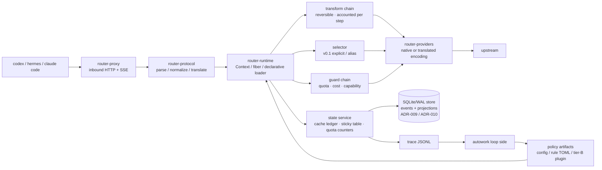

# Design (HOW) — router

Convention: this document is the single source of truth for the **implementation structure** (module
boundaries, data flow, algorithms, test strategy). External behavior is in `docs/spec.md`.

## 1. Panorama



Three hard boundaries (AGENTS.md carries the binding clauses): the byte boundary, content determinism,
the observation boundary.

## 2. crate dependency direction

```
router-cli → router-proxy → router-protocol → router-core ← router-plugins
                    ↘ router-runtime ↗                 ↑
                          router-providers        router-plugin-sdk (tier-B protocol types)
                    router-store ──→ router-core  (trait Store implementation, ADR-009)
```

- `router-core`: the domain model of request/decision, the cost engine, the cache ledger, the plugin
  traits. **Depends on no HTTP/protocol crate**.
- `router-runtime`: Cordis semantics (§4). `router-core`'s traits are loaded here as fibers.
- `router-protocol`: codec for the 3 protocols + translation matrix + `Usage` normalization; pure
  functions, exhaustively unit-testable.
- `router-providers`: wire capabilities, authentication, retry, SSE parsing; **makes no decisions**.
- `router-proxy`: the axum data plane, byte-faithful forwarding and SSE passthrough.
- `router-plugins`: the built-in tier-A plugins (cache-guard, transform_rules, cost_ledger, quota_guard,
  sticky).
- `router-store`: the SQLite/WAL implementation of `trait Store` (event log + projections + migrations).
  It is the persistence seam **under** the state service's traits of §12.2, not a second domain model
  (ADR-009).

## 3. Decision pipeline (the order of one request)

```
parse → session resolution → transform chain → selector → guard chain → encode → forward → usage normalization → ledger/trace
```

Key design: **both transform and guard remain trace-attributable after the decision** (one transform
record is written per step); in v0.1 the selector only does explicit/alias resolution and `auto` is left
to a plugin — but the slot, the contract and the trace fields are in place now, so a plugin needs no
data-plane change when it lands.

## 4. Plugin runtime (aligned with Cordis semantics)

The mapping from the paper's primitives to this project's implementation (fixed by ADR-002):

| Cordis primitive | This project's Rust form | Purpose |
|---|---|---|
| `ctx.effect(cb) → dispose` | `fn(&mut Ctx) -> Effect`, `Effect{undo: FnOnce}`, accumulated LIFO | any registration/rewrite carries its own inverse; unloading a plugin = a full rollback |
| `ctx.set(key,value)` / `ctx.get(key)` + `notify → refresh` | typed service slot `ServiceKey<T>`; when a provider enters UNLOADING its **dependents are deactivated first**, then the binding is withdrawn | dependencies and dependents between plugins need no manual ordering |
| `fiber.inject` (a coeffect declaration) | the manifest declares `inject: [services]`; while unsatisfied it **stops at load-waiting** instead of erroring | out-of-order loading is safe |
| `ctx.isolate(key, realm)` | the same key with multiple realms → two independent sets of bindings | **A/B and shadow**: two policy versions coexist without interfering |
| `ctx.intercept(key, metadata)` | does not change the binding, only "how it is used" | set the sample rate, timeout or shadow switch for one plugin |
| entries + keyed diff + HMR | a declarative `plugins:` list + per-field minimal operations | parameter-level experiments need no restart |

**Rust's trade-off (must be faced honestly)**: the paper's HMR relies on dynamic module loading in JS.
This project's tier-A plugins are linked at compile time, so there is **no module-level HMR** — a code
change = rebuild + restart; only **config-level coordination** (config/weights/rule TOML take effect
immediately) and module-level reload of tier-B (out-of-process) plugins exist. To keep the restart cost
low, the `cache ledger / sticky table / quota counters` are all projections of the local store (§8,
ADR-009) and survive a restart (rebuilt from the event log if a projection was lost), so a restart loses no
session context.

Lifecycle state machine (simplified): `LOADING → ACTIVE → UNLOADING → (removed)`; while `inject` is
unsatisfied it stays at LOADING; when unloading a fiber its dependents leave first, then its inverse is
executed in LIFO order. A failed state carries an error result and does not affect other fibers.

## 5. Cost engine

**Five-tier price + peak/off-peak**: `input_miss`, `input_hit`, `cache_write`, `output`,
`peak.multiplier`. Per-request cost:

```
cost = input_miss × p_miss + input_cached × p_hit + cache_write × p_write + output × p_out   (× peak)
```

**Quota plans** (coding-plan style): the marginal cost inside the plan is recorded as 0, but
`tokens_remaining` and `over_quota: block|spill` must be modeled; under `spill` the overflow is charged
at `p_miss`. The remaining allowance is written to the trace (`quota_after`), making "where the
allowance was spent" auditable.

**The cost model of switching (cache-aware breakeven)**: switching models immediately loses the prefix
cache and recomputes the whole prefix once at the miss price.

```
switch_gain  ≈ remaining_turns × tokens_per_turn × (p_stay − p_new)
switch_cost  ≈ prefix_tokens × p_miss_new
switch if and only if switch_gain > safety_factor × switch_cost
```

The parameters are in `config.cache.breakeven`; `remaining_turns` is estimated from the session history
and `safety_factor` defaults to 1.2. (In v0.1 the model is specified explicitly, so this formula decides
**failover and quota spill**, not automatic model selection.)

## 6. Cache policy (P0, the first-order lever)

1. **Fidelity**: on the passthrough path the only permitted mutation is deleting router-owned fields;
   for the same input the encoder must be byte-deterministic.
2. **Content determinism**: a transform is a pure function of `(content, stable config)` — depending on
   the turn number, the wall clock or an RNG is forbidden. Any "rolling window / per-turn trimming"
   implementation counts as breaking the prefix (which is why P4 is deferred).
3. **Stickiness**: a session → (provider, model) mapping, keyed preferentially by the client-supplied
   `prompt_cache_key` (the upstream echoes it; measured to work), falling back to `header:session-id` /
   `header:thread-id`; TTL is in config.
4. **Breakpoint injection**: when translating to an anthropic upstream, inject `cache_control` at "stable
   content boundaries" (same content → same position); the number of breakpoints is written to the trace
   (`cache_control_breaks`).
5. **State-service handover**: the ledger and the sticky table are projections of the local store
   (§8, ADR-009/ADR-010); a restart loads them — and rebuilds them from the event log if they were
   lost — so the `prefix_continuity` metric does not break across restarts.

## 7. Protocol translation layer

The capability matrix is declared in config (`supports`); the 3×3 table is constructed at runtime:

- a `native` cell → byte passthrough (the only permitted operation is deleting router-owned fields).
- a `translated` cell → goes through an explicit mapper; every mapper must be marked
  `lossless | lossy(reason)`.
- when lossy: write the trace and optionally the `X-Router-Lossy` response header; never silently.
- inbound unknown fields are kept verbatim (a bypass side channel exists), so protocol evolution loses
  no information.
- **an upstream error is normalized in exactly one place** (ADR-011): the provider layer surfaces the raw
  evidence (status, headers, error body) and makes no decision (§2), the classifier in `router-core`
  assigns a reason and a recovery action, and this layer only *renders* the client-facing shape
  (`ErrorBody`, §12.7). No call site branches on an upstream's prose, and an upstream error body is read
  and never persisted (ADR-009 item 3).

## 8. State and persistence

One local process, one writer, one store. State is an **event log plus rebuildable projections**, not
memory plus snapshots: ADR-009 fixes the storage boundary, ADR-010 the truth and the write ordering.

The plugin-facing surface stays the service traits of §12.2 (`CacheLedger`, `SessionTable`, `QuotaStore`);
`trait Store` is the persistence seam **under** them, implemented by `router-store` (§12.1).

| State | Medium | Durability | Notes |
|---|---|---|---|
| event log (`events`) | SQLite/WAL behind `trait Store` | intent / accounting events `synchronous=FULL`, committed **before** the effect they authorize (ADR-010) | the truth: every state transition is a row |
| sticky table / cache ledger / quota counters | projections in the same store | `NORMAL` + group commit | rebuildable from `events`; losing one regresses statistics, never correctness |
| provider cooldown (demotion, ADR-011) | projection in the same store | `NORMAL` + group commit | rebuildable from `events`; losing it costs one doomed attempt, never a wrong charge |
| trace | append-only JSONL, rolled hourly (spec §4.1; record shape in §12.6) | OS defaults | the analysis truth and the only product → autowork channel (ADR-005), unchanged |
| request / response bodies | **never persisted by the product** | — | the log keeps `body_hash` + a pointer; raw bytes exist only in captures taken outside the product |

- **Store path**: `<directory containing the config file>/state/router.db` (`state/` is gitignored). v0.1
  fixes it — there is no `state:` config key (§12.5); a section that moves the file is an additive future
  key (spec §4.1's precedent).
- **Startup prerequisite**: if the store cannot be opened or migrated, `serve` exits non-zero with the
  reason. There is no in-memory degraded mode: a gateway that enforced quota from numbers it cannot
  recover would report figures it cannot stand behind.
- **Ordered write path**: `upstream.submitted` commits before the upstream attempt begins; if that intent
  write fails, the request is rejected before anything is sent (nothing billed, the client's retry is
  safe) (ADR-009 item 8).
- **Crash window**: an intent with no response is `unknown_outcome`; the quota is not charged again and no
  cost is invented for it (ADR-010).
- **Migrations**: forward-only, with three deliberately distinct version axes (store DDL / event payload /
  trace record — ADR-009 item 7).

**Upstream failure path (ADR-011).** One classifier, one action, one record: `upstream.responded` →
`classify_upstream_error` → `error.classified` (a kind of ADR-010's vocabulary; `NORMAL`, payload `reason` +
`action` + the matched table entry + `retry_after_s?` + `demotion?`) → the action's effect. The action set is
`retry | rotate credential | fallback provider | compress | abort`, and the trace mirror rides in the
existing `errors[]` element (`kind = upstream_error`, `details.*`), so no spec §6 field and no
`schema_version` moves (§12.6).

- **Retry needs not-billed evidence**: an answer (any status) or a failure before the request bytes went out
  may be retried inside the declared attempt budget; a request fully written whose response never arrived
  may **not**, because the upstream may already have billed it — that attempt is ADR-010's
  `unknown_outcome`, and the client decides whether to retry.
- **`context_overflow` / `payload_too_large` compress instead of failing over** (failing over bills another
  provider for the same oversized prompt), and `content_policy_blocked` is aborted locally, never re-probed
  unchanged.
- **The provider is the demotion unit** (a plan allowance is per provider/account, spec §4.0): a
  billing-class failure writes a cooldown that the guard sees as an unavailable route, so the next request
  does not pay to rediscover a dead account. `Retry-After` and the `x-ratelimit-*` headers feed its TTL, and
  a wait longer than `server.request_timeout` is carried across requests by the cooldown rather than held
  open inside one.
- **A failover prices the cache it breaks**: `failover.triggered` carries the prefix tokens and the switch
  cost in integer NanoUsd (§5, §12.4, ADR-006) as an **inferred** figure at decision time, and the measured
  figure — the miss-priced tokens actually billed on the first post-switch turn, against the origin route's
  `input_hit` price — once that attempt's `usage` lands. The `verified/inferred` convention (spec §7) thus
  applies to failover exactly as it applies to transforms.

## 9. Replay (computing money with the same code)

`router replay --trace t.jsonl --config c.yaml [--plugins p.yaml]`: feeds real inbound requests into
**the same production decision pipeline** (the same binary, the same transform/encoding path), replacing
only the outbound HTTP with a local simulation (or a real replay once, behind a budget gate). It outputs
a cost/cache/latency report contrasted against `prefix_continuity`.

This is the foundation of autowork: a policy cannot be re-implemented in Python without producing skew
(the lesson of the old project), so policy simulation is always a subcommand of the product.

## 10. Test strategy

| Layer | Contents |
|---|---|
| unit | exhaustive protocol codec (3×3), `Usage` normalization, five-tier cost, breakeven boundaries, realm isolation, effect LIFO rollback, the upstream-error taxonomy (one fixture per reason class plus the priority-order cases, ADR-011) |
| conformance | fidelity (upstream-visible prefix hash == the client's), SSE event-sequence equivalence, tool-call round trip, unknown-field passthrough, error-code mapping |
| cache | same-session two turns `prefix_continuity == 1.0`; re-measure after enabling each transform (regression guard) |
| accounting | every transform carries a `verified/inferred` label; gates read verified only |
| state | write-ahead ordering on a fixed event log, projection == rebuild from `events`, an intent-write failure rejecting before anything reaches the upstream, startup refusal when the store cannot be opened or a second writer holds it, config-driven `serve` (CONF-20…25, §12.10) |
| interaction | one onboarding smoke run each with the real codex/hermes (including verification of the `NO_PROXY` prerequisite) |

## 11. Risks and mitigations

| Risk | Mitigation |
|---|---|
| a transform breaks the prefix without knowing it | `prefix_continuity` as a blocking gate; run the cache regression for each transform separately |
| a lossy translation layer makes client behavior wrong | the lossy list goes into the spec; mark it explicitly when lossy + conformance cases |
| no HMR for tier-A slows experiment iteration | parameters/rules go through config-level coordination; experiment-class plugins are forced to tier-B |
| the accounting convention is polluted by "estimates" | the binary verified/inferred convention + reports must state the sample size |
| a system proxy makes onboarding fail | README/spec enforce `NO_PROXY`; the smoke test includes this item |
| a retry picks the same dead provider again | the demotion is *state* (a cooldown projection), not a per-request check; the previous project measured this failure mode at 62% of its failures (ADR-011) |
| the failure path's judgement is re-implemented at each call site | one classifier in `router-core`, one table per reason class with a one-fixture minimum; the provider layer makes no decisions (§2) (ADR-011) |
| the loop improves the measurement instead of the product | the gate definitions, the frozen corpus and the conformance assertions are outside the mutable scope, and a verdict records the evaluator commit and the corpus digest it ran against (ADR-012) |
| an online experiment destroys the prefix cache | shadow first (no upstream call), then a session-bucketed canary decided at session start and never mid-session; shadow can never enter the cost gate (ADR-013) |
| an auto-adopted parameter drifts past its declared envelope | declared triggers + automatic rollback + no promotion without the minimum sample + a re-proposal cooldown; only in-envelope parameters are auto-adoptable (ADR-013) |

## 12. Module and type landing list

This section lands the structure of §2/§4/§5/§6/§7 as **signature sketches + a case-ID table**, giving
implementers a single basis. It lands only "the shape of types and contracts", not function bodies; the
implementation order is given by each row's "Lands in".

### 12.1 crate list, dependency direction and the third-party dependency allowlist

```
router-cli → router-proxy → router-protocol → router-core ← router-plugins
                    ↘ router-runtime ↗                 ↑
                          router-providers        router-plugin-sdk
```

| crate | Public surface (what is usable outside) | Permitted third-party dependencies | Lands in |
|---|---|---|---|
| `router-core` | domain model, cost/quota/breakeven pure functions, plugin traits, `DecisionRecord` | `serde`, `serde_json`(preserve_order+arbitrary_precision), `sha2` | from R1-2 |
| `router-protocol` | codec for the 3 protocols, translation matrix, `Usage` normalization, `raw_json` (span-faithful editing) | `serde_json` | R2 |
| `router-providers` | `ProviderClient` (wire capabilities, authentication, retry, SSE parsing) | `reqwest`, `tokio`, `futures` | R2 |
| `router-runtime` | `Ctx` / `Effect` / `ServiceKey` / fiber state machine, declarative loader | none (pure std + core) | R2 |
| `router-plugins` | built-in tier-A: cache_guard / transform_rules / cost_ledger / quota_guard / sticky | `toml`, `regex` | R2/R3 |
| `router-proxy` | axum data plane: byte-faithful forwarding, SSE passthrough | `axum`, `tokio`, `hyper`, `tower` | R2 |
| `router-cli` | `serve` / `stats` / `replay` / `trace` | `clap`, `tokio` | from R1-2 (serve stub) |
| `router-plugin-sdk` | tier-B out-of-process plugin protocol types (UDS frames) | `serde_json` | R3 |
| `router-store` | the SQLite/WAL store: the `events` log, the `sessions` / `cache_ledger` / `quota_counters` projections, forward-only migrations | `rusqlite` (bundled), `serde_json` | R2 (ADR-009) |
| `router-conformance` (`tests/conformance/`) | the CONF cases (§12.8) | `tokio`, `axum`, the crates under test | from R1-2, as an empty shell |

- **`router-core` depends on no HTTP / protocol crate** (§2 hard constraint); how it is spot-checked: the
  dependency set of `cargo tree -p router-core` must be ⊆ the allowlist.
- Dependency discipline: **a new dependency must have its reason written in the commit message**
  (consistent with this round's task constraint). Any dependency outside the allowlist is discussed first.
- Every crate root adds `#![forbid(unsafe_code)]`; `router-core` additionally adds
  `#![deny(clippy::float_arithmetic)]` (money only takes the fixed-point path of §12.4).
- Test placement: unit tests use `#[cfg(test)] mod tests` in place; conformance lives in
  `tests/conformance/tests/` (§12.8).

### 12.2 Runtime primitives (ADR-002 → Rust signature sketch)

| Cordis primitive | Rust type (`router-runtime`) | Where the semantics land |
|---|---|---|
| `ctx.effect(cb) → dispose` | `Ctx::effect(Effect) -> EffectId` + `Effect { undo: Box<dyn FnOnce()+Send> }` | a LIFO stack; unload = run the undos in order |
| `ctx.set/get(key)` + refresh | `Ctx::provide/get` + `ServiceKey<T>` | a provider going offline → its dependents are deactivated first, then the binding is withdrawn |
| `fiber.inject` | `Plugin::inject() -> &[ServiceId]` | while unsatisfied it stays at `Loading{waiting_on}`, with no error |
| `ctx.isolate(key, realm)` | `Ctx::isolate(key, RealmId) -> RealmGuard` | multiple sets of bindings for the same key (A/B and shadow coexist) |
| `ctx.intercept(key, md)` | `Ctx::intercept(&key, InterceptMeta)` | does not change the binding, only "how it is used" (sample/timeout/shadow) |
| entries + keyed diff | a `PluginCfg` list + `apply_config_diff` | a config change diffs itself; `disabled` unloads; an `id`/`kind` change rebuilds |

```rust
pub struct PluginId(pub String);
pub struct ServiceId(&'static str);
pub struct RealmId(u32);
pub const ROOT_REALM: RealmId = RealmId(0);

pub struct ServiceKey<T: ?Sized> { name: &'static str, _m: PhantomData<fn() -> T> }
impl<T: ?Sized> ServiceKey<T> { pub const fn new(name: &'static str) -> Self; pub fn name(&self) -> &'static str; }
pub const CACHE_LEDGER: ServiceKey<dyn CacheLedger> = ServiceKey::new("cache_ledger");
pub const SESSION_TABLE: ServiceKey<dyn SessionTable> = ServiceKey::new("session_table");
pub const QUOTA_STORE:   ServiceKey<dyn QuotaStore>   = ServiceKey::new("quota_store");
pub const TRACE_SINK:    ServiceKey<dyn TraceSink>    = ServiceKey::new("trace_sink");

pub struct Effect { undo: Option<Box<dyn FnOnce() + Send>> }
impl Effect { pub fn new(f: impl FnOnce() + Send + 'static) -> Self; pub fn noop() -> Self; }

pub struct Ctx { /* fiber scope: service table + effect stack + realm table */ }
impl Ctx {
    pub fn effect(&mut self, e: Effect) -> EffectId;
    pub fn provide<T: Send + Sync + 'static>(&mut self, key: ServiceKey<T>, v: Arc<T>) -> EffectId;
    pub fn get<T: Send + Sync + 'static>(&self, key: &ServiceKey<T>) -> Option<Arc<T>>;
    pub fn isolate<T: Send + Sync + 'static>(&mut self, key: ServiceKey<T>, realm: RealmId) -> RealmGuard;
    pub fn intercept<T: Send + Sync + 'static>(&mut self, key: &ServiceKey<T>, md: InterceptMeta);
}

pub enum FiberState { Created, Loading { waiting_on: Vec<ServiceId> }, Active, Unloading, Failed(PluginError), Removed }

pub trait Plugin: Send + Sync {
    fn id(&self) -> &PluginId;
    fn inject(&self) -> &'static [ServiceId];      // coeffect declaration; unsatisfied → stays at Loading
    fn apply(&self, ctx: &mut Ctx) -> Result<Effect, PluginError>;
}
```

**Unload order (the implementation must follow it, and a test asserts it)**: ① recursively put the
dependents into `Unloading` and wait for them to finish → ② run this fiber's `Effect::undo` in reverse
LIFO → ③ withdraw the service bindings → ④ `Removed`. A failure goes to `Failed(err)` and **does not
affect other fibers** (ADR-002's "failure isolation"). How it is asserted: after load → activate →
unload, the service table and the intercept table must be **deep-equal** to what they were before
loading (R2 test).

### 12.3 Decision-pipeline types and the failure semantics of each step

```
parse → session resolution → transform chain → selector → guard chain → encode → forward → usage normalization → ledger/trace
```

```rust
pub enum Protocol { Chat, Responses, Anthropic }
pub enum ClientKind { Codex, Hermes, ClaudeCode, Other }
pub struct RouteSpec { pub provider: String, pub model: String }
pub enum SelectionSource { Explicit, Alias, Plugin }
pub struct Decision { pub route: RouteSpec, pub source: SelectionSource, pub plugin_chain: Vec<PluginId> }

pub trait Transform: Send + Sync {
    fn id(&self) -> &'static str;
    /// Content-deterministic: reading the clock/turn/RNG is forbidden. Err = fall back to the original text (spec §8), the caller records the trace.
    fn apply(&self, req: &mut CanonicalRequest) -> Result<TransformReport, TransformError>;
}
pub struct TransformReport {
    pub added_input_tokens: u64, pub saved_input_tokens: u64, pub saved_output_tokens: u64,
    pub cache_impact: CacheImpact, pub verdict: Verdict, pub tee_id: Option<TeeId>,
}
pub enum CacheImpact { Neutral, Risky, Broken }      // Broken → cache_guard's strict_prefix rejects it
pub enum Verdict { Verified, Inferred }              // only Verified can enter a gate (ADR-003/spec §7)

pub trait Selector: Send + Sync { fn select(&self, req: &CanonicalRequest, roster: &Roster) -> Result<Decision, SelectError>; }
pub trait Guard: Send + Sync { fn check(&self, cx: &GuardCx<'_>) -> GuardOutcome; }
pub enum GuardOutcome { Pass, Reject { code: ErrorCode, message: String }, Downgrade(RouteSpec) }
pub trait Observer: Send + Sync { fn on_decision(&self, rec: &DecisionRecord); fn on_error(&self, e: &RouterError); }
```

| Step | Failure semantics |
|---|---|
| parse | the request body is unparsable → `invalid_request` 400, not forwarded |
| session resolution | every source is missing → `session = None` (the trace records null, `sticky_hit=false`), **not an error** |
| transform | any step `Err` → fall back to the original text + `TransformRecord.error`; the request proceeds as usual (spec §8) |
| selector | `auto` → `auto_not_supported` 400 (spec §3); a `provider/model` that does not exist → 404 |
| guard | `Reject` → the normalized error body; `Downgrade` → take that route and record `failover_from` |
| encoding | a translation cell missing its declaration → 400; lossy → record `lossy[]` + `X-Router-Lossy` |
| forwarding | 5xx/429/quota exhausted → the fallback chain; chain exhausted → 502 carrying the last `upstream_status` |
| usage normalization | the upstream is missing usage fields → zero values + trace `usage_missing: true` (**never guessed**) |
| ledger/trace | a trace write failure → the request proceeds as usual, the count goes into the `trace_dropped` metric (an observable degradation) |

#### 12.3.1 Landing the byte boundary in the types (AGENTS hard constraint 1)

```rust
pub struct CanonicalRequest {
    pub protocol_in: Protocol,
    pub raw: RawBody,                 // the client's raw bytes: the sole authority
    pub doc: JsonDoc,                 // order-preserving parsed view (for decisions; **not used for outbound sending**)
    pub session: Option<SessionId>,
    pub thread_id: Option<String>,
    pub turn_index: u32,
}
pub struct RawBody(Bytes);
impl RawBody {
    pub fn as_bytes(&self) -> &[u8];
    /// The only permitted rewrite: deleting top-level router-owned fields. All other bytes are kept byte for byte.
    pub fn remove_top_level_keys(&self, keys: &[&str]) -> Result<RawBody, RawEditError>;
}
```

- `RawBody` **does not implement** `DerefMut`/`AsMut`, and exposes no mutable reference to a
  `serde_json::Value` → a casual "just tweak it" is blocked at compile time.
- `remove_top_level_keys` uses a **single-pass JSON scanner** (it needs only the spans of the top-level
  keys, tracking strings/escapes/bracket depth) to delete at the byte level; a **parse → reserialize
  round trip is forbidden** (that is the most common way the byte boundary is broken).
- router-owned fields = the `router_meta` echo + routing hints (spec §2). The deletion list is a
  **whitelist constant**; adding one requires changing that constant.
- The separator semantics of deletion (pinned down in R1-2c): consecutive whitelist hits form one
  "segment"; the segment is removed as a whole and swallows the comma between **its tail** and the
  member that follows it (including the whitespace in between); the comma at the head of the segment is
  left to the previous retained member. Only when the first member is the start of a segment does it
  instead swallow the segment-tail comma. Invariant: any `Ok` output must be valid JSON, and the
  retained members are byte-for-byte equal to their input spans (the `deletion_position_matrix*` tests
  are a permanent regression matrix).
- Three settled boundary behaviors (the rationale for rejecting vs passing through, each pinned by a
  unit test):
  - **BOM prefix → `Err(NotTopLevelObject)`**: stripping the BOM is a rewrite outside the whitelist
    (hard constraint 1 permits deleting router-owned fields only), so router has no right to "fix it in
    passing" and it is left to the caller to handle as a 400.
  - **Leading-zero number (`01`) → `Err(Malformed)`**: the RFC 8259 number grammar does not contain this
    form; the raw value fragment is vetted by the serde_json validator, and an ambiguous number is not
    passed through (upstream parsers disagreeing is a hidden risk).
  - **invalid UTF-8 inside a **string** value → `Ok` and passed through byte for byte**: the byte
    boundary takes priority, router does not interpret value content, and legality is adjudicated by the
    upstream. Note the asymmetry: invalid UTF-8 inside a **key** is still `Err(Malformed)` — a key must
    be decodable to be compared semantically against the whitelist, and if it cannot be compared there is
    no safe way to decide delete-or-not.
- The domain of the prefix hash = the raw bytes of `messages | input | tools` and the system-instruction
  position in the upstream-visible body (spec §6 "prefix"), so "deleting router fields" does not affect
  that hash — CONF-10 asserts exactly this.
- Prefix blocks (`prefix_blocks[]`): a block = the **smallest indivisible unit** in the prefix region
  (one message / one tool definition / one input item), recording `tokens` and `hash` per block;
  `hash = the first 16 hex chars of sha256(block raw bytes)`.
  (GAP-Q5: the spec does not define block granularity; this blueprint takes a "structural unit" rather
  than a fixed-length token bucket, because the former aligns with cache breakpoints.)

### 12.4 Cost / quota / breakeven pure functions (the implementation target of R1-2)

```rust
/// Money is fixed-point: 1 nano-USD = 1e-9 USD. No f64 appears in the decision path or the trace.
pub struct NanoUsd(pub u64);
/// Unit price: nano-USD / 1K token (the same shape as the config's USD/1K, only integerized).
pub struct Price(pub u64);
pub struct PriceTable { pub input_miss: Price, pub input_hit: Price, pub cache_write: Price,
                        pub output: Price, pub peak: PeakTable }
pub struct PeakTable { pub multiplier_pct: u32, pub windows: Vec<PeakWindow> }   // 2.0 → 200
pub struct PeakWindow { pub days: Weekdays, pub from_min: u16, pub to_min: u16, pub tz: Tz }

pub struct Usage { pub input_total: u64, pub input_cached: u64, pub cache_write: u64,
                   pub output: u64, pub reasoning: u64 }
impl Usage { pub fn uncached(&self) -> u64;  pub fn cache_hit_rate(&self) -> f32; }

pub struct CostBreakdown { pub input_miss: NanoUsd, pub input_hit: NanoUsd, pub cache_write: NanoUsd,
                           pub output: NanoUsd, pub peak_applied_pct: u32, pub total: NanoUsd }

/// Pure function: cost(miss, hit, write, out, price, at) -> CostBreakdown
/// cost_nano = Σ_tier ( tokens_tier × price_tier_nano_per_1k ) / 1000   (integer; only the final division rounds down)
/// A peak-window hit (at ∈ windows) → sum the no-peak total first, then × multiplier_pct / 100.
/// The input_miss tier uses usage.uncached(); the output tier includes reasoning (most upstreams count reasoning into output).
pub fn cost(usage: &Usage, price: &PriceTable, at: Timestamp, tz: Tz) -> CostBreakdown;
```

Quota (spec §4 `quota`, DESIGN §5):

```rust
pub enum QuotaWindow { Monthly { reset_day: u8 } }        // spec defines monthly only; any other value = a load error
pub enum OverQuota { Block, Spill }
pub struct QuotaPlan { pub models: Vec<String>, pub window: QuotaWindow, pub tokens: u64,
                       pub over_quota: OverQuota, pub source: String }
pub struct QuotaState { pub plan_idx: usize, pub window_start_epoch_s: u64, pub tokens_used: u64 }
pub enum QuotaVerdict {
    Inside  { remaining_before: u64 },
    Spill   { billable_tokens: u64 },      // the overflow is charged at input_miss (DESIGN §5)
    Blocked { remaining: u64 },            // over_quota=block → Guard Reject(quota_exceeded)
}
/// Pure function (the only state write point): tokens = usage.input_total + usage.output (this blueprint's default convention; see GAP-Q1)
pub fn charge(plan: &QuotaPlan, st: &mut QuotaState, usage: &Usage, now_epoch_s: u64) -> QuotaVerdict;
```

cache-aware breakeven (DESIGN §5, integerized to avoid floating-point boundary disagreements):

```rust
pub struct BreakevenParams { pub enabled: bool, pub min_remaining_turns: u32, pub safety_factor_pct: u32 }
pub struct SwitchCandidate {
    pub prefix_tokens: u64,      // the amount of prefix recomputed at the miss price when switching models
    pub tokens_per_turn: u64,    // estimated input tokens per following turn
    pub remaining_turns: u32,    // estimated remaining turns (no history → 0)
    pub p_stay_hit: Price,       // the next turn's unit price if staying = the current model's input_hit (already cached)
    pub p_new_miss: Price,       // the new model's input_miss (switching necessarily misses the whole prefix)
}
pub enum StayReason { Disabled, RemainingTurnsZero, BelowMinRemainingTurns, NotPaying }
pub enum SwitchVerdict { Switch { gain: NanoUsd, cost: NanoUsd },
                         Stay { reason: StayReason, gain: NanoUsd, cost: NanoUsd } }
/// gain = remaining_turns × tokens_per_turn × (p_stay_hit − p_new_miss) / 1000   (an i128 intermediate)
/// cost = prefix_tokens × p_new_miss / 1000
/// Switch ⟺ gain × 100 > safety_factor_pct × cost      (strictly greater; cross-multiplied, so no precision is lost to division)
pub fn decide_switch(p: &BreakevenParams, c: &SwitchCandidate) -> SwitchVerdict;
```

**Boundary cases (R1-2 must cover them, asserting the `SwitchVerdict` for each)**:

| Case | Expectation |
|---|---|
| `enabled = false` | `Stay(Disabled)` |
| `remaining_turns = 0` | `Stay(RemainingTurnsZero)` (gain is always 0) |
| `remaining_turns < min_remaining_turns` | `Stay(BelowMinRemainingTurns)` (even if the formula is better) |
| `prefix_tokens = 0` | `Switch` (switching costs 0, gain > 0) |
| exactly equal (`gain×100 == sf×cost`) | `Stay(NotPaying)` (switch only on strictly greater) |
| `p_stay_hit ≥ p_new_miss` | `Stay(NotPaying)` (not profitable) |
| a peak-window hit | both `cost`/`gain` include `×multiplier_pct/100` |
| integer tiering `input_miss=0.00015` | parses to `Price(150_000)` (no floating-point residue) |

### 12.5 Config types and parsing rules (`config.example.yaml` ↔ types)

```rust
#[derive(Deserialize)] #[serde(deny_unknown_fields)]
pub struct RouterConfig { pub server: ServerCfg, pub session: SessionCfg, pub cache: CacheCfg,
    pub trace: TraceCfg,
    pub providers: Vec<ProviderCfg>, pub aliases: BTreeMap<String, RouteSpec>,
    pub plugins: Vec<PluginCfg>, pub fallback: Vec<RouteSpec> }

/// spec §4.1; `Rollover::Hourly` is the only value in v0.1 → the file `<dir>/YYYY-MM-DDTHH.jsonl` (UTC).
pub struct TraceCfg { pub dir: PathBuf, pub rollover: Rollover }
```

| Point | Rule |
|---|---|
| duration | `<integer><ms\|s\|m\|h>`, concatenable (`1h30m`); invalid → a load error (with the field path) |
| context | `<integer>` or `<integer>k\|m` (k=1024, m=1048576); used by the guard's capability check |
| price | read as f64 (USD/1K), converted **at load time** to `Price((v * 1e9).round() as u64)`; `v < 0`, or 0 after `round` → a load error |
| peak.multiplier | converted to `multiplier_pct = (v*100).round()`; only two decimal places are supported, otherwise a load error |
| base_url | must already contain the version segment; router only appends `chat → /chat/completions`, `responses → /responses`, `anthropic → /v1/messages` |
| `rules_file` | resolved relative to **the directory containing this config file** (not the CWD); `trace.dir` follows the same rule (spec §4.1) |
| `trace.rollover` | only `hourly` is accepted (any other value = a load error); retention is **not** a config key (v0.1 does no automatic cleanup) |
| `state` | **not** a config key in v0.1: the store path is fixed at `<config dir>/state/router.db` (spec §4.5, ADR-009); a `state:` section that moves the file (as `trace.dir` does) is an additive future key |
| unknown fields | `deny_unknown_fields` → **errors out and exits** (no silent ignore: config is written by hand, and "I changed it but it did not take effect" is the most expensive silent failure) |
| secrets | only `api_key_env`; when the env var is missing at startup → that provider is marked unavailable and reported on `/health` (it does not block other providers) |
| `disabled: true` | that fiber is not loaded (no error); `/health` lists it under `plugins_disabled` |
| defaults | only those the spec §4 states explicitly (`safety_factor: 1.2`, `sticky`, `over_quota`) have a default; everything else is **not enabled unless written** |

### 12.6 DecisionRecord (trace contract, fully covering spec §6)

```rust
pub struct DecisionRecord {
    pub schema_version: u16,            // trace version; the autowork side uses it for compatibility (ADR-005)
    pub ts: String,                     // RFC3339 UTC, milliseconds
    pub identity: IdentityRec,          // identity
    pub protocol: ProtocolRec,          // protocol
    pub decision: DecisionRec,          // decision
    pub state: StateRec,                // state
    pub prefix: PrefixRec,              // prefix
    pub transforms: Vec<TransformRecord>, // transform (one per step)
    pub usage: Usage,                   // usage
    pub cost: CostRec,                  // cost
    pub result: ResultRec,              // result
    pub errors: Vec<TraceError>,        // failure details (spec §6 "failure details"; written back in R1-4)
}

pub struct IdentityRec { pub request_id: String,
    pub event_id: i64,          // the request.received event in the state store (spec §4.5, ADR-010)
    pub client: ClientKind, pub client_ua_raw: Option<String>,
    pub session: Option<String>, pub thread_id: Option<String>, pub turn_index: u32 }
pub struct ProtocolRec { pub r#in: Protocol, pub out: Protocol, pub translated: bool, pub lossy: Vec<LossyNote> }
pub struct LossyNote { pub field: &'static str, pub reason: &'static str, pub action: LossyAction }
pub struct DecisionRec { pub provider: String, pub model: String, pub selection_source: SelectionSource,
    pub plugin_chain: Vec<String>, pub decision_ms: u32 }
pub struct StateRec { pub stateful_inbound: bool, pub sticky_hit: bool, pub cache_control_breaks: u16 }
pub struct PrefixRec { pub blocks: Vec<PrefixBlock>, pub continuity: Option<f32> }
pub struct PrefixBlock { pub kind: BlockKind, pub index: u16, pub tokens: u64, pub hash: String }
pub struct TransformRecord { pub plugin: String, pub added_input_tokens: i64, pub saved_input_tokens: i64,
    pub saved_output_tokens: i64, pub cache_impact: CacheImpact, pub verdict: Verdict,
    pub tee_id: Option<String>, pub error: Option<String> }
pub struct CostRec { pub input_miss: NanoUsd, pub input_hit: NanoUsd, pub cache_write: NanoUsd,
    pub output: NanoUsd, pub peak_applied_pct: u32, pub total: NanoUsd, pub quota_after: Option<QuotaAfter> }
pub struct QuotaAfter { pub provider: String, pub plan_idx: usize, pub tokens_used: u64, pub tokens_limit: u64,
    pub over_quota: OverQuota, pub verdict: &'static str }
pub struct ResultRec { pub status: u16, pub upstream_status: Option<u16>, pub failover_from: Option<RouteSpec>,
    pub overhead_ms: u32, pub upstream_ms: Option<u32>, pub usage_missing: bool }

/// The landing of spec §6 "failure details": the **internal** failure details (possibly several), which are
/// not the same thing as the single error response given to the client in §12.7; the two share the kind vocabulary.
/// No failure = an empty array (not omitted).
pub struct TraceError { pub kind: TraceErrorKind, pub message: String,
    pub plugin: Option<String>, pub details: Option<serde_json::Value> }
pub enum TraceErrorKind { TransformError, UpstreamError, TraceWriteFailed, Internal }
```

spec §6 field groups → Rust paths (auditable line by line):

| spec §6 field group | Fields | Rust path |
|---|---|---|
| identity | `request_id` `event_id` `client` `session` `thread_id` `turn_index` | `identity.*` (`client_ua_raw` is an appendix, for troubleshooting when UA normalization fails; `event_id` is the join anchor into the event log, spec §4.5) |
| protocol | `protocol_in` `protocol_out` `translated` `lossy[]` | `protocol.r#in` `protocol.out` `protocol.translated` `protocol.lossy` |
| decision | `provider` `model` `selection_source` `plugin_chain[]` `decision_ms` | `decision.*` |
| state | `stateful_inbound` `sticky_hit` `cache_control_breaks` | `state.*` |
| prefix | `prefix_blocks[]` (token count + hash) `prefix_continuity` | `prefix.blocks[].{tokens,hash}` `prefix.continuity` |
| transform | `plugin` `added_input_tokens` `saved_input_tokens` `saved_output_tokens` `cache_impact` `verdict` | `transforms[].*` |
| usage | `input_total` `input_cached` `cache_write` `output` `reasoning` | `usage.*` |
| cost | `cost.input_miss` `input_hit` `cache_write` `output` `total` `quota_after` | `cost.*` |
| result | `status` `upstream_status` `failover_from` `overhead_ms` `upstream_ms` | `result.*` |
| failure details | `errors[]` (`kind` `message` `plugin?` `details?`) | `errors[].*` (the kind vocabulary is shared with the error body of §12.7; the difference between internal details and the client-facing response is explained above) |

- On disk: `<config trace.dir>/YYYY-MM-DDTHH.jsonl` (spec §4.1; `trace.dir` defaults to
  `./state/traces`), **append-only, rolled hourly** (DESIGN §8); a write failure does not block the
  request and records `errors[].kind = trace_write_failed`.
- `schema_version` only increments on a **breaking** change; adding an optional field does not change the
  version (the autowork side tolerates unknown fields).
- `identity.event_id` is the `request.received` row of that request in the state store: the analysis truth
  and the state truth are paired on `request_id` + `event_id`, never on a timestamp (spec §4.5).
- Derived metrics (`router stats`, spec §6 "metric definitions") — all computable in a single pass over
  the trace, with no extra state needed:
  `cache_hit_rate = Σusage.input_cached / Σusage.input_total`;
  `stateful_inbound_rate`, `prefix_continuity_p50` (group by session, take adjacent requests),
  `verified_savings_tokens` (**accumulates only `verdict=Verified`**), the p99 of
  `overhead_ms_p99 = result.overhead_ms`.
- Reporting discipline: any statement of "how much was saved" must carry the convention
  (verified/inferred), the sample size and the time window (spec §7).

### 12.7 Error semantics and the response surface (the landing of spec §8)

> Since R1-4, the error-body schema and the `error.type`→HTTP table below **are already written into
> `docs/spec.md` §8** (the spec is the single source of truth for the external contract); this section
> keeps `ErrorBody`'s Rust form and the implementation details, and the two must agree.

Unified error body (**all** non-2xx responses and the stub endpoints share one shape; README's success
response carries the router-owned field `router_meta`):

```rust
pub struct ErrorBody { pub error: ErrorDetail }
pub struct ErrorDetail { pub r#type: &'static str, pub message: String,
                         pub request_id: String, pub details: Option<serde_json::Value> }
```

| `error.type` | HTTP | Trigger |
|---|---|---|
| `invalid_request` | 400 | request body unparsable / missing `model` / wrong field type |
| `unknown_provider` `unknown_model` | 404 | `provider/model` or an alias does not resolve |
| `auto_not_supported` | 400 | `model: auto` (v0.1; the hint says a plugin takes it over, spec §3) |
| `capability_unsupported` | 400 | inbound protocol ∉ that provider's `supports` |
| `cost_cap_exceeded` | 403 | guard cost cap hit |
| `quota_exceeded` | 429 | `quota.over_quota = block` and the allowance is exhausted |
| `stateful_unsupported` | 400 | stateful inbound and stickiness cannot keep fidelity (ADR-004) |
| `upstream_error` | 502 | upstream error and the fallback chain is exhausted (`details.upstream_status`) |
| `upstream_timeout` | 504 | an upstream attempt timed out and the chain is exhausted |
| `not_implemented` | 501 | the v0.1 stubs of the three protocol endpoints (R1-2) |
| `internal` | 500 | everything else (beyond the degradation path of a trace write failure) |

Response headers: `X-Router-Request-Id` (always), `X-Router-Session` (when a session was resolved),
`X-Router-Lossy` (when a lossy translation happened, DESIGN §7). On the SSE path all three headers must
already have been sent before the first event.

### 12.8 conformance case table (`CONF-01…CONF-25`)

Location: the workspace member `router-conformance` (`tests/conformance/`), case file
`tests/conf_<NN>_<slug>.rs`, the test function named after the file. **An unimplemented path must carry
`#[ignore = "CONF-NN: depends on <implementation item>"]`** (explicitly visible, rather than simply not
written).

| ID | Covers §10 | Assertion | Depends on implementation item |
|---|---|---|---|
| CONF-01 | conformance·fidelity | chat inbound → `wire_api: chat`: the upstream-visible body is byte-identical to the client body | router-protocol native path |
| CONF-02 | same as above | responses → responses native: bytes are identical | same as above |
| CONF-03 | same as above | anthropic → anthropic native: bytes are identical | same as above |
| CONF-04 | same as above·translation | chat → responses: two requests with the same content produce **the same upstream bytes** (determinism); the lossy points are registered one by one | translation matrix + mappers |
| CONF-05 | same as above | chat → anthropic: determinism + `cache_control` breakpoint positions stable | same as above + breakpoint injection |
| CONF-06 | same as above | responses → chat: determinism + the lossy list (dropping reasoning must be marked) | same as above |
| CONF-07 | same as above | responses → anthropic: determinism + breakpoint injection | same as above |
| CONF-08 | same as above | anthropic → chat: determinism + `thinking` handling | same as above |
| CONF-09 | same as above | anthropic → responses: determinism + `tool_use` mapping | same as above |
| CONF-10 | conformance·fidelity + §12.3.1 | after deleting router-owned fields the remaining bytes are byte-identical to the client's; the `router_meta` echo never reaches the upstream | `RawBody::remove_top_level_keys` |
| CONF-11 | conformance·unknown fields | top-level and nested unknown fields are passed through verbatim (including the measured fields `include`, `client_metadata`) | `RawBody` + encoder |
| CONF-12 | conformance·tool-call round trip | chat `tool_calls`/`role=tool` ↔ responses `function_call*` ↔ anthropic `tool_use/result`: id and order preserved | translation matrix |
| CONF-13 | conformance·SSE | native streaming: the upstream's `event:`/`sequence_number` are passed through event-by-event equivalently; end-event semantics preserved (responses has no `[DONE]`) | router-proxy SSE passthrough |
| CONF-14 | conformance·error codes | upstream 400/401/429/5xx → the normalized error body of §12.7; 5xx/429 triggers fallback and records `failover_from` | proxy + guard/fallback |
| CONF-15 | §10·cache | same-session two-turn passthrough: `prefix_continuity == 1.0` | cache ledger + sticky table |
| CONF-16 | §10·cache | after enabling each transform separately, re-measure the cache regression, not below the baseline (parameterized: one case per plugin) | transform chain + ledger |
| CONF-17 | §10·accounting | every `TransformRecord.verdict ∈ {Verified, Inferred}` and gates read `Verified` only | the accounting implementation |
| CONF-18 | §10·interaction | one smoke run each with the real codex/hermes (including verification of the `NO_PROXY` prerequisite) — manual / network-enabled CI only | end to end |
| CONF-19 | §9·replay | two `router replay` runs over the same trace produce cost/cache reports identical field by field | the replay subcommand |
| CONF-20 | §10·state | **ordered write invariant**: on one request run through the pipeline with a recording store and a fake provider, the event row with the highest `event_id` at the instant the attempt's request bytes are handed to the wire is that attempt's `upstream.submitted` intent — nothing is written between the intent commit and the attempt | `trait Store` + the ordered write path (§12.10.5) |
| CONF-21 | §10·state | **projection == rebuild**: running the same request set twice — once projecting incrementally, once rebuilding from `events` — yields row-by-row identical `sessions` / `cache_ledger` / `quota_counters` / `provider_cooldown` contents | the projections (§12.10.4) |
| CONF-22 | §10·state | **intent write failure ⇒ nothing reached the upstream**: with a store double whose intent write fails, the fake provider records zero attempts, the client receives the §8 `internal` body with `details.stage = "intent"`, and no intent row exists for the request | store + the intent path (§12.10.5) |
| CONF-23 | §10·state | **startup refusal, both kinds**: (a) a store that cannot be opened or migrated makes `serve` exit **non-zero** with the reason (never a silent in-memory fallback); (b) a second `serve` on the same state directory is refused at startup with a *distinguishable* "locked" reason | store startup + `router-cli` (§12.10.4) |
| CONF-24 | §10·state | **trace ↔ event join**: every `DecisionRecord` carries an `event_id` that exists in `events` with `kind = request.received` and the same `request_id`; the request's accounting rows carry a `trace_ref` that resolves to that record's own line | store + trace (§12.10.5) |
| CONF-25 | §10·state | **config-driven `serve`**: the listen address, the plugin set and the roster come from the config file — a config naming another address and another plugin set is what the process actually uses (`/health` reports the configured set, and the configured address is where it listens), with no hardcoded default surviving in the serving path | config parsing + `serve` (§12.10.2) |

**Allocation of CONF-20…25 (R2-2a).** These six IDs are allocated by the owner's R2-2a
decision — a human decision, not a loop outcome (AGENTS constraint 9 / ADR-012's
never-mutable path rule), which is why the allocation is recorded here rather than appearing
as an edit to an existing case. The cases are asserted by the round that lands the
implementation they name (R2-2b for CONF-25; R2-2c for CONF-20…24); their case files land
with those items and carry `#[ignore = "CONF-NN: depends on <item>"]` until then. The IDs
are allocated once: they are not renumbered and not reused. CONF-20 is the case ADR-010's
consequences explicitly invited ("the last event before an upstream call is
`upstream.submitted`"); CONF-21/22 come from ADR-009's projection rule (item 5) and its
failure-mode table (item 8); CONF-23 from ADR-009 item 6/item 8; CONF-24 from spec §4.5's
join key; CONF-25 from spec §4 (no behaviour outside the config).

Case IDs are a **contract**: a new behavior in `docs/spec.md` → this section and `tests/conformance/`
must gain it in step, and numbering only grows, never changes (a removed case keeps its ID and is marked
`removed`).

**R2-2d note — the failover chain walks routes, but never re-attempts a provider (spec §4.2).** The
chain walks "the next route **not yet attempted**" in list order, skipping routes of a provider
already attempted in this request (the in-request form of ADR-011 item 4's provider-level demotion:
a second attempt on a dead provider is the failure mode it designs out). Routes already attempted
are never retried within one request — the "not yet attempted" rule subsumes per-route retries on
the buffered path. The five CONF cases of this card (01/02/03/10-chain/14) are un-ignored by the
round that lands the provider adapters and the buffered forwarding path; their existing assertions
stand as written.

### 12.9 Gaps and pending rulings (GAP-Q1…Q13)

**This round changes no existing clause, it only registers.** Each entry gives the default this blueprint
adopts and its blast radius. (From R1-4 on, the "write-back record" below the table governs: settled
items are written into the spec, unsettled ones stay registered.)

| # | Gap | This blueprint's default | Impact |
|---|---|---|---|
| Q1 | the `quota` accounting convention is undefined (input only? including output? does cache_read count?) | `input_total + output` | quota routing (D5); the spec needs one more sentence |
| Q2 | the trace on-disk path / rollover / retention are not in config (§3's `state/traces/` is an implementation detail) | `state/traces/YYYY-MM-DDTHH.jsonl`, hourly | R2's trace implementation; a config section may also be needed |
| Q3 | the storage and retrieval channel of `tee + retrieve` are undefined (ADR-003 requires them, the spec has no endpoint) | declare `tee` in the rule first, storage and the endpoint come later | the retrievability of P1 compression's (D3) savings |
| Q4 | the override semantics of the rules' "three-level override" and whether an rtk-style trust gate is needed are undefined | the first hit takes effect; no trust gate is implemented | rule loading safety (D3) |
| Q5 | the block granularity of `prefix_blocks[]` is undefined | a structural unit (message / tool definition / input item) | cache-metric comparability |
| Q6 | the time zone and "holiday" semantics of the peak windows (`peak.windows`) | windows carry an explicit `tz`; holidays are not modeled | cost accuracy (D9) |
| Q7 | which tier breakeven's `p_stay` uses (hit price vs miss price) | `p_stay = input_hit`; `switch_cost` uses `p_new_miss` | failover/spill decisions (D5) |
| Q8 | the 400 criterion for `stateful_inbound` when it "cannot keep fidelity" is undefined | as long as the sticky table has that session it counts as able to keep fidelity | landing ADR-004 |
| Q9 | the behavior when `context` is exceeded (400, or hand it to the upstream) | hand it to the upstream (do not judge on the upstream's behalf) | guard behavior |
| Q10 | the error-body schema and `errors[]` are not listed in spec §6 | pinned down by §12.6/§12.7, recommended to be written back into the spec | autowork parsing the trace |
| Q11 | the plugin `inject` is not in spec §4's schema (DESIGN §4 requires it) | already landed in `config.example.yaml` and marked GAP | out-of-order loading safety |
| Q12 | the `fallback` chain schema and its switching granularity (global / per model) are not given in spec §4 | a global ordered route list | failover (D5) |
| Q13 | whether an alias may point at `auto` or carry parameter overrides | `provider/model` only | selection semantics (§3) |
| Q14 | how `prefix_blocks[].tokens` is counted (spec §6 requires a per-block token count; the dependency allowlist has no tokenizer) | proportional attribution of the measured `usage.input_total` over the prefix region by block byte length; every figure derived from it (`prefix_tokens`, `reprefill_tokens`, `switch_cost_nano`) is therefore `inferred` (spec §7), while `prefix_continuity` — the fidelity metric — uses only block hashes and is unaffected | cache-metric comparability; the inferred/verified split (§12.10.6) |

ADR disposition (R1-4): the three originally proposed ADRs have been written as the orchestrator ruled —
`ADR-006` "integer NanoUsd fixed-point accounting", `ADR-007` "span-faithful forwarding (no
parse→reserialize round trip)", `ADR-008` "three-level rule override and the trust gate" (v0.1 does not
enable the trust gate, and states the trigger condition for re-evaluating it). All three encode the types
and conformance assertions already pinned down, so §12's type sketches no longer need changing.

**R1-4 write-back record (2026-09-19; the spec has been changed, this section's table is kept as a
historical register)**

| Disposition | Items |
|---|---|
| already written into `docs/spec.md` | Q2 → §4.1; Q3 → §4.4 (the retrieval channel explicitly marked "not implemented in this version"); Q5 → §6 "the definition of `prefix_blocks[]`"; Q10 → §6 "failure details" + §8 (the error body + the type→HTTP table); Q11 → §4.3; Q12 → §4.2 |
| already ruled by ADR-008 | Q4 (override semantics = the first hit takes effect; the trust gate is not enabled in v0.1, and the trigger condition for re-evaluation is written in that ADR) |
| takes the default value (not written into the spec; annotated in `config.example.yaml` comments) | Q1 (quota = `input_total + output`), Q7 (`p_stay = input_hit`), Q9 (over context → hand it to the upstream), Q13 (an alias is only `provider/model`), Q14 (added in R2-2a: prefix-block tokens are a proportional estimate of the measured usage, so everything derived from them is `inferred` — §12.10.6) |
| left for Round 2 / D3 | Q8 (the 400 criterion for `stateful_inbound`), Q6 (holidays not modeled = a known deviation) |

### 12.10 Data plane and storage landing (the R2 blueprint)

The sections above name the two R2 deliverables without landing them: the **data plane**
(provider adaptation and the byte-level streaming relay, §12.10.1–§12.10.3) and the
**store** (`trait Store`, the `events` table, its projections and the event wiring,
§12.10.4–§12.10.6). This section lands their shape so `router-providers`, `router-proxy`,
`router-cli` and the new `router-store` can be implemented in parallel against one sketch.

It adds no field to spec §6, no error type to spec §8 and no key to spec §4. Where it
touches a contract it cites it; the two places where a contract's *wording* is narrower than
its intent are flagged explicitly as refinements (notes R1 and R2 in §12.10.5) rather than
quietly reinterpreted.

#### 12.10.1 Provider adaptation: `trait ProviderClient` and the `reqwest` implementation

```rust
// crates/router-providers (§12.1 allowlist: reqwest, tokio, futures)
pub struct UpstreamPlan<'a> {
    pub route: &'a RouteSpec,
    pub protocol_out: Protocol,       // the provider's wire_api; the encoding was decided in §7
    pub base_url: &'a str,            // already carries the version segment (spec §4)
    pub api_key: &'a SecretKey,       // Debug prints <redacted>; never serialized, never logged
    pub attempt: u32,                 // 0-based attempt index within one inbound request
    pub stream: bool,                 // the inbound request asked for SSE
}

/// The raw material of a classification. `router-providers` surfaces it and decides nothing
/// (ADR-011 item 1); the proxy, the guards and the plugins never read an upstream error body.
pub struct ErrorEvidence<'a> {
    pub status: Option<u16>,
    pub headers: &'a HeaderMap,
    pub body: &'a [u8],
    pub wrote_full_request: bool,     // ADR-011 item 6: the retry rule turns on exactly this flag
}

pub enum AttemptOutcome {
    Responded(UpstreamResponse),      // an answer (any status) arrived
    NotSent(TransportError),          // connect/TLS failure: no request bytes went out, nothing billed
    WrittenNoResponse(TransportError),// full write, no response: ADR-010 item 4's crash window
}
pub struct UpstreamResponse { pub status: u16, pub headers: HeaderMap, pub body: UpstreamBody }
pub enum UpstreamBody { Buffered(Bytes), Stream(BoxStream<'static, Result<Bytes, TransportError>>) }

pub trait ProviderClient {
    fn wire_api(&self) -> Protocol;                       // no I/O: the declared native format
    fn build(&self, plan: &UpstreamPlan<'_>) -> Result<http::Request<Bytes>, ProviderError>;
    fn send(&self, req: http::Request<Bytes>) -> impl Future<Output = AttemptOutcome> + Send;
}
```

- **No `async-trait`** (it is not in the allowlist): `send` returns `impl Future`, the trait is
  used through generics, and the proxy is monomorphized over the real client and its test
  double. dyn-compatibility is not needed anywhere — §12.1 lists exactly one real
  implementation.
- **One attempt per call.** `send` never retries and never fails over; the attempt index is a
  parameter, not a loop counter (ADR-011: retry is a *decision*, taken above this layer).
- **URL assembly** is the only place a path is composed: `base_url` already contains the
  version segment, and the client appends `chat → /chat/completions`,
  `responses → /responses`, `anthropic → /v1/messages` and nothing else (spec §4).
- **Auth** never leaks: `chat`/`responses` send `Authorization: Bearer <key>`; `anthropic`
  sends `x-api-key` plus `anthropic-version` (falling back to `Authorization: Bearer` for
  providers that document it). Auth header values exist only in the outbound request —
  `SecretKey` has no `Display`, its `Debug` prints `<redacted>`, it is not `Serialize`, and no
  log line, trace field or event payload can carry it (§12.10.2).
- **One `reqwest::Client` per provider**, built at startup so the connection pool is reused:
  `.connect_timeout(server.upstream_attempt_timeout)`,
  `.redirect(reqwest::redirect::Policy::none())`, and **automatic decompression disabled**
  (see R9 in §12.10.3). The inbound `server.request_timeout` bounds the whole request and is
  enforced by the caller, not by the client.
- **Test double.** `ProviderClient` ships a fake that returns a canned `AttemptOutcome` and
  records the bytes it was handed. Every case that must not touch the network uses it —
  CONF-20 and CONF-22 (the ordered-write invariant and the intent-write rejection) are only
  assertable through it.

#### 12.10.2 Config landing (spec §4 + §4.5)

Types live in `router-core` (pure, unit-testable): §12.5's `RouterConfig` is the type of the
file — exactly spec §4, `deny_unknown_fields`. File I/O lives in `router-cli`, which produces
a **resolved** form for `router-proxy`:

```rust
pub struct ResolvedConfig {
    pub config_dir: PathBuf,               // the anchor for every relative path (spec §4.1)
    pub server: ServerCfg,
    pub trace_dir: PathBuf,                // = config_dir / trace.dir       (spec §4.1)
    pub state_db: PathBuf,                 // = config_dir / state/router.db (spec §4.5, ADR-009 item 6)
    pub rules: Vec<(PluginId, PathBuf)>,   // per plugins[*].config.rules_file, resolved the same way
    pub router: RouterConfig,              // the validated file itself (roster, aliases, fallback, plugins)
}
```

- **Resolution rule, in one place.** A relative path is resolved against the directory
  containing the config file — never the CWD — for `trace.dir`, every `rules_file` and
  `state/` alike (spec §4.1; ADR-009 item 6). `config_dir` is the only place that rule is
  written, so the three paths cannot drift apart.
- **Load-time validation** (each failure exits non-zero, naming the config path and the
  reason; there is no partially-started process — CONF-25's counterpart, and the reason
  `deny_unknown_fields` is worth the friction):

  | Check | Example failure |
  |---|---|
  | an alias target resolves to a roster route | `aliases.coding-fast: unknown route zai/glm-9` |
  | a `quota` entry references only its **own** provider's model ids (spec §4.0) | a cross-provider reference |
  | `wire_api ∈ supports`, and every `supports` entry is a known protocol | a declaration that contradicts itself |
  | `fallback` entries are `provider/model` roster routes (aliases do not take part, spec §4.2) | an alias or an unknown route in the chain |
  | no duplicate provider `name`; no duplicate model `id` within a provider | an ambiguous roster |
  | the §12.5 parsing rules for duration / context / price / peak multiplier | the §12.5 error verbatim, with the field path |
  | no unknown key — **including a `state:` section** | the message states that the state path is fixed in v0.1 (spec §4.5) and that a `state:` section is an additive future key |

- **A missing `api_key_env` value is not a load error** (§12.5): that provider is marked
  unavailable and reported by `/health`; the rest of the roster still serves. A missing *key*
  in the file is, of course, a load error.
- **`/health` reports what was actually loaded** (the R2-2b/2c contract): the plugin set
  (with `disabled` entries shown as disabled), each provider's key presence, the resolved
  `trace_dir` and `state_db`, and the store's status. Before R2-2c lands, the store's status
  is reported honestly as `pending` (the path is resolved, opening is not implemented yet);
  once it lands, the value is `open` or the refusal reason (CONF-23).
- **No defaults outside the file.** The R1-2 stub's hardcoded `127.0.0.1:8790` address and
  hardcoded five-plugin list are removed and may not reappear in the serving path; the listen
  address, plugin set and roster come from the config and are asserted to do so by CONF-25.

#### 12.10.3 The streaming data plane: SSE byte-level requirements

The relay is a **byte-level** operation. Its requirements are stated as R1–R11 so a reviewer
can check an implementation against them one at a time.

**R1 — no re-framing.** Router never parses SSE events in order to re-emit them. The bytes
that reach the client are the bytes the upstream sent, in the order they arrived; router does
not insert, delete, reorder, rewrite or normalize `event:` / `data:` / `id:` / `retry:` lines,
does not merge or split events to a preferred size, and does not append a terminal marker
(§12.8 CONF-13 asserts the native path's equivalence event by event).

**R2 — write through, no buffering.** Each read is written to the client as soon as it is
available; router never accumulates the body to flush it at the end. Accumulating would
destroy the interactive property, change the observed timing of the stream and defeat R4's
idle detection. Time-to-first-event is the upstream's, not the stream's.

**R3 — the head goes first, and carries the truth.** The response head (the upstream's status
plus §12.7's response headers, including all three `X-Router-*` values required by spec §8)
is written before the first body byte. A streaming response never gains a `content-length`
that router invented; a buffered response keeps the upstream's.

**R4 — bounded idle.** After the head is sent, a gap with no upstream bytes longer than
`server.upstream_attempt_timeout` is a failure: the relay ends (R6), it does not hang. The
inbound `server.request_timeout` (default 10m) remains the outer bound on the whole request,
including the stream.

**R5 — a client disconnect cancels the upstream.** Dropping the response future drops the
upstream body stream, which closes that connection: router does not keep draining a stream
nobody is reading (that would bill tokens with no reader). If the stream had not completed,
the request is an `unknown_outcome` (§12.10.5): the upstream may already have billed it, so
the quota is not charged again and no cost is invented (ADR-010 item 4).

**R6 — mid-stream failure semantics** (three cases; the boundary is *our* head):

| Failure | Before our head is sent | After the first event is forwarded |
|---|---|---|
| connect/TLS failure, or an upstream error status with a non-SSE body | the ordinary error path: classify (ADR-011) → retry / fail over per the attempt budget → the client receives the §8 error body. The three headers have not been sent yet, so this is still a normal request | not reachable (the head already carries the upstream's status) |
| the stream ends without completing (`Timeout`, a closed connection, an upstream error event) | — | failover is **impossible** — the client's output is already committed. Router stops relaying and terminates the stream using the protocol's own in-band failure shape where one exists (`anthropic`: `event: error`; `responses`: the `error`/`response.failed` event) and otherwise ends the stream **without** the protocol's terminal marker (chat completions: no `[DONE]`). The classification is recorded in the trace's `errors[]` |

Standing rule for both columns: router **never fabricates** a successful terminal event, never
appends `[DONE]`, and never presents a truncated stream as complete.

**R7 — observe without mutating.** The usage/accounting tap reads a *copy* of the relayed
bytes through a read-only fan-out (a `futures` tee on the stream), never on the relay path
itself. Consequence: a bug in the accounting tap cannot change what a client sees, and the
byte boundary holds even where the observation is wrong.

**R8 — streamed usage honesty.** Usage is taken from the protocol's own carrier: the terminal
events of `responses` / `anthropic`, and for `chat` only when the client requested it
(`stream_options.include_usage`). No carrier ⇒ `usage_missing = true`, zero usage, no invented
cost and no plan charge (spec §6/§7 are unchanged by this; the alternative would be a
fabricated number).

**R9 — no compression rewriting.** The client's `reqwest` is configured not to add
`accept-encoding` and not to decompress transparently. If the client asked for gzip, the
compressed bytes and the `content-encoding` header travel together as opaque bytes: a
decompressed body with a stripped `content-encoding` is a rewrite of upstream-visible bytes
(AGENTS constraint 1), and `reqwest`'s default behaviour does exactly that.

**R10 — redirects are not followed** (`redirect::Policy::none()`): following one would hide
the very status the classifier needs, and may re-send the body — an unrecorded second paid
attempt. A 3xx is evidence, not instructions.

**R11 — the streaming path is the same request.** The SSE path shares the pipeline, the
events, the trace record and the cost path with the buffered path; `result.status` is the
status already sent to the client, and a stream that never completed is marked through
`errors[]` + `usage_missing` rather than through a fabricated status.

#### 12.10.4 `trait Store`, the `events` table and the projections

The DDL below is the v0.1 schema (store DDL version 1). `events` is contractual (ADR-010 item
2); a projection's column set is implementation-defined because it is rebuildable (ADR-009
item 2).

```sql
PRAGMA journal_mode = WAL;
PRAGMA foreign_keys = ON;

CREATE TABLE schema_version (                 -- the store's own forward-only DDL version
    version    INTEGER NOT NULL,              -- 1 = this DDL
    applied_at TEXT    NOT NULL               -- RFC3339 UTC
);

CREATE TABLE events (                         -- the truth (ADR-010 item 2)
    event_id       INTEGER PRIMARY KEY AUTOINCREMENT,  -- the ordering anchor; the join key's second half
    ts_us          INTEGER NOT NULL,                   -- unix microseconds; observation, never a join key
    kind           TEXT    NOT NULL,                   -- ADR-010's vocabulary (see the note below)
    request_id     TEXT,                               -- NULL only for store-level events
    session        TEXT,
    schema_version INTEGER NOT NULL,                   -- the payload's own version, per row: old rows are never rewritten
    payload        TEXT    NOT NULL,                   -- JSON: the event's essentials
    body_hash      TEXT,                               -- first 16 hex of sha256(router-visible bytes); never the body
    trace_ref      TEXT                                -- "<trace file>:<line>", written only where R2 allows it
);
CREATE INDEX idx_events_request ON events(request_id, event_id);   -- replay one request, in order
CREATE INDEX idx_events_kind_ts ON events(kind, ts_us);            -- the reason mix / counters over a window
CREATE INDEX idx_events_session ON events(session, event_id);      -- a session's history

-- projections: rebuildable from `events`; losing one regresses statistics, never correctness
CREATE TABLE sessions (                       -- the sticky table (ADR-004)
    session_key   TEXT PRIMARY KEY,
    provider      TEXT    NOT NULL,
    model         TEXT    NOT NULL,
    requests_seen INTEGER NOT NULL DEFAULT 0, -- the source of `turn_index` (§12.10.5)
    expires_at_us INTEGER NOT NULL,
    last_event    INTEGER NOT NULL
);
CREATE TABLE cache_ledger (                   -- the last prefix block set seen per session (spec §6)
    session_key TEXT    NOT NULL,
    block_index INTEGER NOT NULL,
    kind        TEXT    NOT NULL,             -- block kind: message | tool | input_item | system
    tokens      INTEGER NOT NULL,
    hash        TEXT    NOT NULL,
    last_event  INTEGER NOT NULL,
    PRIMARY KEY (session_key, block_index)
);
CREATE TABLE quota_counters (                 -- tokens charged per plan window (spec §4 quota)
    provider        TEXT    NOT NULL,
    plan_idx        INTEGER NOT NULL,
    window_start_us INTEGER NOT NULL,
    tokens_used     INTEGER NOT NULL,
    last_event      INTEGER NOT NULL,
    PRIMARY KEY (provider, plan_idx, window_start_us)
);
CREATE TABLE provider_cooldown (              -- ADR-011 demotions: provider-wide or route-scoped
    scope      TEXT    NOT NULL,              -- 'provider' | 'route'
    provider   TEXT    NOT NULL,
    model      TEXT    NOT NULL DEFAULT '',   -- '' = provider-wide (SQLite treats NULLs as distinct in a PK)
    until_us   INTEGER NOT NULL,
    reason     TEXT    NOT NULL,              -- the FailoverReason that caused it
    last_event INTEGER NOT NULL,
    PRIMARY KEY (scope, provider, model)
);
```

- **No `CHECK` on `events.kind`, deliberately.** The vocabulary grows (ADR-010 item 2's list,
  plus `error.classified` from ADR-011); a `CHECK` would force a DDL migration per new event
  kind, and DDL migrations are exactly what must not be coupled to the truth's vocabulary. The
  closed set is enforced in code (`EventKind`), and a reader tolerates an unknown kind instead
  of failing (rows written by a newer binary stay readable — ADR-009 item 7).
- **`trait Store`** is the lower seam: `router-core`'s service traits (`CacheLedger`,
  `SessionTable`, `QuotaStore`, §12.2) are implemented *over* it, and `router-core` stays
  I/O-free.

```rust
// crates/router-store (ADR-009 item 1). The only crate with `rusqlite` in its allowlist.
pub struct EventId(pub i64);
pub struct NewEvent<'a> {
    pub kind: EventKind, pub request_id: Option<&'a str>, pub session: Option<&'a str>,
    pub body_hash: Option<&'a str>, pub trace_ref: Option<&'a str>,   // attempt index rides in the payload
    pub payload: serde_json::Value,
}
pub enum StoreError {
    Locked,                                        // another process holds this state directory
    Unopenable(String),                            // missing directory, permissions, corruption
    SchemaTooNew { found: u32, supported: u32 },   // forward-only migrations
    Busy,                                          // SQLITE_BUSY past the busy timeout
    Sql(String),
}
pub trait Store: Send + Sync {
    /// Durable: committed before the caller performs the effect it authorizes (ADR-010 item 3).
    fn append(&self, ev: NewEvent<'_>) -> Result<EventId, StoreError>;
    /// Cheap and batchable; a lost projection is rebuilt, never a correctness problem (ADR-009 item 4).
    fn project(&self, w: ProjectionWrite<'_>) -> Result<(), StoreError>;
    /// The serving path's reads: sticky binding, quota state, cooldown, the session counter.
    fn query(&self, q: Query<'_>) -> Result<QueryRow, StoreError>;
    /// The state layer's correctness oracle: must converge with the incremental path, row for row (CONF-21).
    fn rebuild(&self, which: Projection) -> Result<RebuildStats, StoreError>;
    fn schema_version(&self) -> Result<u32, StoreError>;
}
```

- **One connection, one writer.** `rusqlite::Connection` is not `Sync`, so the store owns one
  behind a `Mutex`; a single connection is also what makes the writer lock workable. Reads on
  the serving path take that mutex — microseconds at this scale, and it removes a whole class
  of "two handles disagree" bugs.
- **The writer lock is the database's own.** At open: WAL, `foreign_keys=ON`, a short
  `busy_timeout`, then `PRAGMA locking_mode = EXCLUSIVE` followed by a write (the migration
  step satisfies this). In EXCLUSIVE locking mode SQLite never releases the file locks, so a
  second process on the same state directory fails with `StoreError::Locked` instead of
  interleaving writes — ADR-009 item 8's rule, asserted by CONF-23(b). The cost is honest and
  documented: while `serve` runs, no other process (a SQLite CLI included) can read the file;
  `book/operations.md` says to stop the process to inspect, and a `router state` surface is a
  separate change (ADR-010's consequences).
- **Durability tiers are a property of the event class** (ADR-009 item 4): `append` (the
  intent/accounting class) commits `synchronous=FULL` in its own transaction;
  `project` writes are `NORMAL` and batched. When a request writes several events of the
  same class, they are not stacked into one commit — the intent row must be durable *before*
  its effect, and ADR-009's measurement is what says a per-row commit is affordable.
- **Migrations** are forward-only: `const MIGRATIONS: &[Migration]` (`version` + `sql`),
  applied in order, one transaction each, recorded in `schema_version`; a database whose
  version exceeds the binary's maximum is refused with `SchemaTooNew` rather than read on a
  guess; a DDL migration never rewrites `events` rows. A maintenance tick runs a **passive**
  WAL checkpoint — never the request path.
- **Failure modes map onto `StoreError`** (the behaviours are ADR-009 item 8's; this table
  fixes which variant a caller matches on):

  | ADR-009 item 8 failure | At this layer |
  |---|---|
  | open or migrate fails at startup | `Unopenable` / `SchemaTooNew` → `serve` exits non-zero with the reason; never an in-memory fallback |
  | a second `serve` on the same state directory | `Locked` at open → exit non-zero, a *distinguishable* reason (CONF-23) |
  | a FULL write fails mid-request | surfaced to the pipeline, which rejects before anything reaches the upstream: `500 internal`, `details.stage = "intent"` (CONF-22) |
  | a NORMAL projection write fails | the request is unaffected; the projection is marked stale and repaired by `rebuild` or at the next startup |
  | the process dies mid-request | an intent row without a completing response row is `unknown_outcome` (ADR-010 item 4) — the same rule that covers a client disconnect and an upstream death mid-stream (§12.10.3 R5/R6) |
- **`router-store` is the only writer.** No other crate opens the database file: `rusqlite` is
  in exactly one allowlist row (§12.1), which is what keeps "events is the truth" a structural
  claim rather than a discipline.
- **Measurement owed (ADR-009).** The numbers that authorize this design come from a Python
  `sqlite3` harness; ADR-009's re-measurement clause makes it part of the R2-2 latency gate.
  The gate's budget must name numbers measured through `rusqlite` in this real write path
  (including a long payload and a database that has grown all day), not the harness figures.

#### 12.10.5 Event wiring: where each event is written in the pipeline

§12.3's pipeline is `parse → session resolution → transform chain → selector → guard chain → encode → forward → usage normalization → ledger/trace`.
This table is the landing of ADR-010 item 2's vocabulary onto it — one row per event, so the
ordered write path of ADR-010 item 3 is a checklist rather than an intention. Durability
follows ADR-009 item 4's single question (*may this fact be recomputed?*).

| # | Pipeline step | Event | Written | Durability | Payload essentials |
|---|---|---|---|---|---|
| 1 | receive: the inbound bytes are read and hashed | `request.received` | once per request that entered the pipeline, before any decision | FULL | `protocol_in`, `protocol_out: null` (note R1), `client`, `session?`, `turn_index`, `body_hash` |
| 2 | transform chain, per step that changed the payload | `transform.applied` | after the step returns `Ok` and its report is built | NORMAL | plugin, added/saved tokens, `cache_impact`, verdict |
| 3 | selector + guard chain | `decision.made` | once a route is chosen and the guards passed (or a `Downgrade` route taken) | NORMAL | provider, model, `selection_source`, plugin chain, `decision_ms`, `protocol_out` |
| 4 | session binding (after selection, before the attempt) | `session.bound` | only when the binding is created or moved; a sticky hit writes nothing | FULL | session key, provider, model, ttl |
| 5 | forward — the intent | `upstream.submitted` | **before** the attempt's request bytes are handed to the wire | **FULL** | route, `attempt_index`, `attempt_id`, `body_hash` of the outbound bytes |
| 6 | forward — the outcome | `upstream.responded` | when the response head + body complete (buffered) or the stream ends (SSE) | FULL | status, raw `usage?`, latency, `wrote_full_request` |
| 7 | classifier (a failure, `router-providers` → `router-core`) | `error.classified` | after `classify_upstream_error` returns, before the action's effect (ADR-011 item 8) | NORMAL | status, `reason`, `action`, matched table entry, `retry_after_s?`, `demotion?` |
| 8 | failover: a route switch | `failover.triggered` | after the classification chose `FallbackProvider`, before the next `upstream.submitted` | FULL | reason, from → to, `reprefill_tokens` (inferred), `switch_cost_nano` (inferred) |
| 9 | usage normalization | — | **no event**: usage lands in the trace; an upstream that reported none sets `usage_missing` and nothing is charged | — | — |
| 10 | cost | `cost.computed` | once usage is known, **after** the trace line was appended (note R2) | FULL | the five-tier cost, `trace_ref` |
| 11 | quota | `quota.charged` | with `cost.computed`, before a buffered response is released | FULL | provider, plan, tokens charged, remaining, `trace_ref` |
| 12 | loader (not a request step) | `plugin.loaded` / `plugin.unloaded` | at each load/unload edge | NORMAL | plugin id, kind, tier, effective config digest |
| 13 | loader (not a request step) | `config.applied` | at startup after validation, and on every accepted config diff | FULL | config digest, changed keys (keyed diff, ADR-002) |

**The invariant to review at every state-changing call site** (ADR-010's consequence): *does
the intent row precede the effect?* Row 5 is the one that carries money — it commits before
the request bytes leave — and CONF-20 asserts it on a fixed trace.

**R1 — refinement of ADR-010 item 2 (which row owns `protocol_out`).** ADR-010 lists
"protocol in/out" among `request.received`'s essentials, but the outbound protocol does not
exist at receive time: it *is* the selected provider's `wire_api`, decided at selection. The
row therefore carries `protocol_in` with `protocol_out: null`, and row 3 carries the resolved
`protocol_out`. No column moves, no row is ever rewritten, and nothing is lost: ADR-010's list
summarizes what a request's events know collectively. Recorded so two implementers do not
disagree about which row owns the field.

**R2 — the trace line precedes the accounting rows.** ADR-009 item 3 gives the event a
`trace_ref` pointer, and an event row is never rewritten (ADR-009 item 7) — so the only rows
that can carry a *real* pointer are those written after the trace line exists. The
end-of-request order is therefore: normalize usage → compute cost → **append the trace line**
(it is complete at that point) → commit `cost.computed` + `quota.charged` with `trace_ref`
naming that line → release the buffered response. The earlier rows (`request.received`,
`decision.made`, `transform.applied`, `session.bound`, `upstream.submitted`,
`upstream.responded`, `error.classified`) carry `trace_ref = NULL` by construction — they are
written before the line exists, and rewriting them is forbidden. The join stays exact in both
directions: from the trace, `identity.event_id` always resolves the request's
`request.received` row; from the store, the accounting rows' `trace_ref` resolves the line.
A trace-write failure leaves `trace_ref` null and records `errors[].kind = trace_write_failed`
(the request is unaffected — spec §8).

**R3 — release ordering on the streaming path.** ADR-010 item 3 commits `cost.computed` /
`quota.charged` "before the response is released to the client". On the SSE path the head is
released at the first event, long before usage exists, so that clause cannot hold literally
there. It holds where it can, and the difference is stated rather than glossed: the **upstream
attempt** is covered by its FULL intent row (row 5, always before the wire), and the accounting
rows commit at stream end before the last byte is written through. A streamed response whose
usage never arrived is reported as `usage_missing` and nothing is charged. This is ADR-010's
own asymmetry (a missing response is recoverable ambiguity; an unrecorded upstream call is an
unaccountable charge) applied to the streaming path.

**`turn_index`** is `requests_seen` for that session from the projection, read at receive time
and incremented by the binding write; with no session, or on the session's first request, it is
1. It is a projection query — not a clock read and not a count of user messages — so a
restarted process computes the same value its predecessor would have, which AGENTS constraint 2
requires of observation as much as of content.

**Requests that produce no state events.** A request whose body cannot be read or parsed never
enters the pipeline: it is answered with the §8 `invalid_request` body and gets a trace line
(§6 is one record per request) but no event rows — there is no request to anchor.
A request rejected later by the pipeline (an unknown route, a guard `Reject`) keeps its
`request.received` row and gets no intent row: nothing was sent, so nothing was billed, and
the trace carries the reason.

#### 12.10.6 Prefix blocks and the prefix hash: the computation points

Both the trace's `prefix_blocks[]` and the event's `body_hash` are computed at **one** place:
the encoder's output — the byte-final outbound body produced by §12.3's `encode` step, before
row 5 of §12.10.5 is written (`upstream.submitted.body_hash` hashes exactly those bytes).

- **One helper, several call sites.** `body_sha16(bytes) -> String` returns the first 16 hex
  characters of the sha256. Its call sites are the event's `body_hash`, each
  `PrefixBlock.hash`, and any future digest. The "same convention" clause of ADR-009 item 3 is
  then enforced by construction rather than by discipline — two implementations cannot drift
  because there is only one implementation.
- **Extraction is a span scan, never a parse→reserialize.** A block's bytes are the member's
  exact span in the outbound document, located by the same single-pass scanner §12.3.1 uses
  for whitelist deletion (the block extractor and the deleter share the scanner, not the
  policy). For the native path those spans are the client's own bytes; for a translated path
  they are the encoder's output. The domain is spec §6's: `messages` / `input` / `tools`
  members plus the system-instruction position — so deleting router-owned fields cannot change
  a block hash (CONF-10 asserts exactly that).
- **`tokens` per block (GAP-Q14).** The dependency allowlist has no tokenizer, and putting an
  unverifiable one in the money path would be worse than estimating: block `tokens` is a
  proportional attribution of the **measured** `usage.input_total` over the prefix region by
  block byte length. Everything derived from it — `prefix_tokens`, `reprefill_tokens`,
  `switch_cost_nano` (ADR-011 item 9's failover pricing) — is therefore `inferred` (spec §7)
  and must be labelled so wherever it is reported. `prefix_continuity`, the fidelity metric,
  compares block **hashes** only, so the gate keeps measuring exactly what it claims.
- **Continuity** is computed against the previous request of the same session: hashes compared
  from block 0, longest common block ratio (spec §6). A session with no previous request
  records `continuity: null` — an absent measurement is absent, not 1.0 and not 0.0, because
  either number would be an invention that a gate could act on.
- **Where the results live.** `prefix.blocks[]` + `prefix.continuity` in the trace (§12.6);
  `reprefill_tokens` / `switch_cost_nano` in `failover.triggered`'s payload (§12.10.5 row 8);
  and the per-session block set as the `cache_ledger` projection (§12.10.4), which is what
  makes continuity computable for the *next* request — including after a restart.
