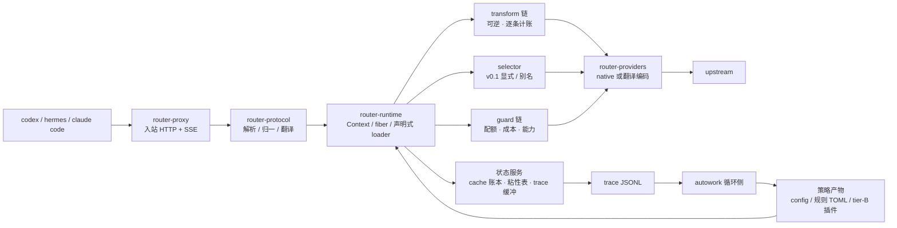

# Design (HOW) — router

口径：本文是**实现结构**的单一真相（模块边界、数据流、算法、测试策略）。对外行为见 `docs/spec.md`。

## 1. 全景



三条硬边界（AGENTS.md 有约束条款）：字节边界、内容确定性、观测边界。

## 2. crate 依赖方向

```
router-cli → router-proxy → router-protocol → router-core ← router-plugins
                    ↘ router-runtime ↗                 ↑
                          router-providers        router-plugin-sdk (tier-B 协议类型)
```

- `router-core`：请求/决定的领域模型、成本引擎、cache 账本、插件 trait。**不依赖任何 HTTP/协议 crate**。
- `router-runtime`：Cordis 语义（§4）。`router-core` 的 trait 在此被装载为 fiber。
- `router-protocol`：3 协议编解码 + 翻译矩阵 + `Usage` 归一化；纯函数，可单测穷举。
- `router-providers`：wire 能力、鉴权、重试、SSE 解析；**不做决定**。
- `router-proxy`：axum 数据面，字节保真转发与 SSE 透传。
- `router-plugins`：内置 tier-A 插件（cache-guard、transform_rules、cost_ledger、quota_guard、sticky）。

## 3. 决定管线（一次请求的顺序）

```
parse → session 解析 → transform 链 → selector → guard 链 → 编码 → 转发 → usage 归一 → 账本/trace
```

关键设计：**transform 与 guard 都在决定之后仍然可被 trace 归因**（每步写一条 transform 记录）；
selector 在 v0.1 只做显式/别名解析，`auto` 留给插件——但槽位、契约、trace 字段现在就位，插件一上
线无需改数据面。

## 4. 插件运行时（对齐 Cordis 语义）

论文给出的原语与本项目的落地映射（表由 ADR-002 固化）：

| Cordis 原语 | 本项目的 Rust 形态 | 用途 |
|---|---|---|
| `ctx.effect(cb) → dispose` | `fn(&mut Ctx) -> Effect`，`Effect{undo: FnOnce}`，LIFO 累加 | 任何注册/改写自带逆；卸载插件 = 完整回滚 |
| `ctx.set(key,value)` / `ctx.get(key)` + `notify → refresh` | 类型化服务槽 `ServiceKey<T>`；提供者进入 UNLOADING 时**依赖者先被停用**，再撤下绑定 | 插件间的依赖与被依赖关系不需要人工排序 |
| `fiber.inject`（coeffect 声明） | manifest 声明 `inject: [services]`；未满足时**停在加载等待**而非报错 | 乱序加载安全 |
| `ctx.isolate(key, realm)` | 同 key 多 realm → 两套独立绑定 | **A/B 与 shadow**：两个策略版本并存互不干扰 |
| `ctx.intercept(key, metadata)` | 不改绑定、只改"怎么用" | 对单个插件设采样率、超时、shadow 开关 |
| entries + keyed diff + HMR | 声明式 `plugins:` 列表 + per-field 最小操作 | 参数级实验无需重启 |

**Rust 的取舍（必须诚实面对）**：论文的 HMR 依赖 JS 动态模块加载。本项目 tier-A 插件是编译期链接，
**没有模块级 HMR**——代码变更 = 重建 + 重启；只有**配置级协调**（config/权重/规则 TOML 立即生效）与
tier-B（进程外）插件的模块级重载。为压低重启代价，`cache 账本 / 粘性表 / trace 缓冲`都在状态服务里
落盘并在重启后交接，重启不丢会话上下文。

生命周期状态机（简化）：`LOADING → ACTIVE → UNLOADING → (removed)`；`inject` 未满足时停在 LOADING；
卸载一个 fiber 时先让依赖者离开，再按 LIFO 执行其逆。失败状态带错误结果，不影响其它 fiber。

## 5. 成本引擎

**五档价 + 峰谷**：`input_miss`、`input_hit`、`cache_write`、`output`、`peak.multiplier`。
单请求成本：

```
cost = input_miss × p_miss + input_cached × p_hit + cache_write × p_write + output × p_out   (× peak)
```

**配额套餐**（coding plan 类）：套餐内边际成本记 0，但必须建模 `tokens_remaining` 与
`over_quota: block|spill`；`spill` 时溢出部分按 `p_miss` 计。额度余量写入 trace（`quota_after`），
使"额度用在了哪"可审计。

**切换的代价模型（cache-aware breakeven）**：换模型会立刻失去前缀缓存、把整段前缀按 miss 价重算一次。

```
switch_gain  ≈ remaining_turns × tokens_per_turn × (p_stay − p_new)
switch_cost  ≈ prefix_tokens × p_miss_new
切换当且仅当 switch_gain > safety_factor × switch_cost
```

参数在 `config.cache.breakeven`；`remaining_turns` 由会话历史估计、`safety_factor` 默认 1.2。
（v0.1 因显式指定模型，此式用于 **failover 与 quota spill** 的决策，不用于自动选模。）

## 6. 缓存策略（P0，一阶杠杆）

1. **保真**：passthrough 路径只允许删除 router 自有字段；编码器对同一输入必须字节确定。
2. **内容确定性**：transform 是 `(content, stable config)` 的纯函数——禁止依赖轮次、时间、随机数。
   任何"滚动窗口/按轮裁剪"的实现都视为破坏前缀（P4 因此延后）。
3. **粘性**：session → (provider, model) 映射，键优先取客户端给出的 `prompt_cache_key`（上游会回显，
   实测可用），后备 `header:session-id` / `header:thread-id`；TTL 见 config。
4. **断点注入**：向 anthropic 上游翻译时，按"稳定内容边界"注入 `cache_control`（同内容同位置），
   断点数写入 trace（`cache_control_breaks`）。
5. **状态服务交接**：账本与粘性表定期 snapshot；重启后加载，使 `prefix_continuity` 指标不因重启断裂。

## 7. 协议翻译层

能力矩阵由 config 声明（`supports`），运行期构造 3×3 表：

- `native` 格 → 字节直通（唯一允许的操作是删 router 自有字段）。
- `translated` 格 → 走显式映射器；每个映射器必须标注 `lossless | lossy(reason)`。
- 有损时：写 trace、可选 `X-Router-Lossy` 响应头，绝不静默。
- 入站未知字段原样保留（存在旁路侧信道），保证协议演进不丢信息。

## 8. 状态与持久化

单进程、无 DB。状态分三类：

| 状态 | 介质 | 说明 |
|---|---|---|
| cache 账本 / 粘性表 | 内存 + 定期 snapshot（JSON） | 重启交接；丢了只是统计回退，不影响正确性 |
| trace | append-only JSONL（按小时滚动） | 产品 → autowork 的唯一接口；可被 `router replay` 消费 |
| 配额余量 | 内存 + snapshot | 依赖上游 `usage` 累计，不猜测 |

## 9. Replay（同一份代码算钱）

`router replay --trace t.jsonl --config c.yaml [--plugins p.yaml]`：把真实入站请求喂进**生产同一个决定
管线**（同一个 binary，同一个 transform/编码路径），只把出站 HTTP 换成本地模拟（或真实重放一次，需
预算门）。输出成本/缓存/延迟报表与 `prefix_continuity` 对照。

这条是 autowork 的地基：策略不可能在 Python 里重实现一遍而不产生 skew（旧项目的教训），所以策略模拟
永远是产品的子命令。

## 10. 测试策略

| 层 | 内容 |
|---|---|
| 单元 | 协议编解码穷举（3×3）、`Usage` 归一、五档成本、breakeven 边界、realm 隔离、effect LIFO 回滚 |
| conformance | 保真（上游可见 prefix hash == 客户端）、SSE 事件序列等价、tool call 往返、未知字段透传、错误码映射 |
| 缓存 | 同 session 两轮 `prefix_continuity == 1.0`；启用每个 transform 后重测（防回归） |
| 计账 | 每 transform 的 `verified/inferred` 标注存在；gate 只读 verified |
| 交互 | 用真实 codex/hermes 各跑一轮接入冒烟（含 `NO_PROXY` 前提验证） |

## 11. 风险与对策

| 风险 | 对策 |
|---|---|
| 某个 transform 破坏前缀而不自知 | `prefix_continuity` 作为阻塞门；每个 transform 单独跑缓存回归 |
| 翻译层有损导致客户端行为异常 | 有损清单进 spec；有损时显式标记 + conformance 用例 |
| tier-A 无 HMR 导致实验迭代慢 | 参数/规则走配置级协调；实验类插件强制 tier-B |
| 计账口径被"估算"污染 | verified/inferred 二元口径 + 报告必须声明样本量 |
| 系统代理导致接入失败 | README/spec 强制 `NO_PROXY`；冒烟测试包含此项 |
