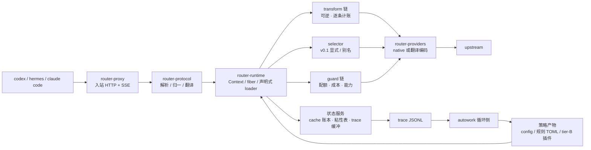

# Design (HOW) — router

口径：本文是**实现结构**的单一真相（模块边界、数据流、算法、测试策略）。对外行为见 `docs/spec.md`。

## 1. 全景



三条硬边界（AGENTS.md 有约束条款）：字节边界、内容确定性、观测边界。

## 2. crate 依赖方向

```
router-cli → router-proxy → router-protocol → router-core ← router-plugins
                    ↘ router-runtime ↗                 ↑
                          router-providers        router-plugin-sdk (tier-B 协议类型)
```

- `router-core`：请求/决定的领域模型、成本引擎、cache 账本、插件 trait。**不依赖任何 HTTP/协议 crate**。
- `router-runtime`：Cordis 语义（§4）。`router-core` 的 trait 在此被装载为 fiber。
- `router-protocol`：3 协议编解码 + 翻译矩阵 + `Usage` 归一化；纯函数，可单测穷举。
- `router-providers`：wire 能力、鉴权、重试、SSE 解析；**不做决定**。
- `router-proxy`：axum 数据面，字节保真转发与 SSE 透传。
- `router-plugins`：内置 tier-A 插件（cache-guard、transform_rules、cost_ledger、quota_guard、sticky）。

## 3. 决定管线（一次请求的顺序）

```
parse → session 解析 → transform 链 → selector → guard 链 → 编码 → 转发 → usage 归一 → 账本/trace
```

关键设计：**transform 与 guard 都在决定之后仍然可被 trace 归因**（每步写一条 transform 记录）；
selector 在 v0.1 只做显式/别名解析，`auto` 留给插件——但槽位、契约、trace 字段现在就位，插件一上
线无需改数据面。

## 4. 插件运行时（对齐 Cordis 语义）

论文给出的原语与本项目的落地映射（表由 ADR-002 固化）：

| Cordis 原语 | 本项目的 Rust 形态 | 用途 |
|---|---|---|
| `ctx.effect(cb) → dispose` | `fn(&mut Ctx) -> Effect`，`Effect{undo: FnOnce}`，LIFO 累加 | 任何注册/改写自带逆；卸载插件 = 完整回滚 |
| `ctx.set(key,value)` / `ctx.get(key)` + `notify → refresh` | 类型化服务槽 `ServiceKey<T>`；提供者进入 UNLOADING 时**依赖者先被停用**，再撤下绑定 | 插件间的依赖与被依赖关系不需要人工排序 |
| `fiber.inject`（coeffect 声明） | manifest 声明 `inject: [services]`；未满足时**停在加载等待**而非报错 | 乱序加载安全 |
| `ctx.isolate(key, realm)` | 同 key 多 realm → 两套独立绑定 | **A/B 与 shadow**：两个策略版本并存互不干扰 |
| `ctx.intercept(key, metadata)` | 不改绑定、只改"怎么用" | 对单个插件设采样率、超时、shadow 开关 |
| entries + keyed diff + HMR | 声明式 `plugins:` 列表 + per-field 最小操作 | 参数级实验无需重启 |

**Rust 的取舍（必须诚实面对）**：论文的 HMR 依赖 JS 动态模块加载。本项目 tier-A 插件是编译期链接，
**没有模块级 HMR**——代码变更 = 重建 + 重启；只有**配置级协调**（config/权重/规则 TOML 立即生效）与
tier-B（进程外）插件的模块级重载。为压低重启代价，`cache 账本 / 粘性表 / trace 缓冲`都在状态服务里
落盘并在重启后交接，重启不丢会话上下文。

生命周期状态机（简化）：`LOADING → ACTIVE → UNLOADING → (removed)`；`inject` 未满足时停在 LOADING；
卸载一个 fiber 时先让依赖者离开，再按 LIFO 执行其逆。失败状态带错误结果，不影响其它 fiber。

## 5. 成本引擎

**五档价 + 峰谷**：`input_miss`、`input_hit`、`cache_write`、`output`、`peak.multiplier`。
单请求成本：

```
cost = input_miss × p_miss + input_cached × p_hit + cache_write × p_write + output × p_out   (× peak)
```

**配额套餐**（coding plan 类）：套餐内边际成本记 0，但必须建模 `tokens_remaining` 与
`over_quota: block|spill`；`spill` 时溢出部分按 `p_miss` 计。额度余量写入 trace（`quota_after`），
使"额度用在了哪"可审计。

**切换的代价模型（cache-aware breakeven）**：换模型会立刻失去前缀缓存、把整段前缀按 miss 价重算一次。

```
switch_gain  ≈ remaining_turns × tokens_per_turn × (p_stay − p_new)
switch_cost  ≈ prefix_tokens × p_miss_new
切换当且仅当 switch_gain > safety_factor × switch_cost
```

参数在 `config.cache.breakeven`；`remaining_turns` 由会话历史估计、`safety_factor` 默认 1.2。
（v0.1 因显式指定模型，此式用于 **failover 与 quota spill** 的决策，不用于自动选模。）

## 6. 缓存策略（P0，一阶杠杆）

1. **保真**：passthrough 路径只允许删除 router 自有字段；编码器对同一输入必须字节确定。
2. **内容确定性**：transform 是 `(content, stable config)` 的纯函数——禁止依赖轮次、时间、随机数。
   任何"滚动窗口/按轮裁剪"的实现都视为破坏前缀（P4 因此延后）。
3. **粘性**：session → (provider, model) 映射，键优先取客户端给出的 `prompt_cache_key`（上游会回显，
   实测可用），后备 `header:session-id` / `header:thread-id`；TTL 见 config。
4. **断点注入**：向 anthropic 上游翻译时，按"稳定内容边界"注入 `cache_control`（同内容同位置），
   断点数写入 trace（`cache_control_breaks`）。
5. **状态服务交接**：账本与粘性表定期 snapshot；重启后加载，使 `prefix_continuity` 指标不因重启断裂。

## 7. 协议翻译层

能力矩阵由 config 声明（`supports`），运行期构造 3×3 表：

- `native` 格 → 字节直通（唯一允许的操作是删 router 自有字段）。
- `translated` 格 → 走显式映射器；每个映射器必须标注 `lossless | lossy(reason)`。
- 有损时：写 trace、可选 `X-Router-Lossy` 响应头，绝不静默。
- 入站未知字段原样保留（存在旁路侧信道），保证协议演进不丢信息。

## 8. 状态与持久化

单进程、无 DB。状态分三类：

| 状态 | 介质 | 说明 |
|---|---|---|
| cache 账本 / 粘性表 | 内存 + 定期 snapshot（JSON） | 重启交接；丢了只是统计回退，不影响正确性 |
| trace | append-only JSONL（按小时滚动） | 产品 → autowork 的唯一接口；可被 `router replay` 消费 |
| 配额余量 | 内存 + snapshot | 依赖上游 `usage` 累计，不猜测 |

## 9. Replay（同一份代码算钱）

`router replay --trace t.jsonl --config c.yaml [--plugins p.yaml]`：把真实入站请求喂进**生产同一个决定
管线**（同一个 binary，同一个 transform/编码路径），只把出站 HTTP 换成本地模拟（或真实重放一次，需
预算门）。输出成本/缓存/延迟报表与 `prefix_continuity` 对照。

这条是 autowork 的地基：策略不可能在 Python 里重实现一遍而不产生 skew（旧项目的教训），所以策略模拟
永远是产品的子命令。

## 10. 测试策略

| 层 | 内容 |
|---|---|
| 单元 | 协议编解码穷举（3×3）、`Usage` 归一、五档成本、breakeven 边界、realm 隔离、effect LIFO 回滚 |
| conformance | 保真（上游可见 prefix hash == 客户端）、SSE 事件序列等价、tool call 往返、未知字段透传、错误码映射 |
| 缓存 | 同 session 两轮 `prefix_continuity == 1.0`；启用每个 transform 后重测（防回归） |
| 计账 | 每 transform 的 `verified/inferred` 标注存在；gate 只读 verified |
| 交互 | 用真实 codex/hermes 各跑一轮接入冒烟（含 `NO_PROXY` 前提验证） |

## 11. 风险与对策

| 风险 | 对策 |
|---|---|
| 某个 transform 破坏前缀而不自知 | `prefix_continuity` 作为阻塞门；每个 transform 单独跑缓存回归 |
| 翻译层有损导致客户端行为异常 | 有损清单进 spec；有损时显式标记 + conformance 用例 |
| tier-A 无 HMR 导致实验迭代慢 | 参数/规则走配置级协调；实验类插件强制 tier-B |
| 计账口径被"估算"污染 | verified/inferred 二元口径 + 报告必须声明样本量 |
| 系统代理导致接入失败 | README/spec 强制 `NO_PROXY`；冒烟测试包含此项 |

## 12. 模块与类型落地清单

本节把 §2/§4/§5/§6/§7 的结构落成**签名草图 + 用例 ID 表**，使实现方有唯一依据。
只落"类型与契约的形状"，不含函数体；实现顺序见每条的「落点」。

### 12.1 crate 清单、依赖方向与第三方依赖白名单

```
router-cli → router-proxy → router-protocol → router-core ← router-plugins
                    ↘ router-runtime ↗                 ↑
                          router-providers        router-plugin-sdk
```

| crate | 公开面（对外可用的东西） | 允许的第三方依赖 | 落点 |
|---|---|---|---|
| `router-core` | 领域模型、成本/配额/breakeven 纯函数、插件 trait、`DecisionRecord` | `serde`, `serde_json`(preserve_order+arbitrary_precision), `sha2` | R1-2 起 |
| `router-protocol` | 3 协议编解码、翻译矩阵、`Usage` 归一化、`raw_json`（span 保真编辑） | `serde_json` | R2 |
| `router-providers` | `ProviderClient`（wire 能力、鉴权、重试、SSE 解析） | `reqwest`, `tokio`, `futures` | R2 |
| `router-runtime` | `Ctx` / `Effect` / `ServiceKey` / fiber 状态机、声明式 loader | 无（纯 std + core） | R2 |
| `router-plugins` | 内置 tier-A：cache_guard / transform_rules / cost_ledger / quota_guard / sticky | `toml`, `regex` | R2/R3 |
| `router-proxy` | axum 数据面：字节保真转发、SSE 透传 | `axum`, `tokio`, `hyper`, `tower` | R2 |
| `router-cli` | `serve` / `stats` / `replay` / `trace` | `clap`, `tokio` | R1-2 起（serve 桩） |
| `router-plugin-sdk` | tier-B 进程外插件协议类型（UDS 帧） | `serde_json` | R3 |
| `router-conformance`（`tests/conformance/`） | CONF 用例（§12.8） | `tokio`, `axum`, 被测 crate | R1-2 空壳起 |

- **`router-core` 不依赖任何 HTTP / 协议 crate**（§2 硬约束）；抽查方式：`cargo tree -p router-core` 的依赖集合必须 ⊆ 白名单。
- 依赖纪律：**新增依赖必须在 commit message 写明理由**（与本轮任务约束一致）。白名单外的依赖一律先讨论。
- 每个 crate 根加 `#![forbid(unsafe_code)]`；`router-core` 另加 `#![deny(clippy::float_arithmetic)]`（金额只走 §12.4 的定点路径）。
- 测试放置：单元测试用 `#[cfg(test)] mod tests` 就地放；conformance 放 `tests/conformance/tests/`（§12.8）。

### 12.2 运行时原语（ADR-002 → Rust 签名草图）

| Cordis 原语 | Rust 类型（`router-runtime`） | 语义落地点 |
|---|---|---|
| `ctx.effect(cb) → dispose` | `Ctx::effect(Effect) -> EffectId` + `Effect { undo: Box<dyn FnOnce()+Send> }` | LIFO 栈；卸载 = 依次执行 undo |
| `ctx.set/get(key)` + refresh | `Ctx::provide/get` + `ServiceKey<T>` | 提供者下线 → 依赖者先停用，再撤绑定 |
| `fiber.inject` | `Plugin::inject() -> &[ServiceId]` | 未满足停在 `Loading{waiting_on}`，不报错 |
| `ctx.isolate(key, realm)` | `Ctx::isolate(key, RealmId) -> RealmGuard` | 同 key 多套绑定（A/B 与 shadow 并存） |
| `ctx.intercept(key, md)` | `Ctx::intercept(&key, InterceptMeta)` | 不改绑定只改"怎么用"（采样/超时/shadow） |
| entries + keyed diff | `PluginCfg` 列表 + `apply_config_diff` | config 变更自 diff；`disabled` 卸载；`id`/`kind` 变更重建 |

```rust
pub struct PluginId(pub String);
pub struct ServiceId(&'static str);
pub struct RealmId(u32);
pub const ROOT_REALM: RealmId = RealmId(0);

pub struct ServiceKey<T: ?Sized> { name: &'static str, _m: PhantomData<fn() -> T> }
impl<T: ?Sized> ServiceKey<T> { pub const fn new(name: &'static str) -> Self; pub fn name(&self) -> &'static str; }
pub const CACHE_LEDGER: ServiceKey<dyn CacheLedger> = ServiceKey::new("cache_ledger");
pub const SESSION_TABLE: ServiceKey<dyn SessionTable> = ServiceKey::new("session_table");
pub const QUOTA_STORE:   ServiceKey<dyn QuotaStore>   = ServiceKey::new("quota_store");
pub const TRACE_SINK:    ServiceKey<dyn TraceSink>    = ServiceKey::new("trace_sink");

pub struct Effect { undo: Option<Box<dyn FnOnce() + Send>> }
impl Effect { pub fn new(f: impl FnOnce() + Send + 'static) -> Self; pub fn noop() -> Self; }

pub struct Ctx { /* fiber 作用域：服务表 + effect 栈 + realm 表 */ }
impl Ctx {
    pub fn effect(&mut self, e: Effect) -> EffectId;
    pub fn provide<T: Send + Sync + 'static>(&mut self, key: ServiceKey<T>, v: Arc<T>) -> EffectId;
    pub fn get<T: Send + Sync + 'static>(&self, key: &ServiceKey<T>) -> Option<Arc<T>>;
    pub fn isolate<T: Send + Sync + 'static>(&mut self, key: ServiceKey<T>, realm: RealmId) -> RealmGuard;
    pub fn intercept<T: Send + Sync + 'static>(&mut self, key: &ServiceKey<T>, md: InterceptMeta);
}

pub enum FiberState { Created, Loading { waiting_on: Vec<ServiceId> }, Active, Unloading, Failed(PluginError), Removed }

pub trait Plugin: Send + Sync {
    fn id(&self) -> &PluginId;
    fn inject(&self) -> &'static [ServiceId];      // coeffect 声明；未满足 → 停在 Loading
    fn apply(&self, ctx: &mut Ctx) -> Result<Effect, PluginError>;
}
```

**卸载顺序（实现必须遵守，且有测试断言）**：① 递归把依赖者置 `Unloading` 并等其完成 →
② 逆 LIFO 执行本 fiber 的 `Effect::undo` → ③ 撤下服务绑定 → ④ `Removed`。
失败进入 `Failed(err)`，**不影响其它 fiber**（ADR-002 的"失败隔离"）。
断言方式：装载→激活→卸载后，服务表与拦截表必须与装载前**深度相等**（R2 测试）。

### 12.3 决定管线的类型与每步失败语义

```
parse → session 解析 → transform 链 → selector → guard 链 → 编码 → 转发 → usage 归一 → 账本/trace
```

```rust
pub enum Protocol { Chat, Responses, Anthropic }
pub enum ClientKind { Codex, Hermes, ClaudeCode, Other }
pub struct RouteSpec { pub provider: String, pub model: String }
pub enum SelectionSource { Explicit, Alias, Plugin }
pub struct Decision { pub route: RouteSpec, pub source: SelectionSource, pub plugin_chain: Vec<PluginId> }

pub trait Transform: Send + Sync {
    fn id(&self) -> &'static str;
    /// 内容确定：禁读时钟/轮次/RNG。Err = 回退原文（spec §8），调用方记 trace。
    fn apply(&self, req: &mut CanonicalRequest) -> Result<TransformReport, TransformError>;
}
pub struct TransformReport {
    pub added_input_tokens: u64, pub saved_input_tokens: u64, pub saved_output_tokens: u64,
    pub cache_impact: CacheImpact, pub verdict: Verdict, pub tee_id: Option<TeeId>,
}
pub enum CacheImpact { Neutral, Risky, Broken }      // Broken → cache_guard 的 strict_prefix 拒绝
pub enum Verdict { Verified, Inferred }              // 只有 Verified 能进 gate（ADR-003/spec §7）

pub trait Selector: Send + Sync { fn select(&self, req: &CanonicalRequest, roster: &Roster) -> Result<Decision, SelectError>; }
pub trait Guard: Send + Sync { fn check(&self, cx: &GuardCx<'_>) -> GuardOutcome; }
pub enum GuardOutcome { Pass, Reject { code: ErrorCode, message: String }, Downgrade(RouteSpec) }
pub trait Observer: Send + Sync { fn on_decision(&self, rec: &DecisionRecord); fn on_error(&self, e: &RouterError); }
```

| 步 | 失败语义 |
|---|---|
| parse | 请求体不可解析 → `invalid_request` 400，不转发 |
| session 解析 | 全部来源缺失 → `session = None`（trace 记 null，`sticky_hit=false`），**不是错误** |
| transform | 任一环 `Err` → 回退原文 + `TransformRecord.error`；请求照常（spec §8） |
| selector | `auto` → `auto_not_supported` 400（spec §3）；`provider/model` 不存在 → 404 |
| guard | `Reject` → 归一错误体；`Downgrade` → 走该 route 并记 `failover_from` |
| 编码 | 翻译格缺声明 → 400；有损 → 记 `lossy[]` + `X-Router-Lossy` |
| 转发 | 5xx/429/quota 耗尽 → fallback 链；链尽 → 502 带最后一次 `upstream_status` |
| usage 归一 | 上游缺 usage 字段 → 0 值 + trace `usage_missing: true`（**不猜**） |
| 账本/trace | trace 写失败 → 请求照常，计数进 `trace_dropped` 指标（可观测的降级） |

#### 12.3.1 字节边界在类型上的落地（AGENTS 硬约束 1）

```rust
pub struct CanonicalRequest {
    pub protocol_in: Protocol,
    pub raw: RawBody,                 // 客户端原始字节：唯一权威
    pub doc: JsonDoc,                 // 保序解析视图（决策用；**不用于出站发送**）
    pub session: Option<SessionId>,
    pub thread_id: Option<String>,
    pub turn_index: u32,
}
pub struct RawBody(Bytes);
impl RawBody {
    pub fn as_bytes(&self) -> &[u8];
    /// 唯一允许的改写：删除顶层 router 自有字段。其余字节逐字节保留。
    pub fn remove_top_level_keys(&self, keys: &[&str]) -> Result<RawBody, RawEditError>;
}
```

- `RawBody` **不实现** `DerefMut`/`AsMut`，也不暴露 `serde_json::Value` 的可变引用 → 编译期挡住"顺手改一改"。
- `remove_top_level_keys` 用**单遍 JSON 扫描器**（只需顶层键的 span，跟踪字符串/转义/括号深度）
  实现字节级删除；**禁止 parse → reserialize 往返**（那是字节边界最常见的破法）。
- router 自有字段 = `router_meta` 回显 + 路由提示（spec §2）。删除清单是**白名单常量**，新增必须改这个常量。
- 删除的分隔符语义（R1-2c 钉死）：连续命中白名单的成员构成一个"段"，段整体剔除并
  吞掉**段尾**与其后继成员之间的逗号（含其间空白）；段首逗号留给前一个保留成员。
  仅当首成员即段的起点时才改吞段尾逗号。不变式：任何 `Ok` 输出必为合法 JSON，且
  保留成员逐字节等于其输入 span（`deletion_position_matrix*` 测试为永久回归矩阵）。
- 三处已定边界行为（拒绝 vs 透传的取舍理由，各有单测钉死）：
  - **BOM 前缀 → `Err(NotTopLevelObject)`**：剥离 BOM 是白名单之外的改写（硬约束 1
    只允许删 router 自有字段），router 无权"顺手修"，交调用方按 400 处理。
  - **前导零数字（`01`）→ `Err(Malformed)`**：RFC 8259 数值文法不含此形态；原始值
    片段由 serde_json 校验器把关，不透传模棱两可的数值（不同上游解析分歧是隐患）。
  - **字符串**值**内的非法 UTF-8 → `Ok` 且逐字节透传**：字节边界优先，router 不解释
    值内容，合法性交上游裁决。注意不对称：**键**内非法 UTF-8 仍 `Err(Malformed)`——
    键必须可解码才能与白名单做语义比对，比对不了就无法安全决定删或不删。
- 前缀 hash 的定义域 = 上游可见 body 中 `messages | input | tools` 与系统指令位的原始字节
  （spec §6「前缀」），因此"删 router 字段"不影响该 hash —— CONF-10 正是断言这一点。
- 前缀块（`prefix_blocks[]`）：块 = 前缀区里的**最小不可分单元**（一条 message / 一个 tool 定义 /
  一个 input item），逐块记 `tokens` 与 `hash`；`hash = sha256(块原始字节) 的 hex 前 16 位`。
  （GAP-Q5：spec 未定义块粒度；本蓝图取"结构单元"而非定长 token 桶，因为前者与缓存断点对齐。）

### 12.4 成本 / 配额 / breakeven 纯函数（R1-2 的实现目标）

```rust
/// 金额定点：1 nano-USD = 1e-9 USD。决定路径与 trace 中不出现 f64。
pub struct NanoUsd(pub u64);
/// 单价：nano-USD / 1K token（与 config 的 USD/1K 同形，只是整数化）。
pub struct Price(pub u64);
pub struct PriceTable { pub input_miss: Price, pub input_hit: Price, pub cache_write: Price,
                        pub output: Price, pub peak: PeakTable }
pub struct PeakTable { pub multiplier_pct: u32, pub windows: Vec<PeakWindow> }   // 2.0 → 200
pub struct PeakWindow { pub days: Weekdays, pub from_min: u16, pub to_min: u16, pub tz: Tz }

pub struct Usage { pub input_total: u64, pub input_cached: u64, pub cache_write: u64,
                   pub output: u64, pub reasoning: u64 }
impl Usage { pub fn uncached(&self) -> u64;  pub fn cache_hit_rate(&self) -> f32; }

pub struct CostBreakdown { pub input_miss: NanoUsd, pub input_hit: NanoUsd, pub cache_write: NanoUsd,
                           pub output: NanoUsd, pub peak_applied_pct: u32, pub total: NanoUsd }

/// 纯函数：cost(miss, hit, write, out, price, at) -> CostBreakdown
/// cost_nano = Σ_tier ( tokens_tier × price_tier_nano_per_1k ) / 1000   （整数，最后一次除法向下取整）
/// 峰段命中（at ∈ windows）→ 先求和无峰总值，再 × multiplier_pct / 100。
/// input_miss 档用 usage.uncached()；output 档含 reasoning（上游多把 reasoning 计入 output）。
pub fn cost(usage: &Usage, price: &PriceTable, at: Timestamp, tz: Tz) -> CostBreakdown;
```

配额（spec §4 `quota`，DESIGN §5）：

```rust
pub enum QuotaWindow { Monthly { reset_day: u8 } }        // spec 只定义 monthly；其它值 = 装载错误
pub enum OverQuota { Block, Spill }
pub struct QuotaPlan { pub models: Vec<String>, pub window: QuotaWindow, pub tokens: u64,
                       pub over_quota: OverQuota, pub source: String }
pub struct QuotaState { pub plan_idx: usize, pub window_start_epoch_s: u64, pub tokens_used: u64 }
pub enum QuotaVerdict {
    Inside  { remaining_before: u64 },
    Spill   { billable_tokens: u64 },      // 溢出部分按 input_miss 计（DESIGN §5）
    Blocked { remaining: u64 },            // over_quota=block → Guard Reject(quota_exceeded)
}
/// 纯函数（唯一状态写入点）：tokens = usage.input_total + usage.output（本蓝图默认口径，见 GAP-Q1）
pub fn charge(plan: &QuotaPlan, st: &mut QuotaState, usage: &Usage, now_epoch_s: u64) -> QuotaVerdict;
```

cache-aware breakeven（DESIGN §5，整数化以避免浮点边界分歧）：

```rust
pub struct BreakevenParams { pub enabled: bool, pub min_remaining_turns: u32, pub safety_factor_pct: u32 }
pub struct SwitchCandidate {
    pub prefix_tokens: u64,      // 换模型要按 miss 价重算的前缀量
    pub tokens_per_turn: u64,    // 预估后续每轮输入 token
    pub remaining_turns: u32,    // 预估剩余轮次（无历史 → 0）
    pub p_stay_hit: Price,       // 保持现状的下一轮单价 = 现模型 input_hit（已缓存）
    pub p_new_miss: Price,       // 新模型 input_miss（换过去必然 miss 整段前缀）
}
pub enum StayReason { Disabled, RemainingTurnsZero, BelowMinRemainingTurns, NotPaying }
pub enum SwitchVerdict { Switch { gain: NanoUsd, cost: NanoUsd },
                         Stay { reason: StayReason, gain: NanoUsd, cost: NanoUsd } }
/// gain = remaining_turns × tokens_per_turn × (p_stay_hit − p_new_miss) / 1000   （i128 中间量）
/// cost = prefix_tokens × p_new_miss / 1000
/// Switch ⟺ gain × 100 > safety_factor_pct × cost      （严格大于；交叉相乘，无除法精度损失）
pub fn decide_switch(p: &BreakevenParams, c: &SwitchCandidate) -> SwitchVerdict;
```

**边界用例（R1-2 必须覆盖，逐条断言 `SwitchVerdict`）**：

| 用例 | 期望 |
|---|---|
| `enabled = false` | `Stay(Disabled)` |
| `remaining_turns = 0` | `Stay(RemainingTurnsZero)`（gain 恒 0） |
| `remaining_turns < min_remaining_turns` | `Stay(BelowMinRemainingTurns)`（即便算式更优） |
| `prefix_tokens = 0` | `Switch`（切换成本为 0，gain > 0） |
| 恰好相等（`gain×100 == sf×cost`） | `Stay(NotPaying)`（严格大于才切） |
| `p_stay_hit ≥ p_new_miss` | `Stay(NotPaying)`（不赚） |
| 峰段命中 | `cost`/`gain` 均含 `×multiplier_pct/100` |
| 整数分档 `input_miss=0.00015` | 解析为 `Price(150_000)`（无浮点残差） |

### 12.5 配置类型与解析规则（`config.example.yaml` ↔ 类型）

```rust
#[derive(Deserialize)] #[serde(deny_unknown_fields)]
pub struct RouterConfig { pub server: ServerCfg, pub session: SessionCfg, pub cache: CacheCfg,
    pub trace: TraceCfg,
    pub providers: Vec<ProviderCfg>, pub aliases: BTreeMap<String, RouteSpec>,
    pub plugins: Vec<PluginCfg>, pub fallback: Vec<RouteSpec> }

/// spec §4.1；`Rollover::Hourly` 是 v0.1 唯一取值 → 文件 `<dir>/YYYY-MM-DDTHH.jsonl`（UTC）。
pub struct TraceCfg { pub dir: PathBuf, pub rollover: Rollover }
```

| 点 | 规则 |
|---|---|
| duration | `<整数><ms\|s\|m\|h>`，可拼接（`1h30m`）；非法 → 装载错误（带字段路径） |
| context | `<整数>` 或 `<整数>k\|m`（k=1024, m=1048576）；用于 guard 的能力检查 |
| price | 读作 f64（USD/1K），**装载时**转 `Price((v * 1e9).round() as u64)`；`v < 0` 或 `round` 后为 0 → 装载错误 |
| peak.multiplier | 转 `multiplier_pct = (v*100).round()`；仅支持两位小数，否则装载错误 |
| base_url | 必须已含版本段；router 只追加 `chat → /chat/completions`、`responses → /responses`、`anthropic → /v1/messages` |
| `rules_file` | 相对**本 config 文件所在目录**解析（不是 CWD）；`trace.dir` 同此规则（spec §4.1） |
| `trace.rollover` | 只接受 `hourly`（其它值 = 装载错误）；保留期**不是** config 键（v0.1 不自动清理） |
| 未知字段 | `deny_unknown_fields` → **报错退出**（不静默忽略：配置是给人手写的，"改了没生效"是最贵的沉默失败） |
| 密钥 | 只有 `api_key_env`；启动时 env 缺失 → 该 provider 标记不可用并在 `/health` 报出（不阻止其它 provider） |
| `disabled: true` | 不装载该 fiber（不报错）；`/health` 列在 `plugins_disabled` |
| 缺省值 | 只有 spec §4 明示的（`safety_factor: 1.2`、`sticky`、`over_quota`）有缺省；其余**没写即不启用** |

### 12.6 DecisionRecord（trace 契约，spec §6 全覆盖）

```rust
pub struct DecisionRecord {
    pub schema_version: u16,            // trace 版本；autowork 侧按此做兼容（ADR-005）
    pub ts: String,                     // RFC3339 UTC，毫秒
    pub identity: IdentityRec,          // 身份
    pub protocol: ProtocolRec,          // 协议
    pub decision: DecisionRec,          // 决定
    pub state: StateRec,                // 状态
    pub prefix: PrefixRec,              // 前缀
    pub transforms: Vec<TransformRecord>, // transform（每步一条）
    pub usage: Usage,                   // usage
    pub cost: CostRec,                  // 成本
    pub result: ResultRec,              // 结果
    pub errors: Vec<TraceError>,        // 失败明细（spec §6「失败明细」，R1-4 已回写）
}

pub struct IdentityRec { pub request_id: String, pub client: ClientKind, pub client_ua_raw: Option<String>,
    pub session: Option<String>, pub thread_id: Option<String>, pub turn_index: u32 }
pub struct ProtocolRec { pub r#in: Protocol, pub out: Protocol, pub translated: bool, pub lossy: Vec<LossyNote> }
pub struct LossyNote { pub field: &'static str, pub reason: &'static str, pub action: LossyAction }
pub struct DecisionRec { pub provider: String, pub model: String, pub selection_source: SelectionSource,
    pub plugin_chain: Vec<String>, pub decision_ms: u32 }
pub struct StateRec { pub stateful_inbound: bool, pub sticky_hit: bool, pub cache_control_breaks: u16 }
pub struct PrefixRec { pub blocks: Vec<PrefixBlock>, pub continuity: Option<f32> }
pub struct PrefixBlock { pub kind: BlockKind, pub index: u16, pub tokens: u64, pub hash: String }
pub struct TransformRecord { pub plugin: String, pub added_input_tokens: i64, pub saved_input_tokens: i64,
    pub saved_output_tokens: i64, pub cache_impact: CacheImpact, pub verdict: Verdict,
    pub tee_id: Option<String>, pub error: Option<String> }
pub struct CostRec { pub input_miss: NanoUsd, pub input_hit: NanoUsd, pub cache_write: NanoUsd,
    pub output: NanoUsd, pub peak_applied_pct: u32, pub total: NanoUsd, pub quota_after: Option<QuotaAfter> }
pub struct QuotaAfter { pub provider: String, pub plan_idx: usize, pub tokens_used: u64, pub tokens_limit: u64,
    pub over_quota: OverQuota, pub verdict: &'static str }
pub struct ResultRec { pub status: u16, pub upstream_status: Option<u16>, pub failover_from: Option<RouteSpec>,
    pub overhead_ms: u32, pub upstream_ms: Option<u32>, pub usage_missing: bool }

/// spec §6「失败明细」的落地：**内部**失败明细（可多条），与 §12.7 给客户端的单次错误响应
/// 不是同一个东西；两者共享 kind 词表。无失败 = 空数组（不省略）。
pub struct TraceError { pub kind: TraceErrorKind, pub message: String,
    pub plugin: Option<String>, pub details: Option<serde_json::Value> }
pub enum TraceErrorKind { TransformError, UpstreamError, TraceWriteFailed, Internal }
```

spec §6 字段组 → Rust 路径（逐行可审计）：

| spec §6 字段组 | 字段 | Rust 路径 |
|---|---|---|
| 身份 | `request_id` `client` `session` `thread_id` `turn_index` | `identity.*`（`client_ua_raw` 为附录，UA 归一失败时排障用） |
| 协议 | `protocol_in` `protocol_out` `translated` `lossy[]` | `protocol.r#in` `protocol.out` `protocol.translated` `protocol.lossy` |
| 决定 | `provider` `model` `selection_source` `plugin_chain[]` `decision_ms` | `decision.*` |
| 状态 | `stateful_inbound` `sticky_hit` `cache_control_breaks` | `state.*` |
| 前缀 | `prefix_blocks[]`（token 数 + hash） `prefix_continuity` | `prefix.blocks[].{tokens,hash}` `prefix.continuity` |
| transform | `plugin` `added_input_tokens` `saved_input_tokens` `saved_output_tokens` `cache_impact` `verdict` | `transforms[].*` |
| usage | `input_total` `input_cached` `cache_write` `output` `reasoning` | `usage.*` |
| 成本 | `cost.input_miss` `input_hit` `cache_write` `output` `total` `quota_after` | `cost.*` |
| 结果 | `status` `upstream_status` `failover_from` `overhead_ms` `upstream_ms` | `result.*` |
| 失败明细 | `errors[]`（`kind` `message` `plugin?` `details?`） | `errors[].*`（kind 词表与 §12.7 的错误体共享；内部明细 vs 客户端响应面的区别见上） |

- 落盘：`<config trace.dir>/YYYY-MM-DDTHH.jsonl`（spec §4.1；`trace.dir` 默认 `./state/traces`），
  **append-only，按小时滚动**（DESIGN §8）；写失败不阻塞请求，并记 `errors[].kind = trace_write_failed`。
- `schema_version` 只在**破坏性**变更时 +1；新增可选字段不改版本（autowork 侧容忍未知字段）。
- 派生指标（`router stats`，spec §6「指标定义」）——全部可由 trace 单遍算出，不需要额外状态：
  `cache_hit_rate = Σusage.input_cached / Σusage.input_total`；
  `stateful_inbound_rate`、`prefix_continuity_p50`（按 session 分组取相邻请求）、
  `verified_savings_tokens`（**只累加 `verdict=Verified`**）、`overhead_ms_p99 = result.overhead_ms` 的 p99。
- 报告纪律：任何"省了多少"必须带口径（verified/inferred）、样本量、时间窗（spec §7）。

### 12.7 错误语义与响应面（spec §8 的落地）

> R1-4 起，下面的错误体 schema 与 `error.type`→HTTP 表**已在 `docs/spec.md` §8 成文**（spec 是对外
> 契约的单一真相）；本节保留 `ErrorBody` 的 Rust 形态与实现细节，两者必须一致。

统一错误体（**所有**非 2xx 与桩端点同形；README 的成功响应带 router 自有字段 `router_meta`）：

```rust
pub struct ErrorBody { pub error: ErrorDetail }
pub struct ErrorDetail { pub r#type: &'static str, pub message: String,
                         pub request_id: String, pub details: Option<serde_json::Value> }
```

| `error.type` | HTTP | 触发 |
|---|---|---|
| `invalid_request` | 400 | 请求体不可解析 / 缺 `model` / 字段类型错 |
| `unknown_provider` `unknown_model` | 404 | `provider/model` 或别名解析不到 |
| `auto_not_supported` | 400 | `model: auto`（v0.1；提示由插件接管，spec §3） |
| `capability_unsupported` | 400 | 入站协议 ∉ 该 provider `supports` |
| `cost_cap_exceeded` | 403 | guard 成本上限命中 |
| `quota_exceeded` | 429 | `quota.over_quota = block` 且额度耗尽 |
| `stateful_unsupported` | 400 | stateful 入站且粘性无法保真（ADR-004） |
| `upstream_error` | 502 | 上游错误且 fallback 链用尽（`details.upstream_status`） |
| `upstream_timeout` | 504 | 上游尝试超时且链用尽 |
| `not_implemented` | 501 | v0.1 三个协议端点的桩（R1-2） |
| `internal` | 500 | 其它（含 trace 写失败的降级路径之外） |

响应头：`X-Router-Request-Id`（恒有）、`X-Router-Session`（解析出 session 时）、
`X-Router-Lossy`（发生有损翻译时，DESIGN §7）。SSE 路径首个事件前必须已发这三个头。

### 12.8 conformance 用例表（`CONF-01…CONF-19`）

位置：workspace 成员 `router-conformance`（`tests/conformance/`），用例文件 `tests/conf_<NN>_<slug>.rs`，
测试函数名与文件同名。**未实现路径必须 `#[ignore = "CONF-NN: 依赖 <实现项>"]`**（显式可见，而不是不写）。

| ID | 覆盖 §10 | 断言 | 依赖实现项 |
|---|---|---|---|
| CONF-01 | conformance·保真 | chat 入站 → `wire_api: chat`：上游可见 body 与客户端 body 逐字节相同 | router-protocol native 路径 |
| CONF-02 | 同上 | responses → responses native：字节相同 | 同上 |
| CONF-03 | 同上 | anthropic → anthropic native：字节相同 | 同上 |
| CONF-04 | 同上·翻译 | chat → responses：同内容两次请求产出**同一上游字节**（确定性）；有损点逐条登记 | 翻译矩阵 + 映射器 |
| CONF-05 | 同上 | chat → anthropic：确定性 + `cache_control` 断点位置稳定 | 同上 + 断点注入 |
| CONF-06 | 同上 | responses → chat：确定性 + 有损清单（reasoning 丢弃须标记） | 同上 |
| CONF-07 | 同上 | responses → anthropic：确定性 + 断点注入 | 同上 |
| CONF-08 | 同上 | anthropic → chat：确定性 + `thinking` 处理 | 同上 |
| CONF-09 | 同上 | anthropic → responses：确定性 + `tool_use` 映射 | 同上 |
| CONF-10 | conformance·保真 + §12.3.1 | 删 router 自有字段后其余字节与客户端逐字节相同；`router_meta` 回显不会进入上游 | `RawBody::remove_top_level_keys` |
| CONF-11 | conformance·未知字段 | 顶层与嵌套未知字段原样透传（含 `include`、`client_metadata` 等实测字段） | `RawBody` + 编码器 |
| CONF-12 | conformance·tool call 往返 | chat `tool_calls`/`role=tool` ↔ responses `function_call*` ↔ anthropic `tool_use/result`：id 与顺序保留 | 翻译矩阵 |
| CONF-13 | conformance·SSE | native 流式：上游 `event:`/`sequence_number` 逐事件等价透传；结束事件语义保留（responses 无 `[DONE]`） | router-proxy SSE 透传 |
| CONF-14 | conformance·错误码 | 上游 400/401/429/5xx → §12.7 归一错误体；5xx/429 触发 fallback 并记 `failover_from` | proxy + guard/fallback |
| CONF-15 | §10·缓存 | 同 session 两轮 passthrough：`prefix_continuity == 1.0` | cache 账本 + 粘性表 |
| CONF-16 | §10·缓存 | 每个 transform 单独启用后重测缓存回归，不低于基线（参数化：逐插件一例） | transform 链 + 账本 |
| CONF-17 | §10·计账 | 每条 `TransformRecord.verdict ∈ {Verified, Inferred}` 且 gate 只读 `Verified` | 计账实现 |
| CONF-18 | §10·交互 | 真实 codex/hermes 各一轮冒烟（含 `NO_PROXY` 前提验证）—— 手动/带网络的 CI 专属 | 端到端 |
| CONF-19 | §9·replay | 同一 trace 两次 `router replay` 的成本/缓存报表逐字段一致 | replay 子命令 |

用例 ID 是**契约**：`docs/spec.md` 新增行为 → 本节与 `tests/conformance/` 必须同步新增，
编号只增不改（删除的用例保留 ID 并标 `removed`）。

### 12.9 缺口与待裁定（GAP-Q1…Q13）

**本轮不改既有条款，只登记。** 每条给出本蓝图采用的默认值与影响面。（R1-4 起按下表下方的
「回写记录」处置：已定项写进 spec，未定项保持登记。）

| # | 缺口 | 本蓝图默认 | 影响 |
|---|---|---|---|
| Q1 | `quota` 计量口径未定义（input only？含 output？cache_read 是否计入） | `input_total + output` | 配额路由（D5）；需 spec 补一句 |
| Q2 | trace 落盘路径/滚动/保留期未进 config（§3 的 `state/traces/` 是实现细节） | `state/traces/YYYY-MM-DDTHH.jsonl`，按小时 | R2 的 trace 实现；也可能要 config 段 |
| Q3 | `tee + retrieve` 的存储与取回通道未定义（ADR-003 要求，spec 无端点） | 规则里先声明 `tee`，存储与端点后置 | P1 压缩（D3）的收益可回取性 |
| Q4 | 规则"三级覆盖"的覆盖语义与是否要 rtk 式 trust 门未定义 | 首个命中生效；trust 门不实现 | 规则装载安全（D3） |
| Q5 | `prefix_blocks[]` 的块粒度未定义 | 结构单元（message / tool 定义 / input item） | 缓存指标可比性 |
| Q6 | 峰谷窗口的时区与"节假日"语义（`peak.windows`） | 窗口显式带 `tz`；节假日不建模 | 成本精度（D9） |
| Q7 | breakeven 的 `p_stay` 档位（命中价 vs miss 价） | `p_stay = input_hit`；`switch_cost` 用 `p_new_miss` | failover/spill 决策（D5） |
| Q8 | `stateful_inbound` "无法保真" 时的 400 判定条件未定义 | 粘性表有该 session 即视为可保真 | ADR-004 的落地 |
| Q9 | 超 `context` 时的行为（400 还是交上游） | 交上游（不替上游做判断） | guard 行为 |
| Q10 | 错误体 schema 与 `errors[]` 未在 spec §6 列出 | §12.6/§12.7 固化，建议回写 spec | autowork 解析 trace |
| Q11 | plugin `inject` 未进 spec §4 schema（DESIGN §4 要求） | 已在 `config.example.yaml` 落地并标 GAP | 乱序加载安全 |
| Q12 | `fallback` 链 schema 与切换粒度（全局 / 按模型）未在 spec §4 给出 | 全局有序 route 列表 | failover（D5） |
| Q13 | 别名是否可指向 `auto` 或携带参数覆盖 | 仅 `provider/model` | 选择语义（§3） |

ADR 处置（R1-4）：原建议的三条 ADR 已按编排者裁定落笔 —— `ADR-006`「整数 NanoUsd 定点计账」、
`ADR-007`「span 保真转发（禁止 parse→reserialize 往返）」、`ADR-008`「规则三级覆盖与 trust 门」
（v0.1 不启用 trust 门，并写明重新评估的触发条件）。三条都编码了已写死的类型与 conformance 断言，
不再需要改 §12 的类型草图。

**R1-4 回写记录（2026-09-19；spec 已改，本节表格保留为历史登记）**

| 处置 | 条目 |
|---|---|
| 已写进 `docs/spec.md` | Q2 → §4.1；Q3 → §4.4（取回通道明确标"本版不实现"）；Q5 → §6「`prefix_blocks[]` 的定义」；Q10 → §6「失败明细」+ §8（错误体 + type→HTTP 表）；Q11 → §4.3；Q12 → §4.2 |
| 已由 ADR-008 裁定 | Q4（覆盖语义 = 首个命中生效；trust 门 v0.1 不启用，重新评估的触发条件写在该 ADR 里） |
| 采默认值（未进 spec；`config.example.yaml` 注释标注） | Q1（quota = `input_total + output`）、Q7（`p_stay = input_hit`）、Q9（超 context 交上游）、Q13（别名仅 `provider/model`） |
| 留到 Round 2 / D3 | Q8（`stateful_inbound` 的 400 条件）、Q6（节假日不建模 = 已知偏差） |

