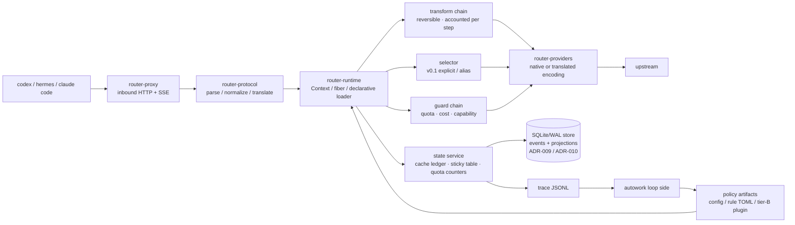

# Design (HOW) — router

Convention: this document is the single source of truth for the **implementation structure** (module
boundaries, data flow, algorithms, test strategy). External behavior is in `docs/spec.md`.

## 1. Panorama



Three hard boundaries (AGENTS.md carries the binding clauses): the byte boundary, content determinism,
the observation boundary.

## 2. crate dependency direction

```
router-cli      → router-proxy → router-protocol → router-core
                → router-plugins → router-runtime → router-core
                → router-store → router-core            (trait Store implementation, ADR-009)
router-proxy    → router-providers → router-core
router-plugin-sdk  (no workspace-crate dependency; its own dep is `serde_json`)
```

- `router-core`: the domain model of request/decision, the cost engine, the cache ledger, the plugin
  traits. **Depends on no HTTP/protocol crate**.
- `router-runtime`: Cordis semantics (§4). `router-core`'s traits are loaded here as fibers.
- `router-protocol`: codec for the 3 protocols + translation matrix + `Usage` normalization; pure
  functions, exhaustively unit-testable.
- `router-providers`: wire capabilities, authentication, retry, SSE parsing; **makes no decisions**.
- `router-proxy`: the axum data plane, byte-faithful forwarding and SSE passthrough.
- `router-plugins`: the built-in tier-A plugins (cache-guard, transform_rules, cost_ledger, quota_guard,
  sticky).
- `router-store`: the SQLite/WAL implementation of `trait Store` (event log + projections + migrations).
  It is the persistence seam **under** the state service's traits of §12.2, not a second domain model
  (ADR-009).

## 3. Decision pipeline (the order of one request)

```
parse → session resolution → transform chain → selector → guard chain → encode → forward → usage normalization → ledger/trace
```

Key design: **both transform and guard remain trace-attributable after the decision** (one transform
record is written per step); in v0.1 the selector only does explicit/alias resolution and `auto` is left
to a plugin — but the slot, the contract and the trace fields are in place now, so a plugin needs no
data-plane change when it lands.

## 4. Plugin runtime (aligned with Cordis semantics)

**Status: the contract is frozen and the machinery exists — implemented, not wired.** **ADR-036** adopts
this section, §12.2's signatures and §13.6's boundary as the contract (**D1–D8**), and **R41-2** landed the
implementation: `crates/router-runtime/src/{lib,service,effect,ctx,fiber,loader}.rs` carry the identities,
`ServiceKey<T>`, the `Effect` inverse stack, the `Ctx` fiber scope (service table, realms, intercept),
`FiberState`, `trait Plugin`, and the load-time-resolving loader — **minus the four service-key
constants**, whose traits (`dyn CacheLedger` / `dyn SessionTable` / `dyn QuotaStore` / `dyn TraceSink`)
exist nowhere yet (§12.2's status says why); §13.1's row for **P9** therefore reads **`implemented, not
wired`**. The `inject` / `isolate` / `intercept` keys are parsed and validated (the plugin validation loop,
`router-core/src/config.rs:1744-1804`) and **still nothing acts on them** — no configuration mounts a
plugin and no request path reaches the runtime — while `disabled` is honoured at start-up (spec §4.4;
`router-cli/src/lib.rs:270`). Read this section as the contract of machinery that exists and is not wired
into the assembly (R41-3), and `book/plugins.md` for the user-facing sentence.

The mapping from the paper's primitives to this project's implementation (fixed by ADR-002):

| Cordis primitive | This project's Rust form | Purpose |
|---|---|---|
| `ctx.effect(cb) → dispose` | `fn(&mut Ctx) -> Effect`, `Effect{undo: FnOnce}`, accumulated LIFO | any registration/rewrite carries its own inverse; unloading a plugin = a full rollback |
| `ctx.set(key,value)` / `ctx.get(key)` + `notify → refresh` | typed service slot `ServiceKey<T>`; when a provider enters UNLOADING its **dependents are deactivated first**, then the binding is withdrawn | dependencies and dependents between plugins need no manual ordering |
| `fiber.inject` (a coeffect declaration) | the manifest declares `inject: [services]`; while unsatisfied it **stops at load-waiting** instead of erroring | out-of-order loading is safe |
| `ctx.isolate(key, realm)` | the same key with multiple realms → two independent sets of bindings | **A/B and shadow**: two policy versions coexist without interfering |
| `ctx.intercept(key, metadata)` | does not change the binding, only "how it is used" | set the sample rate, timeout or shadow switch for one plugin |
| entries + keyed diff + HMR | a declarative `plugins:` list + per-field minimal operations | parameter-level experiments need no restart |

**Rust's trade-off (must be faced honestly)**: the paper's HMR relies on dynamic module loading in JS.
This project's tier-A plugins are linked at compile time, so there is **no module-level HMR** — a code
change = rebuild + restart; only **config-level coordination** (config/weights/rule TOML take effect
immediately) and module-level reload of tier-B (out-of-process) plugins exist. To keep the restart cost
low, the `cache ledger / sticky table / quota counters` are all projections of the local store (§8,
ADR-009) and survive a restart (rebuilt from the event log if a projection was lost), so a restart loses no
session context.

Lifecycle state machine (simplified): `LOADING → ACTIVE → UNLOADING → (removed)`; while `inject` is
unsatisfied it stays at LOADING; when unloading a fiber its dependents leave first, then its inverse is
executed in LIFO order. A failed state carries an error result and does not affect other fibers.

## 5. Cost engine

**Five-tier price + peak/off-peak**: `input_miss`, `input_hit`, `cache_write`, `output`,
`peak.multiplier`. Per-request cost:

```
cost = input_miss × p_miss + input_cached × p_hit + cache_write × p_write + output × p_out   (× peak)
```

**Quota plans** (coding-plan style): the marginal cost inside the plan is recorded as 0, but
`tokens_remaining` and `over_quota: block|spill` must be modeled; under `spill` the overflow is charged
at `p_miss`. The remaining allowance is written to the trace (`quota_after`), making "where the
allowance was spent" auditable.

**The cost model of switching (cache-aware breakeven)**: switching models immediately loses the prefix
cache and recomputes the whole prefix once at the miss price.

```
switch_gain  ≈ remaining_turns × tokens_per_turn × (p_stay − p_new)
switch_cost  ≈ prefix_tokens × p_miss_new
switch if and only if switch_gain > safety_factor × switch_cost
```

The parameters are in `config.cache.breakeven`; `remaining_turns` is estimated from the session history
and `safety_factor` defaults to 1.2. (In v0.1 the model is specified explicitly, so this formula decides
**failover and quota spill**, not automatic model selection.)

## 6. Cache policy (P0, the first-order lever)

1. **Fidelity**: on the passthrough path the only permitted mutations are deleting router-owned fields
   and replacing the value of the top-level `model` member with the resolved native id (spec §2,
   §12.10.7); for the same input the encoder must be byte-deterministic.
2. **Content determinism**: a transform is a pure function of `(content, stable config)` — depending on
   the turn number, the wall clock or an RNG is forbidden. Any "rolling window / per-turn trimming"
   implementation counts as breaking the prefix (which is why P4 is deferred).
3. **Stickiness**: a session → (provider, model) mapping, keyed preferentially by the client-supplied
   `prompt_cache_key` (the upstream echoes it; measured to work), falling back to `header:session-id` /
   `header:thread-id`; TTL is in config.
4. **Breakpoint injection**: when translating to an anthropic upstream, inject `cache_control` at "stable
   content boundaries" (same content → same position); the number of breakpoints is written to the trace
   (`cache_control_breaks`).
5. **State-service handover**: the ledger and the sticky table are projections of the local store
   (§8, ADR-009/ADR-010); a restart loads them — and rebuilds them from the event log if they were
   lost — so the `prefix_continuity` metric does not break across restarts.

## 7. Protocol translation layer

The capability matrix is declared in config (`supports`); the 3×3 table is constructed at runtime:

- a `native` cell → byte passthrough (the only permitted operation is deleting router-owned fields).
- a `translated` cell → goes through an explicit mapper; every mapper must be marked
  `lossless | lossy(reason)`.
- when lossy: write the trace and optionally the `X-Router-Lossy` response header; never silently.
- inbound unknown fields are kept verbatim (a bypass side channel exists), so protocol evolution loses
  no information.
- **an upstream error is normalized in exactly one place** (ADR-011): the provider layer surfaces the raw
  evidence (status, headers, error body) and makes no decision (§2), the classifier in `router-core`
  assigns a reason and a recovery action, and this layer only *renders* the client-facing shape
  (`ErrorBody`, §12.7). No call site branches on an upstream's prose, and an upstream error body is read
  and never persisted (ADR-009 item 3).

## 8. State and persistence

One local process, one writer, one store. State is an **event log plus rebuildable projections**, not
memory plus snapshots: ADR-009 fixes the storage boundary, ADR-010 the truth and the write ordering.

The plugin-facing surface stays the service traits of §12.2 (`CacheLedger`, `SessionTable`, `QuotaStore`);
`trait Store` is the persistence seam **under** them, implemented by `router-store` (§12.1).

| State | Medium | Durability | Notes |
|---|---|---|---|
| event log (`events`) | SQLite/WAL behind `trait Store` | intent / accounting events `synchronous=FULL`, committed **before** the effect they authorize (ADR-010) | the truth: every state transition is a row |
| sticky table / cache ledger / quota counters | projections in the same store | `NORMAL` + group commit | rebuildable from `events`; losing one regresses statistics, never correctness |
| provider cooldown (demotion, ADR-011) | projection in the same store | `NORMAL` + group commit | rebuildable from `events`; losing it costs one doomed attempt, never a wrong charge |
| trace | append-only JSONL, rolled hourly (spec §4.1; record shape in §12.6) | OS defaults | the analysis truth and the only product → autowork channel (ADR-005), unchanged |
| request / response bodies | **never persisted by the product** | — | the log keeps `body_hash` + a pointer; raw bytes exist only in captures taken outside the product |

- **Store path**: `<directory containing the config file>/state/router.db` (`state/` is gitignored). v0.1
  fixes it — there is no `state:` config key (§12.5); a section that moves the file is an additive future
  key (spec §4.1's precedent).
- **Startup prerequisite**: if the store cannot be opened or migrated, `serve` exits non-zero with the
  reason. There is no in-memory degraded mode: a gateway that enforced quota from numbers it cannot
  recover would report figures it cannot stand behind.
- **Ordered write path**: `upstream.submitted` commits before the upstream attempt begins; if that intent
  write fails, the request is rejected before anything is sent (nothing billed, the client's retry is
  safe) (ADR-009 item 8).
- **Crash window**: an intent with no response is `unknown_outcome`; the quota is not charged again and no
  cost is invented for it (ADR-010).
- **Migrations**: forward-only, with three deliberately distinct version axes (store DDL / event payload /
  trace record — ADR-009 item 7).

**Upstream failure path (ADR-011).** One classifier, one action, one record: `upstream.responded` →
`classify_upstream_error` → `error.classified` (a kind of ADR-010's vocabulary; `NORMAL`, payload `reason` +
`action` + the matched table entry + `retry_after_s?` + `demotion?`) → the action's effect. The action set is
`retry | rotate credential | fallback provider | compress | abort`, and the trace mirror rides in the
existing `errors[]` element (`kind = upstream_error`, `details.*`), so no spec §6 field and no
`schema_version` moves (§12.6).

- **Retry needs not-billed evidence**: an answer (any status) or a failure before the request bytes went out
  may be retried inside the declared attempt budget; a request fully written whose response never arrived
  may **not**, because the upstream may already have billed it — that attempt is ADR-010's
  `unknown_outcome`, and the client decides whether to retry.
- **`connect_failure` is a reason of its own** (ADR-011 item 6's rows, named here because the ADR's v0.1
  enum sketch lists no transport class): a no-status failure whose transport evidence says no connection
  was ever established (`reqwest`'s `is_connect()`, surfaced as `TransportKind::Connect` by
  `router-providers`) classifies as `connect_failure` — nothing was billed, so the class **fails over**
  (`action = fallback_provider`) and never re-attempts the same provider in this request. A no-status
  failure whose evidence is `is_timeout()` (a connect or read timeout) keeps the `timeout` reason and its
  existing abort semantics. The two share one evidence source — the transport kind on the attempt's
  `TransportError` — so the split is a pure function of the failure, not a heuristic over error text.
- **`context_overflow` / `payload_too_large` compress instead of failing over** (failing over bills another
  provider for the same oversized prompt), and `content_policy_blocked` is aborted locally, never re-probed
  unchanged.
- **The provider is the demotion unit** (a plan allowance is per provider/account, spec §4.0): a
  billing-class failure writes a cooldown that the guard sees as an unavailable route, so the next request
  does not pay to rediscover a dead account. `Retry-After` and the `x-ratelimit-*` headers feed its TTL, and
  a wait longer than `server.request_timeout` is carried across requests by the cooldown rather than held
  open inside one.
- **A failover prices the cache it breaks**: `failover.triggered` carries the prefix tokens and the switch
  cost in integer fixed-point nano amounts of the attempt's own price table (ADR-006 + ADR-018, §5, §12.4) as
  an **inferred** figure at decision time, and the measured
  figure — the miss-priced tokens actually billed on the first post-switch turn, against the origin route's
  `input_hit` price — once that attempt's `usage` lands. The `verified/inferred` convention (spec §7) thus
  applies to failover exactly as it applies to transforms.

## 9. Replay (computing money with the same code)

`router replay --trace t.jsonl --config c.yaml [--plugins p.yaml]`: feeds real inbound requests into
**the same production decision pipeline** (the same binary, the same transform/encoding path), replacing
only the outbound HTTP with a local simulation (or a real replay once, behind a budget gate). It outputs
a cost/cache/latency report contrasted against `prefix_continuity`.

This is the foundation of autowork: a policy cannot be re-implemented in Python without producing skew
(the lesson of the old project), so policy simulation is always a subcommand of the product.

**Not implemented in v0.1** and taken by no round yet: there is no `replay` subcommand and no simulation seam
in the serving path, so the shape above is design intent, not a served surface — spec §9.3 says the same thing
at the user-facing boundary, together with `router trace tail` and `GET /metrics`. Until it lands, the trace
record (spec §6) is the interface, and a figure that cannot be replayed must not be claimed.

## 10. Test strategy

| Layer | Contents |
|---|---|
| unit | exhaustive protocol codec (3×3), `Usage` normalization, five-tier cost, breakeven boundaries, realm isolation, effect LIFO rollback, the upstream-error taxonomy (one fixture per reason class plus the priority-order cases, ADR-011) |
| conformance | fidelity (upstream-visible prefix hash == the client's), SSE event-sequence equivalence, tool-call round trip, unknown-field passthrough, error-code mapping |
| cache | same-session two turns `prefix_continuity == 1.0`; re-measure after enabling each transform (regression guard) |
| accounting | every transform carries a `verified/inferred` label; gates read verified only |
| state | write-ahead ordering on a fixed event log, projection == rebuild from `events`, an intent-write failure rejecting before anything reaches the upstream, startup refusal when the store cannot be opened or a second writer holds it, config-driven `serve` (CONF-20…25, §12.10) |
| interaction | one onboarding smoke run each with the real codex/hermes (including verification of the `NO_PROXY` prerequisite) |

## 11. Risks and mitigations

| Risk | Mitigation |
|---|---|
| a transform breaks the prefix without knowing it | `prefix_continuity` as a blocking gate; run the cache regression for each transform separately |
| a lossy translation layer makes client behavior wrong | the lossy list goes into the spec; mark it explicitly when lossy + conformance cases |
| no HMR for tier-A slows experiment iteration | parameters/rules go through config-level coordination; experiment-class plugins are forced to tier-B |
| the accounting convention is polluted by "estimates" | the binary verified/inferred convention + reports must state the sample size |
| a system proxy makes onboarding fail | README/spec enforce `NO_PROXY`; the smoke test includes this item |
| a retry picks the same dead provider again | the demotion is *state* (a cooldown projection), not a per-request check; the previous project measured this failure mode at 62% of its failures (ADR-011) |
| the failure path's judgement is re-implemented at each call site | one classifier in `router-core`, one table per reason class with a one-fixture minimum; the provider layer makes no decisions (§2) (ADR-011) |
| the loop improves the measurement instead of the product | the gate definitions, the frozen corpus and the conformance assertions are outside the mutable scope, and a verdict records the evaluator commit and the corpus digest it ran against (ADR-012) |
| an online experiment destroys the prefix cache | shadow first (no upstream call), then a session-bucketed canary decided at session start and never mid-session; shadow can never enter the cost gate (ADR-013) |
| an auto-adopted parameter drifts past its declared envelope | declared triggers + automatic rollback + no promotion without the minimum sample + a re-proposal cooldown; only in-envelope parameters are auto-adoptable (ADR-013) |

## 12. Module and type landing list

This section lands the structure of §2/§4/§5/§6/§7 as **signature sketches + a case-ID table**, giving
implementers a single basis. It lands only "the shape of types and contracts", not function bodies; the
implementation order is given by each row's "Lands in".

### 12.1 crate list, dependency direction and the third-party dependency allowlist

```
router-cli      → router-proxy → router-protocol → router-core
                → router-plugins → router-runtime → router-core
                → router-store → router-core            (trait Store implementation, ADR-009)
router-proxy    → router-providers → router-core
router-plugin-sdk  (no workspace-crate dependency; its own dep is `serde_json`)
```

| crate | Public surface (what is usable outside) | Permitted third-party dependencies | Lands in |
|---|---|---|---|
| `router-core` | domain model, cost/quota/breakeven pure functions, plugin traits, `DecisionRecord` | `serde`, `serde_json`(preserve_order+arbitrary_precision), `sha2` | 2026-09-19 |
| `router-protocol` | codec for the 3 protocols, translation matrix, `Usage` normalization, `raw_json` (span-faithful editing) | `serde_json` | 2026-09-19 |
| `router-providers` | `ProviderClient` (wire capabilities, authentication, retry, SSE parsing) | `reqwest` (with a TLS feature — all real providers are https), `tokio`, `futures` | 2026-09-19 |
| `router-runtime` | `Ctx` / `Effect` / `ServiceKey` / fiber state machine, declarative loader | none (pure std + core) | 2026-09-19 |
| `router-plugins` | built-in tier-A: cache_guard / transform_rules / cost_ledger / quota_guard / sticky; and the **assembly** that mounts them from the `plugins:` list (`assemble`, R41-3) | `toml`, `regex` | 2026-09-19 / 2026-09-20 / 2026-09-25 |
| `router-proxy` | axum data plane: byte-faithful forwarding, SSE passthrough | `axum`, `tokio`, `hyper`, `tower` | 2026-09-19 |
| `router-cli` | `serve` / `stats` / `setup` / `replay` / `trace` (`setup` lands per §12.14; `replay` and `trace` are named in the plan, not yet served) | `clap`, `tokio` (+ `serde_yaml` in this crate only, §12.10.2), **`notify`** (**ADR-039**: the reload's file-watch mechanism, ADR-037 D7's mechanism half, ruled by the owner 2026-09-26 — the row is the contract and it lands **now**; the dependency, the code and the tests land with the reload round's own cards) | 2026-09-19 (serve stub) |
| `router-plugin-sdk` | tier-B out-of-process plugin protocol types (UDS frames) | `serde_json` | 2026-09-20 |
| `router-store` | the SQLite/WAL store: the `events` log, the `sessions` / `cache_ledger` / `quota_counters` projections, forward-only migrations | `rusqlite` (bundled), `serde_json` | 2026-09-19 (ADR-009) |
| `router-conformance` (`tests/conformance/`) | the CONF cases (§12.8) | `tokio`, `axum`, the crates under test | 2026-09-19, as an empty shell |

- **`router-core` depends on no HTTP / protocol crate** (§2 hard constraint); how it is spot-checked: the
  dependency set of `cargo tree -p router-core` must be ⊆ the allowlist.
- Dependency discipline: **a new dependency must have its reason written in the commit message**
  (consistent with this round's task constraint). Any dependency outside the allowlist is discussed first.
- **The `notify` row is declared and not yet used (ADR-039).** `router-cli` may take `notify` for the
  reload's file-watch mechanism — ADR-037 D7's mechanism half, decided by the owner on 2026-09-26 — and
  **no other crate may**: `router-core`'s cell does not gain it (the domain is I/O-free and
  `cargo tree -p router-core` must stay ⊆ its allowlist, the spot-check above), and no crate may reach the
  platform backends directly (the crate holds `inotify` / FSEvents / `kqueue` behind one API). The row is
  the contract; **the `Cargo.toml` line, the code and the tests land with the reload round's own cards**,
  the dependency's MSRV is re-measured there against `Cargo.toml`'s floor (`rust-version = "1.88"`, whose
  comment records the 2026-09-20 measurement and that a raised dependency can raise it), and the
  `[workspace.dependencies]` comment shape the landing round writes is ADR-039 D3's, verbatim (§12.1
  states the boundary; the ADR states the reason — one copy of each).
- Every crate root adds `#![forbid(unsafe_code)]`; `router-core` additionally adds
  `#![deny(clippy::float_arithmetic)]` (money only takes the fixed-point path of §12.4).
- Test placement: unit tests use `#[cfg(test)] mod tests` in place; conformance lives in
  `tests/conformance/tests/` (§12.8).

### 12.2 Runtime primitives (ADR-002 → Rust signature sketch)

**Status: the contract is frozen, and the machinery is implemented — with one deliberate
absence.** **ADR-036** adopts the sketch below as the contract the loader must satisfy (its **D1**,
**D3**, **D5**; §13.6 is the boundary it belongs to), and **R41-2** implemented it:
`crates/router-runtime/src/{lib,service,effect,ctx,fiber,loader}.rs` carry the identity types,
`ServiceKey<T>`, `Effect`/`EffectId`, `Ctx` (fiber scope: service table + effect stack + realm
table), `FiberState`, `trait Plugin`, and the load-time-resolving loader, with the unload order
below and the deep-equality condition after load → activate → unload asserted by unit tests in
place. The exception: the four service-key constants (`CACHE_LEDGER` / `SESSION_TABLE` /
`QUOTA_STORE` / `TRACE_SINK`) did **not** land — the four traits they are declared over
(`dyn CacheLedger` / `dyn SessionTable` / `dyn QuotaStore` / `dyn TraceSink`) exist nowhere in
`crates/` and this sketch never gives their method sets, so inventing them inside a round would
freeze contracts nothing has tested against a real binding; they land in the round that first
binds one (R41-3's assembly or R41-4's observer, ADR-036 D3's order). `router-plugin-sdk` stays a
stub, and nothing consumes the runtime yet — the state is **implemented, not wired**.

| Cordis primitive | Rust type (`router-runtime`) | Where the semantics land |
|---|---|---|
| `ctx.effect(cb) → dispose` | `Ctx::effect(Effect) -> EffectId` + `Effect { undo: Box<dyn FnOnce()+Send> }` | a LIFO stack; unload = run the undos in order |
| `ctx.set/get(key)` + refresh | `Ctx::provide/get` + `ServiceKey<T>` | a provider going offline → its dependents are deactivated first, then the binding is withdrawn |
| `fiber.inject` | `Plugin::inject() -> &[ServiceId]` | while unsatisfied it stays at `Loading{waiting_on}`, with no error |
| `ctx.isolate(key, realm)` | `Ctx::isolate(key, RealmId) -> RealmGuard` | multiple sets of bindings for the same key (A/B and shadow coexist) |
| `ctx.intercept(key, md)` | `Ctx::intercept(&key, InterceptMeta)` | does not change the binding, only "how it is used" (sample/timeout/shadow) |
| entries + keyed diff | a `PluginCfg` list + `apply_config_diff` | a config change diffs itself; `disabled` unloads; an `id`/`kind` change rebuilds |

```rust
pub struct PluginId(pub String);
pub struct ServiceId(&'static str);
pub struct RealmId(u32);
pub const ROOT_REALM: RealmId = RealmId(0);

pub struct ServiceKey<T: ?Sized> { name: &'static str, _m: PhantomData<fn() -> T> }
impl<T: ?Sized> ServiceKey<T> { pub const fn new(name: &'static str) -> Self; pub fn name(&self) -> &'static str; }
pub const CACHE_LEDGER: ServiceKey<dyn CacheLedger> = ServiceKey::new("cache_ledger");
pub const SESSION_TABLE: ServiceKey<dyn SessionTable> = ServiceKey::new("session_table");
pub const QUOTA_STORE:   ServiceKey<dyn QuotaStore>   = ServiceKey::new("quota_store");
pub const TRACE_SINK:    ServiceKey<dyn TraceSink>    = ServiceKey::new("trace_sink");

pub struct Effect { undo: Option<Box<dyn FnOnce() + Send>> }
impl Effect { pub fn new(f: impl FnOnce() + Send + 'static) -> Self; pub fn noop() -> Self; }

pub struct Ctx { /* fiber scope: service table + effect stack + realm table */ }
impl Ctx {
    pub fn effect(&mut self, e: Effect) -> EffectId;
    pub fn provide<T: Send + Sync + 'static>(&mut self, key: ServiceKey<T>, v: Arc<T>) -> EffectId;
    pub fn get<T: Send + Sync + 'static>(&self, key: &ServiceKey<T>) -> Option<Arc<T>>;
    pub fn isolate<T: Send + Sync + 'static>(&mut self, key: ServiceKey<T>, realm: RealmId) -> RealmGuard;
    pub fn intercept<T: Send + Sync + 'static>(&mut self, key: &ServiceKey<T>, md: InterceptMeta);
}

pub enum FiberState { Created, Loading { waiting_on: Vec<ServiceId> }, Active, Unloading, Failed(PluginError), Removed }

pub trait Plugin: Send + Sync {
    fn id(&self) -> &PluginId;
    fn inject(&self) -> &'static [ServiceId];      // coeffect declaration; unsatisfied → stays at Loading
    fn apply(&self, ctx: &mut Ctx) -> Result<Effect, PluginError>;
}
```

**Unload order (the implementation must follow it, and a test asserts it)**: ① recursively put the
dependents into `Unloading` and wait for them to finish → ② run this fiber's `Effect::undo` in reverse
LIFO → ③ withdraw the service bindings → ④ `Removed`. A failure goes to `Failed(err)` and **does not
affect other fibers** (ADR-002's "failure isolation"). How it is asserted: after load → activate →
unload, the service table and the intercept table must be **deep-equal** to what they were before
loading (unit-tested).

### 12.3 Decision-pipeline types and the failure semantics of each step

```
parse → session resolution → transform chain → selector → guard chain → encode → forward → usage normalization → ledger/trace
```

```rust
pub enum Protocol { Chat, Responses, Anthropic }
pub enum ClientKind { Codex, Hermes, ClaudeCode, Other }
pub struct RouteSpec { pub provider: String, pub model: String }
pub enum SelectionSource { Explicit, Alias, Plugin }
pub struct Decision { pub route: RouteSpec, pub source: SelectionSource, pub plugin_chain: Vec<PluginId> }

pub trait Transform: Send + Sync {
    fn id(&self) -> &'static str;
    /// Content-deterministic: reading the clock/turn/RNG is forbidden. Err = fall back to the original text (spec §8), the caller records the trace.
    /// Shape superseded by §12.12 (ADR-019): `apply_node(ctx, text) -> Option<TransformOutcome>` plus a
    /// path-addressed plan applied as value spans over the client's bytes — the parsed view is never
    /// what reaches the wire.
    fn apply(&self, req: &mut CanonicalRequest) -> Result<TransformReport, TransformError>;
}
pub struct TransformReport {
    pub added_input_tokens: u64, pub saved_input_tokens: u64, pub saved_output_tokens: u64,
    pub cache_impact: CacheImpact, pub verdict: Verdict, pub tee_id: Option<TeeId>,
}
pub enum CacheImpact { Neutral, Risky, Broken }      // Broken → cache_guard's strict_prefix rejects it
pub enum Verdict { Verified, Inferred }              // only Verified can enter a gate (ADR-003/spec §7)

pub trait Selector: Send + Sync { fn select(&self, req: &CanonicalRequest, roster: &Roster) -> Result<Decision, SelectError>; }
pub trait Guard: Send + Sync { fn check(&self, cx: &GuardCx<'_>) -> GuardOutcome; }
pub enum GuardOutcome { Pass, Reject { code: ErrorCode, message: String }, Downgrade(RouteSpec) }
pub trait Observer: Send + Sync { fn on_decision(&self, rec: &DecisionRecord); fn on_error(&self, e: &RouterError); }
```

| Step | Failure semantics |
|---|---|
| parse | the request body is unparsable → `invalid_request` 400, not forwarded |
| session resolution | every source is missing → `session = None` (the trace records null, `sticky_hit=false`), **not an error** |
| transform | any step `Err` → fall back to the original text + `TransformRecord.error`; the request proceeds as usual (spec §8) |
| selector | `auto` → `auto_not_supported` 400 (spec §3); a `provider/model` that does not exist → 404 |
| guard | `Reject` → the normalized error body; `Downgrade` → take that route and record `failover_from` |
| encoding | a translation cell missing its declaration → 400; lossy → record `lossy[]` + `X-Router-Lossy` |
| forwarding | 5xx/429/quota exhausted → the fallback chain; the chain exhausted with an attempt behind it → 502 carrying that attempt's `upstream_status` and its class, and **no** `stage`/`skipped[]`; nothing attempted and nothing may serve → 502 with the frozen `no_available_route` shape (§8, §12.10.9, ADR-023) |
| usage normalization | the upstream is missing usage fields → zero values + trace `usage_missing: true` (**never guessed**) |
| ledger/trace | a trace write failure → the request proceeds as usual, the count goes into the `trace_dropped` metric (an observable degradation) |

#### 12.3.1 Landing the byte boundary in the types (AGENTS hard constraint 1)

```rust
pub struct CanonicalRequest {
    pub protocol_in: Protocol,
    pub raw: RawBody,                 // the client's raw bytes: the sole authority
    pub doc: JsonDoc,                 // order-preserving parsed view (for decisions; **not used for outbound sending**)
    pub session: Option<SessionId>,
    pub thread_id: Option<String>,
    pub turn_index: u32,
}
pub struct RawBody(Bytes);
impl RawBody {
    pub fn as_bytes(&self) -> &[u8];
    /// Mutation (a) of the byte boundary: deleting top-level router-owned fields. All other bytes are kept byte for byte.
    pub fn remove_top_level_keys(&self, keys: &[&str]) -> Result<RawBody, RawEditError>;
    /// Mutation (b): replacing the **value** of a top-level string member (in practice the outbound
    /// `model`, spec §2). Byte-level, single pass, no parse→reserialize. `Cow::Borrowed` when the value
    /// already is `value` (byte-identical input), `Cow::Owned` otherwise; `Err` when the member is
    /// absent or its value is not a JSON string.
    pub fn set_top_level_string(&self, key: &str, value: &str) -> Result<Cow<'_, [u8]>, BodyError>;
}
```

- `RawBody` **does not implement** `DerefMut`/`AsMut`, and exposes no mutable reference to a
  `serde_json::Value` → a casual "just tweak it" is blocked at compile time.
- `remove_top_level_keys` uses a **single-pass JSON scanner** (it needs only the spans of the top-level
  keys, tracking strings/escapes/bracket depth) to delete at the byte level; a **parse → reserialize
  round trip is forbidden** (that is the most common way the byte boundary is broken).
- router-owned fields = the `router_meta` echo + routing hints (spec §2). The deletion list is a
  **whitelist constant**; adding one requires changing that constant.
- The separator semantics of deletion (pinned down 2026-09-19): consecutive whitelist hits form one
  "segment"; the segment is removed as a whole and swallows the comma between **its tail** and the
  member that follows it (including the whitespace in between); the comma at the head of the segment is
  left to the previous retained member. Only when the first member is the start of a segment does it
  instead swallow the segment-tail comma. Invariant: any `Ok` output must be valid JSON, and the
  retained members are byte-for-byte equal to their input spans (the `deletion_position_matrix*` tests
  are a permanent regression matrix).
- **Mutation (b) — `set_top_level_string`** (its settled semantics — ruled 2026-09-19 (`3074957`), implemented the same day (`233e05e`), so ruling and wiring cannot differ):
  - **Only the value span moves.** The member's key bytes, its position in the document, the separators
    and the whitespace around it, and every byte outside the member are byte-for-byte the input; the new
    value is encoded as a JSON string (`"` + RFC 8259 escaping + `"`) inserted in place of the old value
    span. It therefore cannot reorder members, re-escape unrelated strings or drop trailing whitespace —
    the three ways a parse→reserialize would silently rewrite the body.
  - **Idempotent and content-deterministic** (AGENTS constraint 2): the result depends only on
    (content, key, value); a second application with the same value returns the first application, and a
    value equal to the member's current value returns the input bytes unchanged (`Cow::Borrowed`).
  - **An absent member is an error, never an insertion** (`Err`, not "add it and carry on"): the
    passthrough path never invents a member the client did not send, and no reachable path needs the
    insertion — a body whose `model` is missing or not a string is answered `400 invalid_request`
    before the rewrite (spec §8). A present member whose value is **not** a JSON string is an error for
    the same reason. The concrete variant names are the implementation's to choose (`RawEditError`'s
    vocabulary plus these two), the *distinguishability* is the contract.
  - **The same scanner** as `remove_top_level_keys` — the primitive and the deleter share
    `scan_top_level_members`, never a second parser (the policy differs; the scanning does not).
- Three settled boundary behaviors (the rationale for rejecting vs passing through, each pinned by a
  unit test):
  - **BOM prefix → `Err(NotTopLevelObject)`**: stripping the BOM is a rewrite outside the whitelist
    (hard constraint 1 permits deleting router-owned fields and replacing the value of the top-level
    `model` member — and nothing else), so router has no right to "fix it in
    passing" and it is left to the caller to handle as a 400.
  - **Leading-zero number (`01`) → `Err(Malformed)`**: the RFC 8259 number grammar does not contain this
    form; the raw value fragment is vetted by the serde_json validator, and an ambiguous number is not
    passed through (upstream parsers disagreeing is a hidden risk).
  - **invalid UTF-8 inside a **string** value → `Ok` and passed through byte for byte**: the byte
    boundary takes priority, router does not interpret value content, and legality is adjudicated by the
    upstream. Note the asymmetry: invalid UTF-8 inside a **key** is still `Err(Malformed)` — a key must
    be decodable to be compared semantically against the whitelist, and if it cannot be compared there is
    no safe way to decide delete-or-not.
- The domain of the prefix hash = the raw bytes of `messages | input | tools` and the system-instruction
  position in the upstream-visible body (spec §6 "prefix"), so "deleting router fields" does not affect
  that hash — CONF-10 asserts exactly this. The `model` member is **not** in that domain either, so
  mutation (b) does not affect it: `prefix_continuity` measures the conversation's fidelity, not the
  route the request took (§12.10.7).
- Prefix blocks (`prefix_blocks[]`): a block = the **smallest indivisible unit** in the prefix region
  (one message / one tool definition / one input item), recording `tokens` and `hash` per block;
  `hash = the first 16 hex chars of sha256(block raw bytes)`.
  (GAP-Q5: the spec does not define block granularity; this blueprint takes a "structural unit" rather
  than a fixed-length token bucket, because the former aligns with cache breakpoints.)

### 12.4 Cost / quota / breakeven pure functions (the implementation target of the 2026-09-19 bootstrap)

```rust
/// Money is fixed-point: 1e-9 of the amount's own currency. No f64 appears in the decision path or
/// the trace. ADR-018 (spec §4.8) renamed `NanoUsd` to `Nano` and paired it with `Money`; that block
/// sits below this sketch, and nothing else in this section's shapes changes.
pub struct Nano(pub u64);
/// Unit price: nano-currency / 1K token (the same shape as the config's price, only integerized).
pub struct Price(pub u64);
pub struct PriceTable { pub input_miss: Price, pub input_hit: Price, pub cache_write: Price,
                        pub output: Price, pub peak: PeakTable }
pub struct PeakTable { pub multiplier_pct: u32, pub windows: Vec<PeakWindow> }   // 2.0 → 200
pub struct PeakWindow { pub days: Weekdays, pub from_min: u16, pub to_min: u16, pub tz: Tz }

pub struct Usage { pub input_total: u64, pub input_cached: u64, pub cache_write: u64,
                   pub output: u64, pub reasoning: u64 }
impl Usage { pub fn uncached(&self) -> u64;  pub fn cache_hit_rate(&self) -> f32; }

pub struct CostBreakdown { pub input_miss: Nano, pub input_hit: Nano, pub cache_write: Nano,
                           pub output: Nano, pub peak_applied_pct: u32, pub total: Nano,
                           pub currency: Currency }   // §4.8 — added by the currency-tagged block below

/// Pure function: cost(miss, hit, write, out, price, at) -> CostBreakdown
/// cost_nano = Σ_tier ( tokens_tier × price_tier_nano_per_1k ) / 1000   (integer; only the final division rounds down)
/// A peak-window hit (at ∈ windows) → sum the no-peak total first, then × multiplier_pct / 100.
/// The input_miss tier uses usage.uncached(); the output tier includes reasoning (most upstreams count reasoning into output).
pub fn cost(usage: &Usage, price: &PriceTable, at: Timestamp, tz: Tz) -> CostBreakdown;
```

**Currency-tagged amounts (ADR-018, spec §4.8).** The fixed-point representation of ADR-006 stands; what the
currency round adds is that the **unit travels with the value**. One request is priced by one entry's table, so
a record has one currency, and no consumer ever has to be told what a set of `nano` figures means:

```rust
/// spec §4.8. Two values in v0.1; the serialized form is the ISO-4217 code
/// ("USD" / "CNY") in the trace, `/health` and the report, and the config
/// spelling is the same code, exact (a lowercase spelling is a load error).
pub enum Currency { Usd, Cny }

/// The raw fixed-point amount: 1e-9 of **the currency carried beside it**.
/// ADR-018 renamed this type from `NanoUsd` — the name may not assert a unit the
/// value does not hold. It is the integer inside `Money`, never an aggregate
/// by itself.
pub struct Nano(pub u64);

/// An amount **and** its unit. Every money value that crosses a container
/// boundary — an aggregate, a cap, a plan state, a trace field, a report figure
/// — is a `Money`. There is **no** `impl Add for Money` across currencies and
/// **no** `Sum`, so "add two currencies" is not expressible; the one adder
/// returns the mismatch instead of a value.
pub struct Money { pub nano: Nano, pub currency: Currency }
pub enum CurrencyMismatch { Left(Currency), Right(Currency) }
impl Money { pub fn checked_add(self, rhs: Money) -> Result<Money, CurrencyMismatch>; }

/// `PriceTable` gains the unit (one table, one currency — the table belongs to
/// the provider entry, §4.8) and `CostBreakdown` copies it, so the pure cost
/// function's output is self-describing.
pub struct PriceTable { pub currency: Currency, pub input_miss: Price, /* …unchanged… */ }
pub struct CostBreakdown { pub currency: Currency, /* …unchanged… */ }
```

- **Aggregation is keyed by currency.** The plan's month spend and the report's figures are
  `BTreeMap<Currency, Money>`; `router-cli`'s `TraceFigures` gains a per-currency map, and keeps its scalar
  fields only for the single-currency case — the same rule (and the same reasoning) as spec §9.2's `--json`
  shape, so the text and the JSON cannot drift apart.
- **No `f64` appears anywhere new.** The currency is an enum, not a number: ADR-006 item 3's crate-level
  `deny(clippy::float_arithmetic)` holds, and nothing on the money path converts between currencies at all.
- **The cap stays a single scalar by construction** (spec §4.6): `plan_policy.overflow_monthly_cap_usd` is USD,
  and a policy that sets it over a non-USD overflow route is a load error, so the one comparison that could mix
  units is refused before the process serves.

Quota (spec §4 `quota`, DESIGN §5):

```rust
pub enum QuotaWindow { Monthly { reset_day: u8 } }        // spec defines monthly only; any other value = a load error
pub enum OverQuota { Block, Spill }
pub struct QuotaPlan { pub models: Vec<String>, pub window: QuotaWindow, pub tokens: u64,
                       pub over_quota: OverQuota, pub source: String }
pub struct QuotaState { pub plan_idx: usize, pub window_start_epoch_s: u64, pub tokens_used: u64 }
pub enum QuotaVerdict {
    Inside  { remaining_before: u64 },
    Spill   { billable_tokens: u64 },      // the overflow is charged at input_miss (DESIGN §5)
    Blocked { remaining: u64 },            // over_quota=block → Guard Reject(quota_exceeded)
}
/// Pure function (the only state write point): tokens = usage.input_total + usage.output (this blueprint's default convention; see GAP-Q1)
pub fn charge(plan: &QuotaPlan, st: &mut QuotaState, usage: &Usage, now_epoch_s: u64) -> QuotaVerdict;
```

**ADR-014 refinement — which signal may refuse a request.** The `Blocked` verdict above stays the **local**
verdict and keeps its meaning as a recorded warning: under GAP-Q1 the plan's `tokens` may be a placeholder, so
it may not by itself produce a `GuardOutcome::Reject`. Two consequences land with ADR-014's implementation:
(a) `over_quota: block` refuses when the **upstream** has declared the allowance exhausted (ADR-011's
`quota_exhausted` classification) rather than when the local counter says so, while the local verdict stays
visible through `cost.quota_after.verdict`; (b) the local counter's second honest use is **deferring a plan
probe** until the plan's declared window boundary (`window_start_for`) has passed — a deferral of an
experiment, never a refusal of a request. `plan_policy`'s own guardrail (`overflow_monthly_cap_usd`) **may**
refuse, and the asymmetry is deliberate: its inputs are measured usage priced by the config table, whereas
GAP-Q1's denominator is unverified (spec §4.6, ADR-014 items 2 and 7).

cache-aware breakeven (DESIGN §5, integerized to avoid floating-point boundary disagreements):

```rust
pub struct BreakevenParams { pub enabled: bool, pub min_remaining_turns: u32, pub safety_factor_pct: u32 }
pub struct SwitchCandidate {
    pub prefix_tokens: u64,      // the amount of prefix recomputed at the miss price when switching models
    pub tokens_per_turn: u64,    // estimated input tokens per following turn
    pub remaining_turns: u32,    // estimated remaining turns (no history → 0)
    pub p_stay_hit: Price,       // the next turn's unit price if staying = the current model's input_hit (already cached)
    pub p_new_miss: Price,       // the new model's input_miss (switching necessarily misses the whole prefix)
}
pub enum StayReason { Disabled, RemainingTurnsZero, BelowMinRemainingTurns, NotPaying }
pub enum SwitchVerdict { Switch { gain: Money, cost: Money },
                         Stay { reason: StayReason, gain: Money, cost: Money } }
/// gain = remaining_turns × tokens_per_turn × (p_stay_hit − p_new_miss) / 1000   (an i128 intermediate)
/// cost = prefix_tokens × p_new_miss / 1000
/// Switch ⟺ gain × 100 > safety_factor_pct × cost      (strictly greater; cross-multiplied, so no precision is lost to division)
pub fn decide_switch(p: &BreakevenParams, c: &SwitchCandidate) -> SwitchVerdict;
```

**Boundary cases (the implementation must cover them, asserting the `SwitchVerdict` for each)**:

| Case | Expectation |
|---|---|
| `enabled = false` | `Stay(Disabled)` |
| `remaining_turns = 0` | `Stay(RemainingTurnsZero)` (gain is always 0) |
| `remaining_turns < min_remaining_turns` | `Stay(BelowMinRemainingTurns)` (even if the formula is better) |
| `prefix_tokens = 0` | `Switch` (switching costs 0, gain > 0) |
| exactly equal (`gain×100 == sf×cost`) | `Stay(NotPaying)` (switch only on strictly greater) |
| `p_stay_hit ≥ p_new_miss` | `Stay(NotPaying)` (not profitable) |
| a peak-window hit | both `cost`/`gain` include `×multiplier_pct/100` |
| integer tiering `input_miss=0.00015` | parses to `Price(150_000)` (no floating-point residue) |

### 12.5 Config types and parsing rules (`config.example.yaml` ↔ types)

```rust
#[derive(Deserialize)] #[serde(deny_unknown_fields)]
pub struct RouterConfig { pub server: ServerCfg, pub session: SessionCfg, pub cache: CacheCfg,
    pub trace: TraceCfg,
    pub providers: Vec<ProviderCfg>, pub aliases: BTreeMap<String, RouteSpec>,
    pub plugins: Vec<PluginCfg>, pub fallback: Vec<RouteSpec>,
    pub plan_policy: Option<PlanPolicyCfg> }   // spec §4.6; ADR-014 — absent = no plan-first routing

/// spec §4.6. `ProviderCfg` gains `account: AccountKind` (`CodingPlan` | `Api`, absent ⇒ `Api`); the
/// cross-field checks are §12.10.2's table, not serde's (a `deny_unknown_fields` struct does not police
/// an enum value, and this section's only job is syntax).
pub struct PlanPolicyCfg { pub family: String, pub primary: RouteSpec, pub overflow: RouteSpec,
    pub on_primary_exhausted: OnPrimaryExhausted,   // Spill (default) | Block
    pub recover: RecoveryMode,                      // Probe (default) | None
    pub cooldown: DurationVal,                      // default 15m
    pub overflow_monthly_cap_usd: Option<CapUsdVal> }  // absent = no cap; `to_nano()` is the one rounding

/// spec §4.8 (ADR-018): `region` and `currency` are **provider-entry** properties with the
/// backward-compatible defaults (`intl` / `USD`), and the family tag is a **model-entry** property whose
/// default is the model's own `id`. `PlanPolicyCfg.family` above matches the tag (not an id), which is
/// what lets two routes with different native ids be one family.
pub struct ProviderCfg { pub region: Region, pub currency: Currency, /* …unchanged… */ }
pub enum Region { Cn, Intl }        // absent ⇒ Intl; display/audit only — it routes nothing and it
                                    //   does not choose a currency
pub enum Currency { Usd, Cny }      // absent ⇒ Usd; serialized "USD" / "CNY"; the unit of this entry's
                                    //   `price` table and of every amount computed from it (§12.4)
pub struct ModelCfg { pub id: String, pub family: Option<String>, /* …unchanged… */ }

/// spec §4.1; `Rollover::Hourly` is the only value in v0.1 → the file `<dir>/YYYY-MM-DDTHH.jsonl` (UTC).
pub struct TraceCfg { pub dir: PathBuf, pub rollover: Rollover }

/// spec §4's `server` section, including §4.7's one added key. `auth_token_env` carries the **name** of
/// an environment variable of this process; the value is read once by `router-cli` at startup and never
/// reaches this type or `router-proxy` — `router-core` stays I/O-free (§12.10.2's split), and the token
/// value never enters a config struct, a log line, a trace field or an event payload (§12.11).
pub struct ServerCfg { pub addr: String, pub upstream_attempt_timeout: DurationVal,
    pub request_timeout: DurationVal, pub auth_token_env: Option<String> }   // absent ⇒ no inbound auth
```

| Point | Rule |
|---|---|
| duration | `<integer><ms\|s\|m\|h>`, concatenable (`1h30m`); invalid → a load error (with the field path) |
| context | `<integer>` or `<integer>k\|m` (k=1024, m=1048576); used by the guard's capability check |
| price | read as f64 (1K tokens **in the entry's `currency`**, §4.8), converted **at load time** to `Price((v * 1e9).round() as u64)`; `v < 0`, or 0 after `round` → a load error. The unit is carried into `PriceTable.currency` (§12.4); no conversion between currencies exists in this parser or anywhere else |
| peak.multiplier | converted to `multiplier_pct = (v*100).round()`; only two decimal places are supported, otherwise a load error |
| `account` (spec §4.6) | `coding_plan` \| `api`; **absent ⇒ `api`**; any other value is a load error (`deny_unknown_fields` polices keys, not enum values) |
| `currency` (spec §4.8) | `USD` \| `CNY`, the ISO-4217 code exact (a lowercase spelling is a load error, and so is any other code); **absent ⇒ `USD`**. The value is carried into `PriceTable.currency` (§12.4) — the parser never converts anything |
| `region` (spec §4.8) | `cn` \| `intl`; **absent ⇒ `intl`**; any other value is a load error naming `providers[i].region`. Informational: it routes nothing, it chooses no unit, and the router does not check it against a host in `urls` (ADR-018, ADR-020). Surfaced by `/health` (§12.10.2) |
| `models[].family` (spec §4.8) | optional non-empty string; **absent ⇒ the model's own `id`**. At most one model entry of a provider entry may carry a given tag; a duplicate or an empty string is a load error naming `providers[i].models[j].family`. This is the value `plan_policy.family` matches (§4.6). It is never a route: nothing resolves a client's string to a tag, and no rule infers a tag from ids that look alike |
| `plan_policy` (spec §4.6) | at most one section in v0.1; a second family is an additive future key, never a reshaped section. Its cross-field checks are §12.10.2's table (they are routing rules, not syntax) |
| `overflow_monthly_cap_usd` (spec §4.6) | read as a `CapUsdVal` (f64 USD) and converted **at load time** by `CapUsdVal::to_nano()` to `Nano((v * 1e9).round())` — one rounding, the same shape as `price` (§12.4); a negative or non-finite value is a load error, and so is setting it when `overflow`'s provider is of a currency other than USD (the cap is USD by name; spec §4.8/§4.6 — the message names the key and the currency found); absent means no cap. Every later comparison is integer and single-currency |
| `urls` (spec §4.9) | a map `<wire> → <complete URL>`; the router uses the value **verbatim** — it appends nothing and trims nothing (ADR-020). `set(keys) == set(supports)` is enforced here: a declared wire with no URL, or a URL for an undeclared wire, is a load error naming `providers[i].urls`, and a value that is not an absolute `http(s)` URL (or that contains whitespace) is a load error naming the path and the value found. The key type is `WireApi`, whose own deserializer refuses an unknown protocol — `deny_unknown_fields` cannot police a map's keys |
| `rules_file` | resolved relative to **the directory containing this config file** (not the CWD); `trace.dir` follows the same rule (spec §4.1) |
| `trace.rollover` | only `hourly` is accepted (any other value = a load error); retention is **not** a config key (v0.1 does no automatic cleanup) |
| `state` | **not** a config key in v0.1: the store path is fixed at `<config dir>/state/router.db` (spec §4.5, ADR-009); a `state:` section that moves the file (as `trace.dir` does) is an additive future key |
| unknown fields | `deny_unknown_fields` → **errors out and exits** (no silent ignore: config is written by hand, and "I changed it but it did not take effect" is the most expensive silent failure) |
| `server.auth_token_env` (spec §4.7) | a plain string, or absent. Absent ⇒ **no inbound auth** (today's behaviour, and the backward-compatibility clause). Present ⇒ the named env var must exist **and be non-empty** or the process refuses to start — but that check is **not** this parser's: `router-core` never reads the environment (§12.10.2's split), so this row fixes only that the key is a string the parser carries through. The startup refusal and the empty-string rule are §12.11 |
| secrets | only `api_key_env`; when the env var is missing at startup → that provider is marked unavailable and reported on `/health` (it does not block other providers). `auth_token_env` is the one exception: a missing value there refuses the start (§12.11) |
| `disabled: true` | that fiber is not loaded (no error); `/health` lists it under `plugins_disabled` |
| defaults | only those the spec §4 states explicitly (`safety_factor: 1.2`, `sticky`, `over_quota`) have a default; everything else is **not enabled unless written** |
| `providers` / `providers_file` (spec §4, §4.14) | **exactly one of the two is written.** `providers` is the inline `Vec<ProviderCfg>`; `providers_file` is a path resolved by §4.1's existing rule (`resolve`: absolute wins, else `<config_dir>/<value>`, literally, `~` **not** expanded). *Both* written, or *neither*, is a **load refusal naming both keys**. The check lives in the **loader**, not in `RouterConfig::validate()`: the shape is visible only before the join, and after it the two shapes are one document |
| the roster file's own shape (spec §4.14) | the **same block**: exactly one top-level key, `providers:`, holding the same entry type under the same `deny_unknown_fields` strictness. A roster whose top-level key is not `providers:` — a `server:` block, a bare sequence, an empty document — a roster with a second top-level key, or an entry breaking an existing per-entry rule, is a load error naming the **roster's own resolved path** |
| the refusals, and the key each names | (1) both keys; (2) neither key; (3) `providers_file` + the value as written + the **resolved** path, when the roster cannot be read; (4) the roster's resolved path + the offending key, when it is not the roster block; (5) for a root key that references the roster and does not resolve there (`aliases.*`, `fallback[i]`, `plan_policy.primary` / `.overflow`, `quota.models`) the **existing** reference error, which must additionally name the roster file it failed to resolve in. Shape 5 runs in `validate()`, after the join, in the existing message order (spec §4.14's table; ADR-037 D5) |

**The roster's join, in types — and the one rule that keeps the second file out of the serving path.** The
root file's own shape is every section of `RouterConfig` as it stands above **plus**
`providers: Option<Vec<ProviderCfg>>` and `providers_file: Option<String>`; the roster file's shape is
`{ providers: Vec<ProviderCfg> }`; a **pure** join `(root, roster?) -> RouterConfig` yields today's type with
`providers` always populated. `RouterConfig` is therefore still the only thing `router-proxy` sees: the seven
`providers` reads in the proxy (`accounting.rs:67`, `availability.rs:109`, `forward.rs:1641`, `:1662`,
`stream_forward.rs:574`, `:1221`, `:1256`) are untouched, and no second accessor, second resolution rule or
roster service key is introduced. `validate()` stays the **one** validator and runs **after** the join, so
cross-file references are checked in one pass with the existing key paths and message order.
`config_load::load` (`crates/router-cli/src/config_load.rs:41`) is the only I/O — read the root, read the
roster when the root names one, join, validate — and `validate_text` (`:31`) becomes the pair's entry point so
`serve`'s startup and `setup`'s candidate gate cannot drift (spec §4.11; ADR-037 D4). The two absolute paths
and the two file digests are resolved **once**, in `router-cli`, and travel to `router-proxy` exactly as
`config_dir` / `trace_dir` / `state_db` do (§12.10.2's `ResolvedConfig`).

### 12.6 DecisionRecord (trace contract, fully covering spec §6)

```rust
pub struct DecisionRecord {
    pub schema_version: u16,            // trace version (2 since ADR-018: `cost.currency` / `plan_switch.cost_currency`); the autowork side uses it for compatibility (ADR-005)
    pub ts: String,                     // RFC3339 UTC, milliseconds
    /// The identity of the **effective configuration** that priced this record (ADR-037; spec §6, §4.14):
    /// the byte digest `sha16(root_sha16 + ":" + roster_sha16)`, each half the first 16 hex chars of SHA-256
    /// over that file's own bytes, the roster half the **empty string** when the roster is inline. Written on
    /// every record this build produces; a record **without** it predates the field, and no `schema_version`
    /// moves for it (the additive rule below). Computed once by the loader, never on a request path.
    pub config_digest: String,
    pub identity: IdentityRec,          // identity
    pub protocol: ProtocolRec,          // protocol
    pub decision: DecisionRec,          // decision
    pub state: StateRec,                // state
    pub prefix: PrefixRec,              // prefix
    pub transforms: Vec<TransformRecord>, // transform (one per step that changed the payload; omitted when empty)
    pub transform_mode: TransformMode,  // the mode in effect for this request's outbound body (ADR-019, spec §2.1/§6); always present
    pub usage: Usage,                   // usage
    pub cost: CostRec,                  // cost
    pub result: ResultRec,              // result
    pub errors: Vec<TraceError>,        // failure details (spec §6 "failure details"; written back 2026-09-19)
}

pub struct IdentityRec { pub request_id: String,
    pub event_id: i64,          // the request.received event in the state store (spec §4.5, ADR-010)
    pub client: ClientKind, pub client_ua_raw: Option<String>,
    pub session: Option<String>, pub thread_id: Option<String>, pub turn_index: u32 }
pub struct ProtocolRec { pub r#in: Protocol, pub out: Protocol, pub translated: bool, pub lossy: Vec<LossyNote> }
pub struct LossyNote { pub field: &'static str, pub reason: &'static str, pub action: LossyAction }
pub struct DecisionRec { pub provider: String, pub model: String, pub requested_model: Option<String>,
    pub selection_source: SelectionSource, pub plugin_chain: Vec<String>, pub decision_ms: u32 }
pub struct StateRec { pub stateful_inbound: bool, pub sticky_hit: bool, pub cache_control_breaks: u16 }
pub struct PrefixRec { pub blocks: Vec<PrefixBlock>, pub continuity: Option<f32> }
pub struct PrefixBlock { pub kind: BlockKind, pub index: u16, pub tokens: u64, pub hash: String }
pub struct TransformRecord { pub plugin: String, pub added_input_tokens: i64, pub saved_input_tokens: i64,
    pub saved_output_tokens: i64, pub cache_impact: CacheImpact, pub verdict: Verdict,
    pub edited_paths: Vec<EditedPath>, pub tee_id: Option<String>, pub error: Option<String> }
/// What one step rewrote, and how much of it (ADR-019; spec §6's `edited_paths[]`): the audit surface of
/// a content edit — a reviewer compares spans, not documents (§12.12, ADR-007's rationale). `path` is the
/// node address (`input[7].output`), never a byte offset (the scan is what resolves it, per attempt), and
/// the two byte counts are the **payload text's** length before and after the step, not the encoded span's
/// (escaping belongs to the splicer and shows up in that attempt's `body_hash`).
pub struct EditedPath { pub path: String, pub rule: String, pub bytes_in: usize, pub bytes_out: usize }
pub struct CostRec { pub input_miss: Nano, pub input_hit: Nano, pub cache_write: Nano,
    pub output: Nano, pub peak_applied_pct: u32, pub total: Nano,
    /// spec §4.8 (ADR-018): the unit every amount in this record is denominated in — the currency of the
    /// provider entry `decision.provider` names. Always written (a v1 record without it is USD by definition).
    pub currency: Currency, pub quota_after: Option<QuotaAfter> }
pub struct QuotaAfter { pub provider: String, pub plan_idx: usize, pub tokens_used: u64, pub tokens_limit: u64,
    pub over_quota: OverQuota, pub verdict: &'static str }
pub struct ResultRec { pub status: u16, pub upstream_status: Option<u16>, pub failover_from: Option<RouteSpec>,
    /// spec §6 `plan_switch` (ADR-014): present-and-null whenever the plan policy did not displace this
    /// request's account — the same stance as `prefix.continuity`, never omitted.
    pub plan_switch: Option<PlanSwitchRec>,
    pub overhead_ms: u32, pub upstream_ms: Option<u32>, pub usage_missing: bool }

/// spec §6 `plan_switch` (ADR-014 §12.10.8): the plan policy moved this request's account. `from` / `to` are
/// `"<provider>/<model>"` strings, the same wire form `failover_from` uses; `reason` is the stable word
/// (`primary_exhausted` / `primary_cooling_down` / `primary_recovered`) and `probe` says whether the move was
/// an admitted probe's return trip. The two figures are the switch's cache price under spec §7's convention,
/// and `cost_currency` (spec §4.8, ADR-018) denominates `switch_cost_nano` — the **destination** route's
/// currency, which a family spanning two currencies may make different from `cost.currency`.
pub struct PlanSwitchRec { pub from: String, pub to: String, pub reason: &'static str,
    pub probe: bool, pub reprefill_tokens: u64, pub switch_cost_nano: Nano, pub cost_currency: Currency }

/// The landing of spec §6 "failure details": the **internal** failure details (possibly several), which are
/// not the same thing as the single error response given to the client in §12.7; the two share the kind vocabulary.
/// No failure = an empty array (not omitted).
///
/// `kind` is a `String` produced by the one function that ties the two vocabularies together,
/// `TraceError::kind_for_code(ErrorCode)`: `transform_error` / `upstream_error` / `trace_write_failed` /
/// `internal`, plus §12.11's `unauthorized`. Its `match` is exhaustive, so a new `error.type` in §12.7's
/// table cannot land without its trace word landing with it.
/// *(This sketch used to write an `enum TraceErrorKind`; the implementation has always used the string
/// mapping above, so the sketch was the drift — corrected here rather than left as a type that does not
/// exist, which is the "documented but unreachable" defect in reverse.)*
pub struct TraceError { pub kind: String, pub message: String,
    pub plugin: Option<String>, pub details: Option<serde_json::Value> }
```

spec §6 field groups → Rust paths (auditable line by line):

| spec §6 field group | Fields | Rust path |
|---|---|---|
| config | `config_digest` | `record.config_digest` — a **top-level** field beside `schema_version`, not a nested group (spec §6, §4.14; ADR-037 D6: the byte digest of the root file and the roster, written once by the loader and stamped by every writer) |
| identity | `request_id` `event_id` `client` `session` `thread_id` `turn_index` | `identity.*` (`client_ua_raw` is an appendix, for troubleshooting when UA normalization fails; `event_id` is the join anchor into the event log, spec §4.5) |
| protocol | `protocol_in` `protocol_out` `translated` `lossy[]` | `protocol.r#in` `protocol.out` `protocol.translated` `protocol.lossy` |
| decision | `provider` `model` `requested_model` `selection_source` `plugin_chain[]` `decision_ms` | `decision.*` (`model` = the resolved provider-native id, `requested_model` = the client's own string — spec §6 and §12.10.7) |
| state | `stateful_inbound` `sticky_hit` `cache_control_breaks` | `state.*` |
| prefix | `prefix_blocks[]` (token count + hash) `prefix_continuity` | `prefix.blocks[].{tokens,hash}` `prefix.continuity` |
| transform | `transform_mode` `plugin` `edited_paths[]` `added_input_tokens` `saved_input_tokens` `saved_output_tokens` `cache_impact` `verdict` | `transform_mode` + `transforms[].*` (the mode is a sibling of the array, never derived from it: an empty array is ambiguous between "no mode" and "mode on, nothing matched" — spec §6, ADR-019) |
| usage | `input_total` `input_cached` `cache_write` `output` `reasoning` | `usage.*` |
| cost | `cost.input_miss` `input_hit` `cache_write` `output` `total` `quota_after` | `cost.*` |
| result | `status` `upstream_status` `failover_from` `plan_switch` `overhead_ms` `upstream_ms` | `result.*` (`plan_switch` is ADR-014's displacement record: spec §6 defines it, §12.10.8 lands it) |
| failure details | `errors[]` (`kind` `message` `plugin?` `details?`) | `errors[].*` (the kind vocabulary is shared with the error body of §12.7; the difference between internal details and the client-facing response is explained above) |

- `state.sticky_hit` is **not** a constant, and this bullet is where its rule lands symbol by symbol
  (spec §6 states it; R11-F2 is the departure R21 corrects). Its meaning is spec §6's own — *the session
  already had a binding row when the request arrived* — and it is computed by **one read of the `sessions`
  projection, taken before any binding write, reused by both sinks**: the argument `Accountant::bind_session`
  receives (which its `sticky_hit && !route_changed` early return at `accounting.rs:193-195` consults, to
  decide whether a `session.bound` event is written) *is* the value `Accountant::commit` stores into
  `state.sticky_hit` (`accounting.rs:520`) — never a second read. The buffered path's **success** path does
  exactly this: one read (`forward.rs:896`) whose value feeds both `AccountCtx.sticky_hit` (`:917`) and
  `bind_session`'s third argument (`:924`). The streaming path must do the same; before R21 it read the
  predicate twice inside its own `bind_session` call (`stream_forward.rs:499`, `:506`) **and again per
  candidate after that write** (`:831-834`), so the record's field (`:1519`) was `true` on a fresh session's
  first request. A **third** read site is the shared failure record: `record_failure_trace` evaluates the
  predicate at record time (`forward.rs:628`, reached from the buffered path's failure branch at `:594` and
  the streaming one at `stream_forward.rs:228`), i.e. *after* that same request's row-4 write — the same
  class, on both media, which the one-read rule above covers and the R21 implementation folds in. Freezing
  spec §6's existing definition is a defect correction, not a semantic change; `CONF-66` (§12.8) is the case
  that pins the value on both media.
- The **rest** of the group is constant in v0.1 (known gap G-F): `Accountant::commit` — the record's single
  writer — stores `stateful_inbound: false` and `cache_control_breaks: 0` for every request. `store` and
  `previous_response_id` are never read: they are ordinary client bytes, so at most §12.3.1's two mutations
  touch them. The mapping row above stays the contract to land; Q8 below is where the `stateful_inbound`
  half lands.
- On disk: `<config trace.dir>/YYYY-MM-DDTHH.jsonl` (spec §4.1; `trace.dir` defaults to
  `./state/traces`), **append-only, rolled hourly** (DESIGN §8); a write failure does not block the
  request and records `errors[].kind = trace_write_failed`.
- `schema_version` only increments on a **breaking** change; adding an optional field does not change the
  version (the autowork side tolerates unknown fields).
- **It moved to 2 with ADR-018** (spec §6/§4.8): the cost group gains `cost.currency` and `plan_switch`
  gains `cost_currency`. Neither is an *optional* addition in the sense above — their absence is not a value
  (`requested_model: null` and `plan_switch: null` are), and a consumer that ignores `cost.currency` will sum
  a CNY figure into a USD one. That is exactly the class the version exists to signal, so the version moves
  once and a reader that knows only v1 can refuse a v2 record instead of misreading it. The older vintage
  stays unambiguous in the other direction: **a record without `cost.currency` is USD by definition**, because
  no non-USD route was configurable when the format had nowhere to say so — which is why one window may hold
  both vintages (spec §9.2 reads them together).
- `decision.requested_model` is such an addition (contract ruled 2026-09-19 (`3074957`), implemented the same day (`233e05e`)): `null` when the
  request carried no parsable `model` (the field is present-and-null rather than omitted, the same stance
  as `prefix.continuity` — an absent value is written as absent, never as a plausible substitute).
- `result.plan_switch` is such an addition too (ADR-014; spec §6): optional and present-and-null, so
  `schema_version` stays 1. It is **not** a second name for `failover_from` — spec §6's own table fixes which
  facts set which of the two (a failure-class fact sets `failover_from`; the plan policy's account state sets
  `plan_switch`) — and §12.10.8 lands the rest.
- `transform_mode` and `transforms[].edited_paths[]` are additions of the same class (ADR-019; spec §6):
  the mode is present on every record and the path list only on a step that changed a payload, so a
  reader that tolerates unknown fields reads an older record unchanged — an added key never moves the
  version (§12.12 lands the rest).
- `config_digest` is an addition of the same class (ADR-037; spec §6, §4.14). It is the identity of the
  effective configuration — the byte digest of the root file and the roster, written on every record this
  build produces — so a decision and its money are attributable to the revision that priced them. It
  changes how **no** existing field is read, which is the distinction that moved the version to 2
  (`cost.currency` above), so `schema_version` stays **2**; a record **without** it was written before the
  field existed and must never be read as an empty digest. The value is computed **once**, by the loader,
  and reaches the proxy as a value of `AppState` beside `trace_dir` / `state_db` — so the four
  `DecisionRecord` constructors in `router-proxy` (`body_limit.rs:68`, `accounting.rs:487`, `auth.rs:133`,
  `forward.rs:124-131`) and the two fixtures that build a record (`trace.rs:402`, `trace_sink.rs:162`) gain
  one additive line each, and nothing behind a request opens, reads or hashes a file.
- **The value is never the empty string, and forgetting it is loud (`R43-F4`).** The trait's default —
  `fn config_digest(&self) -> &str { "" }`, `crates/router-core/src/trace.rs:382-384` — exists for the writer
  that has **no configuration behind it**: a test or a tool whose records never land in a served trace. That
  is the whole of its justification, and it is not a value a served writer may return. The one writer wired
  into the serving path carries the loader's digest (`ConfigTraceWriter`, `crates/router-cli/src/lib.rs:104-112`);
  a writer that cannot produce a non-empty digest is a **defect that fails loudly** — at construction or at
  its first write, the mechanism is deliberately the implementation's to choose — and what it may never do is
  stamp a record with an identity of `""` (spec §6's empty-string bullet and §9.1's member rule state the same
  invariant on the contract side). Nothing about the **format** moves for it: `schema_version` stays 2, and a
  record with no digest is still read as "not recorded" (the additive rule above) — a statement about a
  vintage, never an invitation to write one.
- `identity.event_id` is the `request.received` row of that request in the state store: the analysis truth
  and the state truth are paired on `request_id` + `event_id`, never on a timestamp (spec §4.5).
- `identity.event_id` is **`0`** when no such row exists, which is exactly the case for a request refused
  **before** §12.10.5 row 1 — the parse / route / capability rejections already write it, and §12.11's
  inbound-auth refusal is the same class (spec §6's pre-pipeline record). `0` can never collide with a real
  row (`events.event_id` starts at 1), and the sentinel is what makes "no state-truth row" *visible* instead
  of absent. **Scope of CONF-24's join assertion**: the row reads "every `DecisionRecord` carries an
  `event_id` that exists in `events`" — read it as *every record of a request that entered the pipeline*
  (§12.10.5 row 1's own words), which is the only reading under which it is true today. Its assertion, its
  file and its ID are untouched; this bullet exists so the sentinel is a decision rather than an accident.
- Derived metrics (`router stats`, spec §6 "metric definitions") — all computable in a single pass over
  the trace, with no extra state needed:
  `cache_hit_rate = Σusage.input_cached / Σusage.input_total`;
  `stateful_inbound_rate` (**always 0 in v0.1**: the group's `stateful_inbound` member is constant, so no
  request counts as stateful — gap G-F), `prefix_continuity_p50` (group by session, take adjacent requests),
  `verified_savings_tokens` (**accumulates only `verdict=Verified`**), the p99 of
  `overhead_ms_p99 = result.overhead_ms`.
- Reporting discipline: any statement of "how much was saved" must carry the convention
  (verified/inferred), the sample size and the time window (spec §7).

### 12.7 Error semantics and the response surface (the landing of spec §8)

> Since the 2026-09-19 write-back, the error-body schema and the `error.type`→HTTP table below **are already written into
> `docs/spec.md` §8** (the spec is the single source of truth for the external contract); this section
> keeps `ErrorBody`'s Rust form and the implementation details, and the two must agree.

Unified error body (**all** non-2xx responses and the stub endpoints share one shape; README's success
response carries the router-owned field `router_meta`):

```rust
pub struct ErrorBody { pub error: ErrorDetail }
pub struct ErrorDetail { pub r#type: &'static str, pub message: String,
                         pub request_id: String, pub details: Option<serde_json::Value> }
```

| `error.type` | HTTP | Trigger |
|---|---|---|
| `invalid_request` | 400 | request body unparsable / missing `model` / wrong field type; also an unusable `X-Router-Transform` value (spec §2.1, ADR-019) |
| `request_too_large` | 413 | the inbound body exceeds `server.max_body_bytes` (spec §4.13) — refused at the boundary, above the pipeline: no upstream contact, no attempt, no store row, one pre-pipeline trace record (§12.15) |
| `unknown_provider` `unknown_model` | 404 | `provider/model` or an alias does not resolve |
| `auto_not_supported` | 400 | `model: auto` (v0.1; the hint says a plugin takes it over, spec §3) |
| `capability_unsupported` | 400 | inbound protocol ∉ that provider's `supports` |
| `unauthorized` | 401 | the request carried no token, or a token that does not match `server.auth_token_env`'s value (spec §4.7; the error body's `details.header` names which header was read). Decided at the boundary, before the pipeline — it starts no failover walk (§12.11) |
| `cost_cap_exceeded` | 403 | guard cost cap hit |
| `quota_exceeded` | 429 | `quota.over_quota = block` and the allowance is exhausted |
| `stateful_unsupported` | 400 | stateful inbound and stickiness cannot keep fidelity (ADR-004; **cannot fire in v0.1** — no request is ever judged stateful, gap G-F) |
| `upstream_error` | 502 | an upstream attempt errored and the chain is exhausted (`details.upstream_status` / `details.error_class`, no `stage`, no `skipped[]`) **or** nothing may serve and nothing was attempted (the frozen `no_available_route` shape, §8/§12.10.9/ADR-023) |
| `upstream_timeout` | 504 | an upstream attempt timed out and the chain is exhausted |
| `not_implemented` | 501 | a capability declared in the roadmap but not implemented in this build: today the cross-protocol **translation** cells (native passthrough of all three protocols is implemented, so the cell's message names what is missing, spec §8) |
| `internal` | 500 | everything else (beyond the degradation path of a trace write failure) |

Response headers: `X-Router-Request-Id` (always), `X-Router-Session` (when a session was resolved),
`X-Router-Lossy` (when a lossy translation happened, DESIGN §7). On the SSE path all three headers must
already have been sent before the first event.

### 12.8 conformance case table (`CONF-01…CONF-84`)

Location: the workspace member `router-conformance` (`tests/conformance/`), case file
`tests/conformance/tests/conf_<NN>_<slug>.rs`, the test function named after the file. **An unimplemented path
must carry `#[ignore = "CONF-NN: depends on <implementation item>"]`** (explicitly visible, rather than simply
not written).

| ID | Covers §10 | Assertion | Depends on implementation item |
|---|---|---|---|
| CONF-01 | conformance·fidelity | chat inbound → `wire_api: chat`: the upstream-visible body is byte-identical to the client body **minus the router-owned keys and with the top-level `model` replaced by the resolved native id** (spec §2, §12.10.7) | router-protocol native path + the `model` rewrite |
| CONF-02 | same as above | responses → responses native: same two mutations, nothing else | same as above |
| CONF-03 | same as above | anthropic → anthropic native: same two mutations, nothing else | same as above |
| CONF-04 | same as above·translation | chat → responses: two requests with the same content produce **the same upstream bytes** (determinism); the lossy points are registered one by one | translation matrix + mappers |
| CONF-05 | same as above | chat → anthropic: determinism + `cache_control` breakpoint positions stable | same as above + breakpoint injection |
| CONF-06 | same as above | responses → chat: determinism + the lossy list (dropping reasoning must be marked) | same as above |
| CONF-07 | same as above | responses → anthropic: determinism + breakpoint injection | same as above |
| CONF-08 | same as above | anthropic → chat: determinism + `thinking` handling | same as above |
| CONF-09 | same as above | anthropic → responses: determinism + `tool_use` mapping | same as above |
| CONF-10 | conformance·fidelity + §12.3.1 | after deleting router-owned fields the remaining bytes are byte-identical to the client's; the `router_meta` echo never reaches the upstream | `RawBody::remove_top_level_keys` |
| CONF-11 | conformance·unknown fields | top-level and nested unknown fields are passed through verbatim (including the measured fields `include`, `client_metadata`) | `RawBody` + encoder |
| CONF-12 | conformance·tool-call round trip | chat `tool_calls`/`role=tool` ↔ responses `function_call*` ↔ anthropic `tool_use/result`: id and order preserved | translation matrix |
| CONF-13 | conformance·SSE | native streaming: the upstream's `event:`/`sequence_number` are passed through event-by-event equivalently; end-event semantics preserved (responses has no `[DONE]`) | router-proxy SSE passthrough |
| CONF-14 | conformance·error codes | upstream 400/401/429/5xx → the normalized error body of §12.7; 5xx/429 triggers fallback and records `failover_from` | proxy + guard/fallback |
| CONF-15 | §10·cache | same-session two-turn passthrough: `prefix_continuity == 1.0` | cache ledger + sticky table |
| CONF-16 | §10·cache | after enabling each transform separately, re-measure the cache regression, not below the baseline (parameterized: one case per plugin) | transform chain + ledger |
| CONF-17 | §10·accounting | every `TransformRecord.verdict ∈ {Verified, Inferred}` and gates read `Verified` only | the accounting implementation |
| CONF-18 | §10·interaction | one smoke run each with the real codex/hermes (including verification of the `NO_PROXY` prerequisite) — manual / network-enabled CI only | end to end |
| CONF-19 | §9·replay | two `router replay` runs over the same trace produce cost/cache reports identical field by field | the replay subcommand |
| CONF-20 | §10·state | **ordered write invariant**: on one request run through the pipeline with a recording store and a fake provider, the event row with the highest `event_id` at the instant the attempt's request bytes are handed to the wire is that attempt's `upstream.submitted` intent — nothing is written between the intent commit and the attempt | `trait Store` + the ordered write path (§12.10.5) |
| CONF-21 | §10·state | **projection == rebuild**: running the same request set twice — once projecting incrementally, once rebuilding from `events` — yields row-by-row identical `sessions` / `cache_ledger` / `quota_counters` / `provider_cooldown` contents | the projections (§12.10.4) |
| CONF-22 | §10·state | **intent write failure ⇒ nothing reached the upstream**: with a store double whose intent write fails, the fake provider records zero attempts, the client receives the §8 `internal` body with `details.stage = "intent"`, and no intent row exists for the request | store + the intent path (§12.10.5) |
| CONF-23 | §10·state | **startup refusal, both kinds**: (a) a store that cannot be opened or migrated makes `serve` exit **non-zero** with the reason (never a silent in-memory fallback); (b) a second `serve` on the same state directory is refused at startup with a *distinguishable* "locked" reason | store startup + `router-cli` (§12.10.4) |
| CONF-24 | §10·state | **trace ↔ event join**: every `DecisionRecord` carries an `event_id` that exists in `events` with `kind = request.received` and the same `request_id`; the request's accounting rows carry a `trace_ref` that resolves to that record's own line | store + trace (§12.10.5) |
| CONF-25 | §10·state | **config-driven `serve`**: the listen address, the plugin set and the roster come from the config file — a config naming another address and another plugin set is what the process actually uses (`/health` reports the configured set, and the configured address is where it listens), with no hardcoded default surviving in the serving path | config parsing + `serve` (§12.10.2) |
| CONF-26 | §10·invariant | **the client can speak TLS**: the workspace manifest declares `reqwest` with a TLS feature and does not re-enable its default features (an http-only client fails every real provider while every mock upstream stays plain http) | the workspace `Cargo.toml` (§12.10.1) |
| CONF-27 | §10·fidelity + §12.10.7 | **the upstream receives the provider-native model id**: (a) client sends `provider/model` → the mock receives that provider's native id; (b) client sends an alias → the upstream request is **byte-identical** to (a)'s, and the trace's `decision.model` / `decision.requested_model` / `selection_source` say native id / client string / `alias`; (c) every other byte (whitespace, escapes, multi-byte UTF-8, trailing newline) is unchanged | the `model` rewrite (§12.10.7) + `decision.requested_model` (§12.6) |
| CONF-28 | §6 + §8·observation | **a terminal failure still writes its trace line**: an upstream 400 (deterministic `format_error`, never retried) leaves exactly one `DecisionRecord` with `errors[].details.error_class == "format_error"`, `result.status == 502`, `usage_missing: true` and nothing charged; companion cases pin the same one-line invariant on the connect-failure and pre-route paths | the terminal-failure record path (`Accountant::finish_failure`, §12.6) |
| CONF-29 | §8·error behaviour | **a connection failure is not a timeout**: with the upstream pointed at a closed local port (connect refused, nothing written), `error.classified` carries `reason = "connect_failure"` and `action = "fallback_provider"` — never the `timeout` + `abort` pair the flattened no-status arm produced — and the client's terminal failure names the same class | `classify_upstream_error`'s no-status arm (§12.10.1's `transport_cause`, ADR-011 item 6 row 1) |
| CONF-30 | §6 + §7·streaming observation | **the streaming path keeps the same books as the buffered path**: over a mock SSE upstream returning usage, a streamed request leaves one `DecisionRecord` with `session` resolved from `prompt_cache_key`, `cost.computed` written, and `session.bound` in the event log; the same session's second streaming turn records `prefix.continuity == 1.0` (a first-message swap drops it below 1.0); a stream whose usage never arrived keeps `usage_missing: true` and an absent cost. Pre-relay connect failure classifies `connect_failure` with `transport_cause` evidence, same as the buffered path | the stream relay's terminal accounting (`Accountant::finish_stream`, §12.10.5 note R3) |
| CONF-31 | §6·prefix metric | **blocks are enumerated in the provider template order**: with a codex-shaped fixture (`input` serialized before `tools`, turn 2 appending items at the `input` tail), the trace's `prefix.blocks[]` kinds run `tools…, input_item…` and a pure append measures `prefix.continuity == 1.0`; mutating turn 1's first `input` item drops the ratio **below** 1.0 (the metric is bidirectionally movable, not a constant) | `extract_prefix_blocks`'s enumeration order (§12.10.6; the 2026-09-20 Plan A decision) |
| CONF-32 | §4.6 / ADR-014 items 4–5·plan-first priority and the priced spill | while the account state is `primary` a family request is served by the primary route's own `urls` entry for that wire; an upstream `403 quota_exhausted` spills it to the overflow route, the move is one `plan.switched` event (FULL), the trace carries `result.plan_switch` priced at the destination account's miss price, and `failover_from` names the route the failure moved the request off | plan-first routing (2026-09-20, `fd3b3d6`: the guard, the chain's family candidate, the `plan_state` projection) |
| CONF-33 | §4.6 hard rule 2 / ADR-014 item 3·the probe lives at the session boundary | both directions against each other: a session already on `overflow` does **not** probe mid-session (`turn_index == 2`, with `cooldown: 0s` so the cooldown cannot be the explanation); after the cooldown **and** the ADR-011 demotion have passed, a **new** session's first request is admitted as a probe on the primary, its success flips the family back (`plan.switched { reason: primary_recovered, probe: true }`) and pulls the already-spilled session back with it | same as CONF-32 |
| CONF-34 | §4.6 / ADR-014 item 3·a sessionless request never probes | it has no boundary to be admitted at and probing per request is the flip item 1 forbids: it follows the current account state in both directions, and only the upstream moves the family back (`cooldown: 0s` throughout, so a cooldown cannot explain the negative) | same as CONF-32 |
| CONF-35 | §4.6 hard rule 3 / ADR-014 item 2 (GAP-Q16)·the local counter is a warning | with a plan of exactly one request's chargeable tokens and `over_quota: block` — the most aggressive local verdict available — one served request makes the counter read exhausted while the mock upstream keeps answering 200s: the counter neither refuses a request nor forces a spill, and its one honest effect is deferring a probe to the plan's window boundary | same as CONF-32 |
| CONF-36 | §4.6 / ADR-014 item 7·`on_primary_exhausted: block` | the identical `403` exchange as CONF-32's spill, with only the mode changed: the request is refused with the spec §8 `quota_exceeded` body (429) naming the family — never a silent 200 from the metered account, never a quietly downgraded request | same as CONF-32 |
| CONF-37 | §4.6 / ADR-014 item 5·the switch path charges once | a turn that `403`s on the primary and is served by the overflow account walks the whole candidate chain, but `quota.charged` appears at most once for the primary's window and the overflow spend counts the single served response, not one per attempt. Asserted through the event-log rows `router stats` reads, not an internal builder | same as CONF-32 |
| CONF-38 | §4.6 / ADR-014 item 7·`overflow_monthly_cap_usd` | the cap is compared against measured usage priced by the config table (the UTC month's overflow `cost.computed` rows) before the attempt: the request that crosses the cap is served, the next is refused with `cost_cap_exceeded` (403). Fixture: one served overflow response costs 184000 nano, so a cap of 0.000184 USD admits the first and refuses the second | same as CONF-32 |
| CONF-39 | §4.6 / ADR-014 item 10's testability clause·the cooldown knob is usable | a `100ms` cooldown, end-to-end on the live path: while the window is open the boundary does **not** probe (the request is still served by the overflow account), and once it has passed the very same kind of boundary probes and wins — both halves, so neither can pass vacuously | `parse_duration`'s `ms` segment (config.rs) + the probe gate |
| CONF-40 | §4.6 rule 4 / ADR-014 item 6·the account decides the books | an in-plan request (serving provider `account: coding_plan`) is 0 in every cost bucket and `total`, with `quota_after` still recorded when the provider declares a plan; an overflow request is priced at the model's real five-tier price. Both in one session, and again on a quota-less rig (a plan whose allowance is not published is still a plan), so a bug that zeroed everything or priced everything cannot pass | the in-plan accounting branch (`RouteAccounting.in_plan`, 2026-09-20 `ba3636c`) |
| CONF-41 | §9 (reporting surfaces)·`/health`'s plan section + `router stats` provenance | (a) a run whose config declares a `plan_policy` reports the family with `probe.deadline == since + cooldown`, and a run with no `plan_policy` has **no** fabricated plan section; (b) `router stats`' figures equal the sums computed independently from the trace rows and the event log in the case itself | `router stats` + `/health`'s plan section (2026-09-20, `7c3d83b`) |
| CONF-42 | §6 `plan_switch.reason: primary_cooling_down`·the third value's producing path | a request whose resolution lands on the family's `primary` while that provider is inside ADR-011's cooldown is served by the overflow route with `result.plan_switch { from: <primary>, to: <the route actually attempted>, reason: primary_cooling_down }` and `failover_from` naming the abandoned primary — and with **no** `plan.switched` event and the account state still `primary` (a cooldown may not move the account, §4.6 rule 3); the negative half: a healthy primary produces no such value | the pre-attempt cooldown displacement record (2026-09-20, `582001f`) |
| CONF-43 | spec §9.3·the documented command set | **docs ↔ CLI consistency, both directions**: every `router <subcommand>` mention in `book/` and `README.md` (direction: docs → CLI) must resolve in the real clap parser — as a served subcommand, or as a whitelisted deferral that sits inside a paragraph carrying a deferral marker; and every subcommand the parser accepts must be mentioned in the docs at least once (CLI → docs, whitelist-independent). The relation asserted is "documented set = parser's set, modulo explicitly marked deferrals", never a snapshot of either side | the CLI surface (`serve`, `stats`) + the two documentation sets |
| CONF-44 | spec §6's `plan_switch` producer table (row ii)·the direction rule | **a state-driven displacement's `reason` is decided by destination, never by the account state read before the request**: on the third turn of an already-spilled family (nothing failed in the request, no probe admitted) the displacement to the overflow route says `primary_exhausted` with `failover_from: null` and `probe: false`; the spill round itself keeps `primary_exhausted` in the same run, so the two rows cannot drift | the guard's displacement record (both forwarding paths) |
| CONF-60 | spec §2.1/§6, ADR-019 §2·the transform-mode opt-in channel | **the mode channel, four ways**: ① absence of `X-Router-Transform` ⇒ `passthrough`, the byte path; ② explicit `passthrough` ⇒ the same; ③ `transform` with no configured engine ⇒ "asked, not applied": served, `transform_mode: "transform"` on the trace, `transforms` omitted, upstream bytes byte-equal modulo (a)/(b); ④ any other value ⇒ `400 invalid_request` decided **before the body is read** (the wire sees nothing), §8's body + `X-Router-Request-Id`, and the pre-pipeline record class on the trace (`transform_mode: "passthrough"`, `event_id: 0`, `usage_missing: true`, `errors[].kind == "transform_error"`, priced nowhere) | the header resolution at the boundary (`router-proxy::resolve_transform_mode` + `router-cli`'s `mode_refused_record`, §12.12) |
| CONF-45 | spec §4.7 + §8·inbound token auth | **the boundary guard, six ways**: ① no token → `401` (`unauthorized`, §8's body verbatim); ② a wrong token → `401`; ③ the right token, once as `Authorization: Bearer` and once as `x-api-key` → forwarded normally, with the upstream-visible bytes unchanged (the guard adds nothing to the body); ④ `GET /health` with no token → `200`; ⑤ **no `server.auth_token_env` ⇒ behaviour identical to before the key existed** (no auth anywhere); ⑥ the key written but its environment variable missing/empty ⇒ the process does not start (non-zero exit, the variable named on stderr). A 401's trace line — one record, `errors[].kind == "unauthorized"`, `usage_missing: true`, priced nowhere — is asserted with them | the start-up resolution (router-cli) + the guard (`router-proxy::auth`) + §12.11's record |
| CONF-46 | spec §9.3·`GET /metrics` not served | **a bare 404, both layers**: against the real `serve` assembly over loopback (with a `/health` 200 liveness control on the same run), `GET /metrics` answers status `404` — never `200` (a served surface) and never `501` (a registered-but-unimplemented route), because an unregistered path has no handler to choose either — and the response carries no §8 error body: no JSON `error` member and no `X-Router-Request-Id` header (an unrouted path does not go through §8's formatter) | the `serve` route registration (router-cli), asserted without touching it |
| CONF-47 | spec §9.3·unserved subcommands | **the parser's refusal, real exit code and wording**: `router replay --trace … --config …`, `router trace tail`, and the bare `router replay` / `router trace` are each refused by the same `Cli` parser `main` dispatches on — a usage error naming the subcommand (`unrecognized subcommand`, plus a usage line; checked by substring, not a frozen string), mapping to a non-zero process exit (clap's usage error → exit 2, never a silently ignored flag); a liveness control shows the same argv prefix with a served subcommand parses, proving the refusal is the subcommand itself | the CLI argument parser (`router_cli::Cli`, clap derive) |
| CONF-52 | spec §4.8 / ADR-018 §2·money never mixes at the type level | **`compile_fail` doctests on `Money` + the money unit tests in `router-core`'s `cost.rs`**: mixed-currency arithmetic does not compile and aggregation is spelled per-currency — the witness lives in `router-core` (not a `tests/conformance/` file), the class CONF-27's parking rule uses for a non-serve-path invariant | `Money` + `Currency` (§12.4) |
| CONF-53 | spec §4.8 / ADR-018 §1·the currency and region keys parse exactly, default exactly, refuse at load | through the real `config_load::load` (YAML bytes → validated config) and the illegal-currency half through the real `router_cli::serve` exit: (a) an omitted `currency` loads as USD, an omitted `region` as `intl` — per-entry defaults, never global; (b) `currency: CNY` and `region: cn` load, and **cn + USD loads too** (neither field derives the other); (c) an illegal `currency` (wrong case, unknown code, non-string) is a load error naming `providers[i].currency` with the legal spellings, `serve` exits 2; (d) an illegal `region` refuses the same way | the config parser's currency/region keys + load-time validation (§12.10.2) |
| CONF-54 | spec §4.8/§6/§9.2 + ADR-018 §2/§5·a request served by a CNY entry is priced, recorded and reported in CNY | the CONF-41 plan rig with the overflow entry switched to `currency: CNY`: (a) every trace record is v2 (`schema_version: 2`) and carries `cost.currency` equal to **its own** serving entry's currency (CNY for the family's records, USD for a plain side-by-side request); (b) the CNY-priced spill's `cost.computed` store row states `"currency": "CNY"` in its payload; (c) a mixed `router stats` window holds per-currency figures exactly {USD, CNY}, disjoint (a CNY tier never entered the USD line and vice versa), no combined total; (d) `/health`'s provider list carries each entry's `region` and `currency`, defaults shown without the keys written | `Currency` on the money path (§12.4), the v2 trace record (§12.6), per-currency aggregation in `router-cli` |
| CONF-55 | spec §3/§4.8/§6 + ADR-018 §3/§4·the family tag pairs two native ids and is a name, not an address | the CONF-32 plan shape with the family split across different native ids (`p-plan` serves `k3`, `p-api` serves `kimi-k3`, the metered entry tagged `fam`): (a) the tag routes the plan family across the two ids; (b) F3 unchanged — each mock receives **its own** native id while both records' `requested_model` is the client's string verbatim; (c) the bare tag `fam` and `p-api/fam` are both refused `404 unknown_model`; (d) no byte of any upstream request contains the tag; (e) `region: cn` is displayed on `/health` beside the `intl` default with no routing consequence | the family tag (§12.5); the `model` rewrite (§12.10.7) unchanged, which is the point |
| CONF-56 | spec §9.2 + ADR-018 §6·`router stats --json` keeps its scalars with one currency and omits them when two are present | through the public surface the CLI's own print path calls (`stats::report` + `report_json`): (a) a single-currency window keeps every scalar cost key, adds `"currency"`, grows no `by_currency` member, the plan section's `switch_cost_currency` names the unit; (b) a mixed window (CONF-54's rig) omits the scalar cost keys and `currency`, presents the tiers only under per-currency maps holding exactly the currencies seen, the plan section's scalar switch keys absent and its `*_by_currency` maps present — while the currency-free figures (`requests`, `switches`, hit rate) stay single and unchanged, and the report exits 0 | the `--json` report builder (`router-cli` `stats::report_json`) |

**Integration note (2026-09-21, `intern/merge-r6-r9`).** ADR-018's row set allocated `CONF-46…49`; 46/47 were burned by the parallel R6 branch (the two rows above) and the cases that landed with the implementation are **CONF-52…56** — the renumbering paragraphs below record the mapping. One row of the original allocation never landed a case file: **the USD cap over a non-USD overflow refused at load** (written as CONF-49's). Its load-time validation exists (`config.rs`'s `validate_plan_policy`, the `overflow_monthly_cap_usd` × `Currency::Usd` check) but no conformance case asserts it; recorded here rather than given a number — the row is re-allocated when a case lands, per the occupancy notes below.
| CONF-61 | DESIGN §12.12 invariant I1 (ADR-019 item 4)·content determinism | with a fixed rule set, two runs of the composition step over identical inbound bytes produce **byte-identical upstream-visible bodies**, and the same content under a different session key produces the same output (the plan reads no session, clock, turn index or RNG); run on **both** forwarding paths (buffered via the transport seam, streaming via a mock upstream). Negative limb: the trimmed output differs from the untrimmed bytes — the edit is real, so a determinism pass cannot be vacuous | the shared composition step (`compose_transform_stage`) + the engine seam (`TransformEngine`) |
| CONF-62 | DESIGN §12.12 invariant I3 (ADR-019 item 4)·closed-mode byte equality | with a **fully-populated engine loaded whose rule matches the fixture's payload**, a `passthrough`-mode request's upstream bytes equal the client's modulo exactly mutations (a) and (b) — the loaded, matching engine edited nothing (this is the limb that keeps CONF-01/02/03 non-vacuous now that a transform is configurable). Negative limb: the same content with mode `transform` produces the edit — different bytes, exactly the two mutations plus the one declared value-span edit | the mode check inside the composition step (§12.12) |
| CONF-63 | DESIGN §12.12 invariant I2 (ADR-019 item 4)·prefix monotonicity, per fixed effective rule set | within one session, with the effective rule set unchanged and the inbound body growing by append, `out(N)` is a **byte prefix** of `out(N+1)` — a JSON array append replaces turn N's own `]}` tail, so the compared object is the shared region — and `prefix.continuity` stays 1.0; unlike CONF-61/62 (test-local trimmer engines) this case drives the **real** `builtin/transform_rules` engine over the repo's own `rules/tool_output.toml`, loaded by the real `serve` assembly from `plugins[].config.rules_file` — the first rule set configurable end to end. The ledger is part of the object under test (ADR-019 §5): every step reports `saved`/`added` with `net = saved − added`, the tee marker is counted on the added side, and every decision-time figure is `inferred` — no saving claimed as measured. A mid-session mode switch is not silent (ADR-019 §4's last paragraph): the mode word moves, the ledger empties and `prefix_continuity` drops for exactly that turn, the raw payload going back out (I3 on the live path). Negative limbs: a mid-history edit of an earlier payload's surviving line breaks the byte prefix and drops continuity — the assertion distinguishes a monotone rule set from a non-monotone one instead of asserting a constant (the fixture is also what found `prefix.rs`'s `scan_element_end` string-scan bug, fixed with the case) | the rule engine + its CLI wiring (`builtin/transform_rules` from `plugins[].config.rules_file`, §12.12) + the prefix-block scanner (`router-core/src/prefix.rs`, §12.10.6) |
| CONF-71 | spec §9.1 / ADR-016 §13.3 L1a·`blocked_by` is the guard's answer | `/health`'s `probe.blocked_by`/`admitted` and the guard's probe gate give the same answer for the same state because one authority produces both: the section no longer re-derives the evaluation order, it evaluates `PlanFirstRule::probe_admitted` on the surface's reduced request (a fresh session at `turn_index == 1` — the only request shape the gate could still admit, so the two request-shaped arms never fire) and prints the arm's own `blocked_by_surface_word`. Pinned from the outside on the real `serve` assembly: a five-projection state matrix — one per §9.1 word plus the admitted row — where each arm's live section is asserted equal to an independent `PlanFirstRule` evaluation on the very inputs the test itself seeded into the store, with no sleep (the states are written before `serve` opens the store; cooldown 0 makes the time arm time-independent) — if the surface ever re-grows a second copy of the order, some arm's word diverges and the case names the arm | `router-core/src/plan.rs` (`probe_admitted` + `ProbeBlockedBy::blocked_by_surface_word`) consumed by `/health`'s `plan_section` |
| CONF-72 | ADR-016 §13.3 L1a/L1b·the cooldown arm's precedence and recovery, live on both sides of the deadline | the time-dependent row — the one the duplicated implementations historically got wrong: after a real spill drives a 200ms cooldown, **inside** the window the live `/health` says `blocked_by: "cooldown"` and an independent guard evaluation (at a `now` taken after the read) agrees; **after** the deadline the same section says `admitted: true` and the *next real request at a session boundary actually probes the primary and wins* (CONF-39's recovery sequence) — the admitted row is not the surface's opinion alone. The deadline is asserted from the strings (`deadline − since == 200ms` exactly), the L1b witness on the wire: the single `PlanPolicyCfg::cooldown_us` conversion feeds both the printed deadline and the gate the next request passes. The fixture's `Retry-After: 1` demotion (1s) is waited past so it cannot mask the recovery | same as CONF-71 |
| CONF-73 | ADR-016 §13.3 L1b·the ms→µs conversion anchored at sub-second granularity | a configured `700ms` cooldown (700_000µs — a µs-as-ms or ×1_000_000 mistake moves the printed deadline by a factor no rounding can hide; `cooldown: 0s` cannot fail this case, which is why the knob is 700ms), witnessed through the three readers the single `PlanPolicyCfg::cooldown_us` feeds: (a) the surface — `/health`'s `probe.deadline − plan.since == 700ms` exactly; (b) the gate — inside the window a fresh session's boundary does **not** reach the primary (served by the overflow), after the 700ms (+ the fixture's 1s demotion) it **does**: the gate that refused is the gate that then admitted, one unit; (c) the projection — a spill-only run (no probe to flip the row back) read from the store after the server stopped, `plan_state.until_us − since_us == 700_000µs`, the third reader, the same unit | `router-core/src/config.rs::PlanPolicyCfg::cooldown_us` (§12.5's `DurationVal` conversion) consumed by the guard, `/health` and the `plan.switched` projection |
| CONF-74 | spec §4.6 rule 3 / ADR-016 §13.3 L1a·the `window_not_reset` arm earned by traffic | the one arm CONF-71 seeds synthetically (a projection row the test wrote), here end-to-end with its real producer — the accounting path's own `quota.charged` projection: one served in-plan request charges its 105 chargeable tokens against a 100-token plan (CONF-35's fixture), the family spills for real on the next turn, and the fresh session's probe is deferred by the window — visible as `blocked_by: "window_not_reset"` on the live `/health`, agreed by an independent guard evaluation on the state the run itself produced. The control is the same rig without the quota declaration: no plan, no counter, no deferral — `admitted: true` (the arm's value is the counter's, not the clock's or the spill's). The deferral is honest in the other direction too: the deferred request is still **served** by the overflow account (a warning never blocks, §4.6 rule 3 — CONF-35's rule, witnessed here at the boundary) | same as CONF-71 |
| CONF-75 | spec §4.6 rule 3 / ADR-016 §13.3 L1d·the window verdict's single owner | the local counter's window verdict **agreed end-to-end**: the exhaustion is earned by the run's own accounting (one in-plan request charges the 105-token allowance, the family spills), and then (1) the raw `Query::QuotaUsed` row read by the test, (2) the live `/health` saying `window_not_reset`, (3) the request path on the wire — the fresh session's boundary is served by overflow with the plan mock never reached (no probe), and (4) an independent `PlanFirstRule::probe_admitted` fed the test-derived deferral answering `DeferredByWindow` — all give the same answer because there is one adjudication (`availability::probe_deferred_by_window`; the `health.rs` copy is deleted) | `router-proxy/src/availability.rs` (the single owner) consumed by both `plan_guard` and `/health` |
| CONF-76 | ADR-016 §13.3 L1c·the cooldown read's clock semantics | the route-availability read uses **one clock word per evaluation, exclusive boundary, µs granularity**, witnessed live: a seeded cooldown row expiring at `now + 700ms` (sub-second — a truncated-seconds word would disagree for most of the second) makes the live `/health` report `primary_cooling_down` before the boundary and admit after it; the control (no row) admits immediately. The caller supplies the instant (`plan_guard` its request-clock word, the section its one read); no reader owns a private clock | `router-proxy/src/availability.rs::provider_in_cooldown` |
| CONF-77 | ADR-016 §13.3 L1c·the streaming twin | the SSE relay's pre-relay walk consumes the **same** route-availability read as the buffered walk and the probe gate (its private `in_cooldown` copy is deleted): after a real spill whose 403 demotes `p-plan` for 1s, a **streaming** boundary request is served by the overflow account with the plan mock never reached; once the demotion passes, the same streaming shape probes the primary and recovers the family — same request, same answer, whichever medium carries it | `availability::provider_in_cooldown` via `stream_forward.rs`'s `in_cooldown` |
| CONF-78 | ADR-016 §13.3 L1d·the adjudication matrix | the window verdict pinned **per adjudication input**, live on `serve` with pre-seeded projections (time-independent, no sleep): the read is **plan-scoped** (two declared plans covering the family — exhausting the 100-token plan defers while the 1000-token plan is untouched, and charging 100 into the roomy plan admits), the comparison is `>=` at the boundary (`used == tokens` defers, `used == tokens - 1` admits), and the read is **window-scoped** (the same exhaustion charged in the previous window leaves the current window at 0 and admits) — each arm's live section equals the test's own derivation from the rows it seeded | `availability::probe_deferred_by_window`'s steps (plan lookup, `window_start_for`, `next_reset`, `Query::QuotaUsed`, `used >= tokens`) |
| CONF-57 | spec §2 / §4.2 / §8 + ADR-022·a candidate may only be served on its own wire | **the wire gate on both paths, red first**: with the shipped roster's shape — a **chat** request whose resolved route is keyless, a `fallback` chain whose **first** entry is responses-wire and whose **second** is chat-native — (a) the foreign mock's request log stays **empty** (no byte of the client's chat body crosses the matrix) while the chat-native candidate serves the request with `protocol.protocol_out == chat`, `translated == false` and upstream bytes equal to the client's modulo mutations (a)/(b); (b) with **no** chat-native candidate anywhere in the chain, the client gets the frozen exhausted shape on **both** media — `502`, `error.type == "upstream_error"`, the frozen sentence verbatim, `details.stage == "no_available_route"`, `details.skipped[]` holding exactly the candidates the walk refused **without attempting**, in chain order, each with its own reason (`keyless` / `wire_mismatch` / `unknown_provider` / `demoted`), the streaming arm differing by nothing but its pre-existing `"stream": true` — with **no** `upstream.submitted` row, `usage_missing: true`, nothing charged and `failover_from: null`; (c) a chain whose every entry is native and keyed serves normally (the control that keeps (a)/(b) from passing vacuously). Its rig is ADR-023's *nothing was attempted* condition on both arms; the case is unchanged by ADR-023 | the candidate walk's wire predicate on both paths + the exhausted-walk refusal shape (§12.10.9; ADR-022) |
| CONF-58 | spec §4.2 / §6 / §8 + ADR-023 Decision 1·the walk's refusal is decided by **whether anything was attempted**, not by the chain's length | **the two conditions on both media, red first**: a keyed **chat** head whose mock answers 500, and a `fallback` whose only entry is **responses-wire (keyed)** — (a) **both** media get the attempt-exhausted body: `502`, `error.type == "upstream_error"`, the class-based sentence for the head's own class, `details.upstream_status` == the mock's status, `details.error_class` == the class, and **neither** `details.stage` **nor** `details.skipped[]` (the members that would claim no upstream was contacted), the streaming arm differing by nothing but its pre-existing `"stream": true`; (b) both arms' records carry `result.failover_from: null`, exactly one `upstream.submitted` row (the head) and **no** `failover.triggered` row, with `errors[0].details` equal to what the client saw; (c) the control with a **native keyed** entry appended to the chain: the walk serves 200, `failover_from` names the failed head and `failover.triggered.to` names the native entry — never the wire-ineligible one (the narration predicate); (d) the **other** condition in the same case's rig: the same shape with an all-ineligible chain (the head keyless) still returns the frozen `no_available_route` body with `upstream_status` / `error_class` `null` on both media — the discriminant itself, asserted | the walk's narration predicate on both paths + the two refusal bodies (§12.10.9; ADR-023) |
| CONF-59 | spec §8 + ADR-023 Decision 3·`skipped[]` carries one entry per candidate the chain offered | with a chain of **two models on one keyless provider** plus a keyed responses-wire entry, and nothing attempted: (a) both media's `no_available_route` refusal lists **three** entries in chain order — both models of the keyless provider with reason `keyless`, the wire-ineligible one with `wire_mismatch` — so `|skipped[]|` equals the rig's own offered-candidate count (the relation, not a snapshot); (b) the control without the duplicate model lists two, i.e. adding the second model of the same provider changed the list by exactly its own entry; (c) neither mock receives a request, no `upstream.submitted` row exists, `usage_missing: true` and nothing is charged | the buffered walk's keyless narration and the streaming construction's (one list, both media) |
| CONF-64 | spec §6 (`failover_from`'s cooldown row) / §8 (the condition-N record) + ADR-024 Decision 1·a cooling route in a refused chain | **the cooldown displacement survives the refusal, on both media, red first (the streaming half is red at `47ac23c`)**: the resolved route is made to cool down **for real** by the rig's own earlier request (`403` + the `insufficient_quota` wording + `retry-after: 60`; ADR-011 item 4, no seeded projection row and no sleep), and the chain continues with a **keyless** candidate and a **wire-ineligible** one — nothing is attemptable: (a) both media get the frozen `no_available_route` body (`502`, `error.type == "upstream_error"`, the frozen sentence verbatim, `details.stage == "no_available_route"`, `|skipped[]|` equal to the chain's offered count, `upstream_status` / `error_class` `null`), the streaming arm differing by nothing but `"stream": true`; (b) **both** arms' records carry `result.failover_from` naming the abandoned route, with **no** `failover.triggered` row and **no** `upstream.submitted` row, `usage_missing: true`, nothing charged and `errors[0].details` equal to what the client saw — the buffered half is what `conf_42_non_primary_abandon_is_failover_only` already asserts (its `:350`/`:366`), the streaming half is the one this case adds; (c) the control: the same chain with no cooling candidate (the head keyless) leaves `failover_from` `null` on both media (CONF-57 (b)'s shape, re-asserted here as the discriminant against "the head's route is always written") | the streaming walk's refusal record carrying the walk's own `failover_from` (the two refusal returns, `stream_forward.rs:1044-1059` / `:1060-1092`) |
| CONF-65 | spec §8 (`skipped[]`'s order) + ADR-024 Decision 2·the array is the chain's, not the medium's | **chain order and cross-medium equality, red first (the streaming half is red at `47ac23c`)**: over the CONF-64 rig's chain (cooling head, keyless candidate, wire-ineligible candidate, nothing attemptable): (a) each medium's `details.skipped[]` is the offered candidates that were **not** attempted, in the chain's own order — the `demoted` head first, then `keyless`, then `wire_mismatch` — asserted both as that exact sequence and as a relation (the array's `route` sequence is a subsequence of the chain's offered sequence, so the case does not rest on a snapshot of one config); (b) the two arms' arrays are **equal element for element**, so the whole body differs by `"stream": true` alone — before ADR-024's rule the streaming walk's in-walk `demoted` entry lands **last**; (c) the count half is unchanged (ADR-023 Decision 3, `|skipped[]|` == offered) and CONF-59's rig, which has no in-walk `demoted` entry, still lists its entries in chain order | `skipped[]`'s ordering in the streaming walk (each entry must keep its chain position; `stream_forward.rs:631` + `:652`) |
| CONF-67 | spec §4.11 (the write strategy; G1/G2) + ADR-025·the file is **edited**, never reproduced | **the anchored-edit byte contract**: (a) `router setup --non-interactive --config <a path that does not exist>` produces a file whose bytes are **identical** to the template it started from (the binary's embedded `config.example.yaml`) — one hash comparison — and that file loads through the **same** loader `serve` runs; (b) with the `server` section's `addr` answered `<a different address>` and nothing else changed, the produced file differs from the base **only inside that key's own line** — every other line is byte-identical — and the file's counts of `source:` and `TODO verify against official source` occurrences equal the base's counts (relations over the run's own base, never a snapshot of a number) | the `setup` writer (§12.14) |
| CONF-68 | spec §4.11 (the failure boundary; G4/G6) + ADR-025·refusal, never best effort | **the refusal ladder leaves the file alone**: for each of (a) an anchor the file does not carry (the key deleted from the target) **with** a requested change to it, (b) an anchor that resolves to more than one line (a second copy of the same key path), (c) a key whose value is not a single-line scalar (the target's `server:` block rewritten as a flow mapping) with a requested change to it, and (d) a requested value the loader refuses — the command exits **2**, names the key and the reason, leaves the target's bytes **and** its mtime unchanged, and leaves no `<target>.setup.tmp` behind; and the control, the same four keys with **no** requested change, exits 0 with a warning instead of a refusal for (a) and (c) | the `setup` writer's refusal ladder (§12.14) |
| CONF-69 | spec §4.11 (determinism; G3) + ADR-025·the second run is a no-op | **idempotence**: over one target and one answer set, the first run writes the file and a second run with the same answers leaves the file's bytes **and** its mtime unchanged while printing `no change` — asserted as a relation over the run's own two hashes — and the `--non-interactive` path over a fresh target shows the same property with the template as the base | the `setup` writer's plan/diff step (§12.14) |
| CONF-70 | spec §4.11 (the secret boundary; G5) + §4.7 + ADR-025·names only | **the canary and the check's exit codes**: with the environment carrying a canary value for every variable the file names, `router setup --check`, `router setup --check --json` and `router setup --non-interactive` print no canary byte to stdout or stderr and write no file containing it — only **names** appear — while `--check` exits **0** with every named variable present, **4** with one provider key removed from the environment, **4** with the token's variable present but **empty**, and **2** when the target does not load | the `setup` writer's probe and report paths (§12.14) |
| CONF-79 | spec §4.12 (the discovery order; G8) + ADR-025·one file is **found**, never merged | **the location rule on both sides of it**: with `XDG_CONFIG_HOME` pointed at a rig-owned directory carrying `router/config.yaml`, and a second `config.yaml` in the process's CWD — (a) an explicit `--config` naming a third file wins, and `serve` serves from it; (b) with no `--config` the XDG file wins over the CWD one, and the reported path plus its `selected_by` member name the rule; (c) with the XDG file removed, the CWD file is selected; (d) with both removed, a reader refuses (exit 2) naming `--config` and `router setup`, while the writer creates the XDG path together with its directory (`0700`) and the file (`0600`) — the modes read back from the filesystem, not from the code; (e) each case's config keeps §4.1's resolution rule (its traces and its store land under the config file's own directory — CONF-25's relation, re-asserted on the resolved-location shape) | `config_path::resolve` and the CLI argument layer (§12.14) |
| CONF-80 | §6·state + §4.5·the binding's move arm and the TTL's unit | **the binding is created OR moved, and the TTL is milliseconds in / microseconds stored**: on the real `serve` assembly against a loopback mock — (a) with `session.ttl` at two granularities (a sub-second knob and a whole-hour one) the `session.bound` payload's `ttl_us` **and** the `sessions` row's `expires_at_us − the anchor event's ts_us` both equal the fixture's own configured milliseconds × 1 000 (a relation over the run's own config, never a snapshot of a number), and that binding is live before the deadline and gone after it; (b) over one session whose resolved route changes between turns, exactly one further `session.bound` is written naming the new provider/model, and the `sessions` projection's provider/model plus `turn_index` follow it; (c) a turn that resolves to the route the session is already on writes **no** row (the arm that must not regress); (d) each leg holds element for element on the buffered path and on the stream relay | `Accountant::bind_session` (§12.10.5 row 4 + note R6) and the `Forwarder::session_ttl_us` resolution (the `serve` assembly, `router-cli`) |
| CONF-81 | §6·state + §4.5·the binding's **third** writer (`R27-F1`) + §4.6 rule 1 | **an account move is a binding move** — the account handoff writes row 4's row, not just the projection: on the real `serve` assembly against a loopback mock, with `session.ttl` at a whole-hour granularity and a plan family whose primary answers 403 `quota_exhausted` — (a) a session live at the spill gains **exactly one further `session.bound`** row, whose payload names the overflow route and whose `request_id` is the spilling request, so "the account moved" and "this session moved with it" are two facts in the log; (b) **CONF-21's relation holds on the switched session**: `rebuild(Projection::Sessions)` over that store is a no-op element for element — the `sessions` row's `provider`/`model`/`requests_seen`/`last_event` **and** `expires_at_us − ` the anchor row's `ts_us` — where the pre-fix tree's live row is re-pointed while the rebuild rule gives the abandoned route and one fewer count; (c) the no-regression arm: a turn that resolves to the route the session is already on writes no row — including a turn the family serves from `overflow` to a session already re-pointed there; (d) each leg holds element for element on the buffered path and on the stream relay | `record_plan_switch`'s re-point loop (`router-proxy/src/forward.rs`, both media; §12.10.5 row 4's third writer + note R7) together with the **unchanged** `Store::project` / `rebuild_sessions` pair (`router-store/src/lib.rs`) |
| CONF-82 | §4.2·the classification's evidence + §4.6 rule 3 + §12.10.3 R12·the failure head (`R28-F3`) | **the streamed failure head is classified on its own answer** — the *same upstream error bytes* produce the same four facts on the two media, element for element, with the buffered arm as the reference: a plan family whose primary answers `403` with the quota wording — (a) **buffered**: the classification is `quota_exhausted` (the `error.classified` row's `reason`, and its `demotion` member), the provider is demoted (the same fact as the log's own cooldown row, `Query::Cooldown`), `plan.switched` is written once (primary → overflow, `reason = primary_exhausted`) and a session live at the spill gains the handoff's `session.bound` move row (CONF-81's shape); (b) **streamed**: the same bytes → the same four facts element for element, where the pre-fix tree reads `auth`, demotes nothing, writes no `plan.switched` and no move row (the arm was unreachable — a failure head was classified with an empty body); (c) the **discriminant**: a `403` whose body lacks the quota wording is `auth` on **both** media with no demotion, no switch and no re-point, so the case pins that the body is *evidence* rather than a status special-case; (d) the read's own edge: a failure body cut off after its first chunk carries the wording that arrived (what arrived is evidence), while a failure head whose body never arrives classifies exactly as the pre-fix tree did (status and headers alone) — the read is an input, never a fourth fact; (e) the forwarded bytes are unchanged: each candidate's upstream-visible request bytes digest-identical to the pre-fix tree's, on both media | the failure head's own evidence, read under §12.10.3 R4's idle bound (`router-providers/src/stream.rs`) with the classifier and both classification sites (`router-core/src/error_class.rs`, `router-proxy/src/stream_forward.rs`; `forward.rs`'s buffered rule unchanged) |
| CONF-83 | §4.13·the inbound body bound + §8·its refusal + §6·the boundary record | **the bound is the router's own, and so is the refusal** — on the real `serve` assembly against a loopback mock, with `server.max_body_bytes` at the rig's own value: (a) a body **exactly at** the bound is served, the upstream-visible request bytes are the client's own (the byte control), and its record carries `upstream_ms` present with `usage_missing: false`; (b) a body **one byte above** it is refused `413` in §8's unified shape naming `request_too_large`, with `details.limit_bytes` equal to the rig's own configured value, `X-Router-Request-Id` present, **one** pre-pipeline trace record (`event_id: 0`, `usage_missing: true`, nothing priced) and **zero** requests arriving at the stand-in; (c) the same refusal when the length is **not declared** (a chunked body), so omitting `Content-Length` cannot walk around the bound; (d) a body above the bound in a **streaming** request (`stream: true`) is answered as that same complete, non-SSE `413` — `content-type: application/json`, **no** `details.stream` member, no SSE head ever sent — with the connection closed rather than handed on (spec §4.13); (e) the bound follows the key: the rig's own two values move which body is accepted, and a value below `1024` is a load refusal (exit 2) naming the key | the boundary middleware above the path split and the `ErrorCode` vocabulary (spec §4.13, DESIGN §12.15), with the HTTP framework's own cap **disabled** so exactly one bound exists |
| CONF-84 | §6·`overhead_ms_p99` + §9.2·the `overhead p99` line | **the printed figure is the router's own overhead, not the upstream's** — over a rig-built trace whose records carry a declared `upstream_ms` beside a distinctly larger `overhead_ms`: (a) `overhead p99` in the text report **and** `overhead_ms_p99` in `--json` both equal the p99 of the **differences**, so raising every record's `upstream_ms` while holding `overhead_ms` fixed **does not move the figure** — the control the raw-field p99 fails today; (b) records whose `upstream_ms` is `null` are excluded from the sample rather than read as `0` ms (a window holding only such records has **no** figure, never `0`); (c) the two print paths agree element for element on one window | `stats`'s collector and both print paths (`router-cli/src/stats.rs`), against spec §6's definition and §9.2's provenance row (DESIGN §12.16; the `R32-F5` repair) |
| CONF-85 | §4·the roster is its own file + §4.14·the refusal ladder and the identity + §4.12·a named roster is not a candidate | **a named roster, and one identity over the pair — the split's two halves in one case.** *(Half A — the refusal ladder.)* Against the real `serve` loader, each shape of spec §4.14 is refused naming **its own key**, with the inline control green on the same rig: (a) both `providers:` and `providers_file:` written → both keys named; (b) **neither** written → both keys named; (c) `providers_file` naming an unreadable path → `providers_file`, the value as written and the resolved path; (d) a roster file whose top-level key is not `providers:` → the roster's own path and the offending key; (e) a root reference the roster does not define (`aliases`, `fallback[0]`, `plan_policy.primary`) → the key **and the roster file**; (f) the no-candidate arm: with `--config` pinning the root, a `providers.yaml` sitting beside it is never read — §4.12's four-candidate table gained no row — while a fixture pair (root + roster, written into the case's own temp dir) parses and its joined `providers` is **deep-equal** to the inline form's. *(Half B — the identity.)* The pair's bytes hashed **independently of the product** (`shasum -a 256` over each file's bytes, first 16 hex chars, then over `"<root_sha16>:<roster_sha16>"`) equal the `config_digest` on that request's trace row, on the `config.applied` event and on `/health`'s config member — with the discriminators: a **comment-only** roster edit moves the digest and moves **nothing else** on the row (no decision, no byte on the wire, no `Nano` figure), while a **price** edit moves the digest **and** the cost; and the inline shape reports `roster_path: null` / `roster_sha16: ""` while still hashing to a stable digest. Half A is written by the split's card and half B by the identity's — **one file, one writer at a time**, hence the serial chain | the loader's shape check and join (`router-cli/src/config_load.rs`), the roster types (`router-core/src/config.rs`), the trace field and its writers (`router-core/src/trace.rs` + the four `router-proxy` constructors), `/health`'s `config` member (`router-proxy/src/health.rs`) and the `config.applied` payload (`router-cli/src/lib.rs`) |
**Allocation of CONF-20…25.** These six IDs are allocated by the owner's 2026-09-19
decision — a human decision, not a loop outcome (AGENTS constraint 9 / ADR-012's
never-mutable path rule), which is why the allocation is recorded here rather than appearing
as an edit to an existing case. The cases are asserted by the round that lands the
implementation they name (the config-driven serve for CONF-25; the store landing for CONF-20…24); their case files land
with those items and carry `#[ignore = "CONF-NN: depends on <item>"]` until then. The IDs
are allocated once: they are not renumbered and not reused. CONF-20 is the case ADR-010's
consequences explicitly invited ("the last event before an upstream call is
`upstream.submitted`"); CONF-21/22 come from ADR-009's projection rule (item 5) and its
failure-mode table (item 8); CONF-23 from ADR-009 item 6/item 8; CONF-24 from spec §4.5's
join key; CONF-25 from spec §4 (no behaviour outside the config).

**Allocation of CONF-28.** Allocated by the operator's 2026-09-19 gap ruling (failed requests must still
write their trace line; the ID was named on the allocating card). The shared terminal-failure recorder
(`Accountant::finish_failure`, called once from the buffered path's `forward` wrapper) is
deliberately a reusable seam: the streaming path's terminal outcomes were routed through the same
function instead of a second inlined copy (2026-09-19, `3829104`).

**Allocation of CONF-29.** Allocated by the operator's 2026-09-19 ruling (a connection failure must not be
classified `timeout`): the reason name `connect_failure` is defined in §8's failure-path clause above
because ADR-011's v0.1 enum sketch lists no transport class — the ADR's *taxonomy* (item 6's evidence
rows: "no connection was ever established" is a distinct, failover-eligible row) is what the class
implements, so this is a wiring-table entry, not a new ADR decision.

**Allocation of CONF-30.** Allocated by the operator's 2026-09-19 ruling (the streaming path must run the
same closing stages as the buffered path). Measured motivation: a real codex agent loop through the
router left the trace directory **empty** for its streamed requests — session resolution,
`session.bound`, prefix blocks, `cost.computed` and the `DecisionRecord` itself existed only on the
buffered path, so codex/hermes traffic (which is permanently streaming) produced no analysis truth at
all. §12.10.5 note R3 above already carries the design (the accounting rows commit at stream end, before the last
byte is written through; a stream without usage is `usage_missing`, nothing charged); CONF-30 pins it,
and pins the classification parity the same ruling ordered: a pre-relay connect failure on the stream
path classifies `connect_failure` from `transport_cause` evidence, never `timeout`.

**Allocation of CONF-26 and CONF-27.** Two further owner-allocated IDs, recorded the same way (a human
decision, not a loop outcome — ADR-012):

- **CONF-26** was allocated by the operator's TLS fix (`fix/https-tls-backend`) and landed with it as
  `tests/conformance/tests/conf_26_https_capable_http_client.rs`; its row above is added retroactively, because a
  case that exists in `tests/conformance/` and not in this table is exactly the drift the "case IDs are a
  contract" rule below forbids.
- **CONF-27** was allocated by the owner's 2026-09-19 ruling (`3074957`; the outbound `model` is the provider-native id). Its file
  landed with that contract commit `#[ignore]`d behind the wiring (`233e05e`) that makes it true, and **that wiring closed
  that ignore**: CONF-27 executes, and so do CONF-01/02/03, whose expected upstream body the same commit rewrote
  to the native id. Both rows above therefore describe cases that run, and no case file is parked any more.

**Allocation of CONF-32…40 (ADR-014's plan-first routing) — satisfied 2026-09-20.** ADR-014 allocates no ID itself
("the implementing round allocates the conformance cases"), and it says nothing about which round implements the
policy; the implementing round ran 2026-09-20 and allocated the next free IDs with the case files: **CONF-32…39**
by that round's conformance card (ten ADR-014 hard rules, red-then-green on the live serve path) and **CONF-40** by the in-plan-cost
deviation closure (`ba3636c`). The allocation is a human decision (§12.8's own precedent for CONF-20…25), while the
obligation to have a witness is not — which is what this paragraph is for, now discharged row by row above. The
candidate coverage ADR-014 named is witnessed one-to-one: a session displaced mid-flight keeps its account and
does not probe (CONF-33 first half, CONF-34); a new session after the cooldown probes and records
`plan.switched` (CONF-33 second half, CONF-39); a probe deferred by the window boundary (CONF-35); `block`
refusing with a readable reason while `spill` continues (CONF-36 against CONF-32); the overflow cap refusing
with `cost_cap_exceeded` (CONF-38); and `plan_switch`'s presence/absence against `failover_from` (CONF-32,
CONF-34).

**Allocation of CONF-41 and CONF-42 (the 2026-09-20 reporting round).** Allocated by the orchestrator's cards of that round, and
recorded here in the same commit class as the contract they witness (`00e3934`, which writes spec §9 and §6's
`plan_switch` producer table): **CONF-41** (`conf_41_*.rs`, `7c3d83b` — the reporting surfaces of spec §9) and
**CONF-42** (`conf_42_primary_cooling_down.rs`, `582001f` — the third `plan_switch` reason's producing path). Their
files land with those cards on the same round branch; until a file exists its row above is the allocation
record, exactly as CONF-27's was while it was parked behind its implementation.

**Allocation and registration of CONF-43, CONF-44 and CONF-45.** These three rows are recorded here
rather than in the paragraph of the change that allocated each one, because the registry *is* the
contract and a case file that exists without a row is exactly the drift this section forbids:

- **CONF-43** (`conf_43_cli_docs_consistency.rs`) and **CONF-44** (`conf_44_switch_reason_by_direction.rs`)
  landed with the 2026-09-20 reporting/plan work and their rows were **missing from this table** until
  the 2026-09-20 inbound-auth round added them. That is a registry gap closed, not a new decision: both
  rows describe assertions that already execute, and neither file changes. The lesson is this section's
  own rule, one file late.
- **CONF-45** (`conf_45_*.rs`) is allocated by the operator's 2026-09-20 inbound-auth round, and its file
  lands with the implementation it witnesses — the same change class as the contract it asserts (spec §4.7,
  written by that round's contract card). Until the file exists, this row is the allocation record, the
  parking rule CONF-27 and CONF-41/42 already used, and its ID is spent: not renumbered, not reused.

**Allocation of CONF-46, CONF-47, CONF-48 and CONF-49 (the currency / region / family-tag round, ADR-018).**
Allocated by this change in the same class as CONF-27 / CONF-41 / CONF-42: the rows **are** the allocation
record, and each case file lands with the implementation its row names — parked `#[ignore = "CONF-NN: depends
on <item>"]` until then, the rule at the top of this section. The IDs are spent: not renumbered, not reused.
**Occupancy at allocation time, recorded because a later round has to know**: `CONF-01…CONF-45` were taken
(CONF-45's file landed with spec §4.7), `CONF-46…CONF-49` are taken by this row set, and the next free ID is
**`CONF-50`**. A round that greps this table for a free number gets `50`; one that assumes `46` is free is
reading a stale snapshot of it.

**Renumbering of the ADR-018 row set and allocation of CONF-52…CONF-54 (the implementing round, 2026-09-21).**
The split that landed ADR-018's implementation assigned the row set fresh numbers: 46/47's files exist on the
R6 branch (`round/6-auth-and-regions`) and were therefore **burned**; 48–51 were reserved for the parallel R8
cards (region/family in R8-2b, reports and the CN price roster in R8-2c). The currency-round cases that landed
with the implementation are therefore **CONF-52**, **CONF-53** and **CONF-54** — not 46–49 as the rows above
say. The mapping, so a reader of the rows is not misled:

| This round's case | Implements the row numbered |
|---|---|
| `CONF-52` — the type-level no-mix (`compile_fail` doctests on `Money` + the money unit tests in `router-core` `cost.rs`) | the currency-is-data row's type half (was written as CONF-46's) |
| `CONF-53` — `conf_53_currency_region_load.rs`: defaults, exactness, load-refusals, cn+USD legality, serve exit 2 | the parsing/load half of the currency and region rows (CONF-46/48's) |
| `CONF-54` — `conf_54_cny_money_carries_currency.rs`: the CNY end-to-end (v2 records, `cost.computed` unit, mixed window, `/health`) | the reporting half of the currency row (CONF-46's) + the `/health` display of CONF-48's |

The region-inert and family-tag/F3 rows (written as 47/48) belong to R8-2b and land there; the report-provenance
row with R8-2c. **Occupancy now**: `CONF-01…CONF-45` on main's line, 46/47 burned by the R6 branch,
48–51 reserved for the parallel R8 cards, 52–54 spent here; the next free ID is **`CONF-55`** (R8-2b starts
there if it lands after this card; an R9 round greps this paragraph, not the rows above).

**Allocation of CONF-55 (R8-2b, 2026-09-21).** `CONF-55` —
`conf_55_family_tag_and_region.rs` — implements the family-tag/F3 row (written as CONF-47's):
one tag (`fam`) pairing `p-plan/k3` with `p-api/kimi-k3`, the spill routing through both, F3
unchanged (each mock receives its own native id, `requested_model` stays the client's verbatim
string), the bare tag and the provider/tag form refused `404 unknown_model`, the tag absent from
every upstream byte and trace decision value, and `region: cn` displayed on `/health` beside the
`intl` default with no routing consequence. It also carries the load-rule half of the region row
(CONF-48's) at the e2e boundary — a `cn` entry loading and serving — while the refusal half of
both keys stays CONF-53's. **Occupancy now**: 55 spent; 48–51 stay reserved for R8-2b/2c's
remaining rows (the region-display consequence is covered, the report-provenance row is still
R8-2c's); the next free ID is **`CONF-56`**.

**Allocation of CONF-56 (R8-2c, 2026-09-21).** `CONF-56` —
`conf_56_stats_json_omission_rule.rs` — implements the report-provenance row's `--json` half
(the row written as CONF-46's third assertion; the figures-level half landed as CONF-54's):
through the same public surface the CLI's own print path calls (`stats::report` + the
`report_json` builder extracted from the former private `print_json` for exactly this
purpose, the `report()` precedent of CONF-41), a single-currency window keeps every scalar
cost key, adds `"currency"` and grows no `by_currency` member, while the plan section keeps
`switch_cost_currency` beside its scalar; a mixed window (the CONF-54 rig: CNY zeros, a CNY
spill, a plain USD record) omits the scalar cost keys, the `currency` string and the plan
section's scalar switch keys, presents the tiers only under per-currency maps holding
exactly the currencies seen (never a folded entry), and keeps the currency-free figures
(`requests`, `switches`, `hit rate`) single and unchanged — with the report itself
succeeding, because a mixed window is not an error. **Occupancy now**: 55–56 spent by the
R8-2b/2c pair; 48–51 stay reserved (the region row is covered, the currency row is covered,
no unallocated ADR-018 row remains for them — an R9 round that wants a number greps this
paragraph, takes `CONF-57`, and records why 48–51 were left); the next free ID is
**`CONF-57`**.

**Allocation of CONF-60…63 (R9, ADR-019's transform contract) — recorded 2026-09-21 by the
integration branch.** R9's implementing cards did not take `CONF-57…59` (the next free IDs of the
paragraph above): the R8/R9 branches were in flight in parallel with R8's cards holding the lower
range (48–51 reserved, 52–56 spent by R8-2b/2c), and the allocation rule of the time was "grep the
latest allocation paragraph, not the rows" (R8-F2) — R8's close observed the R9 branch had already
taken 60–62 for ADR-019, which is what kept the two branches collision-free. What landed:
**CONF-60…62** by R9-2a (`abe6299` — the mode channel, I1 content determinism, I3 closed-mode byte
equality) and **CONF-63** by R9-2b (`5f7ebb2` — I2 prefix monotonicity over the real rule set, the
ledger, and the non-silent mode switch, with the `prefix.rs` element-scan fix). ADR-019 itself
allocates no ID ("the implementing round allocates the conformance cases"), and the ids were
allocated by the implementing cards against a real occupancy check — §12.8's own precedent.
**Occupancy now**: 60–63 spent by R9; **57–59 are vacant** (R8 landed 52–56 and took none of them)
and stay reserved for the next allocating change — a round that wants a number greps this paragraph
and takes **`CONF-57`**. 48–51 stay reserved exactly as the paragraph above leaves them; the next
free ID is **`CONF-57`**.

**Allocation of CONF-71…78 (R10, ADR-016 §13.3's L1 fixes) — recorded 2026-09-21 by the
integration branch, R10-F5's renumber made explicit.** R10's implementing cards allocated
`CONF-63…66` (R10-1) and `CONF-67…70` (R10-2), but R9's in-flight branch had already taken
**63**; the cards' `ls`-first occupancy check caught it and the landed ids are
**`CONF-71…78`** — the R8-F2 class of collision, one round later. What landed:
**CONF-71/72/73/74** by R10-1 (`981438a` — L1a/L1b, the four rows above: the `blocked_by`
state matrix, the cooldown arm's live precedence and recovery, the ms→µs anchor, and the
`window_not_reset` arm earned by traffic) and **CONF-75/76/77/78** by R10-2 (`fb82e49` —
L1c/L1d, the rows already present). The §13.3 leak register cites all eight as the witnesses of L1a–L1d's
"fixed (R10)" verdicts; §12.8's header (`CONF-01…CONF-78`) was one of the two merge conflicts
of the R10 merge and already tells this range. **Occupancy now** — IDs spent:
`01–47, 52–56, 60–63, 71–78` (CONF-52's row is spent with its witness deliberately in
`router-core`, not a `tests/conformance/` file, per its own row — which is why the case-file
listing reads `01–47, 53–56, 60–63, 71–78`); the unallocated IDs are **48–51, 57–59,
64–70**. 48–51 stay reserved with no ADR-018 row left to spend them (the paragraph above
records why they were left), so a round that wants a number greps this paragraph and takes
**`CONF-57`**, or takes 48–51 only by recording the new obligation with the number, per
this section's rule.

**Allocation of `CONF-57` (R17, ADR-022 — a candidate may only be served on its own wire) — recorded
2026-09-22 by the round's freeze card, the R9/R10 precedent.** The occupancy check was an `ls` of the real
directory (`tests/conformance/tests/`, 63 files, ids `01–47, 53–56, 60–63, 71–78`) cross-read with the
paragraph above: `48–51` still reserved, `57–59` and `64–70` unallocated — so the round **takes the number this
section already names**, `CONF-57`, and its row above is the allocation record. The file lands with the
implementation it witnesses, `tests/conformance/tests/conf_57_wire_compatible_candidates_only.rs`, parked
`#[ignore = "CONF-57: depends on the candidate walk's wire gate"]` if it is written ahead of it — the CONF-27 /
CONF-41/42 / CONF-45 parking rule, unchanged. The ID is spent: not renumbered, not reused. **Occupancy now**:
`01–47, 53–56, **57**, 60–63, 71–78` spent; `58–59, 64–70` unallocated, and the next free ID is **`CONF-58`**.
Nothing in this allocation touches a gate definition, the corpus or an **existing** assertion (AGENTS 9 /
ADR-012): it adds one row, one file and one section (§12.10.9).
*(The two case-file listings in this paragraph read `52–56` when it was written; there is no `CONF-52` file —
the real set is `53–56`, measured again at R19 (R17-F5). Corrected in place here rather than left as a
precedent that sends the next round looking for an id that was never burned; the id **set** and the count were
always right.)*

**Allocation of `CONF-58` and `CONF-59` (R19, ADR-023 — the walk's refusal is per condition, and the walk
narrates only what it can serve) — recorded 2026-09-22 by the round's freeze card, the R17-1 precedent.** The
occupancy check was an `ls` of the real directory (`tests/conformance/tests/`, 64 files, ids
`01–47, 53–57, 60–63, 71–78`) cross-read with the paragraphs above: `48–51` still reserved, `58–59` and `64–70`
unallocated — so the round takes **`CONF-58`**, the two conditions (a chain whose head is attempted and fails
and whose tail cannot be served must give the **attempt-exhausted** body on **both** media, with
`failover_from` clear and no `failover.triggered` row, plus the control whose native tail is narrated and
served), and **`CONF-59`**, `skipped[]`'s completeness (one entry per candidate the chain offered, including a
second model of a keyless provider, on both media). Both files land with the implementation they witness, in
`tests/conformance/tests/conf_58_*.rs` / `conf_59_*.rs`, parked
`#[ignore = "CONF-58: depends on the walk's refusal conditions"]` /
`#[ignore = "CONF-59: depends on the walk's skipped[] completeness"]` if written ahead of it — the CONF-27 /
CONF-41/42 / CONF-45 / CONF-57 parking rule, unchanged. The IDs are spent: not renumbered, not reused.
**Occupancy now**: `01–47, 53–59, 60–63, 71–78` spent; `64–70` unallocated, and the next free ID is
**`CONF-64`**. `CONF-57`'s assertions are **not** touched and stay exactly as landed: its rig is ADR-023's
*nothing was attempted* condition on both arms, so every one of its expectations still holds (measured: the
whole suite is green with ADR-023's rule implemented — 368/0/12, 85 result lines). Nothing in this allocation
touches a gate definition, the corpus or an **existing** assertion (AGENTS 9 / ADR-012): it adds two rows, two
files and the §12.10.9 addendum.

**Allocation of CONF-64 and CONF-65 (R20, ADR-024 — a cooling skip's displacement survives the refusal, and
`skipped[]` is a property of the chain) — recorded 2026-09-22 by the round's adjudication card, the R19-1
precedent.** The occupancy check was an `ls` of the real directory (`tests/conformance/tests/`, 66 files, ids
`01–47, 53–63, 71–78`) cross-read with the paragraphs above: `48–51` still reserved, and the paragraph above
leaves `64–70` unallocated — so the round takes **`CONF-64`**, the condition-N record's cooldown displacement
(the abandoned route as `result.failover_from` on **both** media, with the cooling-free chain as the control;
the streaming half is the one that is red at HEAD), and **`CONF-65`**, `skipped[]`'s chain order and the two
media's element-for-element equality. Both files land with the implementation they witness, in
`tests/conformance/tests/conf_64_*.rs` / `conf_65_*.rs`, parked
`#[ignore = "CONF-64: depends on the streaming walk's refusal record"]` /
`#[ignore = "CONF-65: depends on skipped[]'s chain order on both media"]` if written ahead of it — the CONF-27 /
CONF-41/42 / CONF-45 / CONF-57 parking rule, unchanged. The IDs are spent: not renumbered, not reused.
**Occupancy now**: `01–47, 53–65, 71–78` spent; `66–70` unallocated, and the next free ID is **`CONF-66`**.
`CONF-42`'s assertions are **not** touched and stay exactly as landed — its `:366` is in fact the assertion
ADR-024 Decision 1 rests on (the buffered half of CONF-64), and it stays green under the rule. `CONF-57`'s,
`CONF-58`'s and `CONF-59`'s assertions are likewise untouched: each of their rigs is a chain with **no**
cooling candidate, where the two media already agree. Nothing in this allocation touches a gate definition,
the corpus or an **existing** assertion (AGENTS 9 / ADR-012): it adds two rows, two files and the §12.8/§12.10.9
sentences ADR-024 records.

**Allocation of `CONF-66` (R21, R11-F2's documentation half) — recorded 2026-09-22 by the freezing card, the
R19-1/R20 precedent.** The occupancy check was an `ls` of the real directory (`tests/conformance/tests/`, 68
files: ids `01–47, 53–65, 71–78`) cross-read with the paragraphs above: `48–51` stay reserved and `66–70`
were unallocated — so the round takes **`CONF-66`**, the case that pins `state.sticky_hit` on both media: a
fresh session's first request records **`false`** on the buffered *and* the streaming path, the same
session's later request (its binding still live) records **`true`** on both, `session: null` records
`false`, and over one session's history the two media agree element for element (§12.6's sticky-hit bullet,
spec §6). The streaming half is the one that is red at HEAD (its read sits after its own binding write), and
`conf_35`'s two existing assertions are the **buffered** flip witness — they are not touched: CONF-66 *adds*
the media comparison they do not make. **R21's read sites are three and the freeze covers all three**: the
buffered success path's single pre-write read (`forward.rs:896`), the streaming path's reads
(`stream_forward.rs:499`/`:506` → `:831-834` → `:1519`), and the shared failure record's read at record time
(`forward.rs:628`, reached from both media) — the third being the site the same one-read rule also fixes.
`CONF-66`'s assertions name the **served** rows, so a witness for a failure row, if the round writes one, is
a case of its own: a new allocation, never a re-use of this ID. The file lands with the implementation it
witnesses, in
`tests/conformance/tests/conf_66_*.rs`, parked
`#[ignore = "CONF-66: depends on the streaming path's pre-flight sticky read"]` if written ahead of it — the
CONF-27 / CONF-41/42 / CONF-45 / CONF-57 parking rule, unchanged. Until that file lands, **this paragraph is
the allocation record**. The ID is spent: not renumbered, not reused. **Occupancy now**: `01–47, 53–66,
71–78` spent; `67–70` unallocated, and the next free ID is **`CONF-67`**.

**No ADR, and the reason written down so nobody looks for one** (this card's ruling, item 5). The definition
frozen here is **spec §6's own**, stated there before R11 measured the departure: this round aligns the two
forwarding paths and the two documents to it, so it is a **defect correction, not a semantic change**. Every
freeze that needed an ADR (ADR-022/023/024) introduced a *rule the spec did not already carry*; this one
carries none — hence no `ADR-025`. **Boundaries that do not move**: no trace member is added, removed or
retyped (`TRACE_SCHEMA_VERSION` stays **2**, and the member stays a `bool`), §8's error bodies and the
refusal shapes do not move, no price moves, and `book/` is outside this round's write set. `ADR-022:185`'s
and `ADR-023:224`'s "still open" lines are append-only and stay exactly as written; the closure lives in the
round's record, not in a rewrite of them. One user-facing line stays stale and outside this write set too:
`book/observability-and-accounting.md:44-49` still reads the state group as a constant of
`false`/`false`/`0` "because … the sticky-binding read does not reach the record" — the clause and its
illustration above it (`:84`'s `"sticky_hit":true`) must agree after R21, so the next card that opens
`book/` narrows it (it can ride with the clause ADR-023 still owes `book/connecting-clients.md`).

**Allocation of `CONF-67`…`CONF-70` and `CONF-79` (R22, ADR-025 — the `setup` writer's byte contract and the
config-file location rule) — recorded 2026-09-22 by the round's freeze card, the R19-1/R20/R21 precedent.** The
occupancy check was an `ls` of the real directory (`tests/conformance/tests/`) cross-read with the paragraphs
above: `48–51` stay reserved, the paragraph above leaves `67–70` unallocated — exactly the four IDs it names as
free — and `79` is the ID that paragraph names as the next free one, so the round takes all five: **`CONF-67`**
(all-defaults output byte-identical to the template and differing from the base only inside the answered keys'
lines), **`CONF-68`** (the refusal ladder leaves the target's bytes and mtime untouched, with no temporary file),
**`CONF-69`** (idempotence: the same answers twice leave the file and its mtime unchanged), **`CONF-70`** (the
secret canary, plus `--check`'s `0` / `4` / `2` exit codes by environment), and **`CONF-79`** (the discovery
order, the `selected_by` member, the created file/directory modes, and §4.1's resolution rule re-asserted on the
resolved-location shape). All five rows are above; the five files land with the implementation they witness, in
`tests/conformance/tests/conf_67_*.rs` … `conf_70_*.rs` and `conf_79_*.rs`, parked `#[ignore = "CONF-67: depends
on the setup writer"]` (and the same for 68–70, `CONF-79: depends on the config-file location rule`) if written
ahead of it — the CONF-27 / CONF-41/42 / CONF-45 / CONF-57 parking rule, unchanged. The IDs are spent: not
renumbered, not reused. **Occupancy now**: `01–47, 53–70, 71–79` spent — every ID from `01` to `79` is taken
except the four reserved ones (`48–51`) — and the next free ID is **`CONF-80`**. No existing assertion is
touched: the five cases are new files over a surface that did not exist, CONF-25's row, its `config_load` test
and the loader's own messages are unchanged (the shared entry point `setup` reaches the parser through is a
mechanical extraction of the two calls `load` already makes), and CONF-43's docs↔CLI relation is **kept** by the
round's own chapter rather than by editing that case — its marker requirement is why every `router setup` mention
in `book/` carried "planned" / "not served" until the command landed (§12.14). Nothing in this allocation touches
a gate definition, the corpus or an **existing** assertion (AGENTS 9 / ADR-012).

**Allocation of `CONF-80` (R27, R27-1's freeze — the binding's create-or-move arm and the TTL's unit:
`R21-F5` / `R21-F6`) — recorded 2026-09-23 by the round's freeze card, the R19-1/R20/R21/R22 precedent.** The
occupancy check was an `ls` of the real directory (`tests/conformance/tests/`, 69 files: ids `01–47, 53–66,
71–78`) cross-read with the paragraphs above: `48–51` stay reserved, and the R22 paragraph spends `67–70`
**and** `79` (their files being owed by that round's own finding, R22-F4) — so, exactly as it says there,
the next free ID is **`CONF-80`**, and this round takes it: the case that pins §12.10.5 row 4's second arm
together with the unit of the value that row's payload carries (note R6 below; spec §6, spec §4.5). It lands
with the implementation it witnesses, in `tests/conformance/tests/conf_80_route_changed_and_session_ttl_unit.rs`,
parked `#[ignore = "CONF-80: depends on the measured route_changed and the x1000 session TTL"]` if written
ahead of it — the CONF-27 / CONF-41/42 / CONF-45 / CONF-57 parking rule, unchanged. The ID is spent: not
renumbered, not reused. Every leg observes a value that is **red on the pre-fix tree** — the anchor R27-3
rebuilds it from is **`b9fd007`**, the commit this round is cut from: (a) a configured `60s` reaches the
store as `60_000_000_000` µs where the fixture's own relation gives `60_000_000`, and the binding outlives
its configured deadline by 1000×; (b) a session moving `p1/m-x` → `p2/m-x` writes **one** `session.bound`
(its create arm) where the rule gives two, the `sessions` projection keeps `p1/m-x`, and the moved turn's
`turn_index` repeats its predecessor's instead of advancing; (c) the unchanged-route leg is green on both
trees — it is the arm the fix must not break; (d) both media fail (a)/(b) the same way. Measured at
`b9fd007` by this round's freeze card: `autowork/harness/r27-1/r27-1-probe-output.txt` (29 checks; both
defects present; the unchanged-route control green on the same tree). **Occupancy now**: `01–47, 53–70,
71–80` spent; `48–51` reserved; the next free ID is **`CONF-81`**. No existing assertion is touched:
`conf_66`'s two media legs, `conf_17`'s and `conf_35`'s `sticky_hit` literals, `conf_20`'s and `conf_21`'s
`43_200_000_000` seed and the store's own unit fixtures stay byte-identical, and nothing here moves a gate
definition, a threshold, the corpus or the L1 envelope (AGENTS 9 / ADR-012).

**Allocation of `CONF-81` (R28, R28-1's freeze — the account move as a binding move, the repair of
`R27-F1`) — recorded 2026-09-23 by the round's freeze card, the R19-1/R20/R21/R22/R27 precedent.** The
occupancy check was an `ls` of the real directory (`tests/conformance/tests/`, 70 files: ids `01–47, 53–70,
71–80`) cross-read with the paragraphs above: `48–51` stay reserved, and the R22 paragraph spends `67–70`
**and** `79` (their files being owed by that round's own finding, R22-F4) — so, exactly as it says there,
the next free ID is **`CONF-81`**, and this round takes it: the case that pins row 4's **third** writer —
the plan policy's account handoff — as a **row** and not as a projection write, together with the
live-vs-rebuild relation the `R27-F1` finding measured the absence of. It lands with the implementation it
witnesses, in `tests/conformance/tests/conf_81_account_move_is_a_binding_move.rs`, parked
`#[ignore = "CONF-81: depends on the account handoff writing its session.bound row"]` if written ahead of it
— the CONF-27 / CONF-41/42 / CONF-45 / CONF-57 parking rule, unchanged. The ID is spent: not renumbered,
not reused. Every leg observes a value that is **red on the pre-fix tree** — the anchor R28-3 rebuilds it
from is **`9f2ed21`**, the commit this round is cut from, and R27-3's rig is the measured witness of the same
three values in the same shape (`autowork/harness/r27-3/r27-3-green-at-head.txt:55-56`, legs
`GPL.R27-F1.*` / `GPL-S.R27-F1.*`): (a) a re-pointed session has **no** `session.bound` row of its own (one
row where the rule gives two); (b) the live projection reads `('p-api','m1',2)` while the event-derived
rebuild gives `('p-plan','m1',1)` — a **provider-level** disagreement, so a rebuild silently undoes the
re-point; (c) the unchanged-route leg is green on both trees — the arm the fix must not break; (d) both media
show (a)/(b) the same way. **Occupancy now**: `01–47, 53–70, 71–81` spent; `48–51` reserved; the next free ID
is **`CONF-82`**. No existing assertion is touched: `conf_80`'s four legs, `conf_66`'s two media legs and its
`session.bound`-count control, `conf_33`'s `turn_index > 2` assertion (green before and after this round —
the shipped `sessions` upsert already incremented the count, so the value the case reads does not move; only
that case's explanatory comment, "each account move re-points the binding with a `session.bound` write",
becomes true of the tree), `conf_20`'s and `conf_21`'s seeds and the store's own unit fixtures stay
byte-identical, and nothing here moves a gate definition, a threshold, the corpus or the L1 envelope
(AGENTS 9 / ADR-012). One **prediction** is registered with this allocation rather than left to be
discovered: R27-3's rig asserts the pre-fix values as its *expected* values, so four of its legs must flip
when this round's shape lands (`GPL.{buffered,streaming}.spill-turn-writes-no-row-per-R6-postguard-route`
and both `R27-F1` legs — `R28-F1` in `autowork/harness/r28-1/FREEZE.md`). That rig is a past round's
committed evidence under `autowork/harness/r27-3/`, not a gate and not part of any frozen set, so no frozen
byte moves; whoever re-runs it must re-derive its expectation and must not read a flipped leg as a
regression.

**Allocation of `CONF-82` (R29, R29-1's freeze — the streamed failure head's classification evidence, the
repair of `R28-F3`) — recorded 2026-09-23 by the round's freeze card, the R19-1/R20/R21/R22/R27/R28
precedent.** The occupancy check was an `ls` of the real directory (`tests/conformance/tests/`, **71 files**:
files for `01–47, 53–66, 71–78, 80–81`; the spent ID set is `01–47, 53–70, 71–81`, the difference being R22's
file-less allocations `67–70` and `79`, `R22-F4`) cross-read with the paragraphs above: `48–51` stay reserved,
and the R28 paragraph spends `81` — so, exactly as it says there, the next free ID is **`CONF-82`**, and this
round takes it: the
case that pins the failure head's **own body** as classification evidence (`R28-F3`), so a streamed upstream
answer and a buffered one produce the same four facts (the class, the provider demotion, the `plan.switched`
row, and the session's re-point row), with the *discriminant* (a `403` whose body lacks the quota wording)
proving the body is evidence rather than a status special-case. It lands with the implementation it witnesses,
in `tests/conformance/tests/conf_82_failure_head_evidence.rs`, parked
`#[ignore = "CONF-82: depends on the failure head's own body reaching the classifier"]` if written ahead of it
— the CONF-27 / CONF-41/42 / CONF-45 / CONF-57 parking rule, unchanged. The ID is spent: not renumbered, not
reused. Every leg observes a value that is **red on the pre-fix tree** for the streamed arm — the anchor
R29-2/R29-3 rebuild it from is **`3e9d102`**, the commit this round is cut from — and the buffered arm, the
discriminant and the byte witness are the guards that must stay green **on both trees**: (a) the buffered arm
is the reference (`CONF-32`'s and `CONF-81`'s own shape, green at base); (b) the streamed arm reads `auth`,
writes no demotion, no `plan.switched` and no move row at base — four red facts where the buffered arm records
four facts; (c) the discriminant is green at base **on both media**, and is the leg a "any streamed `403` is
exhaustion" shortcut would break; (d) the read's edge — a body cut off after its first chunk carries the
wording that arrived (red at base: the pre-fix tree reads none of it), while a body that never arrives
classifies exactly as the pre-fix tree did (green at base by construction — the degradation rule); (e) the
forwarded bytes are digest-identical to the pre-fix tree's on both media (green at base; the read is on the
response side). **Occupancy now** (the spent ID set): `01–47, 53–70, 71–82`; `48–51` reserved; the next free ID
is **`CONF-83`**. No existing assertion is touched — the closest miss is opened rather than assumed: `conf_58`'s
streamed arm *is* a streamed failure head (a `500` whose body is `{"error":{"message":"boom"}}`), and it stays
green because that body carries no refinement wording, so the class is status-only on both trees and both
media; `conf_42`'s, `conf_64`'s, `conf_77`'s and `conf_81`'s quota-worded `403`s are all served to **buffered**
requests (the streamed requests in those rigs are `200`s or refusals with nothing attempted), `conf_30`'s
streamed classification leg is the pre-head `NotSent` arm, and the refusal shapes (`conf_57`, `conf_58`,
`conf_64`, `conf_71`) are unchanged by a read that relays no byte. `conf_80`'s four legs, `conf_66`'s two media
legs and its `session.bound`-count control, `conf_33`'s `turn_index > 2` and the store's own unit fixtures stay
byte-identical, and nothing here moves a gate definition, a threshold, the corpus, `replay-contract.md` or the
L1 envelope (AGENTS 9 / ADR-012). One **prediction** is registered with this allocation rather than left to be
discovered: `conf_81`'s leg-(d) docstring says "the relay's 403 arm cannot fire in v0.1 because the
failure-head classification never sees the error body, registered in the card" — after this round that sentence
is false of the tree, and the case is left **byte-identical** (editing a committed case's comment for
cosmetics is not a card's business; the `R28-N2` / `R28-F` precedent), so whoever reads it must read it as the
pre-fix state it described.

**Allocation of `CONF-83` and `CONF-84` (R32 — the inbound body bound, and the gate quantity's derivation) —
recorded 2026-09-23 by the round's freeze card, the R9/R10/R17/R22/R28/R29 precedent.** The occupancy check
was a `ls` of the real directory (`tests/conformance/tests/`, **72** case files, ids
`01–47, 53–66, 71–78, 80–82`) cross-read with the paragraph above, which names `CONF-83` as the next free ID;
R32 therefore takes `83` and `84`, and the two rows above are the allocation records. `CONF-83` pins the bound
spec §4.13 freezes, and its file (`tests/conformance/tests/conf_83_inbound_body_limit.rs`) lands with the
implementation it witnesses — parked `#[ignore = "CONF-83: depends on the inbound body bound"]` if written
ahead of it, the CONF-27 / CONF-41/42 / CONF-45 / CONF-57 parking rule, unchanged. `CONF-84` pins the
derivation `R32-F5` repairs, and its file (`tests/conformance/tests/conf_84_overhead_p99_excludes_upstream.rs`)
lands with that repair. The IDs are spent: not renumbered, not reused. **Both are red at the round's base
`515a22f` on their decisive legs**: for `CONF-83` the key does not exist and a body above the bound is refused
by the HTTP framework with a plain-text body, no `X-Router-Request-Id` and no trace record; for `CONF-84` the
report's p99 is taken over the raw field, so raising a record's `upstream_ms` moves the figure.
**Occupancy now**: the spent ID set is `01–47, 53–70, 71–84`; `48–51` stay reserved exactly as the paragraphs
above leave them; the next free ID is **`CONF-85`**. No existing assertion is touched: `conf_17` builds a
fixture record carrying `overhead_ms: 0` and asserts the verdict algebra, never the report's figure; and no
existing case drives a request body anywhere near a megabyte — the largest authored payload on this machine at
this base is the synthetic suite's own **22 317**-byte item (`autowork/corpus-auto/r23-selfcheck-synth`'s score
card, `size` criterion), some two orders of magnitude below `CONF-83`'s smallest configured bound. Nothing here
moves a gate definition, a threshold, the corpus, `replay-contract.md` or the L1 envelope (AGENTS 9 /
ADR-012).

**Allocation of `CONF-85` (R43 — the roster file and the configuration's identity) — recorded 2026-09-25 by
the round's contract card, the R9/R10/R17/R22/R28/R29/R32 precedent.** The occupancy check was an `ls` of the
real directory (`tests/conformance/tests/`, **74** case files, ids `01–47, 53–66, 71–78, 80–84`; the five
allocated-but-unwritten ids `67–70` and `79` are R22's own file-less allocations, `R22-F4`) cross-read with the
paragraphs above, which name `CONF-85` as the next free ID; R43 therefore takes **85**, and the row above is
the allocation record. **One ID carries both halves of the split** — the refusal ladder (half A) and the byte
identity (half B) — because they pin one contract's two faces over one surface; the file is
`tests/conformance/tests/conf_85_roster_file.rs`, and because one path may have one writer at a time the two
cards that fill it are **serial** (`parents`), the split's card landing half A and the identity's adding half
B. The case is parked `#[ignore = "CONF-85: depends on the named roster and the byte-digest identity"]` for
whichever half is written ahead of its implementation — the CONF-27 / CONF-41/42 / CONF-45 / CONF-57 parking
rule, unchanged — and the ID is spent: not renumbered, not reused. **Every leg is red at this round's base
(`3db485c`)**: `providers_file` is an unknown field, so a root that writes it does not load at all; a root that
writes **both** keys loads today (the inline block is legal on its own) and must be refused; and no trace
record, no `config.applied` payload and no `/health` member carries any digest, so half B has nothing to
compare against. The inline control is green at base by construction, and it is the arm the change must not
break. **Occupancy now**: the spent ID set is `01–47, 53–70, 71–85`; `48–51` stay reserved exactly as the
paragraphs above leave them; the next free ID is **`CONF-86`**. No existing assertion is touched: the **34**
files under `tests/conformance/**` that carry a top-level `providers:` block (measured at this branch's
`c4ae04f`) and the maintained harness config (`autowork/harness/live-base.yaml:100`) stay **byte-identical**,
because the exactly-one-of rule keeps the inline shape legal — which is why R43 edits no fixture, no case file
and no harness config; and nothing here moves a gate definition, a threshold, the corpus, `replay-contract.md`
or the L1 envelope (AGENTS 9 / ADR-012).

Case IDs are a **contract**: a new behavior in `docs/spec.md` → this section and `tests/conformance/`
must gain it in step, and numbering only grows, never changes (a removed case keeps its ID and is marked
`removed`).

**Failover-chain note — the failover chain walks routes, but never re-attempts a provider (spec §4.2),
never crosses the 3×3 matrix (§12.10.9, ADR-022), and never narrates a displacement onto a candidate it cannot
serve (§12.10.9, ADR-023 — the narration predicate *is* the eligibility predicate).** The
chain walks "the next route **not yet attempted**" in list order, skipping routes of a provider
already attempted in this request (the in-request form of ADR-011 item 4's provider-level demotion:
a second attempt on a dead provider is the failure mode it designs out). Routes already attempted
are never retried within one request — the "not yet attempted" rule subsumes per-route retries on
the buffered path. The five CONF cases of this card (01/02/03/10-chain/14) are un-ignored by the
round that lands the provider adapters and the buffered forwarding path; CONF-01/02/03 then kept their
original assertion (the client's `model` string verbatim) until the 2026-09-19 ruling (`3074957`) changed the contract: it
rewrote their expected upstream body to the native id and parked all three `#[ignore]`d behind the wiring (`233e05e`),
which un-ignores them. The IDs, the files and the shape of the assertions are unchanged — the expected
value moved with spec §2, which is the only thing that legitimately moves it.

### 12.9 Gaps and pending rulings (GAP-Q1…Q23)

**This section changes no existing clause, it only registers.** Each entry gives the default this blueprint
adopts and its blast radius. (From the 2026-09-19 write-back on, the "write-back record" below the table governs: settled
items are written into the spec, unsettled ones stay registered.)

| # | Gap | This blueprint's default | Impact |
|---|---|---|---|
| Q1 | the `quota` accounting convention is undefined (input only? including output? does cache_read count?) | `input_total + output` | quota routing (D5); the spec needs one more sentence |
| Q2 | the trace on-disk path / rollover / retention are not in config (§3's `state/traces/` is an implementation detail) | `state/traces/YYYY-MM-DDTHH.jsonl`, hourly | the trace implementation; a config section may also be needed |
| Q3 | the storage and retrieval channel of `tee + retrieve` are undefined (ADR-003 requires them, the spec has no endpoint) | declare `tee` in the rule first, storage and the endpoint come later | the retrievability of P1 compression's (D3) savings |
| Q4 | the override semantics of the rules' "three-level override" and whether an rtk-style trust gate is needed are undefined | the first hit takes effect; no trust gate is implemented | rule loading safety (D3) |
| Q5 | the block granularity of `prefix_blocks[]` is undefined | a structural unit (message / tool definition / input item) | cache-metric comparability |
| Q6 | the time zone and "holiday" semantics of the peak windows (`peak.windows`) | windows carry an explicit `tz`; holidays are not modeled | cost accuracy (D9) |
| Q7 | which tier breakeven's `p_stay` uses (hit price vs miss price) | `p_stay = input_hit`; `switch_cost` uses `p_new_miss` | failover/spill decisions (D5) |
| Q8 | the 400 criterion for `stateful_inbound` when it "cannot keep fidelity" is undefined | as long as the sticky table has that session it counts as able to keep fidelity | landing ADR-004 — **not landed in v0.1**: `stateful_inbound` is a constant `false`, so no request is ever judged stateful and the 400 cannot fire (gap G-F; §12.6's state note) |
| Q9 | the behavior when `context` is exceeded (400, or hand it to the upstream) | hand it to the upstream (do not judge on the upstream's behalf) | guard behavior |
| Q10 | the error-body schema and `errors[]` are not listed in spec §6 | pinned down by §12.6/§12.7, recommended to be written back into the spec | autowork parsing the trace |
| Q11 | the plugin `inject` is not in spec §4's schema (DESIGN §4 requires it) | already landed in `config.example.yaml` and marked GAP | out-of-order loading safety |
| Q12 | the `fallback` chain schema and its switching granularity (global / per model) are not given in spec §4 | a global ordered route list | failover (D5) |
| Q13 | whether an alias may point at `auto` or carry parameter overrides | `provider/model` only | selection semantics (§3) |
| Q14 | how `prefix_blocks[].tokens` is counted (spec §6 requires a per-block token count; the dependency allowlist has no tokenizer) | proportional attribution of the measured `usage.input_total` over the prefix region by block byte length; every figure derived from it (`prefix_tokens`, `reprefill_tokens`, `switch_cost_nano`) is therefore `inferred` (spec §7), while `prefix_continuity` — the fidelity metric — uses only block hashes and is unaffected | cache-metric comparability; the inferred/verified split (§12.10.6) |
| Q15 | ADR-014's `account:` / `plan_policy:` are in spec §4 / §4.6 but not in `config.example.yaml` or the parser, and the example is the file an implementation reads directly (spec §4) | land both in the **same round** that implements ADR-014; until then the example is exactly spec §4 minus these two keys (there is no drift in the other direction — it carries nothing the spec does not define) | `deny_unknown_fields` makes a key and its parser inseparable: an example ahead of the parser is an unservable file |
| Q16 | which signal may `Reject` on a plan's allowance: today `over_quota: block` acts on the **local** counter, whose `tokens` may be a placeholder (Q1) | ADR-014 item 2 / §12.4's refinement: the local verdict warns and never gates, and the `Reject` follows upstream evidence | one refusal point moves behind upstream evidence; the local verdict stays visible in `cost.quota_after.verdict` |
| Q17 | the CN coding plans' published allowance is **not** a token count: `GLM Coding Plan` publishes credits (Lite 2,000/5 h + 10,000/week, Pro 12,000/60,000, Max 28,000/140,000) with a published deduction formula (GLM-5.3: input 6.9, cached 1.7, output 24 per 10,000, halved off-peak) and `Kimi Code` publishes usage windows (a 5-hour rolling window plus a monthly total). v0.1's `quota` is `{models, window: monthly, tokens, reset_day, over_quota}` — the figures here are quoted, not adopted, from `https://docs.bigmodel.cn/cn/coding-plan/overview` (`/glm-coding`) and `https://www.kimi.com/code/docs/`, both read **2026-09-21** (ADR-018 carries the source table; no config value is derived from them) | the CN plan entries carry **no** `quota`: §4.6 already rules that a plan whose allowance is not published is still a plan, and turning a credit allowance into a token figure would be fabrication. The allowance, the coefficients and the windows live in the entries' comments with their source URL and read date (ADR-018) | the local counter is absent for those plans (the upstream stays the only authority, §4.6 rule 3). A future round that wants credit accounting must model the coefficients, the two window kinds and the plan's peak multiplier explicitly — a config shape, not a convenience |

| Q18 | a rule's `match_kind` is declared as a "payload category declaration" (`rules/tool_output.toml`), but nothing says where the category comes from: no wire field carries it and spec §4 defines no tool→kind table | the first rules select on `match_tool` alone, which is sufficient; `match_kind` is resolved by the implementing change (a declared tool→kind table in the plugin's config) | rule selection for the transform pipeline (§12.12); a rule that cannot select its targets must not fall back to guessing content (ADR-003) |
| Q19 | the failing-rule reporting surface: `rules/tool_output.toml` says a rule that fails its inline tests is "reported in the startup log and `/health`", while spec §9.1's `/health` shape has no member for it | the startup log carries it; `/health` gains nothing until the surface's own contract is written | a documented surface with no shape must be named, not invented (§9.3's rule); the implementing change raises it |
| Q21 | spec §4.11's section table can only **replace a value on an existing line**: a genuinely new provider entry, a new alias, a new `fallback` entry or a new plugin entry has no anchor, and the command deliberately has no insert | the file is edited by hand for all four (the example's entries are the template to copy from), and `setup`'s own section for that block **says so** instead of pretending to cover it. A guided *insertion* would need a second contract — position, indentation, and the block's own style — inside a code path whose failure mode is a corrupted price table | what "most items take the default" means in practice: the wizard's reach is bounded by the example's own shape. Registered as a boundary, not an oversight; the trigger for revisiting it is a round that wants a wizard-created entry, and that round freezes the insert rule first. **R43 (2026-09-25) adds one clarification and no exception:** replacing a roster as a **unit** — `--from <roster> --force`, spec §4.11's `--from` row, ADR-037 D9 — is a whole-file replacement under ADR-025's own strategy (a template base, then anchored edits), **not** an insertion: no anchor is created for a new entry, no position and no style are chosen for one, and an entry the operator wants *added* is still hand-written against the roster file. The boundary, and its trigger, stand unchanged (the round's authorization says exactly this) |
| Q22 | the config at the XDG default location (`~/.config/router/config.yaml`) keeps its traces **and its store** beside itself: §4.1's one resolution rule puts every relative path in the file under the config file's own directory, and the store's path is not a config key in v0.1 (fixed at `<config dir>/state/router.db`, spec §4.5, ADR-009 item 6) | the rule stays **one rule**: the store's location moves only when a round adds the additive `state:` key §12.5 already anticipates, never by a second rule that depends on where the config happens to sit. Until then `~/.config/router/` holds the config *and* its state, and whoever wants the traces elsewhere writes an **absolute** `trace.dir` (already supported; `~` is not expanded) | a dotfile-managed or synced `~/.config` carries a WAL database and hourly trace files. Registered as a boundary of the location change, with the trigger: a round that wants the XDG split (config under `~/.config`, state under `$XDG_STATE_HOME`) must promote `state.dir` to a key **and** decide the migration for existing installations — ADR-009 item 6's anchor is asserted by CONF-25 |
| Q23 | a **layered** configuration (a global file plus a project file plus an admin/managed file, merged key by key — opencode's eight layers, codex's project / `--profile` / managed stack) is not modelled: §4.12 finds **one** file | not in v0.1. One file, found by a documented order, is what keeps four things true at once: "the file is the single source of truth" (§4's usage note), `deny_unknown_fields`'s single place to be wrong (§12.5), the anchored-edit write strategy (**a merge has no single base to edit** — ADR-025), and the "back the config and its state together" story (§4.12's second rule) | registered as a **candidate for a later round**, with its own ADR: it changes the config's identity (which file a key came from), the provenance of every load error, what `/health`'s "what was loaded" means, and `setup`'s whole write strategy — one round cannot land half of it. **R43 (2026-09-25) answers those four minimally and lands no layer** (ADR-037 D9: *one root, at most one roster, no precedence ladder, no key-by-key overlay, no second discovery candidate*, so the row's own claim is untouched and the layered config still needs its own ADR and round): **(i) which file a key came from** — the root's own shape decides, exactly one of `providers:` / `providers_file:`; no key is ever looked up in two files, and `/health`'s `config` member plus the `config.applied` event name the files and their digests (spec §4.14, §9.1); **(ii) the provenance of every load error** — each refusal names the file it came from: both keys with the root's path for the shape, `providers_file` with the value as written and the resolved path for an unreadable roster, the **roster's own** resolved path for its content, and the root's path for a reference the roster does not resolve (spec §4.14's table); **(iii) `/health`'s "what was loaded"** — the `config` member: `root_path`, `roster_path` (`null` when the roster is inline), `root_sha16`, `roster_sha16` (`""` when inline) and `config_digest` (spec §9.1); **(iv) `setup`'s write strategy** — every section keeps **one** target file (spec §4.11's new column), the anchored-edit strategy, the refusal ladder and the pair-level candidate gate are reused unchanged, and `--from <roster> --force` replaces a roster as a unit (§12.14, Q21 above). A layer would still need all four decided *again* and differently — which is why this row stays open |

**A note on the numbering: Q17 is not absent by accident.** It belongs to the currency / region / route-tag
contract that is being written on another branch of this repository, and this tree's table therefore
jumps from Q16 to Q18. Numbers here are allocated once and never reused (§12.8's rule for case IDs; the
same discipline applies to this register).

ADR disposition (2026-09-19): the three originally proposed ADRs have been written as the orchestrator ruled —
`ADR-006` "integer NanoUsd fixed-point accounting", `ADR-007` "span-faithful forwarding (no
parse→reserialize round trip)", `ADR-008` "three-level rule override and the trust gate" (v0.1 does not
enable the trust gate, and states the trigger condition for re-evaluating it). All three encode the types
and conformance assertions already pinned down, so §12's type sketches no longer need changing.

**Write-back record (2026-09-19; the spec has been changed, this section's table is kept as a
historical register)**

| Disposition | Items |
|---|---|
| already written into `docs/spec.md` | Q2 → §4.1; Q3 → §4.4 (the retrieval channel explicitly marked "not implemented in this version"); Q5 → §6 "the definition of `prefix_blocks[]`"; Q10 → §6 "failure details" + §8 (the error body + the type→HTTP table); Q11 → §4.3; Q12 → §4.2 |
| already ruled by ADR-008 | Q4 (override semantics = the first hit takes effect; the trust gate is not enabled in v0.1, and the trigger condition for re-evaluation is written in that ADR) |
| takes the default value (not written into the spec; annotated in `config.example.yaml` comments) | Q1 (quota = `input_total + output`), Q7 (`p_stay = input_hit`), Q9 (over context → hand it to the upstream), Q13 (an alias is only `provider/model`), Q14 (registered 2026-09-19: prefix-block tokens are a proportional estimate of the measured usage, so everything derived from them is `inferred` — §12.10.6) |
| deferred to later work | Q8 (the 400 criterion for `stateful_inbound`), Q6 (holidays not modeled = a known deviation) |

**Write-back record (2026-09-20, the ADR-014 landing; the spec has been changed, the table above stays a
historical register)**

| Disposition | Items |
|---|---|
| written into `docs/spec.md` | §4 (the `account` key and the `plan_policy` block), §4.6 (new: per-key semantics, defaults, the hard rules, the Guard-stage relation), §4.2 (the family's `overflow` precedes the chain), §6 (`result.plan_switch` + the switch's recompute-cost convention), §8 (the `quota_exceeded` and `cost_cap_exceeded` triggers) |
| landed in `design/DESIGN.md` | §12.4 (which signal may refuse — the refinement of the local verdict), §12.5 (the parsing rules + `PlanPolicyCfg`), §12.6 (`ResultRec.plan_switch` / `PlanSwitchRec`, no `schema_version` move), §12.8 (the allocation owed by the implementing round), §12.10.2 (the load-time validations), §12.10.4 (`plan_state` is DDL version 2), §12.10.5 (row 15 + note R5), §12.10.8 (the landing) |
| newly registered by this round | Q15 (the config keys and the parser land together with ADR-014's implementation), Q16 (the local verdict may not gate) |
| book | `book/cost-and-caching.md` gains the user-facing section (how to configure plan-first, when it spills, what a spill costs, and what a switch does to the upstream prefix cache) |

### 12.10 Data plane and storage landing (the 2026-09-19 data-plane blueprint)

The sections above name the two data-plane deliverables without landing them: the **data plane**
(provider adaptation and the byte-level streaming relay, §12.10.1–§12.10.3) and the
**store** (`trait Store`, the `events` table, its projections and the event wiring,
§12.10.4–§12.10.6). §12.10.7 lands the one place the outbound body is mutated on the native
path — the `model` rewrite of spec §2. This section lands their shape so
`router-providers`, `router-proxy`, `router-cli` and the new `router-store` can be implemented
in parallel against one sketch.

It adds no field to spec §6 (the `requested_model` of §12.10.7 is the spec's own field, written
into §6), no error type to spec §8 and no key to spec §4. Where it
touches a contract it cites it; the places where a contract's *wording* is narrower than
its intent are flagged explicitly as refinements (notes R1–R4 in §12.10.5) rather than
quietly reinterpreted.

#### 12.10.1 Provider adaptation: `trait ProviderClient` and the `reqwest` implementation

```rust
// crates/router-providers (§12.1 allowlist: reqwest, tokio, futures)
pub struct UpstreamPlan<'a> {
    pub route: &'a RouteSpec,
    pub protocol_out: Protocol,       // the provider's wire_api; the encoding was decided in §7
    pub url: &'a str,                 // the resolved wire's complete URL (spec §4.9, ADR-020)
    pub api_key: &'a SecretKey,       // Debug prints <redacted>; never serialized, never logged
    pub attempt: u32,                 // 0-based attempt index within one inbound request
    pub stream: bool,                 // the inbound request asked for SSE
}

/// The raw material of a classification. `router-providers` surfaces it and decides nothing
/// (ADR-011 item 1); the proxy, the guards and the plugins never read an upstream error body.
pub struct ErrorEvidence<'a> {
    pub status: Option<u16>,
    pub headers: &'a HeaderMap,
    pub body: &'a [u8],
    pub wrote_full_request: bool,     // ADR-011 item 6: the retry rule turns on exactly this flag
    pub transport_cause: Option<TransportCause>, // no-status failures: which transport kind failed (§8's connect_failure split)
}

pub enum AttemptOutcome {
    Responded(UpstreamResponse),      // an answer (any status) arrived
    NotSent(TransportError),          // connect/TLS failure: no request bytes went out, nothing billed
    WrittenNoResponse(TransportError),// full write, no response: ADR-010 item 4's crash window
}
pub struct UpstreamResponse { pub status: u16, pub headers: HeaderMap, pub body: UpstreamBody }
pub enum UpstreamBody { Buffered(Bytes), Stream(BoxStream<'static, Result<Bytes, TransportError>>) }

pub trait ProviderClient {
    fn wire_api(&self) -> Protocol;                       // no I/O: the declared native format
    fn build(&self, plan: &UpstreamPlan<'_>) -> Result<http::Request<Bytes>, ProviderError>;
    fn send(&self, req: http::Request<Bytes>) -> impl Future<Output = AttemptOutcome> + Send;
}
```

- **No `async-trait`** (it is not in the allowlist): `send` returns `impl Future`, the trait is
  used through generics, and the proxy is monomorphized over the real client and its test
  double. dyn-compatibility is not needed anywhere — §12.1 lists exactly one real
  implementation.
- **One attempt per call.** `send` never retries and never fails over; the attempt index is a
  parameter, not a loop counter (ADR-011: retry is a *decision*, taken above this layer).
- **URL selection, not assembly**: the plan carries the URL resolved for its `protocol_out` from the
  entry's `urls` map, and the client POSTs that string verbatim — nothing appended, nothing trimmed,
  nothing normalized (spec §4.9, ADR-020). The lookup's precondition (`set(urls) == set(supports)`) is
  enforced at load time (§12.5), so this layer needs no fallback path and still decides nothing (ADR-011).
- **Auth** never leaks: `chat`/`responses` send `Authorization: Bearer <key>`; `anthropic`
  sends `x-api-key` plus `anthropic-version` (falling back to `Authorization: Bearer` for
  providers that document it). Auth header values exist only in the outbound request —
  `SecretKey` has no `Display`, its `Debug` prints `<redacted>`, it is not `Serialize`, and no
  log line, trace field or event payload can carry it (§12.10.2).
- **One `reqwest::Client` per provider**, built at startup so the connection pool is reused:
  `.connect_timeout(server.upstream_attempt_timeout)`,
  `.redirect(reqwest::redirect::Policy::none())`, and **automatic decompression disabled**
  (see R9 in §12.10.3). The inbound `server.request_timeout` bounds the whole request and is
  enforced by the caller, not by the client.
- **Test double.** `ProviderClient` ships a fake that returns a canned `AttemptOutcome` and
  records the bytes it was handed. Every case that must not touch the network uses it —
  CONF-20 and CONF-22 (the ordered-write invariant and the intent-write rejection) are only
  assertable through it.

#### 12.10.2 Config landing (spec §4 + §4.5)

Types live in `router-core` (pure, unit-testable): §12.5's `RouterConfig` is the type of the
file — exactly spec §4, `deny_unknown_fields`. File I/O lives in `router-cli`, which produces
a **resolved** form for `router-proxy`:

```rust
pub struct ResolvedConfig {
    pub config_dir: PathBuf,               // the anchor for every relative path (spec §4.1)
    pub server: ServerCfg,
    pub trace_dir: PathBuf,                // = config_dir / trace.dir       (spec §4.1)
    pub state_db: PathBuf,                 // = config_dir / state/router.db (spec §4.5, ADR-009 item 6)
    pub rules: Vec<(PluginId, PathBuf)>,   // per plugins[*].config.rules_file, resolved the same way
    pub router: RouterConfig,              // the validated file itself (roster, aliases, fallback, plugins)
}
```

- **Resolution rule, in one place.** A relative path is resolved against the directory
  containing the config file — never the CWD — for `trace.dir`, every `rules_file` and
  `state/` alike (spec §4.1; ADR-009 item 6). `config_dir` is the only place that rule is
  written, so the three paths cannot drift apart.
- **Load-time validation** (each failure exits non-zero, naming the config path and the
  reason; there is no partially-started process — CONF-25's counterpart, and the reason
  `deny_unknown_fields` is worth the friction):

  | Check | Example failure |
  |---|---|
  | an alias target resolves to a roster route | `aliases.coding-fast: unknown route zai/glm-9` |
  | a `quota` entry references only its **own** provider's model ids (spec §4.0) | a cross-provider reference |
  | `wire_api ∈ supports`, and every `supports` entry is a known protocol | a declaration that contradicts itself |
  | `fallback` entries are `provider/model` roster routes (aliases do not take part, spec §4.2) | an alias or an unknown route in the chain |
  | no duplicate provider `name`; no duplicate model `id` within a provider | an ambiguous roster |
  | the §12.5 parsing rules for duration / context / price / peak multiplier | the §12.5 error verbatim, with the field path |
  | spec §4.6's `account` and `plan_policy` (ADR-014, generalized by ADR-018): `account` ∈ {`coding_plan`, `api`}; `primary` and `overflow` are distinct roster routes whose model entries **both carry `family` as their family tag** (their provider-native ids may differ — that is the tag's job, §4.8); `primary`'s provider is `coding_plan` and `overflow`'s is `api`; the model id `primary` resolves to is covered by `quota.models` when the primary provider declares a plan; at most one policy, one per family | an unknown `account` value; a `primary` on a metered provider; `primary == overflow`; a tag no model entry of one of the two providers carries; two model entries of one provider entry sharing a tag; a plan that does not cover the resolved id — each named with the field path |
  | `currency`, `region` and `models[].family` (spec §4.8): the enum values are exact (`USD`/`CNY`, `cn`/`intl`), a tag is a non-empty string unique within its provider entry, and **no field is ever converted from another** | `providers[i].currency: usd` (a lowercase ISO code), `providers[i].region: global`, an empty or duplicated `providers[i].models[j].family` — each named with the field path and the value found |
  | the cap's denomination (spec §4.6 + §4.8): `overflow_monthly_cap_usd` written while `overflow`'s provider's `currency` is not `USD` | the key plus the currency found — the one comparison that could mix units is refused before the process serves (CONF-49) |
  | no unknown key — **including a `state:` section** | the message states that the state path is fixed in v0.1 (spec §4.5) and that a `state:` section is an additive future key |
  | `server.auth_token_env` (spec §4.7): when the key is written, the environment variable it names must be **present and non-empty** | `router: config file <path>: server.auth_token_env names ROUTER_TOKEN, which is unset: refusing to start (a token-less start would serve unauthenticated)` — exit code **4**, the code the other unsatisfiable-environment prerequisites use (store, trace dir), not 2 (a config that cannot be parsed) |

- **A missing `api_key_env` value is not a load error** (§12.5): that provider is marked
  unavailable and reported by `/health`; the rest of the roster still serves. A missing *key*
  in the file is, of course, a load error. **`auth_token_env` is the one exception, and
  deliberately so**: a missing provider key costs one provider while the gateway keeps serving,
  whereas a missing auth token would cost the access control itself — the tolerant reading is
  a silent downgrade of the only thing standing between an open port and the roster, so it
  refuses the start instead (spec §4.7). The check is a **process** fact (`std::env`), so it runs
  in `router-cli` next to the provider-key probe — never in `router-core`, which stays I/O-free —
  and it reads the variable **once**: the value lives only in the guard and is never written to a
  struct that is serialized, a log line, a trace record or an event payload (§12.11).
  It does **not** gate `router stats`: that command reads the config for `trace.dir` and accepts
  no requests, so a missing token variable leaves it working (the refusal belongs to the serving
  process, which is the only thing the token protects).
- **`/health` reports what was actually loaded** (the config-driven contract): the plugin set
  (with `disabled` entries shown as disabled), each provider's key presence **and the entry's `region` and
  `currency`** (`providers[].region` / `.currency`, spec §4.8 — the two facts an operator needs when one
  vendor appears in the roster twice; they are reads of the loaded config, never inferences, and the region
  is displayed rather than used), **whether inbound
  auth is required and which variable holds the token (`auth: {required, env?}`, spec §9.1 —
  the name only, never the value)**, the resolved `trace_dir` and `state_db`, and the store's
  status. Before the store landing, the store's status is reported honestly as `pending` (the path is
  resolved, opening is not implemented yet); once it lands, the value is `open` or the refusal
  reason (CONF-23). Because `serve` refuses to start when the token variable is missing (§4.7),
  a *running* process that reports `auth: {required: true}` has the token in hand: the member is
  a statement about the loaded config, and there is no reachable state in which it is `true` and
  unhonoured.
- **No defaults outside the file.** The bootstrap stub's hardcoded `127.0.0.1:8790` address and
  hardcoded five-plugin list are removed and may not reappear in the serving path; the listen
  address, plugin set and roster come from the config and are asserted to do so by CONF-25.
- **`load` is the only reader, and `load` is the only validator.** `router setup` (§12.14) is the
  **second writer** of a config file (a human editor is the first), and it reaches the parser through
  the *same* two calls this section's `load` makes — deserialize as `RouterConfig`
  (`deny_unknown_fields`), then `validate()` — factored so the startup path and the setup path cannot
  drift: a candidate config is written only after it passes them. The path rule is unchanged for a
  file `setup` wrote: a relative `trace.dir` / `rules_file` in it resolves against **its own
  directory**, like any other config file's.

#### 12.10.3 The streaming data plane: SSE byte-level requirements

The relay is a **byte-level** operation. Its requirements are stated as R1–R12 so a reviewer
can check an implementation against them one at a time.

**R1 — no re-framing.** Router never parses SSE events in order to re-emit them. The bytes
that reach the client are the bytes the upstream sent, in the order they arrived; router does
not insert, delete, reorder, rewrite or normalize `event:` / `data:` / `id:` / `retry:` lines,
does not merge or split events to a preferred size, and does not append a terminal marker
(§12.8 CONF-13 asserts the native path's equivalence event by event).

**R2 — write through, no buffering.** Each read is written to the client as soon as it is
available; router never accumulates the body to flush it at the end. Accumulating would
destroy the interactive property, change the observed timing of the stream and defeat R4's
idle detection. Time-to-first-event is the upstream's, not the stream's.

**R3 — the head goes first, and carries the truth.** The response head (the upstream's status
plus §12.7's response headers, including all three `X-Router-*` values required by spec §8)
is written before the first body byte. A streaming response never gains a `content-length`
that router invented; a buffered response keeps the upstream's.

**R4 — bounded idle.** After the head is sent, a gap with no upstream bytes longer than
`server.upstream_attempt_timeout` is a failure: the relay ends (R6), it does not hang. The
inbound `server.request_timeout` (default 10m) remains the outer bound on the whole request,
including the stream.

**R5 — a client disconnect cancels the upstream.** Dropping the response future drops the
upstream body stream, which closes that connection: router does not keep draining a stream
nobody is reading (that would bill tokens with no reader). If the stream had not completed,
the request is an `unknown_outcome` (§12.10.5): the upstream may already have billed it, so
the quota is not charged again and no cost is invented (ADR-010 item 4).

**R6 — mid-stream failure semantics** (three cases; the boundary is *our* head):

| Failure | Before our head is sent | After the first event is forwarded |
|---|---|---|
| connect/TLS failure, or an upstream error status with a non-SSE body | the ordinary error path: classify (ADR-011) → retry / fail over per the attempt budget → the client receives the §8 error body. The three headers have not been sent yet, so this is still a normal request — and the classification's evidence is **R12**: the head's own body, read before the classifier runs | not reachable (the head already carries the upstream's status) |
| the stream ends without completing (`Timeout`, a closed connection, an upstream error event) | — | failover is **impossible** — the client's output is already committed. Router stops relaying and terminates the stream using the protocol's own in-band failure shape where one exists (`anthropic`: `event: error`; `responses`: the `error`/`response.failed` event) and otherwise ends the stream **without** the protocol's terminal marker (chat completions: no `[DONE]`). The classification is recorded in the trace's `errors[]` |

Standing rule for both columns: router **never fabricates** a successful terminal event, never
appends `[DONE]`, and never presents a truncated stream as complete.

**R7 — observe without mutating.** The usage/accounting tap reads a *copy* of the relayed
bytes through a read-only fan-out (a `futures` tee on the stream), never on the relay path
itself. Consequence: a bug in the accounting tap cannot change what a client sees, and the
byte boundary holds even where the observation is wrong.

**R8 — streamed usage honesty.** Usage is taken from the protocol's own carrier: the terminal
events of `responses` / `anthropic`, and for `chat` only when the client requested it
(`stream_options.include_usage`). No carrier ⇒ `usage_missing = true`, zero usage, no invented
cost and no plan charge (spec §6/§7 are unchanged by this; the alternative would be a
fabricated number).

**R9 — no compression rewriting.** The client's `reqwest` is configured not to add
`accept-encoding` and not to decompress transparently. If the client asked for gzip, the
compressed bytes and the `content-encoding` header travel together as opaque bytes: a
decompressed body with a stripped `content-encoding` is a rewrite of upstream-visible bytes
(AGENTS constraint 1), and `reqwest`'s default behaviour does exactly that.

**R10 — redirects are not followed** (`redirect::Policy::none()`): following one would hide
the very status the classifier needs, and may re-send the body — an unrecorded second paid
attempt. A 3xx is evidence, not instructions.

**R11 — the streaming path is the same request.** The SSE path shares the pipeline, the
events, the trace record and the cost path with the buffered path; `result.status` is the
status already sent to the client, and a stream that never completed is marked through
`errors[]` + `usage_missing` rather than through a fabricated status.

**R12 — the failure head is classified from its own answer.** A failure status head before any relayed byte is
the ordinary error path (R6 column 1), and its classification consumes the same evidence the buffered path
feeds the classifier — the head's status and headers **and the answer's own body**, read to the end under this
section's R4 idle bound (`server.upstream_attempt_timeout`, one read at a time, through the provider layer's
existing reader and through no other) before `classify_upstream_error` runs. Not one byte of that body is
relayed: nothing was written to the client yet, so the read is internal and the §8 refusal still answers the
request, byte for byte as before. The rule exists because the classifier's body-dependent entries are not
decoration — the content-policy patterns decide a *deterministic* verdict that is never re-probed (ADR-011
item 3), and the `403` / `429` / `5xx` refinements decide `quota_exhausted`, the one class that demotes a
provider and, on the family's primary, moves the account (spec §4.6 rule 3). A head classified with an empty
body is therefore a **different verdict on the same upstream answer**, and a body the router never read is
evidence of nothing. **What the bound is, and what a short read means:** the read carries no byte cap of its
own, so it is bounded exactly as the relay's own reads are (R4 per read; `server.request_timeout` remains the
outer bound on the whole request) — a byte cap would be a decision about **both** media and is not taken here.
A read that ends short (the idle bound trips, or the upstream closes the body) is **not** a fourth outcome
class: the classifier runs on the bytes that arrived, which is the status-and-headers verdict when none did
(spec §4.2), and nothing new records the read's own fate.

#### 12.10.4 `trait Store`, the `events` table and the projections

The DDL below is the v0.1 schema (store DDL version 1). `events` is contractual (ADR-010 item
2); a projection's column set is implementation-defined because it is rebuildable (ADR-009
item 2).

```sql
PRAGMA journal_mode = WAL;
PRAGMA foreign_keys = ON;

CREATE TABLE schema_version (                 -- the store's own forward-only DDL version
    version    INTEGER NOT NULL,              -- 1 = this DDL
    applied_at TEXT    NOT NULL               -- RFC3339 UTC
);

CREATE TABLE events (                         -- the truth (ADR-010 item 2)
    event_id       INTEGER PRIMARY KEY AUTOINCREMENT,  -- the ordering anchor; the join key's second half
    ts_us          INTEGER NOT NULL,                   -- unix microseconds; observation, never a join key
    kind           TEXT    NOT NULL,                   -- ADR-010's vocabulary (see the note below)
    request_id     TEXT,                               -- NULL only for store-level events
    session        TEXT,
    schema_version INTEGER NOT NULL,                   -- the payload's own version, per row: old rows are never rewritten
    payload        TEXT    NOT NULL,                   -- JSON: the event's essentials
    body_hash      TEXT,                               -- first 16 hex of sha256(router-visible bytes); never the body
    trace_ref      TEXT                                -- "<trace file>:<line>", written only where §12.10.5 note R2 allows it
);
CREATE INDEX idx_events_request ON events(request_id, event_id);   -- replay one request, in order
CREATE INDEX idx_events_kind_ts ON events(kind, ts_us);            -- the reason mix / counters over a window
CREATE INDEX idx_events_session ON events(session, event_id);      -- a session's history

-- projections: rebuildable from `events`; losing one regresses statistics, never correctness
CREATE TABLE sessions (                       -- the sticky table (ADR-004)
    session_key   TEXT PRIMARY KEY,
    provider      TEXT    NOT NULL,
    model         TEXT    NOT NULL,
    requests_seen INTEGER NOT NULL DEFAULT 0, -- the source of `turn_index` (§12.10.5)
    expires_at_us INTEGER NOT NULL,           -- µs: the binding event's ts_us + its payload's ttl_us (config `session.ttl` in ms x 1_000 — note R6)
    last_event    INTEGER NOT NULL            -- the `session.bound` row that produced this state — the anchor the row above is computed from (note R7)
);
CREATE TABLE cache_ledger (                   -- the last prefix block set seen per session (spec §6)
    session_key TEXT    NOT NULL,
    block_index INTEGER NOT NULL,
    kind        TEXT    NOT NULL,             -- block kind: message | tool | input_item | system
    tokens      INTEGER NOT NULL,
    hash        TEXT    NOT NULL,
    last_event  INTEGER NOT NULL,
    PRIMARY KEY (session_key, block_index)
);
CREATE TABLE quota_counters (                 -- tokens charged per plan window (spec §4 quota)
    provider        TEXT    NOT NULL,
    plan_idx        INTEGER NOT NULL,
    window_start_us INTEGER NOT NULL,
    tokens_used     INTEGER NOT NULL,
    last_event      INTEGER NOT NULL,
    PRIMARY KEY (provider, plan_idx, window_start_us)
);
CREATE TABLE provider_cooldown (              -- ADR-011 demotions: provider-wide or route-scoped
    scope      TEXT    NOT NULL,              -- 'provider' | 'route'
    provider   TEXT    NOT NULL,
    model      TEXT    NOT NULL DEFAULT '',   -- '' = provider-wide (SQLite treats NULLs as distinct in a PK)
    until_us   INTEGER NOT NULL,
    reason     TEXT    NOT NULL,              -- the FailoverReason that caused it
    last_event INTEGER NOT NULL,
    PRIMARY KEY (scope, provider, model)
);
```

- **`plan_state` is DDL version 2, and it is not in the block above** (ADR-014, landed 2026-09-20). The family's
  account state and its probe gate are a projection like the others; §12.10.8 gives its DDL and its rebuild
  rule. Its implementation adds one table through the forward-only migration list (`const MIGRATIONS`), and no
  existing row is rewritten (ADR-009 item 7) — which is why it is version 2 rather than an edit to the DDL
  version 1 above.
- **No `CHECK` on `events.kind`, deliberately.** The vocabulary grows (ADR-010 item 2's list,
  plus `error.classified` from ADR-011); a `CHECK` would force a DDL migration per new event
  kind, and DDL migrations are exactly what must not be coupled to the truth's vocabulary. The
  closed set is enforced in code (`EventKind`), and a reader tolerates an unknown kind instead
  of failing (rows written by a newer binary stay readable — ADR-009 item 7).
- **`trait Store`** is the lower seam: `router-core`'s service traits (`CacheLedger`,
  `SessionTable`, `QuotaStore`, §12.2) are implemented *over* it, and `router-core` stays
  I/O-free.

```rust
// crates/router-store (ADR-009 item 1). The only crate with `rusqlite` in its allowlist.
pub struct EventId(pub i64);
pub struct NewEvent<'a> {
    pub kind: EventKind, pub request_id: Option<&'a str>, pub session: Option<&'a str>,
    pub body_hash: Option<&'a str>, pub trace_ref: Option<&'a str>,   // attempt index rides in the payload
    pub payload: serde_json::Value,
}
pub enum StoreError {
    Locked,                                        // another process holds this state directory
    Unopenable(String),                            // missing directory, permissions, corruption
    SchemaTooNew { found: u32, supported: u32 },   // forward-only migrations
    Busy,                                          // SQLITE_BUSY past the busy timeout
    Sql(String),
}
pub trait Store: Send + Sync {
    /// Durable: committed before the caller performs the effect it authorizes (ADR-010 item 3).
    fn append(&self, ev: NewEvent<'_>) -> Result<EventId, StoreError>;
    /// Cheap and batchable; a lost projection is rebuilt, never a correctness problem (ADR-009 item 4).
    fn project(&self, w: ProjectionWrite<'_>) -> Result<(), StoreError>;
    /// The serving path's reads: sticky binding, quota state, cooldown, the session counter.
    fn query(&self, q: Query<'_>) -> Result<QueryRow, StoreError>;
    /// The state layer's correctness oracle: must converge with the incremental path, row for row (CONF-21).
    fn rebuild(&self, which: Projection) -> Result<RebuildStats, StoreError>;
    fn schema_version(&self) -> Result<u32, StoreError>;
}
```

- **One connection, one writer.** `rusqlite::Connection` is not `Sync`, so the store owns one
  behind a `Mutex`; a single connection is also what makes the writer lock workable. Reads on
  the serving path take that mutex — microseconds at this scale, and it removes a whole class
  of "two handles disagree" bugs.
- **The writer lock is the database's own.** At open: WAL, `foreign_keys=ON`, a short
  `busy_timeout`, then `PRAGMA locking_mode = EXCLUSIVE` followed by a write (the migration
  step satisfies this). In EXCLUSIVE locking mode SQLite never releases the file locks, so a
  second process on the same state directory fails with `StoreError::Locked` instead of
  interleaving writes — ADR-009 item 8's rule, asserted by CONF-23(b). The cost is honest and
  documented: while `serve` runs, no other process (a SQLite CLI included) can read the file;
  `book/operations.md` says to stop the process to inspect, and a `router state` surface is a
  separate change (ADR-010's consequences).
- **Durability tiers are a property of the event class** (ADR-009 item 4): `append` (the
  intent/accounting class) commits `synchronous=FULL` in its own transaction;
  `project` writes are `NORMAL` and batched. When a request writes several events of the
  same class, they are not stacked into one commit — the intent row must be durable *before*
  its effect, and ADR-009's measurement is what says a per-row commit is affordable.
- **Migrations** are forward-only: `const MIGRATIONS: &[Migration]` (`version` + `sql`),
  applied in order, one transaction each, recorded in `schema_version`; a database whose
  version exceeds the binary's maximum is refused with `SchemaTooNew` rather than read on a
  guess; a DDL migration never rewrites `events` rows. A maintenance tick runs a **passive**
  WAL checkpoint — never the request path.
- **Failure modes map onto `StoreError`** (the behaviours are ADR-009 item 8's; this table
  fixes which variant a caller matches on):

  | ADR-009 item 8 failure | At this layer |
  |---|---|
  | open or migrate fails at startup | `Unopenable` / `SchemaTooNew` → `serve` exits non-zero with the reason; never an in-memory fallback |
  | a second `serve` on the same state directory | `Locked` at open → exit non-zero, a *distinguishable* reason (CONF-23) |
  | a FULL write fails mid-request | surfaced to the pipeline, which rejects before anything reaches the upstream: `500 internal`, `details.stage = "intent"` (CONF-22) |
  | a NORMAL projection write fails | the request is unaffected; the projection is marked stale and repaired by `rebuild` or at the next startup |
  | the process dies mid-request | an intent row without a completing response row is `unknown_outcome` (ADR-010 item 4) — the same rule that covers a client disconnect and an upstream death mid-stream (§12.10.3 R5/R6) |
- **`router-store` is the only writer.** No other crate opens the database file: `rusqlite` is
  in exactly one allowlist row (§12.1), which is what keeps "events is the truth" a structural
  claim rather than a discipline.
- **Measurement owed (ADR-009).** The numbers that authorize this design come from a Python
  `sqlite3` harness; ADR-009's re-measurement clause makes it part of the data-plane latency gate.
  The gate's budget must name numbers measured through `rusqlite` in this real write path
  (including a long payload and a database that has grown all day), not the harness figures.

#### 12.10.5 Event wiring: where each event is written in the pipeline

§12.3's pipeline is `parse → session resolution → transform chain → selector → guard chain → encode → forward → usage normalization → ledger/trace`.
This table is the landing of ADR-010 item 2's vocabulary onto it — one row per event, so the
ordered write path of ADR-010 item 3 is a checklist rather than an intention. Durability
follows ADR-009 item 4's single question (*may this fact be recomputed?*).

| # | Pipeline step | Event | Written | Durability | Payload essentials |
|---|---|---|---|---|---|
| 1 | receive: the inbound bytes are read and hashed | `request.received` | once per request that entered the pipeline, before any decision | FULL | `protocol_in`, `protocol_out: null` (note R1), `client`, `session?`, `turn_index`, `body_hash` (the router-visible inbound bytes, note R4) |
| 2 | transform chain, per step that changed the payload | `transform.applied` | after the step returns `Ok` and its report is built | NORMAL | plugin, added/saved tokens, `cache_impact`, verdict |
| 3 | selector + guard chain | `decision.made` | once a route is chosen and the guards passed (or a `Downgrade` route taken) | NORMAL | provider, model (the provider-native id, §12.10.7), `requested_model` (the client's own string), `selection_source`, plugin chain, `decision_ms`, `protocol_out` |
| 4 | session binding (after selection, before the attempt) | `session.bound` | only when the binding is created **or moved** — the move arm has **two writers**: the request's own resolution (`route_changed`, a **measured** value — note R6) and the plan policy's account handoff (§12.10.8), which writes **one row per re-pointed session** (note R7); a sticky hit on an unchanged route writes nothing | FULL | session key, provider, model, and `ttl_us` — **microseconds**, the config `session.ttl` (milliseconds) converted **once** at the resolution site (note R6) |
| 5 | forward — the intent | `upstream.submitted` | **before** the attempt's request bytes are handed to the wire | **FULL** | route, `attempt_index`, `attempt_id`, `body_hash` of **that attempt's** byte-final bytes (note R4) |
| 6 | forward — the outcome | `upstream.responded` | when the response head + body complete (buffered) or the stream ends (SSE) | FULL | status, raw `usage?`, latency, `wrote_full_request` |
| 7 | classifier (a failure, `router-providers` → `router-core`) | `error.classified` | after `classify_upstream_error` returns, before the action's effect (ADR-011 item 8) | NORMAL | status, `reason`, `action`, matched table entry, `retry_after_s?`, `demotion?` |
| 8 | failover: a route switch | `failover.triggered` | after the classification chose `FallbackProvider`, before the next `upstream.submitted` | FULL | reason, from → to, `reprefill_tokens` (inferred), `switch_cost_nano` (inferred) |
| 9 | usage normalization | — | **no event**: usage lands in the trace; an upstream that reported none sets `usage_missing` and nothing is charged | — | — |
| 10 | cost | `cost.computed` | once usage is known, **after** the trace line was appended (note R2) | FULL | the five-tier cost **and the `currency` its amounts are in** (§4.8), `trace_ref` |
| 11 | quota | `quota.charged` | with `cost.computed`, before a buffered response is released | FULL | provider, plan, tokens charged, remaining, `trace_ref` |
| 12 | loader (not a request step) | `plugin.loaded` / `plugin.unloaded` | at each load/unload edge | NORMAL | plugin id, kind, tier, effective config digest |
| 13 | loader (not a request step) | `config.applied` | at startup after validation, and on every accepted config diff | FULL | config digest, changed keys (keyed diff, ADR-002) |
| 14 | startup (not a request step) | `restart.marked` | at process start, before the store serves reads | FULL | the marker `unknown_outcome` accounting reconciles against (ADR-010 item 4: intents left unpaired by the previous process are found by pairing, never by fabricated closure events) |
| 15 | the family's account state (ADR-014; written from the guard at a session boundary, or right after the classification that declares the primary exhausted) | `plan.switched` | after the evidence that moved the family (`error.classified` at row 7, or a successful probe) and **before** the next `upstream.submitted` — the position rows 5 and 8 already occupy (note R5); the account handoff this row enables then writes row 4's move arm for every live binding of the abandoned route, **after** this row (note R7) | **FULL** | `family`, `from_account` / `to_account`, `from_route` / `to_route`, `reason` (`primary_exhausted` / `primary_recovered`), `probe`, `reprefill_tokens` + `switch_cost_nano` (both inferred) **and the `currency` that denominates `switch_cost_nano`** (§4.8), the `session` that carried the evidence (null when it was a sessionless request) |

**Both money-bearing rows carry their unit** (§4.8). A `cost.computed` payload is a set of `*_nano` integers and a
`plan.switched` payload is a `switch_cost_nano`; a row that states an amount without its currency is the
ambiguity ADR-018 removes from the trace, one store away from it — and the store is read on its own (the
`OverflowSpend` projection sums `total_nano` over one route, §12.10.8). So both payloads gain a
`"currency"` field (`"USD"` / `"CNY"`), and `EVENT_SCHEMA_VERSION` (`router-core/src/store.rs`) moves 1 → 2
with the trace version of §12.6: a reader that knows only v1 can refuse a v2 row rather than add a CNY row
into a USD sum. The rest of the event vocabulary is untouched, and the lossy kind parsing of ADR-009 item 7
is unaffected (the kind is unchanged; only the payload is wider).

**The invariant to review at every state-changing call site** (ADR-010's consequence): *does
the intent row precede the effect?* Row 5 is the one that carries money — it commits before
the request bytes leave — and CONF-20 asserts it on a fixed trace.

**R1 — refinement of ADR-010 item 2 (which row owns `protocol_out`).** ADR-010 lists
"protocol in/out" among `request.received`'s essentials, but the outbound protocol does not
exist at receive time: it *is* the selected provider's `wire_api`, decided at selection. The
row therefore carries `protocol_in` with `protocol_out: null`, and row 3 carries the resolved
`protocol_out`. No column moves, no row is ever rewritten, and nothing is lost: ADR-010's list
summarizes what a request's events know collectively. Recorded so two implementers do not
disagree about which row owns the field.

**R2 — the trace line precedes the accounting rows.** ADR-009 item 3 gives the event a
`trace_ref` pointer, and an event row is never rewritten (ADR-009 item 7) — so the only rows
that can carry a *real* pointer are those written after the trace line exists. The
end-of-request order is therefore: normalize usage → compute cost → **append the trace line**
(it is complete at that point) → commit `cost.computed` + `quota.charged` with `trace_ref`
naming that line → release the buffered response. The earlier rows (`request.received`,
`decision.made`, `transform.applied`, `session.bound`, `upstream.submitted`,
`upstream.responded`, `error.classified`) carry `trace_ref = NULL` by construction — they are
written before the line exists, and rewriting them is forbidden. The join stays exact in both
directions: from the trace, `identity.event_id` always resolves the request's
`request.received` row; from the store, the accounting rows' `trace_ref` resolves the line.
A trace-write failure leaves `trace_ref` null and records `errors[].kind = trace_write_failed`
(the request is unaffected — spec §8).

**R3 — release ordering on the streaming path.** ADR-010 item 3 commits `cost.computed` /
`quota.charged` "before the response is released to the client". On the SSE path the head is
released at the first event, long before usage exists, so that clause cannot hold literally
there. It holds where it can, and the difference is stated rather than glossed: the **upstream
attempt** is covered by its FULL intent row (row 5, always before the wire), and the accounting
rows commit at stream end before the last byte is written through. A streamed response whose
usage never arrived is reported as `usage_missing` and nothing is charged. This is ADR-010's
own asymmetry (a missing response is recoverable ambiguity; an unrecorded upstream call is
an unaccountable charge) applied to the streaming path.

**R4 — the two `body_hash` domains.** Once the outbound `model` is rewritten (§12.10.7), the two rows
that carry a `body_hash` no longer hash the same bytes, and each keeps the meaning its row's job implies:

- Row 1 (`request.received`) hashes the **router-visible inbound** bytes: the client's body after the
  router-owned-key deletion and before the rewrite. It identifies *what the client sent* — which is what
  an operator checks a captured payload against (spec §4.5) — and it does not depend on the route taken.
- Row 5 (`upstream.submitted`) hashes **that attempt's byte-final bytes**: after the rewrite, i.e.
  exactly the bytes handed to the wire for that route. On the fallback chain (spec §4.2) each attempt
  therefore carries its own hash, because the candidates' model ids differ.

The two coincide when the client's `model` string already equals the native id. `prefix_blocks[]` is
unaffected by the difference — `model` is outside the prefix domain (§12.6, §12.10.6) — so a block set
computed once for the request remains valid for every attempt.

**R5 — where row 15 (`plan.switched`) sits, and why it is a row of its own (ADR-014 item 8).** The row is
written the moment the *family's* account state changes: after the classification that declared the primary
exhausted (row 7) and before the next attempt's intent (row 5's write point for the following attempt), or when
a probe admitted at a session boundary succeeds. It is neither a second copy of `error.classified` (that row is
about one attempt; this one is about the family's routing state, which outlives the request and is what every
following request inherits) nor a second copy of `failover.triggered` (that row prices one request's switch;
this one is the account move itself, and a recovery has no failover to mirror). Its number is an identifier
rather than a position — the table is ordered by number and the *Written* column says where in the pipeline it
lands — which is the same convention note R1 uses where a row's field list and its write point differ. Without
the row, the account state would be memory instead of a projection: a restart would resume on the primary and
re-send to a plan the upstream already refused, once per session, with no record of why.

**R6 — row 4's move arm and the unit of the value it writes: the two frozen values (`R21-F5` / `R21-F6`).**
Row 4's *Written* column has always read "only when the binding is created **or moved**", and the write's
second input is `route_changed`, `Accountant::bind_session`'s argument next to `sticky_hit`
(`router-proxy/src/accounting.rs`; the guard is `if sticky_hit && !route_changed { return }`). This round
freezes both halves, because the shipped build passed a literal `false` and resolved the TTL 1000× too
large.

- **`route_changed` is measured, and it is read once per request.** It is true exactly when *the binding
  that existed before this request differed in provider or model from the route this request resolved to* —
  the route **after** the guard chain (`plan_guard`, which is where a family's account state may displace
  the request) and **before** the attempt's intent row — and false when there is **no prior binding** or
  when the prior binding already names that same provider and model. The prior binding is the row the same
  single read already fetches: `Query::SessionBinding` in `session_sticky_hit` (`forward.rs`), taken at
  session resolution in both paths (`forward.rs`'s and `stream_forward.rs`'s resolution step) *before* any
  write the request makes — the one-read discipline R21 landed for `sticky_hit` (§12.6's bullet, CONF-66),
  which this arm joins rather than extending with a second read: the read must yield **both** the predicate
  and the prior route, so the two media pass the same pair into `bind_session` and a per-medium divergence
  is impossible by construction. With no prior binding the early return cannot fire (`sticky_hit` is false),
  so the create arm writes — row 4's first half — and `route_changed` may be reported as `false`, nothing
  having existed to move. The comparison is over the resolved **provider and model** pair, not the client's
  `model` string: a route change the client did not name (an alias retarget, a family displacement) is a
  move too.
- **The TTL is milliseconds in, microseconds stored — one conversion, × 1 000.** `DurationVal` is
  milliseconds (§12.5). The `Forwarder` field `session_ttl_us` is what the `serve` assembly resolves from
  `session.ttl` (`router-cli`), and every consumer reads it as **microseconds**: the row 4 payload
  (`accounting.rs`), both `sessions` projection paths (`ProjectionWrite::SessionBound` and
  `rebuild_sessions`, each `expires_at_us = the anchor row's ts_us + ttl_us`), and §12.10.8's account-move
  handoff (`record_plan_switch`), which passes the same value when it re-points live bindings. One
  conversion feeds all four, so the unit is stated **once**, at the resolution site, and no consumer may
  rescale it. The store's own fixtures are the convention's witness (`43_200_000_000` µs for 12 h,
  `3_600_000_000` for 1 h — one factor, ms × 1_000) and the in-tree counter-example is the plan cooldown's
  single owner (`PlanPolicyCfg::cooldown_us`: milliseconds × 1_000, saturating via `try_from` so a u64→i64
  cast cannot wrap negative) — the same rule at the other knob (L1b), not a second unit. The shipped build
  multiplied × 1 000 000, so a configured `12h` expired at ~12 000 h; measured at `b9fd007`, a configured
  `60s` reached the store as `60_000_000_000` µs (`autowork/harness/r27-1/`).
- **Both are observation/accounting, and the boundary is exact.** Not one forwarded request byte moves: the
  rewrite of the top-level `model` value and every other byte the client sent stay as they are (AGENTS 1),
  the new value is a pure function of (content, stable config) — no clock, turn number or RNG enters it
  (AGENTS 2) — and no gate definition, threshold, corpus digest or L1-envelope value moves. §13.3's leak
  register gains **no row**: this is a single conversion site, not a primitive re-derived in two places (the
  L1a–L1d shape), and L1b's cooldown row stays exactly as written — recorded so that nobody looks for a row
  that is deliberately absent, the same convention R21 used for its "no ADR, and the reason written down".
  The round's one measurement artifact is `CONF-80`'s allocation (§12.8).
- **Registered, not fixed here — `R27-F1`: the account-move handoff writes the projection with no event
  row.** `record_plan_switch`'s re-point loop (`forward.rs`, `Query::SessionBindingsFor` over the abandoned
  route) writes `ProjectionWrite::SessionBound` for every live binding and appends **no** `events` row. Two
  consequences, both outside this round's fix: `rebuild_sessions` reads `session.bound` rows only, so the
  incremental `sessions` projection and a rebuild disagree after a spill — the relation this section states
  ("`requests_seen` == the session's `session.bound` count, and the binding columns come from the latest
  `session.bound` row") — and the upsert increments `requests_seen` for a session that made no request, so
  those sessions' `turn_index` jumps. Whether the repair is an event row per re-pointed session or a
  different ownership of the move is a contract question, so it belongs to a card of its own; this note is
  its registration, and R27-2 must not fix it inside the pairing fix.
- **The registration above is answered — `R27-F1` is closed by R28, and the repair is the first of the two
  shapes it names: an event row per re-pointed session. The contract is note R7** (`design/DESIGN.md`, this
  section): the handoff writes row 4's own row for every re-pointed session and its `sessions` write rides
  on that row, so the anchor, the route and the counter are all read off `session.bound` rows and
  `rebuild_sessions`' own rule is **unchanged** (it already reads those rows only). The second shape — a
  re-defined ownership of the move, with the rebuild applying `plan.switched`'s re-point itself — was
  rejected on three counts, recorded in `autowork/harness/r28-1/FREEZE.md`: it puts a second copy of "which
  bindings are on the abandoned route" inside the store (the leak register's L1a shape), it would make the
  live write set a function of the switch instant's clock read — a predicate `rebuild_sessions` cannot
  reconstruct (`expires_at_us > now_us()` at the switch vs `> that row's ts_us` in a replay) — and it leaves
  the log without the fact, which is the defect ADR-010 names. The increment this bullet noted as a
  *consequence* is kept, and its reason changes with the row's existence: it is row 4's rule applied to a
  move (spec §4.5's second bullet, spec §6's second-arm paragraph, `CONF-80(b)`'s frozen behaviour for a
  request-caused move), not a side effect of a projection written without one. What the freeze changes in
  the live path is therefore narrower than the bullet suggests and is enumerated in the freeze document's
  consumer table: **no** live-observable value moves except the anchor of a re-pointed row (from the
  `plan.switched` row's `ts_us` to the move row's), and the log gains the rows.

**R7 — row 4's third writer: the plan policy's account handoff, and the repair of `R27-F1` (frozen
by R28-1; the contract R28-2 implements).** Row 4's *Written* column has always said the binding is
rewritten when it is "created **or moved**", and spec §6 owns the second move's *ownership*: a move
the account handoff makes later in the same request is that handoff's accounting (§4.6 rule 1). What
the shipped build did not do is **write the row**: `record_plan_switch`'s re-point loop wrote
`ProjectionWrite::SessionBound` per live binding of the abandoned route with `last_event` = the
**`plan.switched`** event id and appended **no** `session.bound` row — a projection write with no
event behind it, which is the one thing ADR-010 forbids (the log is the state's single source of
truth) and which `R27-F1` measured on both media (`requests_seen` live 3 vs an event-derived rebuild
1; and after a spill with no recovery, a **provider-level** disagreement, live `api` vs rebuild
`coding_plan`, so a rebuild would silently undo the re-point). The freeze below is the reference
implementation of the shape; `autowork/harness/r28-1/FREEZE.md` carries the decision table, the
rejected alternatives and the consumer table.

- **The row, and the shape.** The handoff writes, per live binding of the abandoned route
  (`Query::SessionBindingsFor { provider: old_provider, model: old_model }`, the same read it uses
  today), exactly **one `session.bound` event** with row 4's own payload — `session_key`, `provider`
  (the destination route's provider), `model` (its model), `ttl_us` — and **then** the
  `ProjectionWrite::SessionBound` for that session, riding on **that** row. There is no new event
  kind, no new payload field and no `EVENT_SCHEMA_VERSION` move: the row kind, the payload shape and
  the projection arm are `Accountant::bind_session`'s own (`router-proxy/src/accounting.rs`), which
  is the point — three writers, one row, one rule.
- **The anchor (CONF-21, AGENTS 2).** `last_event` is the new `session.bound` event id, never the
  `plan.switched` id, so `expires_at_us = that row's ts_us + ttl_us` — the same expression
  `rebuild_sessions` uses and the same one spec §4.5 states ("the binding event's `ts_us` plus the
  `session.bound` payload's `ttl_us`"). The `plan.switched` row's own `ts_us` keeps its separate job
  (`plan_state.since_us`, §12.10.8) and anchors nothing in `sessions`. The value is therefore
  element-for-element reproducible by a rebuild, which the shipped one was not: the rebuild reads
  `session.bound` rows only and the live value came from a `plan.switched` row it cannot know about.
  No second clock read is introduced: the anchor is read from the row that was just appended,
  exactly as `bind_session`'s write does.
- **The count (`requests_seen` / `turn_index`).** The move increments `requests_seen` like every
  other write of this row. The alternative — counting rows but not a move, or carrying the request
  count in a separate column — was rejected because it needs either a payload marker (a vocabulary
  widening, and by §12.10.5's `currency` precedent an `EVENT_SCHEMA_VERSION` move) or a second
  rebuild rule, and because R27 already froze the opposite for a *request-caused* move
  (`CONF-80(b)`: "the `sessions` projection's provider/model plus `turn_index` follow it"; spec §6:
  "that write is what moves the `sessions` projection and advances `turn_index`"). One row kind with
  two contradictory counting rules is the divergence class this repository's apparatus exists to
  prevent. The honest reading is written into the `turn_index` paragraph below and spec §4.5: it
  counts **binding writes**. The one place the value gates behaviour is inert: a re-point can only
  reach a session that already has a live binding, and both writers insert `1` on create, so its
  count is already ≥ 1 and the probe's `turn_index == 1` boundary (§12.10.8) is never crossed by a
  move.
- **Both media, and every consumer.** All three call sites of `record_plan_switch` — the buffered
  walk's 403 arm (`forward.rs`), the buffered probe's success (`plan_probe_succeeded`, `forward.rs`)
  and the stream relay's 403 arm (`stream_forward.rs`) — call the one function, so the shape cannot
  diverge per medium; `CONF-80(d)`'s element-for-element convention is what R28-2's case asserts on
  the relay. The relay's arm is **reachable** only because the failure head's own body is
  classification evidence — note **R8** below freezes that rule and records the state `R28-F3`
  measured without it (a streamed quota-worded `403` classified `auth` and moved nothing). The consumers
  whose *value* changes are exactly two, and both are log-vs-projection
  properties rather than live outputs: a rebuild now reproduces the re-pointed route/count/expiry
  instead of undoing it, and `Query::SessionBindingsFor` therefore returns the same set live and
  after a rebuild (today a rebuild would put those sessions back on the abandoned route, so the
  *next* handoff would move the wrong set). Everything else is unchanged, with the site named in the
  freeze's consumer table: `/health` reads `plan_state` and never `sessions`; `router stats`' read-
  only store open issues exactly one query, `Query::AllEvents`; the trace and the `DecisionRecord`
  gain nothing (no field, no `TRACE_SCHEMA_VERSION` move); `state.sticky_hit` and `route_changed`
  keep their values (row presence and the one resolution read are untouched); `bind_session` and its
  arm are untouched, which is why `CONF-80(c)` (a sticky hit on an unchanged route writes nothing)
  cannot regress — the handoff is not on the resolution path at all and fires only on a classified
  403 `quota_exhausted` or an admitted probe's success.
- **Ordering, and the one shape worth naming.** The rows are written **after** the `plan.switched`
  row (the intent precedes its effects; ADR-009 item 4 forbids stacking FULL rows, so each is its
  own commit) and **before** the next `upstream.submitted` — row 15's own position, which the call
  sites already satisfy. A spill turn's row set is therefore: the request's own row (only if its
  post-guard route differed from its prior binding, note R6) ∪ one row per live binding of the
  abandoned route. In the one sequence where a session is in both sets (its own resolution moved it
  onto the route the handoff is abandoning, and the handoff then re-points it) that session gains
  **two** rows in one request and its count advances by two; the count stays a pure function of the
  log — a replay applies both rows in `event_id` order and lands on the same last-writer state — so
  this is a named shape, not a defect.
- **Failure modes.** A failed `session.bound` append must **not** be followed by its projection
  write (the shipped code wrote the projection unconditionally, which is the class this round
  removes): the row is the truth, and a projection without its row is a disagreement. The append's
  failure does not fail the request (the account state is already durable in `plan.switched`, and
  ADR-009 item 8's projection rule keeps a lost projection from touching the request), and the drop
  is **self-healing**: the session's next request resolves to the route the family is now on, its
  prior binding differs, `route_changed` is true, and `bind_session` writes the row — the count
  regresses by one, which §4.5's "losing a projection regresses statistics, never correctness"
  covers.
- **What the freeze does not move.** No forwarded byte (AGENTS 1), no gate definition, no
  **existing** assertion in `tests/conformance/`, no corpus byte, no `replay-contract.md` byte and
  no L1-envelope value; §13.3's leak register gains no row (this removes a second implementation
  rather than adding one — the projection rule stays in one place, `rebuild_sessions`, and the two
  writers keep feeding it the one row it reads). The round's measurement artifact is `CONF-81`'s
  allocation (§12.8). One *prediction* is registered instead, because it looks like a regression and
  is not: R27-3's committed rig asserts the defect as its expected value, so four of its legs
  (`GPL.{buffered,streaming}.spill-turn-writes-no-row-per-R6-postguard-route` and both `R27-F1`
  legs) must flip when R28-2 lands the shape — `R28-F1` in the freeze document, with the leg names
  and the reason. That rig is R27's evidence, not a gate, so nothing in the frozen apparatus is
  touched; whoever re-runs it must re-derive its expectation rather than read a flip as a failure.

**R8 — the failure head's own body is classification evidence, and the stream relay's 403 arm (`R28-F3`).**
R7 above enumerates the stream relay's 403 arm as the third call site of `record_plan_switch` and concludes
that a per-medium divergence is impossible *by construction*. The writer is indeed shared — but on the tree
R28 landed, that arm **could not fire**: the relay classified its failure head from
`StreamHead::as_upstream_response()`, which returns `body: Bytes::new()` by construction, while a `403`
reaches `QuotaExhausted` **only** through the body's quota wording and `demotes_provider()` is true for
`QuotaExhausted` alone (`router-core/src/error_class.rs`). A streamed, quota-worded `403` therefore classified
`Auth`, ordered no demotion and wrote no `plan.switched` — the family stayed on the primary — while the
buffered path, handed the *same* upstream answer, classified `QuotaExhausted`, demoted, spilled and
re-pointed. §12.10.3's **R12** is the rule that closes it; the missing body also silenced the content-policy
entry (a deterministic verdict that must not be re-probed) and the `429`/`5xx` refinements, which is why the
repair is one read of the head's own body and not a `403` special case (the freeze's decision table records
the rejected alternatives). The pre-fix state is registered as `R28-F3` and measured on both media; the
`OpenHead::NotSent` arm's own `body: b""` is **not** part of the defect — no request byte went out, so there
is no answer body to read and the transport kind is the whole evidence (spec §4.2, `CONF-30`).

- **Where the read lives.** In the provider layer (`router-providers`' streaming module), which is where §7
  puts the raw evidence: the head's own reader, bounded by the same idle bound the relay's reads use
  (§12.10.3 R12), and the buffered view's body-less twin is **removed** rather than kept beside it — one way
  to build a failure head's evidence, so a later caller cannot reintroduce the empty one (this removes a
  second implementation instead of adding one).
- **What the read is not allowed to become.** Not a new event, not a new trace member, not a version move:
  `TRACE_SCHEMA_VERSION` / `EVENT_SCHEMA_VERSION` stay 2, the classification rows keep their payload shape,
  and the read's own fate (a short read, a tripped bound) is recorded nowhere — the classification simply
  runs on the bytes that arrived. Adding that fact would be a vocabulary decision, registered instead.
- **What the client sees.** Nothing changes in shape: an error head is relayed to no one, so the §8 refusal
  answers (the `CONF-57` / `CONF-58` shapes, byte-identical on both media). One value inside the
  attempt-exhausted refusal *is* the classification — its `error_class` member and the class word in its
  sentence — so a streamed quota-worded `403` whose chain is exhausted now reads `quota_exhausted` where the
  pre-fix tree read `auth`; that is the repair, and the buffered path already said it for the same bytes.
- **The measurement artifact.** `CONF-82`'s allocation (§12.8), and nothing else: no forwarded byte moves
  (AGENTS 1 — the read is on the response side of an attempt that is already over), no gate definition, no
  **existing** assertion in `tests/conformance/`, no corpus byte, no `replay-contract.md` byte, no
  L1-envelope value, no transform and no `verified` figure. What the round does not fix is registered as a
  finding in `autowork/harness/r29-1/FREEZE.md` §8 — a byte cap would have to land on both media, and the
  buffered path's own post-head read-failure arm (`unknown_outcome`) is a different question.

**`turn_index`** is `requests_seen` for that session from the projection, read at receive time
and incremented by the binding write; with no session, or on the session's first request, it is
1. It is a projection query — not a clock read and not a count of user messages — so a
restarted process computes the same value its predecessor would have, which AGENTS constraint 2
requires of observation as much as of content. Read honestly it counts **binding writes** (spec §4.5's
second bullet): every write of row 4 increments it, whoever owns the write — the create arm, a request's
own move (`route_changed`), or the plan policy's account handoff (note R7) — so a move advances it without
a client request having arrived. That is inert where the value has teeth (the probe gate's `turn_index == 1`
arm, §12.10.8, can never be crossed by a move: a re-point only reaches sessions whose count is already ≥ 1)
and it is honest in the trace, which carries the value it was read with.

**Requests that produce no state events.** A request whose body cannot be read or parsed never
enters the pipeline: it is answered with the §8 `invalid_request` body and gets a trace line
(§6 is one record per request) but no event rows — there is no request to anchor.
A request rejected later by the pipeline (an unknown route, a guard `Reject`) keeps its
`request.received` row and gets no intent row: nothing was sent, so nothing was billed, and
the trace carries the reason.

#### 12.10.6 Prefix blocks and the prefix hash: the computation points

Both the trace's `prefix_blocks[]` and the event's `body_hash` are computed at **one** place:
the encoder's output — the byte-final outbound body produced by §12.3's `encode` step, before
row 5 of §12.10.5 is written (`upstream.submitted.body_hash` hashes exactly those bytes).

- **One helper, several call sites.** `body_sha16(bytes) -> String` returns the first 16 hex
  characters of the sha256. Its call sites are the event's `body_hash`, each
  `PrefixBlock.hash`, and any future digest. The "same convention" clause of ADR-009 item 3 is
  then enforced by construction rather than by discipline — two implementations cannot drift
  because there is only one implementation.
- **Extraction is a span scan, never a parse→reserialize.** A block's bytes are the member's
  exact span in the outbound document, located by the same single-pass scanner §12.3.1 uses
  for whitelist deletion (the block extractor and the deleter share the scanner, not the
  policy). For the native path those spans are the client's own bytes; for a translated path
  they are the encoder's output. The domain is spec §6's: `messages` / `input` / `tools`
  members plus the system-instruction position — so deleting router-owned fields cannot change
  a block hash (CONF-10 asserts exactly that).
- **Enumeration order = the provider's effective prompt (template) order** (2026-09-20 user
  decision, Plan A): system-instruction position → `tools` → `messages` / `input` items — not
  body byte order. The measured codex body serializes `input` *before* `tools`, while the
  provider template places tools before the conversation, so under the old byte-order
  enumeration a pure tail append in template order (a cache hit upstream: 99.1% verified on the
  real pair) registered as a mid-sequence insertion and reported 0.250 (a ~4× under-report).
  Enumerating in template order closes that gap: the same traffic reports 1.000. The decision
  and its evidence are recorded under `autowork/progress/` (2026-09-20); CONF-31 pins the
  order, and the harness guard `prefix_continuity_order_guard.py` records the history.
- **`tokens` per block (GAP-Q14).** The dependency allowlist has no tokenizer, and putting an
  unverifiable one in the money path would be worse than estimating: block `tokens` is a
  proportional attribution of the **measured** `usage.input_total` over the prefix region by
  block byte length. Everything derived from it — `prefix_tokens`, `reprefill_tokens`,
  `switch_cost_nano` (ADR-011 item 9's failover pricing) — is therefore `inferred` (spec §7)
  and must be labelled so wherever it is reported. `prefix_continuity`, the fidelity metric,
  compares block **hashes** only, so the gate keeps measuring exactly what it claims.
- **Continuity** is computed against the previous request of the same session: hashes compared
  from block 0, longest common block ratio (spec §6). A session with no previous request
  records `continuity: null` — an absent measurement is absent, not 1.0 and not 0.0, because
  either number would be an invention that a gate could act on.
- **Where the results live.** `prefix.blocks[]` + `prefix.continuity` in the trace (§12.6);
  `reprefill_tokens` / `switch_cost_nano` in `failover.triggered`'s payload (§12.10.5 row 8);
  and the per-session block set as the `cache_ledger` projection (§12.10.4), which is what
  makes continuity computable for the *next* request — including after a restart.

#### 12.10.7 The outbound `model` rewrite (spec §2 mutation (b))

The ruling this section lands: **routing resolves first, and the request the upstream sees carries that
route's own model id.** A client's `model` string is a *route name* — `provider/model` or an alias
(spec §3) — and never travels to a provider. With the contract silent on where an outbound model name
comes from, the client's string went upstream verbatim, so every real provider answered 400 (measured
against deepseek and zai with a live client). spec §2 now states the rule; this section states where it
is applied, which is what two implementers must not each improvise.

**The point, per attempt, in order.** Today the outbound body is composed in **two** places, one per
forwarding path — `crates/router-proxy/src/forward.rs:225-236` (buffered) and
`crates/router-proxy/src/stream_forward.rs:176-193` (SSE) — and both must end up with the rewritten
bytes. Two hand-copied compositions are exactly where the byte boundary dies (a later change lands in
one of them), so the rewrite belongs in **one shared composition step** that both paths call:

```
raw: RawBody  = the client's bytes
  → remove_top_level_keys(ROUTER_OWNED_TOP_LEVEL_KEYS)    // mutation (a), §12.3.1
  → set_top_level_string("model", route.model)            // mutation (b), §12.3.1  ← the rewrite
  → body_sha16 / extract_prefix_blocks / build_request    // everything downstream sees these bytes
```

The primitive lives in `router-core` beside `remove_top_level_keys` (§12.3.1); the proxy calls it; the
provider adapter sees only the result. Nothing else on the path may read the client's `model` string
again after selection — the route is the single source for what goes out. The streaming path is the same
request with a different relay (§12.10.3 R11): it is not entitled to a different body.

ADR-007's "the only permitted rewrite = deleting top-level router-owned fields" predates spec §2's second
mutation and is superseded in that one respect; the ADR's core rule — span-faithful editing, no
parse→reserialize round trip — is unchanged and now covers both mutations. (The ADR file itself is
append-only, so the pointer lives here.)

**Per attempt, not per request.** The fallback chain walks routes whose model ids differ (spec §4.2), so
the rewrite belongs *inside* the attempt loop and is applied to that attempt's route: each attempt's
`upstream.submitted.body_hash` is its own byte-final bytes (§12.10.5 note R4). The two things that may
still be computed once, outside the loop, are the ones the rewrite provably cannot change: the prefix
blocks (below) and the session/quota state.

**Why whole-value replacement, not a re-encoding.**

- Only the member's **value span** moves. Its key, its position in the document, the separators,
  the whitespace inside the member and every byte outside it are the input's, so the mutation stays
  auditable: a reviewer compares two spans, not two documents.
- A parse → reserialize round trip would re-escape strings, re-space or reorder members and rewrite the
  body wholesale — every prefix byte would change, the upstream prompt cache would be destroyed for the
  whole conversation (AGENTS constraint 2, DESIGN §6) and `body_hash` / `prefix_blocks[]` would stop
  being identities of the request at all.
- The rewrite is a pure function of (content, route): no clock, no turn number, no RNG. The same inbound
  bytes plus the same route always produce the same outbound bytes — which is also what makes an alias
  and a direct route to the same route **byte-identical upstream** (CONF-27).
- It is deliberately the smallest possible second mutation. The reviewer's checklist stays "two
  mutations" (spec §2); a third is a change to AGENTS constraint 1, which no round may make on its own
  (ADR-012).

**What it cannot touch.**

| Not touched | Why |
|---|---|
| `prefix_blocks[]`, `prefix_continuity` | `model` is not in the prefix domain (spec §6: `messages` / `input` / `tools` + the system-instruction position), so no block hash moves — continuity keeps measuring conversation fidelity, not routing |
| any other byte of the client's body | content, order, whitespace, tool schemas, unknown fields (CONF-11) and trailing whitespace after the closing brace (the scanner admits it) all survive |
| session identity, quota, failover, SSE behaviour | one member's value changes; no other clause of §4/§8 is affected |

**Trace and event fields.**

| Where | Before | After |
|---|---|---|
| `decision.model` (§12.6) | the roster id (already) | unchanged meaning — and it is now also the string the upstream received (spec §6) |
| `decision.requested_model` (§12.6) | does not exist | the client's own string, verbatim; `null` when the request carried none |
| `selection_source` | `explicit` / `alias` / `plugin` | unchanged (two forms resolving to one route still differ here) |
| `decision.made` payload (§12.10.5 row 3) | provider, model, `selection_source`, … | plus `requested_model` |
| `upstream.submitted.body_hash` (§12.10.5 row 5) | the outbound body, computed once | **that attempt's** byte-final bytes (note R4) |

**Failure semantics.** The rewrite either produces the bytes or the request does not go out: an `Err`
from `set_top_level_string` is `500 internal` with `details.stage = "encode"`, no attempt is made and no
cost is invented. It must **never** fall back to forwarding the client's string — that is exactly the
defect this clause removes, and sending an alias upstream would turn a router bug into a provider 400 the
trace cannot explain. The reachable path cannot take that branch anyway: a body whose `model` is missing
or is not a string is answered `400 invalid_request` before selection (spec §8), and a resolved route
always carries an id.

**The translated path.** The encoder of a translated cell must emit `route.model` for the same
reason; mutation (b) is the native path's form of that rule. The native path is asserted by CONF-27
(§12.8).

#### 12.10.8 Plan-first routing (ADR-014; implemented 2026-09-20, `42917cb`…`ba3636c`)

Spec §4.6 is the contract and ADR-014 is the why; this section is the landing — where the rule sits, what state
it reads and writes, and where its trace and event fields come from. The keys and the parser landed in `42917cb`
(GAP-Q15); the behaviour landed in `fd3b3d6`. It adds no pipeline stage, no `error.type` and no spec §6 field group.

**The Guard rule form.** The policy is one rule of the resident quota guard (`builtin/quota_guard`, the
`router-plugins` fiber the loader always keeps), evaluated **before** the allowance rule, and it answers with
the vocabulary `GuardOutcome` already has (§12.3: `Pass` / `Downgrade` / `Reject`):

```rust
/// Pure predicate: is the request inside a family (spec §4.6), and where must it go? It reads projections
/// only (the session binding, `turn_index`, `plan_state`, `provider_cooldown`) plus stable config, so the same
/// state and the same config always give the same answer (AGENTS constraint 2 — no clock read for content;
/// the probe gate compares instants, it does not decide content with them).
pub struct PlanFirstRule { policy: PlanPolicyCfg, cooldown: Duration, /* + the two resolved routes */ }
pub enum PlanMove { Pass(RouteSpec), Downgrade(RouteSpec), Reject { code: ErrorCode, message: String } }

impl PlanFirstRule {
    pub fn decide(&self, route: RouteSpec, session: Option<&SessionId>, turn_index: u32,
                  st: &PlanStateRow, now: Timestamp, primary_allowed: bool,
                  overflow_spend: Nano) -> PlanMove;   // USD: §4.6's load rule guarantees a capped overflow
                                                       // route is USD-priced, so both sides are USD (§12.10.8)
}
```

Its check order is normative (spec §4.6): **probe admission → overflow cap → account state**. A probe is an
attempt on the *free* account, so it must not be refused by a cap on the metered one. The probe predicate is
spec §4.6's rule 2 spelled out:
`session.is_some() && turn_index == 1 && st.account == Overflow && now >= st.until_us && primary_allowed && !deferred_by_window`.
`primary_allowed` is ADR-011's answer for the primary route (its demotion projection — the two constraints are
read together and merged nowhere), and `deferred_by_window` is the local counter's only influence (§12.4's
refinement): the probe waits for the plan's declared window boundary instead of spending a provably doomed
attempt.

**The `plan_state` projection (store DDL version 2).**

```sql
-- ADR-014; an additive migration through `const MIGRATIONS`, no existing row is rewritten (ADR-009 item 7).
CREATE TABLE plan_state (
    family     TEXT    PRIMARY KEY,          -- spec §4.6 `family` (one policy in v0.1)
    account    TEXT    NOT NULL,             -- 'primary' | 'overflow'
    since_us   INTEGER NOT NULL,             -- the transition's instant = the plan.switched row's ts_us
    until_us   INTEGER,                      -- earliest probe instant = since_us + plan_policy.cooldown; NULL on 'primary'
    last_event INTEGER NOT NULL              -- the plan.switched row that produced this state
);
```

- **Rebuild (CONF-21's rule).** Scan `plan.switched` in `event_id` order, per family: the last row's
  `to_account` is the current account, its `ts_us` is `since_us`, its `event_id` is `last_event`, and
  `until_us` is `since_us + cooldown` while the account is `overflow` (otherwise NULL). `cooldown` comes from
  the *current* config: a knob change moves a future deadline, not history, and event rows are never rewritten.
  **Where `until_us` is derived (implementation ruling, from ADR-014 item 10's mid-flight clause): the stored
  column is informational; the probe gate the serving path compares against is recomputed at read time as
  `since_us + <the current config's cooldown>`, so a `cooldown` change takes effect on the next request
  without rewriting anything. `until_us` is written as `since_us +` the then-current cooldown for operators
  inspecting the table.**
- **It is not a second `provider_cooldown`** (§12.10.4). That projection is ADR-011's per-provider
  *availability*, re-derived per request with a TTL from the provider's own clock; this one is the family's
  *routing intent*, which outlives that cooldown and is cleared only by evidence — a successful probe, or the
  plan's own window boundary.
- **The overflow cap's spend is not stored here.** It is the month's sum of measured `cost.total` over the
  family's overflow requests (`cost.computed` rows — a query over `events`), and the cap itself is config; no
  new counter exists to disagree with the log. **That sum is single-currency by construction** (§4.8): it is
  scoped to one route (`OverflowSpend.family_route`), so every row it adds was priced by that one entry's
  table; and where a cap is actually set, spec §4.6's load rule already guarantees that entry is
  USD-denominated, so the comparison is USD against USD with no conversion in it. A row whose payload carries
  no currency is a v1 row and is USD (§12.10.5's note) — which is the same rule the trace's `cost.currency`
  follows, so the projection does not need a second one.

**Trace and events.** `result.plan_switch` (§12.6; spec §6) is the per-request record and `plan.switched`
(§12.10.5 row 15, note R5) is the state transition. Neither is derived from the other: a request can be
displaced without a transition (the family is already spilled; a session is pulled back after another session's
probe) and a transition can happen on a request that never completes. The transition's **effects on the
bindings it moves are rows too** (§12.10.5 note R7): `record_plan_switch` writes one `session.bound` per live
binding of the abandoned route, after the `plan.switched` row and before the next attempt, so "the account
moved" and "these sessions moved with it" are two facts in the log rather than one fact and a projection write
— which is what a rebuild reads (`rebuild_sessions` scans `session.bound` rows only) and what `R27-F1`
measured the absence of.

**Config.** §12.5's parsing rows and §12.10.2's validation rows are the checks. The keys and the parser landed
in `42917cb` together with `config.example.yaml` (GAP-Q15 closed): `deny_unknown_fields` means an example that
carries a key the parser does not know is an unservable file, so neither may get ahead of the other.

**Surfaces.** `/health`'s `plan` section and `router stats` are **spec §9**: the first reports the family's
account state and its probe deadline, the second counts the switches with their verified cost — for ADR-011
item 4's reason, restated: a state nobody can see is indistinguishable from "the metered account is now the
configuration". Both read what is already recorded and neither prices anything:

- the plan section derives `probe.deadline` as `since_us + <the current config's cooldown>` — never the stored
  informational `until_us` (a rebuild may have derived that from a cooldown that has since changed) — and reads
  `Query::PlanState` for `account` / `since`, treating an absent row as `primary`. Its `blocked_by` vocabulary is
  the probe predicate's own order with the two request-shaped arms left out (`recovery_disabled` → `cooldown` →
  `primary_cooling_down` → `window_not_reset`), so the surface and the guard cannot disagree about *why*;
- `router stats` sums the trace's own `cost.*`, `usage`, `transforms[]` and `plan_switch` fields under spec §6's
  metric definitions, and reads the event log **read-only** for the one figure only the log holds
  (`unknown_outcome_requests`, ADR-010 item 4). Its `switch cost (verified)` is one sum over the displaced
  records' measured `cost.total` — `switch_cost_nano` stays the `inferred` column, or the same money would be
  counted twice (spec §9.2).

**Each of the three `plan_switch` reasons has a producer** (spec §6's producer table). `primary_exhausted` and
`primary_recovered` sit on the two account-moving paths above; `primary_cooling_down` is the **pre-attempt
cooldown skip** — the candidate loop's `provider_in_cooldown` `continue` — and it records the displacement **in
the trace row only**. A cooldown is route availability, not a verdict on the plan, so that path must not write a
`plan.switched` event and must not move `plan_state` (spec §4.6 rule 3: only an upstream `403 quota_exhausted`
may move the account); it pairs with `failover_from` set to the abandoned primary, which is what makes the
metered spend attributable at all. Both the trace record and that pairing are witnessed by `CONF-42` (§12.8),
and the buffered and streaming paths are expected to carry it (writes: `forward.rs`, `stream_forward.rs`).

**What this clause does not touch.** The pipeline (§3), the selector (§12.3), the classifier (§12.10.1,
ADR-011), the byte boundary (§12.3.1, §12.10.7), the sticky binding's TTL and the meaning of `state.sticky_hit`
(a binding *was* found; the account move is `plan_switch`'s job, so the two fields do not fight), and the SSE
relay (§12.10.3): a displaced request is still one request, with one byte-final body per attempt.

### 12.10.9 The candidate walk's wire gate and the walk's refusals (ADR-022, ADR-023; spec §2, §4.2, §6, §8)

**The predicate.** A candidate route is eligible for a request's walk iff all three hold: the roster carries its
provider entry; this process holds a key/transport for that provider; and `provider.wire_api == proto_in`. The
third condition is exactly the streaming chain's existing test (`stream_forward.rs:530`) applied to the buffered
walk (`forward.rs:961-988`, which today skips only for already-attempted `:962`, cooldown `:965`, unknown
provider `:979-981` and no transport `:982-988`). Config validation already requires `wire_api ∈ supports`
(`router-core/src/config.rs:1551`), so the wire test subsumes "declared in `supports`": **one condition, not
two**, and the two paths answer "which candidates may serve" identically.

**Eligibility is a skip, and it is the keyless class.** No intent row, no `error.classified`, no
`failover.triggered`, no **`failover_from`**, no `plan_switch`, no `errors[]` member: nothing failed and nothing
moved, so nothing is narrated (ADR-010's vocabulary has no row for a fact that never happened). `failover_from`
stays reserved for the cooldown skip (CONF-42) and for a failed attempt the walk moves on from (ADR-011 item 4);
the cooldown skip's own write survives a refusal (ADR-024). The client learns
nothing from the skip until the walk ends.

**The narration predicate is the eligibility predicate (ADR-023 Decision 2).** The walk names a candidate as the
request's **destination** only if that candidate could serve this request — the five conditions above plus
already-attempted and in-cooldown. In code the buffered walk's narration site is `next_candidate`
(`forward.rs:1698` today), whose predicate had lost the **wire** condition while the loop one screen above
applies it; the streaming path's chain is pre-filtered at construction (`stream_forward.rs:541-548`), so its
`next_candidate_for` is already the rule. Consequences: the `failover.triggered` **event** is written only when
the request moves onto a candidate the walk will attempt, and the event's `to` names a route that can take the
request. The `failover_from` **field** has one further producer — ADR-011's pre-attempt cooldown skip, which
writes it (spec §6's cooldown row) whether the walk then serves, fails, or ends with nothing served (ADR-024).
Measured on the round's HEAD, one config and one
request differing only in `stream`: a chain `[kp/m1 (chat, keyed, mock 500) → mx/m (responses, keyed)]` gave the
buffered arm `failover_from: "kp/m1"` **and** `failover.triggered{to: "mx/m"}` — a displacement narrated onto a
route that can never serve it, priced at that route's table — while the streaming arm wrote neither. The
cooldown skip's own `failover_from` (CONF-42) is a different site and is unchanged: it names the route the walk
moved the request **off**.

**Where it lands.** Buffered: inside the candidate loop, before the transport lookup — a candidate whose wire
differs is classified and `continue`d. Streaming: the chain's construction (`stream_forward.rs:517-551`)
already filters on the wire; it grows the same classification, so the refusal can report reasons instead of a
bare filter.

**The refusal: two conditions, one shape each (ADR-023 Decision 1; spec §8).** Three sites build condition N's
body — the *nothing was attempted* condition: the buffered walk end (the `no_available_route` body at the end of
`forward_inner`), the streaming chain's empty case (`stream_forward.rs:573-591`, the one place a different
sentence existed before R17: *"no available route: the primary provider is keyless or unavailable"*, replaced by
the frozen one) and the streaming loop-end branch that is already conditional on nothing having been attempted
(`:1045-1059`). Status `502`, `error.type` `upstream_error`, the frozen message verbatim, and
`details = {stage: "no_available_route", skipped[], upstream_status: null, error_class: null}` — plus the
streaming path's pre-existing `"stream": true` and nothing else. Condition E — *an attempt was classified and
nothing served after it* — keeps the **attempt-exhausted** body at all six in-loop sites (the buffered
`exhausted_failure` after a failed response, the connect-failure return, the `unknown_outcome` return, and their
three streaming twins), which is the body they already build: the class-based sentence with
`details{upstream_status, error_class}` and **neither `stage` nor `skipped[]`**. The one site ADR-023 moves is the
streaming loop-end **fall-through** (what follows the `attempted.is_empty()` branch, `:1061-1072`): it emitted the
frozen sentence with no `stage`/`skipped[]`, i.e. condition N's sentence over a request that had an attempt
behind it, and it must emit condition E's body instead. The buffered walk end needs no discriminant: with the
narration predicate fixed, every attempt-bearing ending returns in-loop, so condition N cannot carry an attempt's
evidence (`upstream_status` / `error_class` are `null` *by construction*, not by a `null`-check).

`skipped[]` carries **one entry per candidate the chain offered** (ADR-023 Decision 3), in chain order, with a
reason from `{unknown_provider, keyless, wire_mismatch, demoted}` — so in condition N `|skipped[]|` equals the
chain's offered-candidate count, and a second model on a provider the walk already refused as keyless is listed
with the same reason as the first (the buffered loop's provider-level exclusion must narrate it instead of
swallowing it; the streaming path's construction already does, `stream_forward.rs:522-552`). **The order, and the
array itself, are a property of the chain and not of the medium** (ADR-024): for one chain and one request the
two paths must emit the same entries in the same sequence, so the streaming walk — whose list is seeded with the
construction-time skips (`stream_forward.rs:631`) and whose in-walk `demoted` entry is **appended** when the walk
reaches its candidate (`:652`), i.e. after every seeded entry — must carry each entry's chain position through to
serialisation (CONF-65). A candidate that
*was* attempted appears in no `skipped[]`: that request is condition E, whose body has no such member — which is
also why no fifth reason word is needed for "the provider was already attempted". The message is frozen verbatim
and is not the machine-readable part: "unavailable" is its umbrella for the wire reason, and `skipped[]` is the
truth.

**Trace truth (spec §6).** A keyless/wire skip leaves the served record untouched (`protocol.out == protocol.in`,
`translated: false`, and no `failover_from` **of its own** — a cooldown skip earlier in the same walk may have
written the field, and it stays). Either refusal condition leaves a terminal failure record: `502`,
`usage_missing: true`, nothing charged, `errors[0].kind == "upstream_error"` (the `kind_for_code` mapping of
every 5xx-class code — `crates/router-core/src/trace.rs:310-312`) carrying the same `details` object the client
received. The two displacement fields follow the walk's history rather than the condition it ended in (spec §6's
producer table; ADR-023 Decision 2, ADR-024): the `failover.triggered` **event** is written exactly when the
request moved onto a candidate the walk attempted, and `failover_from` is written by a failed attempt the walk
moved on from **or** by ADR-011's pre-attempt cooldown skip (which needs no destination). So a condition-N
refusal carries no `failover_from` when its chain offered no cooling candidate (CONF-57 (b) asserts exactly this
on both media) and carries the abandoned route when it opened on one (CONF-64) — while a condition-E refusal
carries it when the walk did move on from an earlier candidate (an all-eligible all-failing chain) and carries
`null` when it abandoned nothing it then attempted from (CONF-58). `protocol.out` may never
name a wire other than the inbound protocol, and **`translated`'s producer
becomes the mapper event**: v0.1 has no mapper, so it is `false` on every record this build writes, and the
comparison form at `accounting.rs:501` is removed — it is what produced R11-F1's fabricated `translated: true`
over an untranslated body.

**The resolved route is untouched.** `forward.rs:774-789` / `:790-799` and their streaming twins
(`stream_forward.rs:352-365`, `:368-379`) keep answering `400 capability_unsupported` / `501 not_implemented`
for the cell **the client named**. The walk's gate is not a substitute for that answer and does not fire for it:
a request whose resolved route is 501 is refused, not quietly served by a fallback (ADR-022's rejected
alternative B).

**Witness.** `CONF-57` (§12.8) — red first on the unfixed walk, then green. The two refusal conditions and the
narration predicate are witnessed by `CONF-58` (a failing attempt plus an ineligible tail ⇒ the attempt-exhausted
shape on both media, with the trace's displacement fields clear, plus the native-tail control) and `CONF-59`
(`skipped[]`'s completeness: one entry per candidate the chain offered). `CONF-64` witnesses the cooldown
displacement in a condition-N record (both media, with the cooling-free chain as the control) and `CONF-65`
`skipped[]`'s chain order and the two media's element-for-element equality — the two shapes ADR-024 settles and
the round record's R19-F1 / R19-F2 measured; the buffered halves of both are already asserted by
`conf_42_non_primary_abandon_is_failover_only` (the field) and `CONF-59` (the order, on chains without an
in-walk `demoted` entry). ADR-023 records that the rule was
implemented experimentally in a throwaway worktree and the whole suite stayed green (368/0/12, 85 result lines)
with **no** existing assertion moved — that experiment is evidence for the freeze, not a delivery.
The rig that measures ADR-024's two shapes at their HEAD (`autowork/harness/r20-1/`) is a red control: it asserts
the frozen shape and fails at `47ac23c` on exactly the three streaming-side checks.

**What this section does not do.** No mapper and no translation cell is unblocked; no `error.type` is added
(`details` is free-form per code, so §8's table does not move); `state.sticky_hit` is untouched **by this
section** — R11-F2's definition is restored in spec §6 / §12.6 and its case allocated as `CONF-66` in §12.8;
`TRACE_SCHEMA_VERSION` does not move (no field is added or removed; only *values* on already-`502` classes move,
plus the omission of a `failover.triggered` row and a `failover_from` value for a displacement that has no
destination — and, since ADR-024, the presence of that value on a refusal whose chain opened on a cooling
route). The streaming loop-end fall-through's reachability is not asserted by any case — the probes never
reached it — so its new shape is frozen but unwitnessed, and the implementing round must not claim a witness for
it. One user-facing sentence is still owed: `book/connecting-clients.md`'s "failover chain never crosses
protocols" paragraph describes the `no_available_route` case and stays true, but it does not yet name the second
condition; the next round that opens `book/` adds the clause (ADR-023's boundaries record it).

### 12.11 Inbound token auth (the landing of spec §4.7)

Spec §4.7 is the contract; this section is where it lands, symbol by symbol, so two implementers cannot
disagree about the shape. The one-sentence version: **a guard in front of the three protocol routes reads
one header, compares it in constant time against a token the process read once from the environment, and
either passes the untouched request through or answers `401` and leaves one trace line.**

**Why the guard is not a pipeline stage.** It runs at the HTTP boundary, before `Forwarder::forward` —
before the body is parsed, before session resolution, before any state write. Consequences worth stating
explicitly, because each one is a thing that could otherwise be got wrong:

- The **byte boundary is untouched** (AGENTS constraint 1): the guard reads headers and writes nothing into
  the request bytes, so with a valid token the upstream-visible prefix is identical to a run with auth off.
  The round's protocol-fidelity gate applies **with auth on**, which is exactly what CONF-45 ③ asserts.
- There is **one guard for both forwarding paths** (buffered and streaming): it sits above the path split, so
  the streaming path inherits it rather than reimplementing it — the "one shared function, both paths" rule.
- **No state is written.** A refused request never reaches §12.10.5 row 1, so unauthenticated traffic cannot
  write to the store (that is also why its trace record carries `event_id: 0`, §12.6).
- **Determinism is not at stake** (AGENTS constraint 2): the guard is a pure function of (headers, the
  startup token), not of turn number, clock or RNG — and it never touches content.
- **Out of scope on purpose**: no rate limiting, no lockout, no per-IP counter, no `429` for a repeated
  offender. v0.1 refuses and records; a limiter is a different feature with its own contract, and inventing
  one here would be a second, undocumented policy.
- **The bound on the body is this guard's sibling, not its part** (spec §4.13): the same boundary, the same
  route layer, the same class of refusal (`413 request_too_large`, one pre-pipeline record, no store row) —
  and the reason it is a separate middleware rather than a second check inside `auth.rs` is the ordering the
  contract fixes: an unauthenticated request is answered `401` and learns nothing about the bound. Where it
  lands and why there is §12.15.

**Landing list** (each item is additive except where noted):

| File | Change |
|---|---|
| `crates/router-core/src/error.rs` | `ErrorCode::Unauthorized` + its `as_str() = "unauthorized"` + `http_status() = 401` |
| `crates/router-core/src/trace.rs` | the `ErrorCode::Unauthorized => "unauthorized"` arm in `TraceError::kind_for_code` (the `match` is exhaustive, so this is compile-forced) + its unit-test line |
| `crates/router-proxy/src/auth.rs` | **new**: `AuthGate`, `AuthVerdict`, the constant-time comparison, and the refused request's record builder |
| `crates/router-proxy/src/lib.rs` | `mod auth;` + the `pub use` of those items |
| `crates/router-proxy/src/health.rs` | the `auth` member of `/health` (spec §9.1), read from `AppState::config.server.auth_token_env` — **no new `AppState` field**: the validated config already carries the key |
| `crates/router-cli/src/lib.rs` | the startup resolution (env → token, or exit 4), the guard's wiring on the three routes, and the `401` response |
| `crates/router-core/src/config.rs` | `ServerCfg.auth_token_env: Option<String>` (spec §4.7; §12.5 carries the parse row) — the same file the region/rename card touches, so the two commits must not overlap their hunks |
| `config.example.yaml` | the key **commented out**, with a one-line reason (`# auth_token_env: ROUTER_TOKEN  # optional: uncomment to require a token; the variable must exist in this process's environment`). A live value in an example file that everyone copies would make every copied config refuse to start until the operator's environment holds a token — the example must not do that |
| `tests/conformance/tests/conf_45_*.rs` | CONF-45 (§12.8), red first |

**The guard (pure, `router-proxy::auth`).** No HTTP types and no I/O, so it unit-tests without a rig —
the shape `resolve_session_key` (§12.10.5) already established for reading inbound headers:

```rust
/// The token this process expects, resolved once at startup from the env var that
/// `server.auth_token_env` names. Constructed only when that key is written (spec §4.7):
/// no key ⇒ no gate is installed at all, which is the strongest form of "behaves as before".
pub struct AuthGate { token: String }

/// `Refused.header` is what goes into the error body's `details.header` and the trace record:
/// `Some("authorization")` / `Some("x-api-key")` when that header was read and did not match,
/// `None` when the request presented neither.
pub enum AuthVerdict { Admitted, Refused { header: Option<&'static str> } }

impl AuthGate {
    pub fn new(token: String) -> Self;
    /// Pure: `&[(String, String)]` (lowercased names) is the same shape the forwarding path
    /// takes, so the guard and the session key sources read headers the same way.
    pub fn admits(&self, headers: &[(String, String)]) -> AuthVerdict;
}

/// The refused request's record (spec §6's pre-pipeline class, field by field — the spec table
/// is authoritative; this is where it is built). `now_epoch_s` and `overhead_ms` are the guard's
/// own clock reads, and the `ts` uses the record formatter `rfc3339_millis` this crate already
/// owns (§12.6) rather than a second copy of it.
pub fn refused_record(request_id: &str, proto_in: WireApi, verdict: &AuthVerdict,
                      now_epoch_s: u64, overhead_ms: u32) -> DecisionRecord;
```

`admits` accepts, in order: `authorization: Bearer <token>` (case-insensitive scheme, a single space,
the value trimmed of surrounding whitespace) and `x-api-key: <token>`; a match on either admits; a header
that is absent, or whose form offers no credential (`Bearer` with none, no `Bearer ` scheme at all, an
empty value) cannot admit. `Refused.header` names the **first of the two headers the request actually
carried**, whether or not its form was usable — it is the diagnostic ("which header did this client
send?"), so a malformed `Authorization` with no `x-api-key` beside it reports `Some("authorization")`, and
`None` means the request carried neither. The
comparison is **constant time in the compared length** (spec §4.7): no early return on the first differing
byte, no branch on secret bytes; the two lengths are compared first, which is the accepted, documented leak
that `subtle`'s own slice comparison has. It is hand-rolled: `subtle` is not on §12.1's allowlist and a byte
loop does not justify widening it.

**Wiring (`router-cli::serve`).** The guard is applied to the three protocol routes **only**, which is what
makes `/health`'s exemption structural rather than a path comparison (spec §4.7):

- Build each of the three protocol routes as its **own** router (one route per router) so that each can
  carry its own layer instance; when the token resolved, apply
  `axum::middleware::from_fn_with_state(<that route's gate>, …)` to that router, then merge the three into
  the guarded set. One layer instance **per route** is what lets each carry its own `proto_in`
  (`WireApi::Chat` / `Responses` / `Anthropic`) — the gate never has to guess a protocol from a path string,
  and a fourth route added later cannot silently inherit a wrong one.
- `/health` is registered outside that guarded set and keeps answering with no token.
- When `server.auth_token_env` is absent, **no layer is installed** and the assembled router is byte-for-byte
  the assembly v0.1 had before this key existed — CONF-45 ⑤ asserts the behaviour, and the structural form
  makes it impossible for the guard to "half apply".
- The gate's state is `{ gate, trace: Arc<dyn TraceWriter>, proto_in }`: the guard needs the sink to leave
  the refused request's line (spec §4.7), and it takes the **same** `Arc<dyn TraceWriter>` the `Forwarder`
  holds, so a refused request and a served one land in the same file with the same format.
- On refusal: build the record, **write it, then** answer — the same order the end-of-request path uses
  (the observation exists before the client is told). A write failure here is spec §8's non-blocking case and
  does not change the response: the client is told `401` either way.
- The `401` body is §8's: `ErrorBody::new(ErrorCode::Unauthorized, message, request_id)` with
  `details = {"header": …}`, status from `http_status()` (401), and the **same `request_id`** as the trace
  record and the `X-Router-Request-Id` header. The two frozen messages (so the case can assert them and no
  implementer has to invent one):
  - neither header present: `inbound auth: no token presented (send it as 'Authorization: Bearer <token>' or 'x-api-key: <token>')`
  - a token was presented and did not match: `inbound auth: the presented token does not match the value of the environment variable named by server.auth_token_env`
  The second is dispatched by `Refused.header`, not by anything about the token's form: a malformed `Authorization` (no `Bearer` scheme, or a `Bearer` with an empty credential) offers no credential and cannot admit, but the header **was** carried, so it takes this message too. Neither message ever contains the expected token, any prefix of it, or the presented value.
- The startup refusal (spec §4.7) is three lines next to the provider-key probe: read
  `std::env::var(name)`; on `Err` **or** an empty value print
  `router: config file <path>: server.auth_token_env names <NAME>, which is <unset|empty>: refusing to start (a token-less start would serve unauthenticated)`
  — the config path in the existing `config file <path>: …` style, so a machine running several configs
  says which one — and return exit code **4** (§12.10.2's class for an unsatisfiable environment
  prerequisite). The token is then moved into the gate and never re-read.
- The startup line gains the word §4.7's operators look for, in §9.1's vocabulary:
  `router listening on <addr> (config dir: …, trace: …, state: … [store open], auth: required|none)` —
  `required` when the key was written, `none` when it was not. The variable's **name** is not printed here
  (the `/health` member carries it); the value is printed nowhere, ever.

**`/health`'s member (spec §9.1).** `{"required": true, "env": "<the name>"}` when the key is written, and
`{"required": false}` — with no other key — when it is not. It is derived in `health_json` from
`state.config.server.auth_token_env`, so there is exactly one source for it and no second copy of the
resolution logic to drift.

**Tests.**

- **Unit** (in `router-proxy/src/auth.rs`, `#[cfg(test)] mod tests`): equal tokens admit; a token differing
  only in its **last** byte is refused (the case a "startsWith" bug passes and this catches); a prefix and a
  superset are refused; an empty presented token is refused against a non-empty expected one and vice versa;
  `authorization` and `x-api-key` both admit; a malformed `Authorization` (no scheme, no credential) is
  refused with `header: Some("authorization")`; no headers → `header: None`; and the record builder produces
  the field values spec §6's table fixes (`event_id: 0`, `provider: ""`, `usage_missing: true`, every cost
  bucket 0, one error of kind `unauthorized`). *A timing assertion is deliberately not written*: a test
  cannot prove constant-time behaviour, and a flaky timing test would be worse than none — the loop is
  required to be reviewable, and this paragraph is the statement of what "reviewable" means.
- **CONF-45** (§12.8) is the case: red first, then green, driving the real `serve` assembly over loopback
  with a bare-TCP mock upstream, plus the exit-code half against `router_cli::serve`'s return value (the
  pattern CONF-23 uses for its startup refusals) — no new testkit facility is needed, and
  `tests/conformance/src/lib.rs` is not touched.

**What this does not change.** The pipeline, the selector, the guards, the accounting, the trace schema
version (`schema_version` stays 1: one new `kind` word and one new error type are additive), the SSE relay,
the store's schema, and every existing `/health` member. The only observable difference on a config that
does not write `server.auth_token_env` is the new `auth: {required: false}` member and the `auth: none`
word on the startup line: **no request's behaviour changes at all**, which is what CONF-45 ⑤ asserts and
what makes this round backward compatible by construction.

### 12.12 The transform pipeline: mode, edits, invariants and the ledger (ADR-019; **tier 1 wired**)

Primitive **P6 `transform-chain` is wired for tier 1** (the engine
`router-plugins/src/transform_rules.rs` loads `rules/tool_output.toml` — its 13 inline tests are the
acceptance test; `router-cli` wires it from `plugins[].config.rules_file`; the mode channel,
composition step and invariants I1/I3 landed in R9-2a, I2 + the ledger in R9-2b, pinned by
CONF-60..63). What remains open is landing order ⑥ (the paired measurement that may turn a rule's
net into a `verified` figure) and the P4 class (excluded by I2 by construction). ⑤'s CONF-16 half
landed in R41-0 (owner-authorized 2026-09-25; ADR-019:263 places the un-ignore in "the same change"
as the mode landing, a human-allocated §12.8 id): the case is un-ignored and implemented —
parameterized one arm per rule of `rules/tool_output.toml`, driven through the real `serve`
assembly with the repo's own rule file, each arm's same-session two-turn `prefix.continuity`
asserted not below a baseline measured on the same rig in the same run, with a forced-failure red
control (a mid-history edit of a surviving line breaks the prefix). This section is the
contract the landed code answers to. The
contract is ADR-019 (mode, edit discipline, three invariants, measurement); spec §2.1/§4.4/§6/§7 is the
external promise; the rule format is already landed as data (`rules/tool_output.toml`, four rules, 13
inline tests).

**Shape: a content-level plan, byte-level application.** The transform is split in two on purpose, so
that the half that decides is exhaustively unit-testable without a body and the half that edits is
auditable by span comparison:

| piece | home | what it is |
|---|---|---|
| `TransformMode` | `router-core` (type), resolved in `router-proxy` | `Passthrough \| Transform`, from `X-Router-Transform` — `router-core` never reads a header (§12.5/§12.11's split) |
| the rule engine | `router-plugins` (`builtin/transform_rules`; allowlist `toml`, `regex`) | **text in, text out, per payload node**; the stage order, `match_*` selection, `tee` marker and `on_empty` are fixed by `rules/tool_output.toml`, and its inline tests are the parser's spec (ADR-003 item 3, ADR-008) |
| the payload locator + value-span splicer | `router-core::body` | `NodePath` (object keys / array indices) → the node's **value span** in the client's bytes → splice the new text re-encoded as a JSON string; the same single-pass scanner as §12.3.1/§12.10.6, never a reserialize |
| the ledger | `router-core::trace` (§12.6) | one `TransformRecord` per step that changed the payload, plus the record's own `transform_mode` |
| the composition step | `router-proxy` (`forward.rs` + `stream_forward.rs`, **one shared helper**) | applies mutations (a)/(b) and then the plan's edits, per attempt; the L2 leak pattern says why this must stay one implementation |

```rust
// router-core. Sketch only: the plan is content-addressed, the bytes are resolved later.
pub enum TransformMode { Passthrough, Transform }
pub enum PathSeg { Key(String), Index(u32) }
pub struct NodePath(pub Vec<PathSeg>);
pub struct PayloadEdit { pub path: NodePath, pub rule: String, pub new_text: String,
                         pub bytes_in: usize, pub bytes_out: usize }
pub struct TransformPlan { pub edits: Vec<PayloadEdit>, pub reports: Vec<TransformReport> }

/// Content-level: pure in (the node's text, stable config). `None` = leave this node alone.
pub trait Transform: Send + Sync {
    fn id(&self) -> &'static str;
    fn apply_node(&self, ctx: PayloadCtx<'_>, text: &str) -> Option<TransformOutcome>;
}

impl RawBody {
    /// One level deeper than `set_top_level_string`: replace the value spans addressed by `edits`
    /// (`Cow::Borrowed` when the list is empty). Same escaping rule, same "an unresolvable address is
    /// an error, never an invention" stance (§12.3.1).
    pub fn apply_edits(&self, edits: &[PayloadEdit]) -> Result<Cow<'_, [u8]>, BodyError>;
}
```

The `Transform` trait of §12.3 is **superseded in shape** by the sketch above (`apply_node` + a
path-addressed plan, instead of `&mut CanonicalRequest`): a content edit reaches the wire as byte spans
over the client's bytes, and §12.3's own note already says the parsed view is never used for outbound
sending. `TransformReport`'s fields stand as written; the record gains `edited_paths[]` (spec §6).

**Where it sits, and why that order.** §3's chain is unchanged:
`parse → session resolution → transform chain → selector → guard chain → encode → forward → …`

- The **plan is computed in the transform-chain stage**, from (the client's bytes, the mode, the
  configured rule set) and nothing else — no clock, no session, no turn index, no route. One plan per
  request, so a fallback chain does not recompute it, and I1 (content determinism) is decidable by
  reading the stage's inputs.
- The **spans are resolved in the composition step** (§12.10.7), per attempt, against the byte-final
  body: `(a) delete router-owned members → (b) replace the top-level model value → (c) apply the plan's
  edits → body_sha16 / extract_prefix_blocks / build_request`. Resolving *after* (a)/(b) is what makes
  path addressing immune to the byte shifts those two mutations cause; everything downstream (the
  provider, the event's `body_hash`, the trace's blocks) sees those bytes and only those.
- **The same step serves both forwarding paths.** A second copy in `stream_forward.rs` is exactly the
  L2 leak pattern, and the streaming path is the same request with a different relay (§12.10.3 R11).
- **Before the guard chain**, per §3's order, so the guard judges the body that will actually be sent
  (a trimmed body may fit a `context` limit, and a cost cap applies to the size that goes out). This is
  also where the existing event wiring already puts the ledger: §12.10.5 row 2 writes `transform.applied`
  after the step returns `Ok` and its report is built, i.e. with the plan — so a request the guard then
  refuses keeps both its entries and its mode word, and **a ledger entry is a statement about the plan,
  never a claim that those bytes left the process** (`result.status` is that answer; the review checklist
  must not read one as the other). This ADR adds **no event kind and no event-payload field**: the row's
  payload (plugin, added/saved tokens, `cache_impact`, verdict) is the state truth's own shape, and a
  wish from the implementing card to carry the paths there would be a versioned event-schema change with
  its own decision (`events.schema_version`, §12.10.4).
- A transform whose `cache_impact` is `Broken` is refused by `cache_guard` under `strict_prefix: true`
  (§12.3, spec §8's "prefix discontinuity" clause) — the existing refusal point, not a new one.

**The three invariants, as assertions (ADR-019 items 4–5).** Each is stated so that it can be made to
fail, and each has an accompanying negative limb so a vacuous pass is visible:

| # | Assertion | Fixture / negative limb |
|---|---|---|
| I1 | with a fixed rule set, two runs of the composition step over identical inbound bytes produce byte-identical outbound bodies, identical `body_hash`, and identical ledger bytes; and the *same* bytes with a different session and `turn_index` produce the same output | the same fixture is composed with the clock advanced and with a different session id: any difference fails. Run it on **both** forwarding paths |
| I2 | with a fixed rule set, turn 2's body = turn 1's + appended items ⇒ `out(1)` is a **byte prefix** of `out(2)`, and the trace's `prefix.continuity == 1.0` | negative limb: a rule that trims by position (a rolling window) fails the same fixture — the assertion distinguishes a monotone rule set from a non-monotone one instead of asserting a constant |
| I3 | with `transform_rules` loaded and rules that **do match** the fixture payload, a request **without** the header produces bytes equal to the client's modulo (a)/(b) — including the payload the rule would have trimmed | negative limb: the same request **with** `X-Router-Transform: transform` produces the edit **and** one ledger entry, so the pair distinguishes mode-off from mode-on |

**Conformance IDs are not allocated here.** The case files live in `tests/conformance/` (outside this
round's write-set) and §12.8's rule is explicit that an ID is a human decision. What the implementing
card needs is stated above as assertion intent: (i) a new case per invariant limb, whose row says which
invariant it pins; (ii) **the I3 limb attached to the fidelity family** (CONF-01/02/03), because that
family's byte equality is what a configurable transform could make vacuous — and changing an existing
case's assertion is itself a human decision (AGENTS 9), so the row move and the case change land
together; (iii) **CONF-16 leaves `#[ignore]`** in the same change, with the I2 fixture as its body
(its own ignore reason is *"no transform exists to enable yet … a vacuous body would be an always-true
test"* — this is the fixture that makes it non-vacuous).

**Failure semantics.**

| Event | Behaviour | Record |
|---|---|---|
| unusable `X-Router-Transform` value | `400 invalid_request`, before the body is read (spec §2.1, §8) | the pre-pipeline record class of spec §6 |
| a rule fails to load / compile / pass its inline tests | that rule **does not apply** (the rest of the set loads); payload verbatim (ADR-003's fail-safe, the rule file's own hard constraint 3) | `errors[].kind = transform_error`, naming the rule |
| the applier cannot resolve a path / splice a value | the request is forwarded **unedited** (fail-safe), never a partially edited body and never the client's string substituted for a value | `transform_error` + `transform_mode: transform` with an empty `transforms[]` — "asked, not applied" is a countable state, which is the point of the separate mode field |
| a plan that was computed but the guard then refused | the edited bytes never left the process; the entries stay (they describe the plan) and the refusal is the record's own `result.status` | `transform_mode: transform` + the step entries, as spec §6 defines them |

The applier's failure is deliberately **not** a `500` (unlike mutation (b), §12.10.7): (b) is a
correctness requirement — without the native id no provider can serve the request — whereas a payload
edit is an optimisation, and turning a compression bug into an outage of the whole session is a worse
outcome than serving the bytes the client sent.

**Latency.** One scan per candidate payload node, one rule-engine pass per matched node, one splice
pass over the body — no whole-body re-encoding, so the plan is O(body + Σ payload) with no
allocation of a rewritten document. The budget is `autowork/program.md`'s gate ("the decision +
transform overhead p99 stays within budget, benchmarked against rtk's <10ms shape"), and the quantity
it is read from is ADR-029 D1's (`result.overhead_ms − result.upstream_ms`, integer ms,
`upstream_ms: null` records excluded). **No latency number is claimed here**, and the rule format's own
knobs (`min_input_bytes`, the byte-budget guard) are what a rule that costs more than it saves is
expected to use.

**Where the transform-inclusive measurement is defined, and its state.** The *method* is **ADR-030**
(the four-assembly shape — R32's own assembly plus a mode arm, a mode-closed carrier control and the
measured carrier arm; the attribution model and its stated confound; the R = 3 repetitions, the band
and the citation rule; and the body-bound legs; and D5's boundary that the **budget itself is a human
decision**, `autowork/STATE.md`'s waiting-on-human row 1). The *quantity*, the ladder, the per-rung
rules and the ceiling criterion are ADR-029's and are not restated here. The load figures are
**measured** — by R33-2 (`autowork/harness/r33-2/`, runs of record and report) and to be reproduced
by R33-3 — and live in `autowork/harness/r33-*/` and the round record, never in
this section (§12.16's own rule: a measured number in DESIGN is a copy that drifts). Two facts a reader
of this paragraph needs, both measured at R33's base and recorded in
`autowork/harness/r33-1/EVIDENCE.md`: R32's own synthetic payload shape (a user message carrying the pad)
**has no payload node at all**, so it exercises the mode channel and the locator scan and **no rule**;
and at R33's base **three of `rules/tool_output.toml`'s four rules could fire on the live path while
`tool-result-json` could not** (its `match_kind = ["json"]` had no counterpart in the declared `TOOL_KINDS`
table, and the TOML map's alphabetical try order let `bash-log-noise` win the same payload first), which
R33's ledger registered as `R33-F1`, blocking — **closed by R33-FIX** (`autowork/harness/r33-fix/`): the
rule's `match_kind` now declares the kinds the shell family actually produces and the rule-file format
carries an explicit `order` key (ascending, default 0, ties alphabetical), so all four rules can fire on
the live path. *(R35-1's qualifier, added 2026-09-24: "the live path" in that sentence means the
**declared table's own** names — R33-1's carriers are `Bash`/`Grep`/`Diff`, taken from `TOOL_KINDS` itself
(`autowork/harness/r33-1/EVIDENCE.md:169-173`). The clients this repository configures send
`exec_command`, which is in **no** row of the table, so today **no** shipped rule selects a payload node
on real client traffic: 36 nodes, 0 selected, 0 edited, measured in
`autowork/harness/r35-1/corpus-shape.json`. See §12.18 and `R35-1-F1`.)*

**What it does not change.** `RouteSpec` and the route vocabulary (the mode is a request fact, never a
route property, so CONF-27's "alias ≡ direct, byte-identical" claim is untouched); the two-mutation
table; `schema_version` (both additions are optional fields, §12.6); the store (the ledger is
trace-only, no new event kind, no projection); and `/health`'s shape — a *disabled* rule set is already
reported through the existing `plugins_disabled` clause (§12.5), while the **failing-rule** reporting
that `rules/tool_output.toml` promises ("the startup log and `/health`") has no shape in spec §9.1,
which is a different surface's contract and **not this round's write-set**: named here as an open item
for the implementing card to raise, rather than quietly invented.

**Landing order for the implementing cards.** ① `NodePath` + `apply_edits` in `router-core::body`
(unit-level, with an adversarial fixture matrix in the style of the deletion matrix: escapes, multi-byte
UTF-8, a path that resolves to a non-string, an absent path); ② `TransformMode` + the header resolution
in `router-proxy` (the 400, and `transform_mode` on **every** record constructor — the four
`DecisionRecord` sites); ③ the composition-step application + the ledger plumbing on both forwarding
paths through the one helper; ④ the `builtin/transform_rules` engine against
`rules/tool_output.toml`, whose 13 inline tests are its acceptance test; ⑤ the conformance cases above
plus CONF-16's un-ignore; ⑥ the paired measurement that turns the first rule's net gain into a
`verified` figure — the only step that may be reported as a saving (spec §7).

### 12.13 Input-length price tiers: the types, the one selection point and the refusals (ADR-021, spec §4.10)

**What this section lands.** spec §4.10 fixes the contract of `price.tiers` (the **banded shape**), its
load-time refusals and the semantics of band selection. This section names the types, the **one place** the
band is selected, the conversion that stays at load time and the unit tests the implementing card owes — so
`router-core` (types, parser, the pure selector) and the two `router-proxy` call sites can be written without a
second reading of §4.10 appearing anywhere.

**Types (spec §4.10 rules 1–3).**

```rust
/// One band of spec §4.10. The four prices are the same `PriceVal` scalars the flat shape uses, through the
/// same load-time conversion (§12.5's `price` row); `up_to` is the band's **inclusive** ceiling (tokens, a
/// plain integer), `None` on the last band only ("no ceiling", rule 2). A band carries no `peak` and no
/// currency: the multiplier and the unit belong to the entry (§4.10 rule 3, §4.8).
pub struct TierCfg { pub up_to: Option<CeilingVal>, pub input_miss: PriceVal, pub input_hit: PriceVal,
                     pub cache_write: PriceVal, pub output: PriceVal }

/// `PriceCfg` keeps the flat shape and gains the banded one: the four flat scalars become optional and `tiers`
/// joins them, because §4.10 rule 1 is a **cross-field** rule (exactly one shape, and the `peak` both shapes
/// require) whose refusal must name the field path and the reason. Encoding the alternation as an untagged
/// serde enum instead is rejected: it answers "data did not match any variant", losing both, and this
/// repository's load errors are read and quoted by hand.
pub struct PriceCfg { pub input_miss: Option<PriceVal>, pub input_hit: Option<PriceVal>,
                      pub cache_write: Option<PriceVal>, pub output: Option<PriceVal>,
                      pub peak: PeakCfg, pub tiers: Option<Vec<TierCfg>> }
```

**The conversion stays at load time; the selection is per request.**

```rust
/// A band and its integerised table: `up_to` present on every band but the last, bands ascending.
pub struct TierTable { pub up_to: Option<u64>, pub table: PriceTable }

impl PriceCfg {
    /// The single conversion point for a price block (the generalisation of §12.5's `price` row): one
    /// `TierTable` per band; the flat shape yields exactly one with `up_to: None`. **Every** refusal of
    /// §4.10 rule 6 is decided in here, so a check and the conversion it guards cannot drift apart.
    pub fn to_tier_tables(&self, currency: Currency) -> Result<Vec<TierTable>, String>;
}

/// spec §4.10 rule 2, spelled once: the first band whose `up_to` is `None` or `>= n`. Pure, O(bands ≤ 8),
/// no clock, no estimate, no config read. `n = 0` and `n = up_to` both land on the first band that can hold
/// them (§4.10's boundary table).
pub fn select_band<'a>(tiers: &'a [TierTable], input_tokens: u64) -> &'a PriceTable;
```

- The four flat `PriceVal`s and `tiers` share one conversion and one `PeakTable`: each band's `PriceTable`
  carries the entry's **single** `peak` table, so `cost()` — which takes a `PriceTable` — is unchanged and its
  signature still says nothing about bands (§12.4). A `PriceTable` is therefore *per band*, and
  `PriceTable.currency` keeps meaning the entry's unit.
- `to_price_table` (the flat-shape entry point) becomes a private step of `to_tier_tables`: the flat shape is
  the one-band case, and no caller outside the conversion should be able to ask a *price block* for "the"
  table when a block may hold several.

**Where the band is selected — and the one pre-response exception.**

| Call site (at the commit this section was written against) | `n` | Why |
|---|---|---|
| the record's own money: `accounting.rs:437` (`cost(&usage, &acc.price, …)`), whose table the route resolves one line earlier at `accounting.rs:62` | **measured** `usage.input_total` (spec §4.10 rule 2) | this is the only place a record's `cost.*` is computed |
| the switch's re-prefill price — `result.plan_switch` / a failover's switch cost, the `acc.price.input_miss` read at `forward.rs:1941-1943` | none (pre-response) ⇒ the **first** band | §4.10 rule 8: no measured `n` exists yet; the figure stays `inferred` |
| `router-core::breakeven`'s `SwitchCandidate` (`p_stay_hit` / `p_new_miss`, §12.4) | none (pre-response) ⇒ the **first** band | same rule. `decide_switch` is a pure core function that the serving path does **not** call today (DESIGN §5's note), so this row is a contract to keep when it is wired, not a behaviour change |

- `RouteAccounting.price: PriceTable` becomes `prices: Vec<TierTable>` (the same once-per-request conversion at
  `accounting.rs:62`, now one table per band) and the accounting call site selects. Those two lines are the
  whole `router-proxy` change, and for an entry written flat the vector has exactly one element — which is what
  makes the backward-compatibility requirement testable rather than hopeful.
- `router-core`'s load check (`config.rs:1394-1396`, the `m.price.to_price_table(p.currency)` that today
  validates the flat shape) becomes the `to_tier_tables` call above, so the refusals move with the conversion
  and the load error keeps naming `providers[i].models[j].price`.

**The refusals (§4.10 rule 6), and what each message must name.**

| Refusal | The message names |
|---|---|
| both shapes / neither shape | `providers[i].models[j].price`, both keys present (or the missing one), and that a price block is exactly one shape |
| an empty `tiers:`, or more than 8 bands | the path, the band count found, the cap (8) |
| `up_to` zero, negative, fractional or non-integer | the path with the band's index, the value found, and that a ceiling is a positive integer of tokens (so a ceiling below 1 covers nothing) |
| zero or two bands without `up_to` | the path, the indices found, and that exactly one band — the last — has no ceiling |
| the band without `up_to` is not last | the path, that band's index, and the index of the last band |
| two `up_to` equal, or descending | the path, both indices and both values (band *k* would overlap band *k+1*) |
| a band missing one of its four prices | the path with the band's index and the missing key |
| a band's `input_miss` / `input_hit` / `output` converting to 0 | the existing zero-price reason, with the band's index (`cache_write: 0` stays legal, per band) |
| a `peak` (or any other unknown key) inside a band | `deny_unknown_fields` on `TierCfg`, naming the band's path |

**Unit tests the implementing card owes** (this list is `spec §4.10`'s rules and its boundary table, row by
row; a rule with no refusal test is a rule the loader does not actually enforce):

1. **The boundary table, row by row** — the flat shape at `n` ∈ {0, 200000, 10_000_000}; a two-band table at
   `n` ∈ {0, 200000, 200001, 10_000_000}; a three-band table at `n` ∈ {200000, 200001, 1000000, 1000001} —
   asserting *which band's prices* priced the request (compare a `cost()` against a hand-computed breakdown,
   not only that something was returned).
2. **The two spellings are one table** — a flat entry and the same four prices written as a one-band `tiers:`
   list produce row-by-row identical `PriceTable`s and an identical `cost()` for the same `Usage`: the
   backward-compatibility witness, which must exist **before** the flat path is refactored.
3. **One negative case per refusal row** above.
4. **Peak orthogonality** — the same `n` with the request's instant inside a `peak.windows` period and outside
   it selects the **same** band, and the total differs by exactly `multiplier_pct`; and changing the band at a
   fixed instant does not change `peak_applied_pct`.
5. **The cap** — 8 bands load, 9 refuse.
6. **The integer edges** — an `up_to` of `u64::MAX`-adjacent magnitude and an `n` at the top of the range
   select the last band with no overflow (the comparison is `n <= up_to`, so no arithmetic runs on the
   boundary at all).

**What it does not change.** `cost()`'s signature, its arithmetic and its rounding; `CostRec` and the trace's
shape — **nothing is added**, so `schema_version` stays **2** (§12.6's rule does not even come into play: no
field is introduced); `cost.currency`; the store (no event kind, no projection); `context` and the capability
guard; `quota`'s chargeable-token convention (`input_total + output`, GAP-Q1); and the in-plan zero marginal
price. For an entry written flat, every one of these is unchanged by construction — the vector has one element.

### 12.14 The `router setup` writer: the anchored-edit landing (ADR-025; spec §4.11, §4.12)

The contract is spec §4.11 (the writer) and §4.12 (where the file it writes is found); this is where they land.
`setup` is the **second writer of a config file** this
repository has (§12.10.2's `load` / `ResolvedConfig` path is the first, and it is read-only). It is a
`router-cli` command like the others, and like them it is **not** in the serving path: no request path reaches
it, and it writes no trace, no event and no store row.

The comparison this landing follows is the round's survey, `autowork/survey/2026-09-22_config-setup-usability.md`
(hermes-agent / opencode / codex / `docker init`, measured locally with sources); "technique N" below is that
file's §2, and "anti-pattern N" its §4.

**Module map** (`crates/router-cli/src/`, one module per concern, no new dependency anywhere):

| Module | Holds |
|---|---|
| `setup/mod.rs` | the run: the target/base decision, the section list, the plan → validate → land sequence, the exit codes |
| `setup/sections.rs` | **the section table** — the single place the wizard's key set is written (section, key path, edit kind, how to ask, style hint) |
| `setup/anchor.rs` | the line-oriented locator: key paths → a unique `(line, byte range)` inside the file's own bytes |
| `setup/edit.rs` | the two edit kinds, the value codec, `Plan`, `apply` |
| `setup/prompt.rs` | the answer channel: `std::io::IsTerminal` on stdin, line reads, the `[default]` rendering |
| `setup/report.rs` | the `--print` / `--check` / `--dry-run` renderings, human and `--json` |
| `setup/split.rs` | **the shape step** (ADR-038): the inline `providers:` block's span, the byte move into the roster file's bytes, and the root's replacement line — a pure function of (the root's text, the template's own `providers_file:` line), no I/O and no YAML document |
| `config_path` (**not** under `setup/`) | the location rule both sides call: spec §4.12's order, the `selected_by` member, the `mkdir -p` / `0600` / `0700` rules. `main` resolves once and passes an **absolute path** to `serve` / `stats` / `setup`, whose signatures are unchanged — which is what keeps CONF-23's, CONF-25's and CONF-43's rigs driving the same code path they always did |

**Types** (sketch; the shapes whose *stability* matters, not the bodies):

```rust
pub enum Section { Server, Auth, Session, Paths, Providers, Routing, Plugins }

/// One askable (or display-only) key. `path` is a key path in the anchor grammar below; it must resolve in
/// config.example.yaml — a unit test asserts that for every row, so the table and the example cannot drift.
pub struct KeySpec { pub section: Section, pub path: &'static str,
                     pub kind: EditKind,          // Value | Enabled
                     pub ask: Ask,                // Line | Enum(&'static [&'static str]) | Bool | Show
                     pub note: &'static str }     // the display-only keys' "edit by hand" line

pub enum EditKind { Value, Enabled }
pub enum Ask { Line, Enum(&'static [&'static str]), Bool, Show }   // Show = never prompted, never written

/// A resolved anchor: the line's index, the byte extent of the value **within that line**, and whether the
/// line is currently commented out. `Enabled` edits toggle the comment marker at `range`'s line start.
pub struct Anchor { pub line: usize, pub range: Range<usize>, pub enabled: bool, pub quoted: bool }

pub enum AnchorError { NoSuchKey, Ambiguous(usize), NotSettable(&'static str) }   // &'static str = why

pub enum Edit { Set { anchor: Anchor, bytes: String },                 // replace the extent
                Enable { anchor: Anchor, enabled: bool, value: Option<String> } }

pub struct Plan { pub edits: Vec<Edit> }        // sorted by (line, range.start), asserted disjoint

pub fn resolve(text: &str, path: &str) -> Result<Anchor, AnchorError>;
pub fn apply(base: &[u8], plan: &Plan) -> Vec<u8>;            // pure; byte-splicing only
```

**The anchor grammar** (frozen; the unit tests are its source):

| Form | Resolves to |
|---|---|
| `a.b.c` | the value of key `c` in the block mapping `b` in the document's `a` block |
| `a.b[i]` | the `i`-th entry of the **block sequence** `b` (0-based), when that entry is a single-line scalar |
| `a[id=NAME].k` / `providers[name=NAME].k` | the key `k` inside the list entry whose own sibling `id:` / `name:` is `NAME` |

**The locator's rules — the one piece that carries the risk, so every rule is stated.** It is a **line
locator, not a YAML parser**: it never builds a document and never rewrites one (a document would discard the
comments the whole strategy exists to protect).

1. Indentation is spaces; a tab is never indentation. Depth is compared by indentation, not counted from the
   document root, so a key path is walked depth by depth from the root block.
2. The key/value separator is the first `:` that is followed by a space or end-of-line **after** the key text —
   a `:` inside a value is not one.
3. A value's extent runs from the first non-space after the separator to the last non-space before an
   **unquoted** ` #` (the trailing comment) or the end of line; a quoted value's extent is delimited by its
   quotes, and `quoted` records that, because the codec must reproduce the file's own style.
4. A list entry that is a single-line scalar is `- <scalar>` at the list's child indentation.
5. `[id=NAME]` / `[name=NAME]` resolve by scanning that entry's **own** lines only, so a key of a *different*
   entry can never be matched by text alone.
6. **Not settable** (a refusal for a requested change, a warning otherwise): a value inside a flow collection
   (`{ … }`, `[ … ]`), a block scalar, a multi-line value, or a key that appears at two depths the path cannot
   distinguish. **Ambiguous** when the path matches more than one line. **No such key** when it matches none.
7. The scanner reads bytes; it edits a **copy** of the base and returns new bytes. The target is never edited
   in place.

**The value codec.** The replacement is encoded from the anchor's own style — `quoted` reused; a bare boolean
and a bare number stay bare; the §12.5 duration grammar is reused rather than invented (a duration answer is
validated before it is encoded, and the loader validates the candidate again). For a key the file ships
commented out, the *commented* value's style is the style. The codec never re-quotes another key's line and
never touches a line it has no edit for.

**The run, in order** (each step a place a refusal can happen; every refusal writes nothing):

1. Resolve the target by spec §4.12's discovery order (`config_path::resolve`): `--config` > the XDG location >
   `./config.yaml` > (the writer only) the XDG location, created. `mkdir -p` the target's directory when it is
   missing; `0600` on a file this run creates, `0700` on a directory it creates, never a re-mode of one that
   already exists; a target that is a directory, or a directory that cannot be created because a component is
   not a directory, is a refusal (exit 2). If the target exists and `--force` is absent, the base is the
   target's own bytes, else the template's (`--from`, else the embedded example); a missing template is a
   refusal.
1b. **The shape step (ADR-038).** A base root whose parsed shape is inline-with-`providers` is normalized
   here, before any question and before any plan: `setup/split.rs` locates the block's span (the header line
   through the last line the block owns — trailing blank lines stay in the root, comment lines never
   terminate a block), that span's bytes become the roster file's bytes, and the shipped root template's own
   `providers_file:` line takes the header line's place, terminator and all. The roster file's **name** is
   that same template's own value, so a fresh run and a normalized run name one file (ADR-038 D2/D3/D4). A
   file already present at that name is copied to `<roster>.bak` unconditionally and then overwritten (D6);
   the root takes no automatic backup (D7). A root that writes **both** keys, one that writes **neither**,
   and one that does not parse are **not** normalized — the loader's refusal is the run's outcome (D5). The
   step is part of the run's candidate: the roster lane lands first, the root second, both validated as a
   pair before either lands (D8). The insertion is labelled `1b` so that no step number below and no
   cross-reference elsewhere in this document moves.
2. `--print` and `--check` print and return here (no prompt, no write; over a base root that carries the roster
   inline, both prepend the same one-line fact, naming the file a writing run would move it to, and a `roster`
   member in either `--json` — and nothing else on those surfaces moves, the exit codes included).
   `--dry-run` runs the plan and prints it
   in place of step 9.
3. Build the section list (bare / `all` = all seven, in the order spec §4.11's table lists them).
4. For each key of each section: resolve the anchor against the **base**; the shown default is the file's
   current value, else the commented value, else the template's value at that key. `Show` keys are printed
   with their value and their hand-edit note and are never prompted.
5. Read the answer: a line (empty = the default), an enum (the default item is marked, and choosing it prints
   `Skipped (keeping current)` — hermes-agent's technique 2/3, §12.14's survey), or a boolean. **EOF mid-run is
   a cancel**: nothing is written, exit 2 — a half-answered run never lands.
6. An answer that differs from the default adds an edit; a key whose anchor did not resolve is a **refusal**
   when it has a requested change and a **warning** when it does not.
7. Sort the edits, assert disjoint, `apply` → candidate bytes.
8. **`config_load::validate_text(&candidate)`** — the shared entry point extracted from `load()`, so the
   deserializer and `validate()` `serve` runs are literally the same two calls. The messages `load()` prints
   today do not move; the extraction is mechanical (§12.10.2's observable behaviour is unchanged). **Every run
   that reaches a plan reaches this step, including a run whose plan is empty** — there the candidate is the
   base itself. The loader is the gate, so a base it refuses is refused here (exit 2, the loader's reason,
   nothing written), and the four shapes spec §4.14's ladder names — both keys written, neither written, an
   unparsable text, and a present-but-not-the-roster-block roster — are refused on the writing surface exactly
   as `--check` refuses them, instead of being reported as a no-op. (spec §4.11's *the loader is the gate*
   bullet; **R43-F7**, whose shipped site let the empty plan sweep past this step, on the write path and on
   `--dry-run` alike.)
9. Empty plan **over a base that loads** → `no change: <path> left as it is`, exit 0 (this is what makes a
   second run a no-op).
10. `--backup` (or `--force`, which implies it) → copy the existing target to `<target>.bak`.
11. Write candidate bytes to `<target>.setup.tmp` in the target's directory, `sync_all`, `rename` over the
    target; on any failure remove the temporary file and exit with the reason (`1` for I/O). Print the absolute
    path and the number of edits applied. **The replacement carries the target's own mode** (step 1's rule): the
    temporary file's `0600` is a creation mode, and a target that already exists comes out of a landing with the
    mode it had — a `rename` needs the target's directory to be writable, never the file. (**R43-F6**, measured
    at `e72e406`: a `0444` pair landed at `0600` with both files byte-identical and the report reading
    `0 edits applied`.)

**`--check`'s probes** are the two `serve` already makes, and nothing else (the roster fact of step 2 is a
rendering of step 1b's span, not a probe: it decides no state and moves no exit code): for each
`providers[*].api_key_env`,
`std::env::var_os(name).is_some()` → present / absent; for `server.auth_token_env` when the key is enabled,
`std::env::var(name)` → value (non-empty) / **empty** / **absent**, the distinction `lib.rs:81-98` refuses the
start on. Both probes are presence-only: no value is stored, formatted or printed by any branch — including
`--json`, whose members are names, statuses and paths and which has no field a value could occupy.

**The location rule's landing (spec §4.12).** One resolver, called once: `main` computes the target with
`config_path::resolve(explicit)` and passes an **absolute path** on, so `router_cli::serve(&str)` and
`stats::stats(&str, …)` keep the signatures their rigs already drive (CONF-23, CONF-25, CONF-43) and
`Command::Serve { config }` / `Stats { config }` become `Option<String>` (a shape CONF-47's control, which
matches `Serve { .. }`, tolerates). Absence resolves instead of erroring at the parser; **creation happens only
in the writer mode**, so a reader that finds nothing refuses (exit 2) naming `router setup` and `--config`.
Modes need no dependency: the temporary file is opened with `OpenOptions::mode(0o600)` — a umask can only clear
bits, so `0600` is exact whatever the ambient umask — and a directory `create_dir_all` created gets an explicit
`set_permissions(0o700)` afterwards, because that call cannot express a mode.

**A target that is already there keeps its own mode.** The `0600` above is the **creation** mode of the
temporary file, never the landed file's: the landing must carry the **target's** mode onto the replacement — set
it on the temporary file before the `rename`, or on the target after it; the first is the one to prefer, because
it leaves no window in which the target's name carries the wrong mode. `0644` stays `0644`; a target the operator
made read-only (`0444`) stays `0444` and is written all the same, because a `rename` needs the target's
**directory** to be writable and never the file. So no run of this command changes a mode the operator set, and
the report's `0 edits applied` is true of the mode as well as of the bytes (spec §4.11's *Landing* bullet, `G8`).
What the rule covers is the mode: the replace is a new inode, so the file is owned by the user who ran the
command, and a hard link, an ACL or an xattr on the old inode does not travel. A `<target>.bak` copy keeps the
mode it copied.

**The writer over two files (ADR-037; spec §4.11's *target file* column, §4.14) — one target per section, the
pair as the candidate.** Where the root names a roster, the writer owns **two** files, and nothing else in the
strategy moves:

- **The pair is resolved before anything is planned.** `config_path::resolve` finds the **root** exactly as
  above; the roster's path comes from the root's own `providers_file` through the loader's one resolution rule
  (`resolve(&config_dir, value)` — absolute wins, `~` literal, otherwise against the config file's directory),
  so the wizard never invents a location for it. A root that names no file is step 1b's case: the shape
  step gives it the embedded template's own roster name (ADR-038 D2), and the writer owns **two** files
  from that step on.
- **Every section keeps exactly one target file**, which is the column spec §4.11 gained: six sections own root
  keys and edit the root; `providers` owns the **roster's** bytes in every run — a root that carries the
  roster inline is normalized by step 1b before any anchor is resolved (ADR-038), so planning only ever
  sees the split form. The reason the rest is untouched is that an anchor is resolved **in the file that
  owns the key** — so the anchor walk, the codec, the `EditKind` rows and the refusal/exclusion ladder are
  reused as they stand, and a key whose anchor does not resolve is the same refusal (or the same warning) it
  is today.
- **The candidate is the pair, and the landing is atomic over it.** `--print` / `--check` load the pair; the
  write path validates the candidate pair through the same two calls `serve` makes **before either file
  lands**, and a failure lands neither — a run that edits both must not leave a root naming a roster that was
  not rewritten with it (G4 read for two targets).
- **The template is per target.** `--from <path>` names the template for the file being replaced, and the
  binary embeds one per target: today the root example (`EMBEDDED_TEMPLATE`,
  `crates/router-cli/src/setup/mod.rs:27`) and, from the split, the roster's own. `--from <roster> --force` is
  therefore how a roster is replaced as a **unit** (ADR-037 D9; §12.9's Q21 — a replacement, never an
  insertion).
- **What the split does *not* let the wizard do.** It does not insert a provider entry (Q21 stands), and it
  does not re-serialize a file (`deny_unknown_fields` plus anchored edits remain the whole story). Its
  **shape step** (ADR-038, step 1b above) is the one structural edit the wizard performs, and it is a
  **move**: the `providers_file:` line it writes is the shipped template's own, and the roster file it
  creates carries the root's own bytes. It never composes a key, a value or a comment of its own, and it
  never repairs a file that does not load (ADR-038 D5).

All of this landed **together with the shipped example's split and the embedded roster template** — R43-4,
the card that also gives the section table its *target file* column (`providers.example.yaml`, one roster and
one shipped copy, §4.0's no-two-copies rule). The shipped example is the split form at HEAD, so the writer
over the pair is the served behaviour. Over an inline root R43 kept the pre-split behaviour exactly; **R44
(ADR-038) ends that preservation**: the same run normalizes the file (step 1b), so the writer's output is the
pair whatever the input was, and the inline shape survives only for the **reader** (spec §4.14).

**What this does not change.** §12.5's types and the parser (`setup` adds no key: `deny_unknown_fields` makes a
wizard-only key an unservable file); `load()`'s messages and `ResolvedConfig`; the store (no event kind, no
projection — a setup run leaves no row); the proxy and the byte boundary (nothing here is on a request path);
`TRACE_SCHEMA_VERSION` (2); the dependency allowlist (stdin, stdout and `std::io::IsTerminal` are std, and no
prompt/TUI crate is taken); `tests/conformance`'s existing assertions; the gates and the corpus (AGENTS 9 /
ADR-012). `router-cli`'s public surface gains one command (§12.1's row) and its committed dependencies are
unchanged.

**The rig** (the shape the implementing round builds; assertions and IDs in spec §4.11 and §12.8):

- **Unit, pure, no I/O** (`setup/anchor.rs`, `setup/edit.rs`, `setup/split.rs`): the anchor grammar table
  above row by row, including each refusal (`NoSuchKey` / `Ambiguous` / `NotSettable`); the codec's quoting;
  the plan's sort-and-disjoint assertion; the table↔example check (every `KeySpec.path` resolves in
  `config.example.yaml`); and, for the shape step, the span rule (the header line through the last line the
  block owns, comment lines never terminating it, trailing blank lines staying in the root), the byte
  equality of the moved span with the roster file's bytes, the root's replacement line being the embedded
  template's own, and the `providers_file` value being read from that template rather than written in code.
- **Integration, the file contract** (the G1–G8 table in spec §4.11, plus the location case CONF-79): byte
  identity on the all-defaults path,
  locality of *k* changes, idempotence (a second run's hash **and** mtime unchanged), the refusal ladder
  leaving the target's hash unchanged, the `--check` exit codes, and the secret canary. Two obligations the
  two findings of R46-0 add to that list: **the mode rule, both ways** — a `0444` target that a landing
  replaces is `0444` afterwards and carries the run's bytes, and a file the run creates is `0600` (`G8`; the
  `0444` `--force` arm is the one that must read the mode off the file system *and* the bytes' hash off the
  file, because R43-F6's whole shape is "the hash did not move and something did") — and **the empty-plan
  gate**: a base the loader refuses (both keys, neither key, an unparsable text, a present-but-not-the-roster
  roster) is refused at exit 2 on the write path **and** on `--dry-run`, with the target's hash and mode
  unchanged, exactly as `--check` refuses it (`R43-F7`).
- **The shape step's own rig** (spec §4.11; ADR-038): over an inline root — the roster file's bytes are the
  moved block's bytes and the root loses exactly the span while gaining exactly the template's line (every
  other byte equal); the root's answer to a `providers` question lands in the **roster**, not in the root; a
  second run is a no-op over the pair; `--dry-run` names the span and writes nothing; a file already at the
  roster's name is kept at `<roster>.bak` before it is overwritten; a root writing **both** keys, one writing
  **neither** and one that does not parse are refused with nothing written; and a roster whose bytes already
  equal the moved block is neither written nor backed up.
- **The interactive path is driven by a PTY script** (the survey's own technique for `docker init`), not by a
  Rust test harness: a PTY test dependency would be a dependency-allowlist change (§12.1) and therefore a human
  decision, and the zero-dependency path is a script.
- **The docs↔CLI guard is a hand-off, not a footnote.** CONF-43 already asserts, live, that every `router
  <subcommand>` mention in `README.md` and `book/` either resolves in the parser or sits in a paragraph carrying
  one of its five deferral markers. **This round's own chapter was written to keep that green while the command
  did not exist** — every `router setup` mention carried "planned" / "not served" — and it was verified at this
  round's tree (`cargo test -p router-conformance --test conf_43_cli_docs_consistency`: 1 passed). The
  implementing round therefore has **two** obligations beyond the code: add `router setup` to `README.md`'s CLI
  block (CONF-43's direction 2 requires every served subcommand to be mentioned in the docs), and retire the
  deferral markers this chapter carried until the command was served — stale "planned" text on a served command
  is not caught by the case (a mention of a served word never enters its whitelist), so it is a documentation
  debt the round must pay by hand.

### 12.15 The inbound request-body limit (the landing of spec §4.13)

**What this section lands.** One config key (`server.max_body_bytes`, default `2097152`), one refusal
(`413 request_too_large`, spec §8's unified body, `X-Router-Request-Id`, one §6 pre-pipeline record), one
enforcement site, one owner of the bound, and one conformance case (`CONF-83`, §12.8).

**Where a bound can be placed, and why only one of the three candidates is right.** The bound is an
admission rule — it decides whether a request *enters*, not what happens to it after — so its placement is
the same question §12.11 answered for the token guard, and the same three answers are available:

| Candidate site | Why it is rejected, or chosen |
|---|---|
| `router-store` (refuse a body the log cannot hold) | the store never sees a body: ADR-009 persists no body, only `body_hash`. A bound there would sit *after* the read it is supposed to prevent, and would be a second owner of one invariant (ADR-016 item 1's rule 2) |
| `router-proxy`'s forwarding engine (`forward` / `forward_stream`) | **too late by construction.** By the time the engine is called the body is already buffered by the route's extractor, so a check there bounds the *request* but never the *read*, which is the resource being protected; and its refusal would have to be dressed as a walk-shaped one (`skipped[]`, `stage`) although no candidate was ever considered |
| **the boundary, above the path split, as a sibling of §12.11's guard** | **chosen.** It is the only site where (a) **nothing has been read yet**, so a `Content-Length` above the bound costs zero body bytes, (b) the refusal can leave exactly one **pre-pipeline** record — spec §6's boundary class (`event_id: 0`, `usage_missing: true`, no store row), the class §12.11 already freezes for its `401` — and (c) the bound is the router's own value, so spec §8's body, its request-id header and its trace line all hold instead of the HTTP layer's bare `413` |

**The cap has exactly one owner, and today it has none of our making.** At the base tree the bound is an
implicit framework default: the protocol routes take `axum::body::Bytes`
(`crates/router-cli/src/lib.rs:352`, wired at `:490`), no `DefaultBodyLimit` is installed anywhere
(`grep -rn DefaultBodyLimit crates/` → empty), and axum's `RequestExt::with_limited_body` therefore wraps the
body in `http_body_util::Limited` with `DEFAULT_LIMIT = 2_097_152`
(`axum-core` 0.5.6 `src/ext_traits/request.rs:319`, applied at `:326`). The consequence is exactly the
refusal spec §4.13 exists to retire: `413 Payload Too Large`, body `Failed to buffer the request body`
(`axum-core/src/extract/rejection.rs:40-48` — the `LengthLimitError` rejection), **no** `X-Router-Request-Id`,
**no** trace record, no config key, and no way for an operator to see the number. The landing therefore does
two things at once: it installs the router's own bound, and it **disables** the framework's, so that exactly
one cap exists and it is the configured one:

- the three protocol routes get `DefaultBodyLimit::disable()` (the framework's cap must not answer first — a
  request whose size sits between the two caps would otherwise be refused by the invisible one, in the wrong
  shape);
- one middleware (`route_layer`, the §12.11 assembly's shape: `crates/router-cli/src/lib.rs:501-516`) runs
  **inside** the token guard and **above** the transform-mode resolution (`:361`) and the path split (`:389`):
  it refuses a declared `Content-Length` above the bound **without reading the body**, and otherwise reads the
  body **bounded** (`axum::body::to_bytes(body, limit)`) and refuses the moment the bound is passed — the same
  refusal, one response, one record, on both arms. Surviving requests are handed on unchanged, body included,
  so the byte path (§12.3.1) sees the client's bytes exactly as before.
- the guard stays **outermost** for the reason spec §4.13 gives (an unauthenticated request is still told `401`
  and learns nothing about the bound); the layer is installed in **both** assemblies — with and without an
  `auth_token_env` — because it does not depend on a key, unlike §12.11's guard (`:588-631`), and it is
  registered on the three protocol routes only, never on `/health` (the same structural scoping, not a path
  comparison).
- the refusal closes the connection after the response (spec §4.13): the refused request's body may not have
  been drained, and a keep-alive connection holding unread body bytes would parse them as the next request.

**Types.** `ServerCfg` (`router-core/src/config.rs`, spec §12.5's landing rules) gains
`max_body_bytes: usize` with the default above and a load refusal below `1024` (exit `2`, the config-load code —
`crates/router-cli/src/main.rs:27`,`:43`, where a config that cannot be used is refused before anything is
bound), so a value that cannot bound anything is refused where
every other unusable value is. `ErrorCode` (`router-core/src/error.rs`) gains `RequestTooLarge` →
`"request_too_large"` → `413`; the enum's `as_str`/`http_status` pair is the single writer of that vocabulary,
which is why spec §8's table and spec §6's `errors[].kind` list must both name it (§12.7's "the two must
agree"). An **upstream** `413` is unaffected and unrelated: it is classified as the answer's own error
(`error_class.rs:327-334`, `RateLimit`), never as this refusal.

**The case.** `CONF-83` (`tests/conformance/tests/conf_83_inbound_body_limit.rs`, §12.8's row) drives the real
binary against the conformance mock: accepted **at** the bound (served, forwarded verbatim, one record with
`upstream_ms` present), refused **above** it with the rule's name (`error.type`), the header, the status and
the trace record; the chunked arm (no `Content-Length`) refused by the same rule; a body refused in a
**streaming** request answered as a complete non-SSE `413`; and the bound moving with the configured key. The
case is red at the base tree on its decisive legs: the refusal there is the framework's (`details` absent, no
`X-Router-Request-Id`, no trace record), and the key itself does not exist.

### 12.16 The scale/latency baseline: the quantity, the method, and where the numbers live (ADR-029)

**The gate quantity is a subtraction, and this section records the two fields it is taken from.** The
blocking latency gate (`autowork/program.md:41`) is about the **router's own** work, so the quantity is
`result.overhead_ms − result.upstream_ms`: `overhead_ms` is measured from the request's own start
(`crates/router-proxy/src/forward.rs:593`) to the record's commit
(`crates/router-proxy/src/accounting.rs:410`) and therefore **includes** the upstream attempt, while
`upstream_ms` is the answering attempt's own latency (`forward.rs:1194-1198`), so the difference is what the
router itself spent. A record with `upstream_ms: null` is **excluded from the sample** (spec §6's definition),
never read as 0 ms. `router stats`'s `overhead p99` line is that quantity's product-side surface
(`crates/router-cli/src/stats.rs:692`,`:764`), and it printed the p99 of the **raw** field until R32 — i.e. it
measured the upstream, and on any run with a declared stand-in delay it measured the stand-in. The report's
derivation is corrected in step with spec §6/§9.2 as written (`CONF-84`, §12.8); that defect is **`R32-F5`**
in R32's ledger, classified blocking.

**Where the baseline is measured, and why not here.** The load shape, the load generator and the reading path
are **harness-side** (`autowork/harness/r32-*/`, Python, driving the real binary against a loopback
stand-in) — the harness is governed by `autowork/program.md`, `work-mode.md` and the replay contract, not by
this chapter. What belongs here is only the product-side surface the harness reads: the two trace fields
above (and nothing else for the gate quantity), the `events` log for the store arm, and the process's RSS from
the operating system. ADR-029 is the method's contract home; it states the quantity, the load shape, the
saturation criterion and the evidence's home.

**Where the numbers live — and why not in this file.** A measured number in a DESIGN section would be a second
copy of a measurement, and this repository states each figure once (the same single-source rule §12.5's prices
obey). Measured baseline figures therefore live in the per-run evidence under `autowork/harness/r32-*/` and in
`autowork/STATE.md`'s *Key measured facts*, and are restated by a round record. The **budget** those numbers
are compared against is not a loop decision at all (ADR-012; `autowork/STATE.md`'s waiting-on-human row 1): R32
freezes the measurement, R33 measures the transform path with it, and the threshold stays the human's.

**The transform-inclusive half of that measurement is ADR-030's** (the four-assembly shape `P`/`M`/`K0`/`K`,
the mode-closed carrier control, the attribution model with its stated confound, the R = 3 band and its citation
rule, and the body-bound legs); its load figures live under `autowork/harness/r33-*/` and in the round record,
**measured by R33-2 (`autowork/harness/r33-2/results/`) and reproduced by R33-3 at `68f79a8`
(`autowork/harness/r33-3/results/`) — `R33-4-F2` closed here**, and the ladder's own counts are reconciled in
`autowork/harness/r34-1/FREEZE.md` §12.1: the freeze's §4 table enumerates **37** rung ids, the two rigs ran
**40** declarations — the 37 plus the three `K0` twins (`K0-N2`, `K0-S2`, `K0-S3`) the attribution model needed —
and **104** runs (`8 × 1 + 32 × 3`), so the §4 prose's "34 … ≈ 77 runs" is superseded (**`R33-3-F4`**,
reconciled there; the line itself is outside this card's write set). §12.12's latency clause carries the
pointer, states no number, and records the
one premise this section's reader must not lose: R32's own payload shape carries no payload node, so it exercises
no rule.

### 12.17 The cost ranking's home: the method is ADR-031's, and the numbers are not in this file

**What this section is.** The loop's cost work — *which lever is worth money, and on what arithmetic* — has one
method home, **ADR-031**, and one product-side pointer, this section. The method fixes four things: the
**arithmetic** (ADR-031 D1 = this repository's own cost function, adopted rather than re-derived, so a ranking
row is checkable field by field against the trace row it came from); the **denominator** (`$` per 1 000
requests) on a **named, committed base**, with the basis and the sample count printed beside every row; the
**window rule** (a money line names the rate the run's own window required, and a mixed-currency window has
**no combined total** — ADR-018); and the **label rule** (`inferred` is never mixed with `verified`, and a
ranking mints nothing).

**Where the numbers live.** In R34-2's committed artifacts under `autowork/harness/r34-2/` — one row per lever,
each carrying its base, its basis, its sample count, the price entry's official source URL + date, and its
label — restated by the round record, and **never here**. This is the same single-source rule §12.5's prices
and §12.16's baseline figures obey: a measured number copied into this file would be a second copy that goes
stale silently, and a stale price is indistinguishable from a fabricated one to a reader.

**What it deliberately does not touch.** No new trace field, no new event, no schema move
(`TRACE_SCHEMA_VERSION` / `EVENT_SCHEMA_VERSION` stay 2), no new command and no new reporting surface: the
ranking is **loop-side**. `router stats` serves per-currency money, the hit rate and the savings ledger exactly
as it does today (`crates/router-cli/src/stats.rs`); it serves **no `$`-ranked table**, and no clause here
promises one.

**What it may never claim** (ADR-031 D6, restated where a product reader meets it): no `verified` figure; no
price without its official source URL and date; **no threshold** — the L1 envelope and the transform band stay
`autowork/STATE.md`'s waiting-on-human **row 1**; and no saving whose retrieval path does not exist (`tee`'s
originals store and its retrieve channel are still unimplemented, spec §4.4).

**The one thing this section does require, and it is a relation rather than a figure.** A ranking row's
arithmetic must reproduce the trace row it was computed from — field by field, including `peak_applied_pct` —
or the row is not citable. R34's freeze demonstrates the relation against two committed live rows
(`autowork/harness/r34-1/FREEZE.md` §2, `§7`), and the red control that keeps it honest is a deliberately
wrong window and a cross-currency addition that must be refused.

### 12.18 The L2 measurement's home: the method is ADR-032's, and no figure of it lives in this file

**What this section is.** The loop's first lever — *input-side compression (P1), and what a saving from it
may be called* — has one method home, **ADR-032**, and one product-side pointer, this section. The method
fixes five things: **the lever** (the tier-A rule engine of §12.12 over `rules/tool_output.toml`, run in
the request's own `Transform` mode, with the shell-log rule named as the one that realises it for the
clients this repository configures); **the predicate** ("the corpus can exercise it" is a **triple** —
≥ 1 ledger-attested edited path on a paired measured item, a non-zero `delta.input_total` with the sign of
a saving, and a published bound on the pair's own between-session content difference — because a
`paired-sessions` pair's two arms send two different client sessions and the ladder's arithmetic carries
that difference too); **the label conditions** (the contract's own five, quoted, never restated);
**the corpus tier** (only the signed layer's row type carries the ladder, and a freeze is a human act —
HAND-10 §11.3/§11.4, CORP-12 §14.1/§14.2); and **the provenance obligation** (a figure derived from a
delegated freeze, from an ADR-028 recorder-mediated `external`, or from composed rather than captured
bytes says so in the same breath — R23-F6).

**Where the numbers live.** In R35's own artifacts under `autowork/harness/r35-*/` — the probe's reading
(`r35-1/corpus-shape.json`), the round's record and the live row's `result.jsonl` — restated by the round
record, and **never here**. This is §12.5's, §12.16's and §12.17's own single-source rule: a measured
number copied into this file would be a second copy that goes stale silently.

**R35-2's artifact, named.** The implementing card's product-side artifacts are
`rules/tool_output.toml` (the rule file: selection by the tool names this repository's clients actually
send, and the missing `tee` on the shell rule) and `crates/router-plugins/src/transform_rules.rs` (the
engine's own unit batch, including the reachability assertion whose subject is an **observed client
vocabulary** rather than the declared table). **`crates/router-core` is not in that card's write set**:
`kinds_for_tool`'s declared table (`router-core/src/transform.rs:157-164`) is a declaration about names no
configured client sends, and whether it should cover them is a human's wording decision — see
`autowork/harness/r35-1/FREEZE.md` §PREREQUISITE and `R35-1-F1`.

**The implementation note (R35-2, landed).** What the implementing card actually
did, and where the evidence lives (the numbers themselves stay in the round's
record, per this section's own single-source rule): the shell rule now selects
on the wire's own tool name alone — `match_tool` widened to the observed client
vocabulary `exec_command`, the kind gate lifted on that one rule, which the
freeze names as L2's only realiser — witnessed red-then-green by the engine's
unit batch (`observed_client_tool_vocabulary_selects_a_shipped_rule`, R35-1's
D7 R-c) and by a byte witness whose passthrough digest is identical across the
rule change (AGENTS 1: the repair moves nothing on the passthrough path). The
corpus that can exercise L2 exists as an auto-layer nomination under
`autowork/corpus-auto/`; the promotion into the signed tier is the human's
delegated freeze, never the loop's act. What the card deliberately did **not**
land: the `tee` half of `R35-1-F4` — that prescription collides with the frozen
CONF-63 (`tests/conformance/tests/conf_63_i2_prefix_monotonicity.rs:295`
asserts the shell rule declares no tee), and the measurement apparatus is not
the loop's to change (ADR-012); the collision is measured and registered in the
round's record with the human as owner. `write_stdin` is not declared (absent
from the measured vocabulary), and `tool-result-json` keeps its
declared-kinds selection — both stated in the rule file's own comment, neither
silent.

**What it deliberately does not touch.** No new trace field, no new event, no schema move
(`TRACE_SCHEMA_VERSION` / `EVENT_SCHEMA_VERSION` stay 2), no new command and no new reporting surface:
`router stats` serves no `$`-ranked table and no `verified` figure, and no clause here promises one.
`tee`'s originals store and its retrieve channel stay unimplemented (spec §4.4) — a `tee` marker is a
prerequisite of adoption, never a saving.

**What it may never claim** (ADR-032 D5, restated where a product reader meets it): no `verified` figure
minted outside the five conditions; **no threshold** — the L1 envelope and the transform band stay
`autowork/STATE.md`'s waiting-on-human **row 1**; no price number in `book/`; and no saving whose
retrieval path does not exist.

### 12.19 The RRSI subset's home: the decision is ADR-033's, and the product is untouched

**What this section is.** The loop's adoption of three of RRSI's seven regularizers — a **candidate ledger**
with a pre-spend refusal clause (B), a **reachability witness** required of a card that adds a rule, a stage,
a module or a switch (D), and a **conditioned** unproductive-components report (G, conditional on the noise
band E) — has one decision home, **ADR-033**, and its clauses live in `autowork/ledger/README.md` (the
ledger's data contract) and `autowork/work-mode.md` §"The pre-spend declarations" (the card-body
obligations). This section exists for the two things a product reader must be able to see without opening
the loop's files.

**Nothing product-side is added, and the one product-side half is already landed.** B and G are loop-side
entirely; G's deletion step is ordinary product work through the four gates. D's screen is a **card-body**
requirement, and the invariant its product-side half corresponds to already landed at
`crates/router-plugins/src/transform_rules.rs:890` (as landed, `:880` at `a429b9a`) —
`every_shipped_rule_kind_is_reachable_on_the_live_path`, whose subject is the client vocabulary §12.18
describes. **No clause of ADR-033 adds a rule, a stage, a module or a switch**: the wording decision on
`kinds_for_tool`'s declared table stays the human's (§12.18, `R35-1-F1`), and this section asserts no new
product rule.

**What it deliberately does not touch.** No new trace field, no new event, no schema move
(`TRACE_SCHEMA_VERSION` / `EVENT_SCHEMA_VERSION` stay 2), no new command, no reporting surface: the ledger is
loop-side and is never read by the serving path (AGENTS 3). **No threshold** — the L1 envelope and the
transform band stay `autowork/STATE.md`'s waiting-on-human **row 1** — and neither the ledger nor the pruning
report mints a `verified` figure (ADR-033 D6, D7).

## 13. Primitive register, module map and leak register (ADR-016)

The vocabulary is ADR-016's; this chapter is the enumeration. It answers three questions that §2–§12 answer
only indirectly: **which capability does a given module implement**, **which capability has a second
implementation somewhere else**, and **which mode or user task depends on a capability that is not written
yet**. The rules that make the register enforceable (one implementation per invariant; workflow → mode →
primitive, one way; a new primitive is a human decision with an ADR) are ADR-016 item 1; the decision-provider
seam is ADR-016 item 4.

**Dated artefact.** Every `file:line` below was read at `76afd81` (2026-09-21). Line numbers are provenance,
not contract: a row is updated when the site moves, and a change that adds a second implementation of a
primitive updates §13.3 **in its own round** — a register allowed to drift is the leak it claims to name.

### 13.1 The register

| id | primitive | one-line invariant | contract home | code home | state |
|---|---|---|---|---|---|
| P1 | `byte-fidelity` | upstream bytes == client bytes modulo ADR-015's exactly two span mutations | AGENTS 1; ADR-007; ADR-015; spec §2; §12.3.1, §12.10.7 | `router-core/src/body.rs:29,56,90,197`; `router-proxy/src/forward.rs:223,528`; `stream_forward.rs:365` | wired |
| P2 | `inbound-admission` | one guard above the path split and the pipeline; headers only; a refusal leaves one pre-pipeline record and no store row | spec §4.7, §9.1; §12.11 | `router-proxy/src/auth.rs:25,34,49,121`; wiring `router-cli/src/lib.rs:438,714-742` | wired |
| P3 | `resolution` | exactly one route per request from the roster (explicit/alias); the native id is what the outbound body carries; `auto` → 400, undeclared capability → 400 | spec §3, §4, §8; §3, §7, §12.3 | `router-core/src/config.rs:226,746,872`; `forward.rs:403-407,491-507,1270-1306`; `stream_forward.rs:332-345,981-1017` | wired, with L2/L3/L4 |
| P4 | `policy-guard` | the route/refusal decision is a pure predicate over (route, projections, stable config, one clock read) with a normative order; transitions follow upstream evidence only | spec §4.2, §4.6, §8; ADR-011; ADR-014; §12.3, §12.4, §12.10.8 | `router-core/src/plan.rs:109,151,183`; `error_class.rs:226`; `quota.rs:113`; `breakeven.rs:70`; `forward.rs:1121-1200` | wired, with L1/L6 |
| P5 | `decision-record` | one record per request; additive fields keep `schema_version`; joins the log on `request_id` + `identity.event_id`; the only product → autowork channel | ADR-005; spec §6, §7; §8, §12.6 | `router-core/src/trace.rs:22,27,88,311`; writer `router-proxy/src/accounting.rs:358`; sink `router-store/src/trace_sink.rs:40,73` | wired |
| P6 | `transform-chain` | every content change is pure in (content, stable config), individually accounted and labelled, invertible, prefix-preserving — and active **only** in a mode the request itself asked for (ADR-019) | ADR-003; ADR-008; **ADR-019**; spec §2.1, §4.4, §6, §7; §6, §12.3, **§12.12** | engine `router-plugins/src/transform_rules.rs` (loads `rules/tool_output.toml`, its 13 inline tests are the acceptance test); mode `router-core/src/transform.rs`; composition step `router-proxy/src/forward.rs::compose_transform_stage`; assembly `router-plugins/src/assembly.rs` (mounts the engine from the `plugins:` list, **R41-3**); wiring `router-cli/src/lib.rs:273` (one `assemble` call); invariants CONF-60..63 | **wired in v0.1 for tier 1** (the mode channel, the rule engine over the landed rule file, the ledger with per-rule attribution and inferred labels; the paired `verified` measurement is ⑥ and stays open; P4-class rewriting stays excluded by I2) — and **mounted from the `plugins:` list since R41-3** (the first migration: the launcher mounts what the list declares, `inject`/`disabled` honoured) |
| P7 | `state-truth` | the event log is the truth, projections are rebuildable and never the truth, an intent commits before the effect, one writer per state dir | ADR-009; ADR-010; spec §4.5; §8, §12.10.4 | `router-core/src/store.rs:26,180,361,412,442`; `router-store/src/lib.rs:218` | wired |
| P8 | `accounting` | integer `Nano` amounts on the five tiers (+ peak), each carrying its `currency` (ADR-018); every figure carries `verified`/`inferred`; only `verified` enters a gate; an absent measurement is never 0 | ADR-006; ADR-018; spec §7, §4.0, §4.8; §5, §12.4 | `router-core/src/cost.rs:11,44,55`; `peak.rs`; `quota.rs`; `trace.rs:297` | wired |
| P9 | `plugin-runtime` | every registration carries its inverse (LIFO); dependents deactivate first; realms coexist; intercept rebinds nothing; config applies as a keyed diff | ADR-002; **ADR-036**; §4, §12.2, **§13.6** | `router-runtime/src/{lib,service,effect,ctx,fiber,loader}.rs` (R41-2); the assembly `router-plugins/src/assembly.rs` (**R41-3**) drives the loader from the `plugins:` list; `router-plugin-sdk/src/lib.rs:1-4` still a stub; `inject`/`isolate`/`intercept` parse at `config.rs:1004-1019`, validate at `config.rs:1744-1804` — `inject` is consumed by the assembly (an unmet declaration is a named loading wait), `isolate`/`intercept` by nobody | **the mechanism is wired** — the contract is frozen by **ADR-036** (R41-1), the machinery landed in **R41-2** (minus the four service-key constants, whose traits do not exist; §12.2's status says why), and **R41-3**'s assembly drives it from the `plugins:` list with exactly one mountable kind (`builtin/transform_rules`); `inject` and `disabled` are live, `isolate`/`intercept` stay inert, the keyed config diff and live reload stay out (specified-not-in-service), and the other surfaces are **not** migrated — the three always-resident builtins stay resident |

### 13.2 Module → primitive map

| module | primitive it implements | what it must **not** become |
|---|---|---|
| `router-core/src/body.rs` | P1 (the primitive itself: `RawBody`, the whitelist, the span scanner) | a JSON document API — it exposes no mutable `Value` (the compile-time half of AGENTS 1) |
| `router-core/src/prefix.rs` | P5 (`prefix_blocks[]`, `prefix_continuity`, `extract_prefix_blocks:82`, `prefix_continuity:266`) + P8 (`attribute_tokens:235` is the GAP-Q14 proportional attribution → `inferred`) | a tokenizer — the allowlist has none, which is why every derived token figure is labelled |
| `router-core/src/config.rs` | P3 (roster, aliases `:872`, `supports :746`), P4 (`PlanPolicyCfg :795`), P9 (`PluginCfg :825`) — and the **load-time refusals** (`validate :1125`, `validate_plan_policy :1020`, the plugin rows `:1232-1261`) | a place where a mode's shape is decided at runtime: an illegal combination is refused at load, never degraded to a default |
| `router-core/src/plan.rs` | P4 (`PlanFirstRule :109`; the full probe predicate `:151`; the normative rule order `:183`) | a second decision path for the streaming medium — both paths call the same rule |
| `router-core/src/error_class.rs` | P4's classifier (`classify_upstream_error :226`, `classify_status :288`, `refine_by_body :359`; the pattern tables `:161,172,180,185,193` are **code** by ADR-011 item 11) | a provider-configurable taxonomy — a decision provider consumes classes, it does not contribute patterns |
| `router-core/src/quota.rs`, `breakeven.rs` | P4 (`charge :113`, `decide_switch :70`) + P8 (the pure money arithmetic) | a second place that may `Reject` — ADR-014 item 2 keeps the local verdict a warning |
| `router-core/src/cost.rs`, `peak.rs` | P8 | an `f64` on the decision path (`#![deny(clippy::float_arithmetic)]`, `router-core/src/lib.rs`) |
| `router-core/src/trace.rs` | P5 (the record, the writer trait, the derived metrics `verified_savings_tokens :297`) | a state store — the record is analysis truth, the log is state truth (ADR-005/ADR-010) |
| `router-core/src/store.rs` | P7 (the log, the projection vocabulary, `write_intent_then :442`) | a domain model — it is the persistence seam *under* the state traits (§8, §12.10.4) |
| `router-core/src/error.rs` | P3/P5's shared error vocabulary (`ErrorCode :9`, `ErrorBody :64`); `TraceError::kind_for_code` ties the two | a second error table: §12.7 and spec §8 are the one mapping |
| `router-protocol/src/*` | P1 (codec, `raw_json` span editing) + P5 (`Usage` normalization; `sse::SseUsageExtractor` = the streaming accounting tap) | a translation layer that decides anything about routing (§7) |
| `router-providers/src/*` | P1 (the bytes on the wire) + P4's raw evidence — and by construction **no decisions** (`router-providers/src/lib.rs:1-3`) | a call site that branches on an upstream's prose (ADR-011 item 1) |
| `router-proxy/src/auth.rs` | P2 | part of the pipeline: it runs before the body is parsed and writes no store row |
| `router-proxy/src/forward.rs` | the buffered pipeline: P3 (`resolve_route :1270`), P4 (`plan_guard :1121`, `provider_in_cooldown :1308`, `probe_deferred_by_window :1201`), P1 (`rewrite_outbound_model :223`, the key deletion `:528`), P5 (the record assembly), P7 (the event sequence) | a second copy of a primitive the streaming path also needs (see L2) |
| `router-proxy/src/stream_forward.rs` | the same pipeline over the streaming medium (the shared helpers are the point: `plan_guard`, `record_classification`, `resolve_session_key`, `turn_index_for`, `rewrite_outbound_model`) | its own resolution (`resolve_route :981`) or its own capability check (`:332-345`) |
| `router-proxy/src/accounting.rs` | P5 (the record's single writer, `Accountant::commit :358`) + P8 (the five-tier pricing) | a second writer of the trace: with the tier-1 chain wired, `transforms` carries the composition step's real ledger (`ctx.transforms`, `:509`); the closed mode still yields the empty list |
| `router-proxy/src/health.rs` | **consumer** of P4/P7 for `/health` (spec §9.1) | a second implementation of the guard (L1): it reports what the policy says, it does not re-decide |
| `router-cli/src/lib.rs` | the `serve` launcher: P2's wiring (`:438` `/health` outside the guarded set, `:714-742` the per-route gate), the startup prerequisites, and **one** `assemble` call (`:273`) — the plugin pipeline is built by `router-plugins`' assembly, not here | a place where a route's guard is applied by path comparison — or the assembler of the plugin pipeline (that is `router-plugins/src/assembly.rs`, R41-3) |
| `router-cli/src/stats.rs` | **consumer** of P5/P7/P8 for `router stats` (spec §9.2; `report :188`, the read-only store open `:221`, the window scan `:366`) | a writer, or a reader that estimates what it cannot compute |
| `router-store/src/lib.rs` | P7's SQLite/WAL implementation (migrations, the writer lock `:218`) | a second domain model |
| `router-store/src/trace_sink.rs` | P5's on-disk sink (`TraceSink :40`, `write :73`) | a place that decides the record's content |
| `router-plugins/` | P6's rule engine (`transform_rules.rs`: loads `rules/tool_output.toml`, runs its inline tests at load, serves the composition step) + **the assembly** (`assembly.rs`, R41-3: the registry maps `plugins:` entries to P9 `Plugin` instances and drives the loader) — the other tier-A plugins remain stubs | a claim that cache_guard / cost_ledger / quota_guard / sticky exist today — or that more than one kind is mountable from the list |
| `router-runtime/` | P9 — **implemented** in R41-2 (`service.rs` identities + `ServiceKey<T>`, `effect.rs` the inverse stack, `ctx.rs` the fiber scope, `fiber.rs` the state machine + `trait Plugin`, `loader.rs` load-time resolution and the four-step unload) and **driven** since R41-3 by `router-plugins`' assembly from the `plugins:` list | a claim that every shipped capability is mounted from `plugins:` (one kind is; the three residents stay resident), or that the four product service keys exist (their traits do not) |
| `router-plugin-sdk/` | P9's tier-B half — **contract-only** (`src/lib.rs:1-4` stub) | a claim that a realm exists today |
| `tests/conformance/` | the assertions that pin P1/P3/P5/P7 (and the ones that will pin the others; §12.8 is the table) | a place to move an invariant in order to pass (AGENTS 9; ADR-012) |
| `autowork/` | nothing here; the loop's own workflow is W5 (ADR-016 item 6) and its artefacts are outside the product | a serving-path dependency in either direction (AGENTS 3) |

### 13.3 The leak register

| id | primitive | what is re-derived | site A | site B | why it matters | status |
|---|---|---|---|---|---|---|
| **L1a** | P4 | the probe gate's evaluation order (`recovery_disabled` → `cooldown` → `primary_cooling_down` → `window_not_reset`), with the two request-shaped arms deliberately absent from the surface | `router-core/src/plan.rs` (`probe_admitted`, the authority — its arm list includes `NoSession` / `NotSessionBoundary`; `ProbeBlockedBy::blocked_by_surface_word` derives the §9.1 vocabulary from the arm itself) | ~~`router-proxy/src/health.rs` (the `blocked_by` chain)~~ deleted R10: `plan_section` evaluates the guard on the surface's reduced request (fresh session, `turn_index == 1`) and prints the arm's own word | the surface and the guard can disagree about *why* an attempt is blocked; spec §9.1 names the guard's order as the authority (`docs/spec.md:743`) | **fixed (R10)**: `CONF-71` (state matrix, live section == independent guard evaluation), `CONF-72` (the time-dependent row, before/after the deadline, recovery witnessed), `CONF-74` (the window arm earned by traffic + the no-quota control); unit matrix in `plan.rs` |
| **L1b** | P4 | the cooldown's ms→µs conversion (`DurationVal` is ms, `§12.5`) | `router-core/src/config.rs` (`PlanPolicyCfg::cooldown_us`, the single owner; saturating via `try_from` — a plain cast would wrap u64→i64 negative) | ~~`router-proxy/src/health.rs:228-230`~~ and ~~`forward.rs`'s projection write~~ deleted R10: both call the owner; `PlanFirstRule::cooldown_us` delegates too | a clock-unit divergence is silent in production and loud only in a flaky test (R5-F3's class) | **fixed (R10)**: `CONF-73` anchors the unit at sub-second granularity (700ms) across the surface, the gate and the projection's `until_us`; conversion anchor unit test in `plan.rs` |
| **L1c** | P4 | ADR-011's route-availability read (`Query::Cooldown`, with a different clock: `now_us()` vs a passed-in `now`) | `router-proxy/src/availability.rs` (`provider_in_cooldown`, the single owner — the caller supplies the instant; `plan_guard` passes its request-clock µs word, `/health` its section read, both walk-skip call sites their own read) | ~~`router-proxy/src/health.rs:262-273`~~ and ~~`forward.rs`'s method body~~ and ~~`stream_forward.rs`'s `in_cooldown`~~ deleted R10: every consumer calls the owner; the `Arc<dyn Store>` parameter is the shape both consumers already hold | two readers of one projection, one on the request path and one in the report | **fixed (R10)**: `CONF-76` (the clock semantics live: one instant per evaluation, exclusive boundary, sub-second 700ms witness), `CONF-77` (the streaming twin — the relay's walk skips a cooling primary exactly as the buffered walk does, then probes after recovery); boundary-exclusivity unit matrix in `availability.rs` |
| **L1d** | P4 | the local counter's window verdict (plan lookup, window start, `next_reset`, `Query::QuotaUsed`, the `used >= tokens` comparison) — near-identical bodies | `router-proxy/src/availability.rs` (`probe_deferred_by_window`, the single owner — every adjudication step lives here: the roster lookup, `quota_plan_from_cfg`, `window_start_for`, `next_reset`, the `QuotaUsed` read, the comparison) | ~~`router-proxy/src/health.rs:279-320`~~ and ~~`forward.rs:1201-1243`~~ deleted R10: `plan_guard` and `/health` both call the owner on the caller's clock word (µs for the gate, the same word truncated to seconds for the window calendar) | the deferral rule that gates the probe is stated twice; a change to it must be made twice to stay true | **fixed (R10)**: `CONF-75` (the verdict agreed end-to-end: projection row, live `/health`, the request path on the wire, the guard), `CONF-78` (the adjudication matrix: plan-scoped, `>=` at the boundary, window-scoped, each arm equal to the test's own derivation); unit matrix with a fixed store double in `availability.rs` |
| **L2a** | P3 | alias/explicit resolution, including the 404 codes and both message strings | `router-proxy/src/forward.rs:1270-1306` (a method) | `router-proxy/src/stream_forward.rs:981-1017` (a free function) | the two transports can resolve one request differently; `decision.model` and `selection_source` then depend on which medium served it | **open** |
| **L2b** | P3 | the `supports` capability check and its 400 body | `router-proxy/src/forward.rs:491-507` | `router-proxy/src/stream_forward.rs:332-345` | spec §8's `capability_unsupported` is a contract; two renderings can drift in `details`/message | **open** |
| **L3** | P7/P5 | the two reporting consumers read the same state by **different mechanisms** | `/health` reads through the writer's own connection (`router-proxy/src/health.rs:104-135` via `AppState::store`, `:24-28`) | `router stats` scans the trace directory and opens the store read-only (`router-cli/src/stats.rs:188-283`, `:221`, `:366`) | only one of them works while the other is true: the read-only open is refused while `serve` holds `PRAGMA locking_mode = EXCLUSIVE` (`router-store/src/lib.rs:218`, R6-G3), so the "same fact, two views" is really "two facts, one of them unavailable" | **open**; a read seam must state which figures each consumer can honestly obtain |
| **L4** | P3 | the reserved `auto`/`Selector` slot | prose says reserved (`docs/spec.md:78-79`; `design/DESIGN.md:14,367`, §3's closing paragraph) | code has no slot: the refusal is a literal comparison (`router-proxy/src/forward.rs:403-407`), there is no `trait Selector`, and `decision.selection_source` is a `String` (`router-core/src/trace.rs:88`) whose third value is absent from spec §3's own list | the repository's own rule forbids this shape ("a documented-but-unreachable surface is a defect", spec §9.3); the honest options are to define the value or delete it — **a human decision** | **open, by design**; recorded rather than silently kept |
| **L5** | P9 (P6 graduated: its tier-1 engine, mode channel and ledger are wired, R9-2a/2b) | primitives whose absence is load-bearing for accepted modes | `router-runtime/src/{lib,service,effect,ctx,fiber,loader}.rs` (**R41-2** the machinery landed; **R41-3** the launcher's assembly consumes it — the pipeline is built from the `plugins:` list — while `isolate`/`intercept` are consumed by nobody), `router-plugin-sdk/src/lib.rs:1-4` (still a stub) | ADR-013 items 1–4 (shadow/canary compose `isolate`/`intercept`) | P9's machinery exists (R41-2) and R41-3 mounts plugins through it, but **`isolate`/`intercept` are still consumed by nobody** and ADR-013's rails compose exactly those; P6's remaining absence (the paired `verified` measurement, order ⑥) means **no saving may be reported from it yet** — every ledger figure is `inferred` | **open, known**; ADR-016 item 5 marks M3/M4/M5 contract-only |
| **L6** | P4 | the guard's answer vocabulary: `GuardOutcome` is named as existing vocabulary (`router-core/src/plan.rs:3-5`) and sketched in `design/DESIGN.md:368-369`, but no such type exists | the code answers with a plan-specific `PlanMove` (`router-core/src/plan.rs:52-69`) | the caller is a hand-written method with its own outcome struct (`router-proxy/src/forward.rs:156,1121-1200`) | a second rule would invent a second move type, so "the guard chain" is a paragraph rather than an interface — which is exactly what a decision provider needs | **open** (becomes real when a second rule lands) |

Three shapes that are **not** leaks, listed so the register is not re-litigated:

- `router-proxy/src/auth.rs:121`'s `refused_record` is the documented **pre-pipeline** record class (spec §6,
  §12.11), not a second trace writer: `Accountant::commit` (`accounting.rs:358`) remains the writer of
  in-pipeline records, and both land in the same file in the same format.
- The shared helpers across the two forwarding paths (`plan_guard`, `record_classification`,
  `resolve_session_key`, `turn_index_for`, `rewrite_outbound_model`) are shared **on purpose**; L2a/L2b are the
  sites that are not.
- `config.rs`'s load-time refusals restating spec tables is intended: `deny_unknown_fields` makes a key and its
  parser inseparable (§12.5, GAP-Q15), so the example, the spec row and the check land together.

### 13.4 Where the decision-provider seam sits

The contract is ADR-016 item 4; the placement:

```
parse → session resolution → transform chain → resolution (P3) → [ DP-1 ] → guard rules (P4) → encode → forward → record (P5)
```

- It is **not a pipeline stage**: it is consulted by the guard chain, before the rules run, exactly where
  ADR-014 item 9 put the plan rule (no new fiber, no new stage, no new event kind, no new `error.type`).
- It is consulted **only at a session boundary** (no session, or `turn_index == 1`) — ADR-014 item 3's admission
  rule, reused (ADR-016 DP-1.3).
- It may not touch P1 (no bytes), P8 (no money figures), P4's classification tables (classes are consumed, not
  supplied), or the store (it is given projections; it writes nothing).
- Its provenance lands in fields that already exist — `decision.plugin_chain[]` (identity, variant-suffixed),
  `decision.decision_ms` (the wait), the existing decision/switch/error fields (the effect), `errors[]` for an
  advisor failure. A dedicated trace field is deliberately **not** taken, and no CONF id is allocated here
  (§12.8's rule: IDs are a human decision).

### 13.5 Mode and workflow → primitive map

The definitions and the reasoning are ADR-016 items 1, 5 and 6; this is the dependency map, so "can this be
built today?" is answerable without reading a round file.

| mode | primitives | state |
|---|---|---|
| M1 `failover` | P3, P4, P5, P7, P8 | wired (ADR-011) |
| M2 `plan-first` (spill + session-boundary probe) | P3, P4, P5, P7, P8 | wired (ADR-014) |
| M3 `shadow` | **P9**, **P6**, P5 | contract-only (needs L5) |
| M4 `canary` | P4, P7, P8, **P9**, P5 | contract-only for its P9 half (loop-side L1 machinery absent) |
| M5 `rollback` | P7, the reversed mode, P5 | contract-only (loop-side) |
| M6 `advised-decision` (proposed) | DP-1, P4, P5, P8 | not implemented; contract frozen in ADR-016 item 4 |

| workflow | primitives | modes |
|---|---|---|
| W1 `connect a client` | P2, P1, P3, P5, P7 (P4 when a policy is configured) | M1, M2 |
| W2 `save tokens` | P1, P8, P3, P4, P6 (tier 1: the mode + rule engine are wired, R9-2a/2b; every ledger figure stays `inferred` until the paired measurement of order ⑥ exists) | M2, M1 |
| W3 `read the report` | P5, P7, P8, P4 | — (and see L1/L3) |
| W4 `keep the plan preferred` | P3, P4, P7, P8 | M2 |
| W5 `iterate a policy` (the loop) | P5, P7 (+ the loop-side artifacts) | M3, M4, M5 (all blocked on L5) |

### 13.6 The minimal-core boundary (ADR-036)

§13.1 answers *"what exists and what is leaked"*. This one answers the question the owner's
2026-09-25 direction raises — **what may a plugin own, and what may it never own.** The definitions,
the reasoning and the rejected alternatives are ADR-036's; this is the map, so *"can this be a
plugin?"* is answerable without reading the ADR.

**The falsifiable definition (ADR-036 D1):** *the core is minimal when the released binary, started
with an empty `plugins:` list, still serves the passthrough path — and every capability we ship today
is mountable from that list.* The first half **holds since R41-3** (the launcher mounts nothing and
the byte suite passes; the measured run is `autowork/harness/r41-3/`). The second half stays **false**:
the three always-resident builtins remain resident, and the `Selector`/`Guard` surfaces stay blocked
(L4/L6) — "everything else is a plugin" is still a direction, not a property.

| primitive | in the core? | the constraint that forces the answer |
|---|---|---|
| P1 `byte-fidelity` | **yes** | a plugin holding the byte API could return any body, and no test could distinguish that from a translation (AGENTS 1; ADR-015) |
| P2 `inbound-admission` | **yes** | it runs above the pipeline; a component mounted inside it cannot be the thing that admits (spec §4.7, §12.11) |
| P3 `resolution` | surface `Selector` — **blocked** | **L4** (a human decision: define the `plugin` value or delete the slot) and **L2a/L2b** (one implementation, not two) |
| P4 `policy-guard` | surface `Guard` — **blocked** | **L6**: the answer vocabulary is prose today, so a protocol would freeze `PlanMove` as the interface |
| P5 `decision-record` | **yes** | the only product → autowork channel; a pluggable observation boundary makes every gate negotiable (ADR-005; AGENTS 3) |
| P6 `transform-chain` | surface `Transform` | the only content-edit surface, and only as a path-addressed plan; tier-1 wired, `CONF-16` landed with R41-0; **mountable from the `plugins:` list since R41-3** — the first migration, and the only one so far |
| P7 `state-truth` | **yes** | intent-before-effect and "projections are never the truth" are write-path properties (ADR-009/010) |
| P8 `accounting` | **yes** for the **label**; prices and quota data are plugin-hosted **data** | constraint 4 is a labelling invariant: `verified` has one definition and gates read it alone (ADR-006/018; ADR-021/§12.13 for the data half) |
| P9 `plugin-runtime` | **yes** | the loader cannot be loaded — otherwise unload order and failure isolation become the loaded thing's promises about itself |

| other surface | mountable | the contract it answers |
|---|---|---|
| `Observer` | **yes, and first** | returns nothing that reaches the wire; R41-4's moat measurement (inter-chunk jitter, chunk fidelity) is the first plugin |
| provider transport | yes | receives a prepared `RawBody`, may add headers, cannot rewrite the body |
| protocol codecs / mappers | yes, per-cell declared | `lossless \| lossy(reason)`; a missing declaration is a `400`, never a silent re-frame (ADR-022) — and the owner's 〈暂时不做协议翻译〉 leaves the translation column empty |
| price tables / tier config | yes, as data | constraint 5: every figure carries its official source URL + date; ADR-021/§12.13 |
| the four service-key implementations | yes | the binding is replaceable; the semantics stay the core's (the ledger's rules, the table's stickiness, the quota arithmetic, the sink's append-only contract) |
| semantic / exact-match response cache | yes, but **excluded** | a hit removes the upstream call ⇒ no `usage` object ⇒ the saving is `inferred` forever (AGENTS 4), and the 1 client request = 1 upstream call correspondence the accounting rests on goes (ADR-036, "What this ADR does not decide") |

The type-level half (ADR-036 **D4**): the boundary is enforced by making the alternatives
unrepresentable rather than forbidden — `RawBody`'s mutators are private to the core, `Nano`
arithmetic has one path, `verified` has one definition — the same trick ADR-018 uses to make
cross-currency addition a compile error. And a surface declared before its types exist is a
documented-but-unreachable defect (spec §9.3), which is why the order above is the **leak register's**
order and not the order of ambition.
