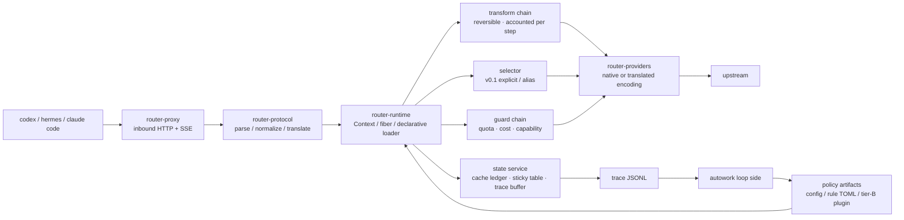

# Design (HOW) — router

Convention: this document is the single source of truth for the **implementation structure** (module
boundaries, data flow, algorithms, test strategy). External behavior is in `docs/spec.md`.

## 1. Panorama



Three hard boundaries (AGENTS.md carries the binding clauses): the byte boundary, content determinism,
the observation boundary.

## 2. crate dependency direction

```
router-cli → router-proxy → router-protocol → router-core ← router-plugins
                    ↘ router-runtime ↗                 ↑
                          router-providers        router-plugin-sdk (tier-B protocol types)
```

- `router-core`: the domain model of request/decision, the cost engine, the cache ledger, the plugin
  traits. **Depends on no HTTP/protocol crate**.
- `router-runtime`: Cordis semantics (§4). `router-core`'s traits are loaded here as fibers.
- `router-protocol`: codec for the 3 protocols + translation matrix + `Usage` normalization; pure
  functions, exhaustively unit-testable.
- `router-providers`: wire capabilities, authentication, retry, SSE parsing; **makes no decisions**.
- `router-proxy`: the axum data plane, byte-faithful forwarding and SSE passthrough.
- `router-plugins`: the built-in tier-A plugins (cache-guard, transform_rules, cost_ledger, quota_guard,
  sticky).

## 3. Decision pipeline (the order of one request)

```
parse → session resolution → transform chain → selector → guard chain → encode → forward → usage normalization → ledger/trace
```

Key design: **both transform and guard remain trace-attributable after the decision** (one transform
record is written per step); in v0.1 the selector only does explicit/alias resolution and `auto` is left
to a plugin — but the slot, the contract and the trace fields are in place now, so a plugin needs no
data-plane change when it lands.

## 4. Plugin runtime (aligned with Cordis semantics)

The mapping from the paper's primitives to this project's implementation (fixed by ADR-002):

| Cordis primitive | This project's Rust form | Purpose |
|---|---|---|
| `ctx.effect(cb) → dispose` | `fn(&mut Ctx) -> Effect`, `Effect{undo: FnOnce}`, accumulated LIFO | any registration/rewrite carries its own inverse; unloading a plugin = a full rollback |
| `ctx.set(key,value)` / `ctx.get(key)` + `notify → refresh` | typed service slot `ServiceKey<T>`; when a provider enters UNLOADING its **dependents are deactivated first**, then the binding is withdrawn | dependencies and dependents between plugins need no manual ordering |
| `fiber.inject` (a coeffect declaration) | the manifest declares `inject: [services]`; while unsatisfied it **stops at load-waiting** instead of erroring | out-of-order loading is safe |
| `ctx.isolate(key, realm)` | the same key with multiple realms → two independent sets of bindings | **A/B and shadow**: two policy versions coexist without interfering |
| `ctx.intercept(key, metadata)` | does not change the binding, only "how it is used" | set the sample rate, timeout or shadow switch for one plugin |
| entries + keyed diff + HMR | a declarative `plugins:` list + per-field minimal operations | parameter-level experiments need no restart |

**Rust's trade-off (must be faced honestly)**: the paper's HMR relies on dynamic module loading in JS.
This project's tier-A plugins are linked at compile time, so there is **no module-level HMR** — a code
change = rebuild + restart; only **config-level coordination** (config/weights/rule TOML take effect
immediately) and module-level reload of tier-B (out-of-process) plugins exist. To keep the restart cost
low, the `cache ledger / sticky table / trace buffer` all persist in the state service and are handed
over after a restart, so a restart loses no session context.

Lifecycle state machine (simplified): `LOADING → ACTIVE → UNLOADING → (removed)`; while `inject` is
unsatisfied it stays at LOADING; when unloading a fiber its dependents leave first, then its inverse is
executed in LIFO order. A failed state carries an error result and does not affect other fibers.

## 5. Cost engine

**Five-tier price + peak/off-peak**: `input_miss`, `input_hit`, `cache_write`, `output`,
`peak.multiplier`. Per-request cost:

```
cost = input_miss × p_miss + input_cached × p_hit + cache_write × p_write + output × p_out   (× peak)
```

**Quota plans** (coding-plan style): the marginal cost inside the plan is recorded as 0, but
`tokens_remaining` and `over_quota: block|spill` must be modeled; under `spill` the overflow is charged
at `p_miss`. The remaining allowance is written to the trace (`quota_after`), making "where the
allowance was spent" auditable.

**The cost model of switching (cache-aware breakeven)**: switching models immediately loses the prefix
cache and recomputes the whole prefix once at the miss price.

```
switch_gain  ≈ remaining_turns × tokens_per_turn × (p_stay − p_new)
switch_cost  ≈ prefix_tokens × p_miss_new
switch if and only if switch_gain > safety_factor × switch_cost
```

The parameters are in `config.cache.breakeven`; `remaining_turns` is estimated from the session history
and `safety_factor` defaults to 1.2. (In v0.1 the model is specified explicitly, so this formula decides
**failover and quota spill**, not automatic model selection.)

## 6. Cache policy (P0, the first-order lever)

1. **Fidelity**: on the passthrough path the only permitted mutation is deleting router-owned fields;
   for the same input the encoder must be byte-deterministic.
2. **Content determinism**: a transform is a pure function of `(content, stable config)` — depending on
   the turn number, the wall clock or an RNG is forbidden. Any "rolling window / per-turn trimming"
   implementation counts as breaking the prefix (which is why P4 is deferred).
3. **Stickiness**: a session → (provider, model) mapping, keyed preferentially by the client-supplied
   `prompt_cache_key` (the upstream echoes it; measured to work), falling back to `header:session-id` /
   `header:thread-id`; TTL is in config.
4. **Breakpoint injection**: when translating to an anthropic upstream, inject `cache_control` at "stable
   content boundaries" (same content → same position); the number of breakpoints is written to the trace
   (`cache_control_breaks`).
5. **State-service handover**: the ledger and the sticky table snapshot periodically; they are loaded
   after a restart so the `prefix_continuity` metric does not break across restarts.

## 7. Protocol translation layer

The capability matrix is declared in config (`supports`); the 3×3 table is constructed at runtime:

- a `native` cell → byte passthrough (the only permitted operation is deleting router-owned fields).
- a `translated` cell → goes through an explicit mapper; every mapper must be marked
  `lossless | lossy(reason)`.
- when lossy: write the trace and optionally the `X-Router-Lossy` response header; never silently.
- inbound unknown fields are kept verbatim (a bypass side channel exists), so protocol evolution loses
  no information.

## 8. State and persistence

Single process, no DB. State falls into three classes:

| State | Medium | Notes |
|---|---|---|
| cache ledger / sticky table | memory + periodic snapshot (JSON) | handover across a restart; losing it only regresses statistics, it does not affect correctness |
| trace | append-only JSONL (rolled hourly) | the only interface from the product → autowork; consumable by `router replay` |
| quota remaining | memory + snapshot | accumulates from the upstream `usage`, never guessed |

## 9. Replay (computing money with the same code)

`router replay --trace t.jsonl --config c.yaml [--plugins p.yaml]`: feeds real inbound requests into
**the same production decision pipeline** (the same binary, the same transform/encoding path), replacing
only the outbound HTTP with a local simulation (or a real replay once, behind a budget gate). It outputs
a cost/cache/latency report contrasted against `prefix_continuity`.

This is the foundation of autowork: a policy cannot be re-implemented in Python without producing skew
(the lesson of the old project), so policy simulation is always a subcommand of the product.

## 10. Test strategy

| Layer | Contents |
|---|---|
| unit | exhaustive protocol codec (3×3), `Usage` normalization, five-tier cost, breakeven boundaries, realm isolation, effect LIFO rollback |
| conformance | fidelity (upstream-visible prefix hash == the client's), SSE event-sequence equivalence, tool-call round trip, unknown-field passthrough, error-code mapping |
| cache | same-session two turns `prefix_continuity == 1.0`; re-measure after enabling each transform (regression guard) |
| accounting | every transform carries a `verified/inferred` label; gates read verified only |
| interaction | one onboarding smoke run each with the real codex/hermes (including verification of the `NO_PROXY` prerequisite) |

## 11. Risks and mitigations

| Risk | Mitigation |
|---|---|
| a transform breaks the prefix without knowing it | `prefix_continuity` as a blocking gate; run the cache regression for each transform separately |
| a lossy translation layer makes client behavior wrong | the lossy list goes into the spec; mark it explicitly when lossy + conformance cases |
| no HMR for tier-A slows experiment iteration | parameters/rules go through config-level coordination; experiment-class plugins are forced to tier-B |
| the accounting convention is polluted by "estimates" | the binary verified/inferred convention + reports must state the sample size |
| a system proxy makes onboarding fail | README/spec enforce `NO_PROXY`; the smoke test includes this item |

## 12. Module and type landing list

This section lands the structure of §2/§4/§5/§6/§7 as **signature sketches + a case-ID table**, giving
implementers a single basis. It lands only "the shape of types and contracts", not function bodies; the
implementation order is given by each row's "Lands in".

### 12.1 crate list, dependency direction and the third-party dependency allowlist

```
router-cli → router-proxy → router-protocol → router-core ← router-plugins
                    ↘ router-runtime ↗                 ↑
                          router-providers        router-plugin-sdk
```

| crate | Public surface (what is usable outside) | Permitted third-party dependencies | Lands in |
|---|---|---|---|
| `router-core` | domain model, cost/quota/breakeven pure functions, plugin traits, `DecisionRecord` | `serde`, `serde_json`(preserve_order+arbitrary_precision), `sha2` | from R1-2 |
| `router-protocol` | codec for the 3 protocols, translation matrix, `Usage` normalization, `raw_json` (span-faithful editing) | `serde_json` | R2 |
| `router-providers` | `ProviderClient` (wire capabilities, authentication, retry, SSE parsing) | `reqwest`, `tokio`, `futures` | R2 |
| `router-runtime` | `Ctx` / `Effect` / `ServiceKey` / fiber state machine, declarative loader | none (pure std + core) | R2 |
| `router-plugins` | built-in tier-A: cache_guard / transform_rules / cost_ledger / quota_guard / sticky | `toml`, `regex` | R2/R3 |
| `router-proxy` | axum data plane: byte-faithful forwarding, SSE passthrough | `axum`, `tokio`, `hyper`, `tower` | R2 |
| `router-cli` | `serve` / `stats` / `replay` / `trace` | `clap`, `tokio` | from R1-2 (serve stub) |
| `router-plugin-sdk` | tier-B out-of-process plugin protocol types (UDS frames) | `serde_json` | R3 |
| `router-conformance` (`tests/conformance/`) | the CONF cases (§12.8) | `tokio`, `axum`, the crates under test | from R1-2, as an empty shell |

- **`router-core` depends on no HTTP / protocol crate** (§2 hard constraint); how it is spot-checked: the
  dependency set of `cargo tree -p router-core` must be ⊆ the allowlist.
- Dependency discipline: **a new dependency must have its reason written in the commit message**
  (consistent with this round's task constraint). Any dependency outside the allowlist is discussed first.
- Every crate root adds `#![forbid(unsafe_code)]`; `router-core` additionally adds
  `#![deny(clippy::float_arithmetic)]` (money only takes the fixed-point path of §12.4).
- Test placement: unit tests use `#[cfg(test)] mod tests` in place; conformance lives in
  `tests/conformance/tests/` (§12.8).

### 12.2 Runtime primitives (ADR-002 → Rust signature sketch)

| Cordis primitive | Rust type (`router-runtime`) | Where the semantics land |
|---|---|---|
| `ctx.effect(cb) → dispose` | `Ctx::effect(Effect) -> EffectId` + `Effect { undo: Box<dyn FnOnce()+Send> }` | a LIFO stack; unload = run the undos in order |
| `ctx.set/get(key)` + refresh | `Ctx::provide/get` + `ServiceKey<T>` | a provider going offline → its dependents are deactivated first, then the binding is withdrawn |
| `fiber.inject` | `Plugin::inject() -> &[ServiceId]` | while unsatisfied it stays at `Loading{waiting_on}`, with no error |
| `ctx.isolate(key, realm)` | `Ctx::isolate(key, RealmId) -> RealmGuard` | multiple sets of bindings for the same key (A/B and shadow coexist) |
| `ctx.intercept(key, md)` | `Ctx::intercept(&key, InterceptMeta)` | does not change the binding, only "how it is used" (sample/timeout/shadow) |
| entries + keyed diff | a `PluginCfg` list + `apply_config_diff` | a config change diffs itself; `disabled` unloads; an `id`/`kind` change rebuilds |

```rust
pub struct PluginId(pub String);
pub struct ServiceId(&'static str);
pub struct RealmId(u32);
pub const ROOT_REALM: RealmId = RealmId(0);

pub struct ServiceKey<T: ?Sized> { name: &'static str, _m: PhantomData<fn() -> T> }
impl<T: ?Sized> ServiceKey<T> { pub const fn new(name: &'static str) -> Self; pub fn name(&self) -> &'static str; }
pub const CACHE_LEDGER: ServiceKey<dyn CacheLedger> = ServiceKey::new("cache_ledger");
pub const SESSION_TABLE: ServiceKey<dyn SessionTable> = ServiceKey::new("session_table");
pub const QUOTA_STORE:   ServiceKey<dyn QuotaStore>   = ServiceKey::new("quota_store");
pub const TRACE_SINK:    ServiceKey<dyn TraceSink>    = ServiceKey::new("trace_sink");

pub struct Effect { undo: Option<Box<dyn FnOnce() + Send>> }
impl Effect { pub fn new(f: impl FnOnce() + Send + 'static) -> Self; pub fn noop() -> Self; }

pub struct Ctx { /* fiber scope: service table + effect stack + realm table */ }
impl Ctx {
    pub fn effect(&mut self, e: Effect) -> EffectId;
    pub fn provide<T: Send + Sync + 'static>(&mut self, key: ServiceKey<T>, v: Arc<T>) -> EffectId;
    pub fn get<T: Send + Sync + 'static>(&self, key: &ServiceKey<T>) -> Option<Arc<T>>;
    pub fn isolate<T: Send + Sync + 'static>(&mut self, key: ServiceKey<T>, realm: RealmId) -> RealmGuard;
    pub fn intercept<T: Send + Sync + 'static>(&mut self, key: &ServiceKey<T>, md: InterceptMeta);
}

pub enum FiberState { Created, Loading { waiting_on: Vec<ServiceId> }, Active, Unloading, Failed(PluginError), Removed }

pub trait Plugin: Send + Sync {
    fn id(&self) -> &PluginId;
    fn inject(&self) -> &'static [ServiceId];      // coeffect declaration; unsatisfied → stays at Loading
    fn apply(&self, ctx: &mut Ctx) -> Result<Effect, PluginError>;
}
```

**Unload order (the implementation must follow it, and a test asserts it)**: ① recursively put the
dependents into `Unloading` and wait for them to finish → ② run this fiber's `Effect::undo` in reverse
LIFO → ③ withdraw the service bindings → ④ `Removed`. A failure goes to `Failed(err)` and **does not
affect other fibers** (ADR-002's "failure isolation"). How it is asserted: after load → activate →
unload, the service table and the intercept table must be **deep-equal** to what they were before
loading (R2 test).

### 12.3 Decision-pipeline types and the failure semantics of each step

```
parse → session resolution → transform chain → selector → guard chain → encode → forward → usage normalization → ledger/trace
```

```rust
pub enum Protocol { Chat, Responses, Anthropic }
pub enum ClientKind { Codex, Hermes, ClaudeCode, Other }
pub struct RouteSpec { pub provider: String, pub model: String }
pub enum SelectionSource { Explicit, Alias, Plugin }
pub struct Decision { pub route: RouteSpec, pub source: SelectionSource, pub plugin_chain: Vec<PluginId> }

pub trait Transform: Send + Sync {
    fn id(&self) -> &'static str;
    /// Content-deterministic: reading the clock/turn/RNG is forbidden. Err = fall back to the original text (spec §8), the caller records the trace.
    fn apply(&self, req: &mut CanonicalRequest) -> Result<TransformReport, TransformError>;
}
pub struct TransformReport {
    pub added_input_tokens: u64, pub saved_input_tokens: u64, pub saved_output_tokens: u64,
    pub cache_impact: CacheImpact, pub verdict: Verdict, pub tee_id: Option<TeeId>,
}
pub enum CacheImpact { Neutral, Risky, Broken }      // Broken → cache_guard's strict_prefix rejects it
pub enum Verdict { Verified, Inferred }              // only Verified can enter a gate (ADR-003/spec §7)

pub trait Selector: Send + Sync { fn select(&self, req: &CanonicalRequest, roster: &Roster) -> Result<Decision, SelectError>; }
pub trait Guard: Send + Sync { fn check(&self, cx: &GuardCx<'_>) -> GuardOutcome; }
pub enum GuardOutcome { Pass, Reject { code: ErrorCode, message: String }, Downgrade(RouteSpec) }
pub trait Observer: Send + Sync { fn on_decision(&self, rec: &DecisionRecord); fn on_error(&self, e: &RouterError); }
```

| Step | Failure semantics |
|---|---|
| parse | the request body is unparsable → `invalid_request` 400, not forwarded |
| session resolution | every source is missing → `session = None` (the trace records null, `sticky_hit=false`), **not an error** |
| transform | any step `Err` → fall back to the original text + `TransformRecord.error`; the request proceeds as usual (spec §8) |
| selector | `auto` → `auto_not_supported` 400 (spec §3); a `provider/model` that does not exist → 404 |
| guard | `Reject` → the normalized error body; `Downgrade` → take that route and record `failover_from` |
| encoding | a translation cell missing its declaration → 400; lossy → record `lossy[]` + `X-Router-Lossy` |
| forwarding | 5xx/429/quota exhausted → the fallback chain; chain exhausted → 502 carrying the last `upstream_status` |
| usage normalization | the upstream is missing usage fields → zero values + trace `usage_missing: true` (**never guessed**) |
| ledger/trace | a trace write failure → the request proceeds as usual, the count goes into the `trace_dropped` metric (an observable degradation) |

#### 12.3.1 Landing the byte boundary in the types (AGENTS hard constraint 1)

```rust
pub struct CanonicalRequest {
    pub protocol_in: Protocol,
    pub raw: RawBody,                 // the client's raw bytes: the sole authority
    pub doc: JsonDoc,                 // order-preserving parsed view (for decisions; **not used for outbound sending**)
    pub session: Option<SessionId>,
    pub thread_id: Option<String>,
    pub turn_index: u32,
}
pub struct RawBody(Bytes);
impl RawBody {
    pub fn as_bytes(&self) -> &[u8];
    /// The only permitted rewrite: deleting top-level router-owned fields. All other bytes are kept byte for byte.
    pub fn remove_top_level_keys(&self, keys: &[&str]) -> Result<RawBody, RawEditError>;
}
```

- `RawBody` **does not implement** `DerefMut`/`AsMut`, and exposes no mutable reference to a
  `serde_json::Value` → a casual "just tweak it" is blocked at compile time.
- `remove_top_level_keys` uses a **single-pass JSON scanner** (it needs only the spans of the top-level
  keys, tracking strings/escapes/bracket depth) to delete at the byte level; a **parse → reserialize
  round trip is forbidden** (that is the most common way the byte boundary is broken).
- router-owned fields = the `router_meta` echo + routing hints (spec §2). The deletion list is a
  **whitelist constant**; adding one requires changing that constant.
- The separator semantics of deletion (pinned down in R1-2c): consecutive whitelist hits form one
  "segment"; the segment is removed as a whole and swallows the comma between **its tail** and the
  member that follows it (including the whitespace in between); the comma at the head of the segment is
  left to the previous retained member. Only when the first member is the start of a segment does it
  instead swallow the segment-tail comma. Invariant: any `Ok` output must be valid JSON, and the
  retained members are byte-for-byte equal to their input spans (the `deletion_position_matrix*` tests
  are a permanent regression matrix).
- Three settled boundary behaviors (the rationale for rejecting vs passing through, each pinned by a
  unit test):
  - **BOM prefix → `Err(NotTopLevelObject)`**: stripping the BOM is a rewrite outside the whitelist
    (hard constraint 1 permits deleting router-owned fields only), so router has no right to "fix it in
    passing" and it is left to the caller to handle as a 400.
  - **Leading-zero number (`01`) → `Err(Malformed)`**: the RFC 8259 number grammar does not contain this
    form; the raw value fragment is vetted by the serde_json validator, and an ambiguous number is not
    passed through (upstream parsers disagreeing is a hidden risk).
  - **invalid UTF-8 inside a **string** value → `Ok` and passed through byte for byte**: the byte
    boundary takes priority, router does not interpret value content, and legality is adjudicated by the
    upstream. Note the asymmetry: invalid UTF-8 inside a **key** is still `Err(Malformed)` — a key must
    be decodable to be compared semantically against the whitelist, and if it cannot be compared there is
    no safe way to decide delete-or-not.
- The domain of the prefix hash = the raw bytes of `messages | input | tools` and the system-instruction
  position in the upstream-visible body (spec §6 "prefix"), so "deleting router fields" does not affect
  that hash — CONF-10 asserts exactly this.
- Prefix blocks (`prefix_blocks[]`): a block = the **smallest indivisible unit** in the prefix region
  (one message / one tool definition / one input item), recording `tokens` and `hash` per block;
  `hash = the first 16 hex chars of sha256(block raw bytes)`.
  (GAP-Q5: the spec does not define block granularity; this blueprint takes a "structural unit" rather
  than a fixed-length token bucket, because the former aligns with cache breakpoints.)

### 12.4 Cost / quota / breakeven pure functions (the implementation target of R1-2)

```rust
/// Money is fixed-point: 1 nano-USD = 1e-9 USD. No f64 appears in the decision path or the trace.
pub struct NanoUsd(pub u64);
/// Unit price: nano-USD / 1K token (the same shape as the config's USD/1K, only integerized).
pub struct Price(pub u64);
pub struct PriceTable { pub input_miss: Price, pub input_hit: Price, pub cache_write: Price,
                        pub output: Price, pub peak: PeakTable }
pub struct PeakTable { pub multiplier_pct: u32, pub windows: Vec<PeakWindow> }   // 2.0 → 200
pub struct PeakWindow { pub days: Weekdays, pub from_min: u16, pub to_min: u16, pub tz: Tz }

pub struct Usage { pub input_total: u64, pub input_cached: u64, pub cache_write: u64,
                   pub output: u64, pub reasoning: u64 }
impl Usage { pub fn uncached(&self) -> u64;  pub fn cache_hit_rate(&self) -> f32; }

pub struct CostBreakdown { pub input_miss: NanoUsd, pub input_hit: NanoUsd, pub cache_write: NanoUsd,
                           pub output: NanoUsd, pub peak_applied_pct: u32, pub total: NanoUsd }

/// Pure function: cost(miss, hit, write, out, price, at) -> CostBreakdown
/// cost_nano = Σ_tier ( tokens_tier × price_tier_nano_per_1k ) / 1000   (integer; only the final division rounds down)
/// A peak-window hit (at ∈ windows) → sum the no-peak total first, then × multiplier_pct / 100.
/// The input_miss tier uses usage.uncached(); the output tier includes reasoning (most upstreams count reasoning into output).
pub fn cost(usage: &Usage, price: &PriceTable, at: Timestamp, tz: Tz) -> CostBreakdown;
```

Quota (spec §4 `quota`, DESIGN §5):

```rust
pub enum QuotaWindow { Monthly { reset_day: u8 } }        // spec defines monthly only; any other value = a load error
pub enum OverQuota { Block, Spill }
pub struct QuotaPlan { pub models: Vec<String>, pub window: QuotaWindow, pub tokens: u64,
                       pub over_quota: OverQuota, pub source: String }
pub struct QuotaState { pub plan_idx: usize, pub window_start_epoch_s: u64, pub tokens_used: u64 }
pub enum QuotaVerdict {
    Inside  { remaining_before: u64 },
    Spill   { billable_tokens: u64 },      // the overflow is charged at input_miss (DESIGN §5)
    Blocked { remaining: u64 },            // over_quota=block → Guard Reject(quota_exceeded)
}
/// Pure function (the only state write point): tokens = usage.input_total + usage.output (this blueprint's default convention; see GAP-Q1)
pub fn charge(plan: &QuotaPlan, st: &mut QuotaState, usage: &Usage, now_epoch_s: u64) -> QuotaVerdict;
```

cache-aware breakeven (DESIGN §5, integerized to avoid floating-point boundary disagreements):

```rust
pub struct BreakevenParams { pub enabled: bool, pub min_remaining_turns: u32, pub safety_factor_pct: u32 }
pub struct SwitchCandidate {
    pub prefix_tokens: u64,      // the amount of prefix recomputed at the miss price when switching models
    pub tokens_per_turn: u64,    // estimated input tokens per following turn
    pub remaining_turns: u32,    // estimated remaining turns (no history → 0)
    pub p_stay_hit: Price,       // the next turn's unit price if staying = the current model's input_hit (already cached)
    pub p_new_miss: Price,       // the new model's input_miss (switching necessarily misses the whole prefix)
}
pub enum StayReason { Disabled, RemainingTurnsZero, BelowMinRemainingTurns, NotPaying }
pub enum SwitchVerdict { Switch { gain: NanoUsd, cost: NanoUsd },
                         Stay { reason: StayReason, gain: NanoUsd, cost: NanoUsd } }
/// gain = remaining_turns × tokens_per_turn × (p_stay_hit − p_new_miss) / 1000   (an i128 intermediate)
/// cost = prefix_tokens × p_new_miss / 1000
/// Switch ⟺ gain × 100 > safety_factor_pct × cost      (strictly greater; cross-multiplied, so no precision is lost to division)
pub fn decide_switch(p: &BreakevenParams, c: &SwitchCandidate) -> SwitchVerdict;
```

**Boundary cases (R1-2 must cover them, asserting the `SwitchVerdict` for each)**:

| Case | Expectation |
|---|---|
| `enabled = false` | `Stay(Disabled)` |
| `remaining_turns = 0` | `Stay(RemainingTurnsZero)` (gain is always 0) |
| `remaining_turns < min_remaining_turns` | `Stay(BelowMinRemainingTurns)` (even if the formula is better) |
| `prefix_tokens = 0` | `Switch` (switching costs 0, gain > 0) |
| exactly equal (`gain×100 == sf×cost`) | `Stay(NotPaying)` (switch only on strictly greater) |
| `p_stay_hit ≥ p_new_miss` | `Stay(NotPaying)` (not profitable) |
| a peak-window hit | both `cost`/`gain` include `×multiplier_pct/100` |
| integer tiering `input_miss=0.00015` | parses to `Price(150_000)` (no floating-point residue) |

### 12.5 Config types and parsing rules (`config.example.yaml` ↔ types)

```rust
#[derive(Deserialize)] #[serde(deny_unknown_fields)]
pub struct RouterConfig { pub server: ServerCfg, pub session: SessionCfg, pub cache: CacheCfg,
    pub trace: TraceCfg,
    pub providers: Vec<ProviderCfg>, pub aliases: BTreeMap<String, RouteSpec>,
    pub plugins: Vec<PluginCfg>, pub fallback: Vec<RouteSpec> }

/// spec §4.1; `Rollover::Hourly` is the only value in v0.1 → the file `<dir>/YYYY-MM-DDTHH.jsonl` (UTC).
pub struct TraceCfg { pub dir: PathBuf, pub rollover: Rollover }
```

| Point | Rule |
|---|---|
| duration | `<integer><ms\|s\|m\|h>`, concatenable (`1h30m`); invalid → a load error (with the field path) |
| context | `<integer>` or `<integer>k\|m` (k=1024, m=1048576); used by the guard's capability check |
| price | read as f64 (USD/1K), converted **at load time** to `Price((v * 1e9).round() as u64)`; `v < 0`, or 0 after `round` → a load error |
| peak.multiplier | converted to `multiplier_pct = (v*100).round()`; only two decimal places are supported, otherwise a load error |
| base_url | must already contain the version segment; router only appends `chat → /chat/completions`, `responses → /responses`, `anthropic → /v1/messages` |
| `rules_file` | resolved relative to **the directory containing this config file** (not the CWD); `trace.dir` follows the same rule (spec §4.1) |
| `trace.rollover` | only `hourly` is accepted (any other value = a load error); retention is **not** a config key (v0.1 does no automatic cleanup) |
| unknown fields | `deny_unknown_fields` → **errors out and exits** (no silent ignore: config is written by hand, and "I changed it but it did not take effect" is the most expensive silent failure) |
| secrets | only `api_key_env`; when the env var is missing at startup → that provider is marked unavailable and reported on `/health` (it does not block other providers) |
| `disabled: true` | that fiber is not loaded (no error); `/health` lists it under `plugins_disabled` |
| defaults | only those the spec §4 states explicitly (`safety_factor: 1.2`, `sticky`, `over_quota`) have a default; everything else is **not enabled unless written** |

### 12.6 DecisionRecord (trace contract, fully covering spec §6)

```rust
pub struct DecisionRecord {
    pub schema_version: u16,            // trace version; the autowork side uses it for compatibility (ADR-005)
    pub ts: String,                     // RFC3339 UTC, milliseconds
    pub identity: IdentityRec,          // identity
    pub protocol: ProtocolRec,          // protocol
    pub decision: DecisionRec,          // decision
    pub state: StateRec,                // state
    pub prefix: PrefixRec,              // prefix
    pub transforms: Vec<TransformRecord>, // transform (one per step)
    pub usage: Usage,                   // usage
    pub cost: CostRec,                  // cost
    pub result: ResultRec,              // result
    pub errors: Vec<TraceError>,        // failure details (spec §6 "failure details"; written back in R1-4)
}

pub struct IdentityRec { pub request_id: String, pub client: ClientKind, pub client_ua_raw: Option<String>,
    pub session: Option<String>, pub thread_id: Option<String>, pub turn_index: u32 }
pub struct ProtocolRec { pub r#in: Protocol, pub out: Protocol, pub translated: bool, pub lossy: Vec<LossyNote> }
pub struct LossyNote { pub field: &'static str, pub reason: &'static str, pub action: LossyAction }
pub struct DecisionRec { pub provider: String, pub model: String, pub selection_source: SelectionSource,
    pub plugin_chain: Vec<String>, pub decision_ms: u32 }
pub struct StateRec { pub stateful_inbound: bool, pub sticky_hit: bool, pub cache_control_breaks: u16 }
pub struct PrefixRec { pub blocks: Vec<PrefixBlock>, pub continuity: Option<f32> }
pub struct PrefixBlock { pub kind: BlockKind, pub index: u16, pub tokens: u64, pub hash: String }
pub struct TransformRecord { pub plugin: String, pub added_input_tokens: i64, pub saved_input_tokens: i64,
    pub saved_output_tokens: i64, pub cache_impact: CacheImpact, pub verdict: Verdict,
    pub tee_id: Option<String>, pub error: Option<String> }
pub struct CostRec { pub input_miss: NanoUsd, pub input_hit: NanoUsd, pub cache_write: NanoUsd,
    pub output: NanoUsd, pub peak_applied_pct: u32, pub total: NanoUsd, pub quota_after: Option<QuotaAfter> }
pub struct QuotaAfter { pub provider: String, pub plan_idx: usize, pub tokens_used: u64, pub tokens_limit: u64,
    pub over_quota: OverQuota, pub verdict: &'static str }
pub struct ResultRec { pub status: u16, pub upstream_status: Option<u16>, pub failover_from: Option<RouteSpec>,
    pub overhead_ms: u32, pub upstream_ms: Option<u32>, pub usage_missing: bool }

/// The landing of spec §6 "failure details": the **internal** failure details (possibly several), which are
/// not the same thing as the single error response given to the client in §12.7; the two share the kind vocabulary.
/// No failure = an empty array (not omitted).
pub struct TraceError { pub kind: TraceErrorKind, pub message: String,
    pub plugin: Option<String>, pub details: Option<serde_json::Value> }
pub enum TraceErrorKind { TransformError, UpstreamError, TraceWriteFailed, Internal }
```

spec §6 field groups → Rust paths (auditable line by line):

| spec §6 field group | Fields | Rust path |
|---|---|---|
| identity | `request_id` `client` `session` `thread_id` `turn_index` | `identity.*` (`client_ua_raw` is an appendix, for troubleshooting when UA normalization fails) |
| protocol | `protocol_in` `protocol_out` `translated` `lossy[]` | `protocol.r#in` `protocol.out` `protocol.translated` `protocol.lossy` |
| decision | `provider` `model` `selection_source` `plugin_chain[]` `decision_ms` | `decision.*` |
| state | `stateful_inbound` `sticky_hit` `cache_control_breaks` | `state.*` |
| prefix | `prefix_blocks[]` (token count + hash) `prefix_continuity` | `prefix.blocks[].{tokens,hash}` `prefix.continuity` |
| transform | `plugin` `added_input_tokens` `saved_input_tokens` `saved_output_tokens` `cache_impact` `verdict` | `transforms[].*` |
| usage | `input_total` `input_cached` `cache_write` `output` `reasoning` | `usage.*` |
| cost | `cost.input_miss` `input_hit` `cache_write` `output` `total` `quota_after` | `cost.*` |
| result | `status` `upstream_status` `failover_from` `overhead_ms` `upstream_ms` | `result.*` |
| failure details | `errors[]` (`kind` `message` `plugin?` `details?`) | `errors[].*` (the kind vocabulary is shared with the error body of §12.7; the difference between internal details and the client-facing response is explained above) |

- On disk: `<config trace.dir>/YYYY-MM-DDTHH.jsonl` (spec §4.1; `trace.dir` defaults to
  `./state/traces`), **append-only, rolled hourly** (DESIGN §8); a write failure does not block the
  request and records `errors[].kind = trace_write_failed`.
- `schema_version` only increments on a **breaking** change; adding an optional field does not change the
  version (the autowork side tolerates unknown fields).
- Derived metrics (`router stats`, spec §6 "metric definitions") — all computable in a single pass over
  the trace, with no extra state needed:
  `cache_hit_rate = Σusage.input_cached / Σusage.input_total`;
  `stateful_inbound_rate`, `prefix_continuity_p50` (group by session, take adjacent requests),
  `verified_savings_tokens` (**accumulates only `verdict=Verified`**), the p99 of
  `overhead_ms_p99 = result.overhead_ms`.
- Reporting discipline: any statement of "how much was saved" must carry the convention
  (verified/inferred), the sample size and the time window (spec §7).

### 12.7 Error semantics and the response surface (the landing of spec §8)

> Since R1-4, the error-body schema and the `error.type`→HTTP table below **are already written into
> `docs/spec.md` §8** (the spec is the single source of truth for the external contract); this section
> keeps `ErrorBody`'s Rust form and the implementation details, and the two must agree.

Unified error body (**all** non-2xx responses and the stub endpoints share one shape; README's success
response carries the router-owned field `router_meta`):

```rust
pub struct ErrorBody { pub error: ErrorDetail }
pub struct ErrorDetail { pub r#type: &'static str, pub message: String,
                         pub request_id: String, pub details: Option<serde_json::Value> }
```

| `error.type` | HTTP | Trigger |
|---|---|---|
| `invalid_request` | 400 | request body unparsable / missing `model` / wrong field type |
| `unknown_provider` `unknown_model` | 404 | `provider/model` or an alias does not resolve |
| `auto_not_supported` | 400 | `model: auto` (v0.1; the hint says a plugin takes it over, spec §3) |
| `capability_unsupported` | 400 | inbound protocol ∉ that provider's `supports` |
| `cost_cap_exceeded` | 403 | guard cost cap hit |
| `quota_exceeded` | 429 | `quota.over_quota = block` and the allowance is exhausted |
| `stateful_unsupported` | 400 | stateful inbound and stickiness cannot keep fidelity (ADR-004) |
| `upstream_error` | 502 | upstream error and the fallback chain is exhausted (`details.upstream_status`) |
| `upstream_timeout` | 504 | an upstream attempt timed out and the chain is exhausted |
| `not_implemented` | 501 | the v0.1 stubs of the three protocol endpoints (R1-2) |
| `internal` | 500 | everything else (beyond the degradation path of a trace write failure) |

Response headers: `X-Router-Request-Id` (always), `X-Router-Session` (when a session was resolved),
`X-Router-Lossy` (when a lossy translation happened, DESIGN §7). On the SSE path all three headers must
already have been sent before the first event.

### 12.8 conformance case table (`CONF-01…CONF-19`)

Location: the workspace member `router-conformance` (`tests/conformance/`), case file
`tests/conf_<NN>_<slug>.rs`, the test function named after the file. **An unimplemented path must carry
`#[ignore = "CONF-NN: depends on <implementation item>"]`** (explicitly visible, rather than simply not
written).

| ID | Covers §10 | Assertion | Depends on implementation item |
|---|---|---|---|
| CONF-01 | conformance·fidelity | chat inbound → `wire_api: chat`: the upstream-visible body is byte-identical to the client body | router-protocol native path |
| CONF-02 | same as above | responses → responses native: bytes are identical | same as above |
| CONF-03 | same as above | anthropic → anthropic native: bytes are identical | same as above |
| CONF-04 | same as above·translation | chat → responses: two requests with the same content produce **the same upstream bytes** (determinism); the lossy points are registered one by one | translation matrix + mappers |
| CONF-05 | same as above | chat → anthropic: determinism + `cache_control` breakpoint positions stable | same as above + breakpoint injection |
| CONF-06 | same as above | responses → chat: determinism + the lossy list (dropping reasoning must be marked) | same as above |
| CONF-07 | same as above | responses → anthropic: determinism + breakpoint injection | same as above |
| CONF-08 | same as above | anthropic → chat: determinism + `thinking` handling | same as above |
| CONF-09 | same as above | anthropic → responses: determinism + `tool_use` mapping | same as above |
| CONF-10 | conformance·fidelity + §12.3.1 | after deleting router-owned fields the remaining bytes are byte-identical to the client's; the `router_meta` echo never reaches the upstream | `RawBody::remove_top_level_keys` |
| CONF-11 | conformance·unknown fields | top-level and nested unknown fields are passed through verbatim (including the measured fields `include`, `client_metadata`) | `RawBody` + encoder |
| CONF-12 | conformance·tool-call round trip | chat `tool_calls`/`role=tool` ↔ responses `function_call*` ↔ anthropic `tool_use/result`: id and order preserved | translation matrix |
| CONF-13 | conformance·SSE | native streaming: the upstream's `event:`/`sequence_number` are passed through event-by-event equivalently; end-event semantics preserved (responses has no `[DONE]`) | router-proxy SSE passthrough |
| CONF-14 | conformance·error codes | upstream 400/401/429/5xx → the normalized error body of §12.7; 5xx/429 triggers fallback and records `failover_from` | proxy + guard/fallback |
| CONF-15 | §10·cache | same-session two-turn passthrough: `prefix_continuity == 1.0` | cache ledger + sticky table |
| CONF-16 | §10·cache | after enabling each transform separately, re-measure the cache regression, not below the baseline (parameterized: one case per plugin) | transform chain + ledger |
| CONF-17 | §10·accounting | every `TransformRecord.verdict ∈ {Verified, Inferred}` and gates read `Verified` only | the accounting implementation |
| CONF-18 | §10·interaction | one smoke run each with the real codex/hermes (including verification of the `NO_PROXY` prerequisite) — manual / network-enabled CI only | end to end |
| CONF-19 | §9·replay | two `router replay` runs over the same trace produce cost/cache reports identical field by field | the replay subcommand |

Case IDs are a **contract**: a new behavior in `docs/spec.md` → this section and `tests/conformance/`
must gain it in step, and numbering only grows, never changes (a removed case keeps its ID and is marked
`removed`).

### 12.9 Gaps and pending rulings (GAP-Q1…Q13)

**This round changes no existing clause, it only registers.** Each entry gives the default this blueprint
adopts and its blast radius. (From R1-4 on, the "write-back record" below the table governs: settled
items are written into the spec, unsettled ones stay registered.)

| # | Gap | This blueprint's default | Impact |
|---|---|---|---|
| Q1 | the `quota` accounting convention is undefined (input only? including output? does cache_read count?) | `input_total + output` | quota routing (D5); the spec needs one more sentence |
| Q2 | the trace on-disk path / rollover / retention are not in config (§3's `state/traces/` is an implementation detail) | `state/traces/YYYY-MM-DDTHH.jsonl`, hourly | R2's trace implementation; a config section may also be needed |
| Q3 | the storage and retrieval channel of `tee + retrieve` are undefined (ADR-003 requires them, the spec has no endpoint) | declare `tee` in the rule first, storage and the endpoint come later | the retrievability of P1 compression's (D3) savings |
| Q4 | the override semantics of the rules' "three-level override" and whether an rtk-style trust gate is needed are undefined | the first hit takes effect; no trust gate is implemented | rule loading safety (D3) |
| Q5 | the block granularity of `prefix_blocks[]` is undefined | a structural unit (message / tool definition / input item) | cache-metric comparability |
| Q6 | the time zone and "holiday" semantics of the peak windows (`peak.windows`) | windows carry an explicit `tz`; holidays are not modeled | cost accuracy (D9) |
| Q7 | which tier breakeven's `p_stay` uses (hit price vs miss price) | `p_stay = input_hit`; `switch_cost` uses `p_new_miss` | failover/spill decisions (D5) |
| Q8 | the 400 criterion for `stateful_inbound` when it "cannot keep fidelity" is undefined | as long as the sticky table has that session it counts as able to keep fidelity | landing ADR-004 |
| Q9 | the behavior when `context` is exceeded (400, or hand it to the upstream) | hand it to the upstream (do not judge on the upstream's behalf) | guard behavior |
| Q10 | the error-body schema and `errors[]` are not listed in spec §6 | pinned down by §12.6/§12.7, recommended to be written back into the spec | autowork parsing the trace |
| Q11 | the plugin `inject` is not in spec §4's schema (DESIGN §4 requires it) | already landed in `config.example.yaml` and marked GAP | out-of-order loading safety |
| Q12 | the `fallback` chain schema and its switching granularity (global / per model) are not given in spec §4 | a global ordered route list | failover (D5) |
| Q13 | whether an alias may point at `auto` or carry parameter overrides | `provider/model` only | selection semantics (§3) |

ADR disposition (R1-4): the three originally proposed ADRs have been written as the orchestrator ruled —
`ADR-006` "integer NanoUsd fixed-point accounting", `ADR-007` "span-faithful forwarding (no
parse→reserialize round trip)", `ADR-008` "three-level rule override and the trust gate" (v0.1 does not
enable the trust gate, and states the trigger condition for re-evaluating it). All three encode the types
and conformance assertions already pinned down, so §12's type sketches no longer need changing.

**R1-4 write-back record (2026-09-19; the spec has been changed, this section's table is kept as a
historical register)**

| Disposition | Items |
|---|---|
| already written into `docs/spec.md` | Q2 → §4.1; Q3 → §4.4 (the retrieval channel explicitly marked "not implemented in this version"); Q5 → §6 "the definition of `prefix_blocks[]`"; Q10 → §6 "failure details" + §8 (the error body + the type→HTTP table); Q11 → §4.3; Q12 → §4.2 |
| already ruled by ADR-008 | Q4 (override semantics = the first hit takes effect; the trust gate is not enabled in v0.1, and the trigger condition for re-evaluation is written in that ADR) |
| takes the default value (not written into the spec; annotated in `config.example.yaml` comments) | Q1 (quota = `input_total + output`), Q7 (`p_stay = input_hit`), Q9 (over context → hand it to the upstream), Q13 (an alias is only `provider/model`) |
| left for Round 2 / D3 | Q8 (the 400 criterion for `stateful_inbound`), Q6 (holidays not modeled = a known deviation) |
